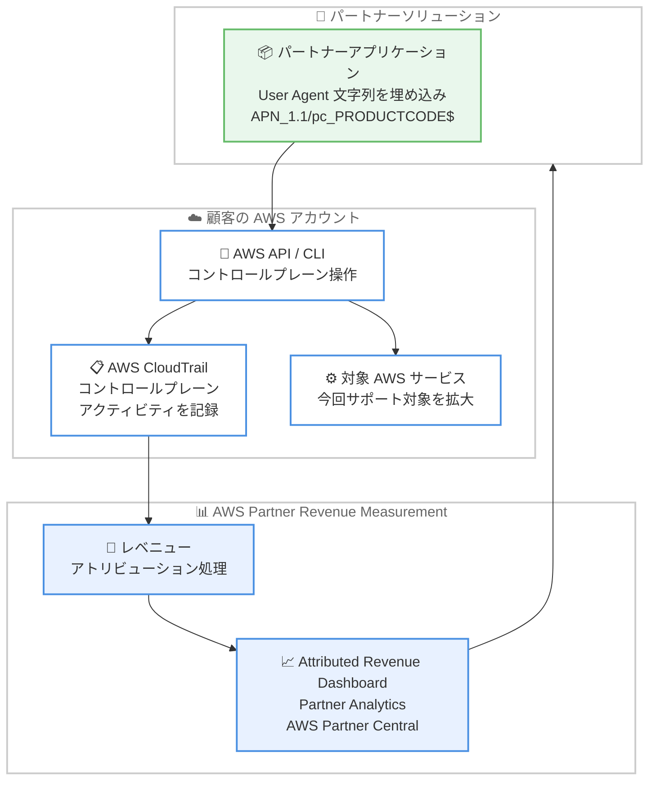

# AWS Partner Revenue Measurement - User Agent 文字列機能のサービスカバレッジ拡大

**リリース日**: 2026 年 8 月 31 日
**サービス**: AWS Partner Revenue Measurement (PRM)
**機能**: User Agent 文字列によるレベニューアトリビューションの対象サービス拡大

📊 [このアップデートのインフォグラフィックを見る](https://takech9203.github.io/aws-news-summary/20260831-partner-revenue-measurement-user-agent-expansion.html)

## 概要

AWS Partner Revenue Measurement (PRM) の [User Agent 文字列](https://docs.aws.amazon.com/PRM/latest/aws-prm-onboarding-guide/user-agent-string.html)機能が、追加の AWS サービスをサポートするようになりました。PRM は、AWS パートナーが自社ソリューションによる AWS 収益への影響 (attributed revenue) や顧客のサービス消費パターンを把握するための仕組みです。

これまで User Agent 文字列機能は、一部の限られた AWS サービスの消費のみを測定対象としていました。今回の拡大により、AWS CloudTrail にコントロールプレーンアクティビティを記録する追加の対象 AWS サービス全体で帰属収益を測定できるようになり、パートナーソリューションが生み出す収益に対する可視性が大幅に向上します。

すでに規定フォーマット (`APN_1.1/pc_<AWS Marketplace product-code>$`) の User Agent をアプリケーションに埋め込んでいるパートナーは、追加の実装作業なしで拡大されたカバレッジの恩恵を自動的に受けられます。拡大により測定される追加のサービス消費は、AWS コンソール上の AWS Partner Central 内 Partner Analytics からアクセスできる [Attributed Revenue Dashboard](https://aws.amazon.com/about-aws/whats-new/2026/04/attributed-revenue-dashboard-launch/) で確認できます。

**アップデート前の課題**

- User Agent 文字列によるサービス消費の測定は、一部の選択されたサービスに限定されていた
- 対象外サービスでの消費は個別に可視化されず、パートナーソリューションが実際に生み出す収益の全体像を把握しにくかった
- パートナーは自社ソリューションの AWS 収益インパクトを AWS との協業 (資金プログラムや共同ビジネス計画など) の裏付けとして十分に示せない場合があった

**アップデート後の改善**

- AWS CloudTrail にコントロールプレーンアクティビティを記録する追加の対象 AWS サービスで帰属収益を測定可能になった
- 既存の User Agent 実装済みパートナーは、追加作業なしで自動的に拡大カバレッジが適用される
- 追加分のサービス消費が Attributed Revenue Dashboard 上で可視化され、収益インパクトの全体像を把握しやすくなった

## アーキテクチャ図



パートナーアプリケーションが User Agent 文字列を付与して AWS API を呼び出すと、CloudTrail に記録されたコントロールプレーンアクティビティをもとに PRM が収益を帰属計算し、Attributed Revenue Dashboard で可視化される流れを示しています。

## サービスアップデートの詳細

### 主要機能

1. **対象 AWS サービスの拡大**
   - これまで一部のサービスに限定されていた User Agent 文字列による測定対象が、AWS CloudTrail にコントロールプレーンアクティビティを記録する追加の対象 AWS サービスへ拡大された
   - 対象サービスには Amazon EC2、Amazon S3、Amazon RDS、Amazon Bedrock、Amazon EKS、AWS Glue など多数のサービスが含まれる (詳細は[対象サービス一覧](https://docs.aws.amazon.com/PRM/latest/aws-prm-onboarding-guide/user-agent-included-services.html)を参照)
   - 一覧に記載のないサービスで捕捉された部分的な消費は「Misc」として集計される

2. **既存実装の自動適用**
   - `APN_1.1/pc_<AWS Marketplace product-code>$` 形式の User Agent をすでに埋め込んでいるパートナーは、追加の実装作業なしで拡大カバレッジが自動適用される
   - AWS は、サービスカバレッジ拡大のたびに運用変更が発生しないよう、ソリューションが利用するすべての AWS サービスとリソースに PRM を実装しておくことを推奨している

3. **Attributed Revenue Dashboard での可視化**
   - 拡大により測定される追加のサービス消費は Attributed Revenue Dashboard に表示される
   - ダッシュボードには AWS コンソール上の AWS Partner Central 内 Partner Analytics からアクセスできる

4. **他の測定方式との補完関係**
   - User Agent 文字列方式は、PRM の [Resource Tagging](https://docs.aws.amazon.com/PRM/latest/aws-prm-onboarding-guide/resource-tagging.html) および [AWS Marketplace Metering](https://docs.aws.amazon.com/PRM/latest/aws-prm-onboarding-guide/marketplace-metering.html) との統合機能を補完する位置づけである

## 技術仕様

### User Agent 文字列の要件

| 項目 | 詳細 |
|------|------|
| フォーマット | `APN_1.1/pc_<YOUR-PRODUCT-CODE>$` |
| プロダクトコード | AWS Marketplace の英数字プロダクトコード |
| 終端デリミタ | `$` (必須) |
| 付与対象 | ソリューションが実行するすべての通常の AWS API / CLI 呼び出し |
| 測定対象の操作 | マネジメント (コントロールプレーン) 操作のみ。リソースの作成、参照、変更、削除など |
| 対象外の操作 | データプレーン操作は対象外 |
| アトリビューション条件 | 月に 1 回以上、AWS リソース (ARN) に対する API 操作が必要。操作がない月はそのリソースは当月の帰属収益に寄与しない |

### 実装例 (AWS SDK for Python / Boto3)

```python
import boto3
from botocore.config import Config

# User Agent 文字列に AWS Marketplace プロダクトコードを追加
config = Config(
    user_agent_extra="APN_1.1/pc_1a2b3c4d5e6f7g8h9i0jexample$"
)

# 設定を適用したクライアントで API を呼び出す
ec2 = boto3.client("ec2", config=config)
response = ec2.describe_instances()
```

Boto3 の `user_agent_extra` 設定により、すべての API 呼び出しの User Agent 文字列に PRM 用の識別子が付与されます。

## 設定方法

### 前提条件

1. AWS Partner Network (APN) に参加し、AWS Partner Central へのアクセス権を保有していること
2. AWS Marketplace に製品を出品し、プロダクトコードを取得していること
3. ソリューションが対象 AWS サービスのコントロールプレーン API を呼び出していること

### 手順

#### ステップ 1: プロダクトコードの確認

AWS Marketplace Management Portal で自社製品のプロダクトコードを確認します。プロダクトコードは User Agent 文字列の `pc_` 以降に埋め込む識別子として使用します。

#### ステップ 2: User Agent 文字列の実装

```bash
# AWS CLI の場合は環境変数で User Agent を追加できる
export AWS_EXECUTION_ENV="APN_1.1/pc_1a2b3c4d5e6f7g8h9i0jexample$"
```

アプリケーションが使用する AWS SDK ごとの実装方法 ([Method-Specific Requirements](https://docs.aws.amazon.com/PRM/latest/aws-prm-onboarding-guide/user-agent-string.html)) に従い、すべての API / CLI 呼び出しに User Agent 文字列を付与します。すでに実装済みの場合、今回の拡大に伴う追加作業は不要です。

#### ステップ 3: Attributed Revenue Dashboard での確認

AWS コンソールから AWS Partner Central の Partner Analytics にアクセスし、Attributed Revenue Dashboard で帰属収益データを確認します。今回の拡大で追加されたサービスの消費も同じダッシュボードに表示されます。

## メリット

### ビジネス面

- **収益インパクトの可視性向上**: 追加の AWS サービスにわたって帰属収益を測定できるため、パートナーソリューションが生み出す収益の全体像を把握しやすくなる
- **AWS との協業強化**: 定量的な収益データをもとに、AWS との共同ビジネス計画やパートナープログラム活用の裏付けを示しやすくなる
- **追加コストなしの改善**: 既存の User Agent 実装済みパートナーは追加投資なしでカバレッジ拡大の恩恵を受けられる

### 技術面

- **実装変更が不要**: 規定フォーマットの User Agent を実装済みであれば、コード変更やデプロイ作業なしで自動的に適用される
- **CloudTrail ベースの測定**: コントロールプレーンアクティビティの記録という標準的な仕組みに基づくため、特別なエージェントの導入が不要
- **複数の測定方式の併用**: Resource Tagging や AWS Marketplace Metering と組み合わせて、ソリューション形態に応じた測定が可能

## デメリット・制約事項

### 制限事項

- 測定対象はコントロールプレーン操作のみで、データプレーン操作は対象外
- 帰属収益の計上には、対象リソース (ARN) に対して月 1 回以上の API 操作が必要
- 対象サービス一覧に記載のないサービスの消費は「Misc」として集計され、サービス別の内訳は表示されない
- 一部サービスには除外項目がある (例: Amazon S3 はストレージコストのみでリクエストは除外、Amazon CloudFront はデータ転送コストと Lambda@Edge を除外)

### 考慮すべき点

- 将来のカバレッジ拡大に備え、ソリューションが利用するすべての AWS サービスの API 呼び出しに User Agent 文字列を実装しておくことが推奨される
- User Agent 文字列にはターミナルデリミタ `$` を含む正確なフォーマットが必要であり、フォーマット誤りは帰属漏れの原因となる
- SaaS 型、AMI 型など製品形態によって最適な測定方式 (User Agent、Resource Tagging、Marketplace Metering) が異なるため、オンボーディングガイドでの確認が必要

## ユースケース

### ユースケース 1: AMI 製品の EC2 以外のサービス消費の可視化

**シナリオ**: AWS Marketplace で AMI 製品を提供する ISV が、製品が EC2 以外に利用する S3 や DynamoDB などの消費も含めた収益インパクトを把握したい。

**実装例**:
```python
config = Config(user_agent_extra="APN_1.1/pc_<product-code>$")
s3 = boto3.client("s3", config=config)
dynamodb = boto3.client("dynamodb", config=config)
```

**効果**: EC2 に加えて、製品が操作する S3 や DynamoDB などの対象サービスの消費も帰属収益として測定され、製品全体の収益貢献を可視化できる。

### ユースケース 2: ML 製品による SageMaker AI 以外の消費測定

**シナリオ**: SageMaker AI ベースの ML 製品を提供するパートナーが、推論パイプラインで利用する Amazon Bedrock や AWS Glue などの消費も収益として捕捉したい。

**実装例**:
```python
config = Config(user_agent_extra="APN_1.1/pc_<product-code>$")
bedrock = boto3.client("bedrock", config=config)
glue = boto3.client("glue", config=config)
```

**効果**: ML ワークロード全体で発生する対象サービスの消費が Attributed Revenue Dashboard に反映され、AWS との共同ビジネスの根拠データとして活用できる。

### ユースケース 3: 既存実装パートナーのカバレッジ自動拡大

**シナリオ**: すでに User Agent 文字列を全 API 呼び出しに実装済みのパートナーが、今回の拡大による影響を確認したい。

**実装例**:
```
1. 追加の実装作業は不要 (自動適用)
2. AWS Partner Central > Partner Analytics > Attributed Revenue Dashboard を開く
3. 拡大対象サービスの帰属収益が新たに表示されていることを確認する
```

**効果**: コード変更やデプロイなしで、これまで「Misc」または未計上だったサービス消費がサービス別に可視化される。

## 料金

Partner Revenue Measurement は AWS パートナー向けの機能であり、追加料金なしで利用できます。User Agent 文字列の実装自体にもコストは発生しません。

## 利用可能リージョン

Partner Revenue Measurement は、すべての AWS 商用リージョンで一般提供されています。

## 関連サービス・機能

- **AWS Partner Central**: Attributed Revenue Dashboard を含む Partner Analytics へのアクセスポイント。パートナー向けのビジネス管理ポータル
- **AWS CloudTrail**: コントロールプレーンアクティビティの記録基盤。今回の拡大は CloudTrail にアクティビティを記録するサービスが対象
- **AWS Marketplace**: プロダクトコードの発行元。User Agent 文字列にはこのプロダクトコードを埋め込む
- **PRM Resource Tagging / AWS Marketplace Metering**: User Agent 文字列方式を補完する PRM の他の測定方式

## 参考リンク

- 📊 [インフォグラフィック](https://takech9203.github.io/aws-news-summary/20260831-partner-revenue-measurement-user-agent-expansion.html)
- [公式発表 (What's New)](https://aws.amazon.com/about-aws/whats-new/2026/08/partner-revenue-measurement-user-agent-expansion/)
- [PRM オンボーディングガイド](https://docs.aws.amazon.com/PRM/latest/aws-prm-onboarding-guide/what-is-service.html)
- [User Agent String の実装方法](https://docs.aws.amazon.com/PRM/latest/aws-prm-onboarding-guide/user-agent-string.html)
- [User Agent String 対象サービス一覧](https://docs.aws.amazon.com/PRM/latest/aws-prm-onboarding-guide/user-agent-included-services.html)
- [Attributed Revenue Dashboard の発表 (What's New)](https://aws.amazon.com/about-aws/whats-new/2026/04/attributed-revenue-dashboard-launch/)

## まとめ

今回のアップデートにより、Partner Revenue Measurement の User Agent 文字列機能が CloudTrail にコントロールプレーンアクティビティを記録する追加の AWS サービスをカバーし、パートナーソリューションの収益インパクトの可視性が大幅に向上しました。既存実装パートナーは追加作業なしで自動的に恩恵を受けられるため、まずは Attributed Revenue Dashboard で拡大分のデータを確認することを推奨します。未実装のパートナーは、ソリューションが利用するすべての AWS サービスへの User Agent 文字列の実装を検討してください。
