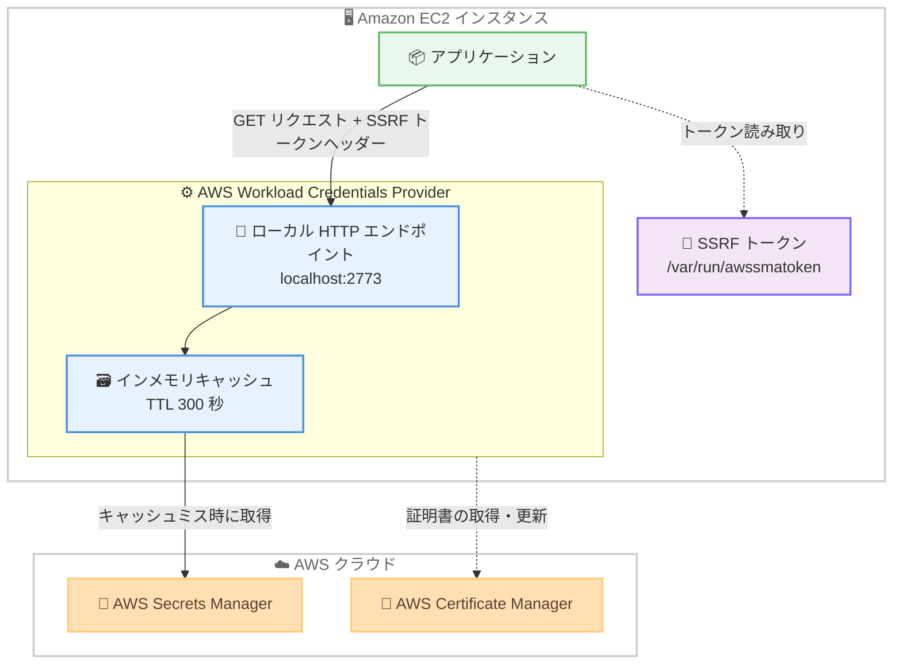

# AWS Secrets Manager - AWS Workload Credentials Provider のワンクリックインストール対応

**リリース日**: 2026 年 8 月 31 日
**サービス**: AWS Secrets Manager
**機能**: AWS Workload Credentials Provider (AWCP) の Linux および Windows 向けワンクリックインストール

📊 [このアップデートのインフォグラフィックを見る](https://takech9203.github.io/aws-news-summary/20260831-workload-credentials-provider-install.html)

## 概要

AWS Secrets Manager は、AWS Workload Credentials Provider (AWCP) のワンクリックインストールを発表しました。AWCP は AWS Secrets Manager からシークレットを取得してローカルにキャッシュし、アプリケーションがローカル HTTP エンドポイント経由でシークレットを取得できるようにするクライアントサイドエージェントです。AWS Certificate Manager (ACM) からの証明書取得にも対応しています。

今回のアップデートにより、複数ステップのソースコードビルド作業が単一コマンドでのインストールに簡素化されました。Linux (x86_64 および ARM64) と Windows (x64) 向けにビルド済みの署名付きバイナリが公開ダウンロード URL から提供されるほか、Amazon Linux のリポジトリにもパッケージが追加され、Amazon Linux を利用する EC2 ユーザーは 1 コマンドでインストールできます。すべてのバイナリはコード署名されており、完全性と真正性が保証されます。

EC2 上でシークレット管理を標準化したい開発者や運用チームにとって、導入の障壁が大幅に下がるアップデートです。

**アップデート前の課題**

このアップデート以前は、AWCP の導入に手間がかかっていました。

- EC2 で AWCP を利用するには、GitHub リポジトリのクローン、バイナリのコンパイル、設定という約 6 ステップの作業が必要だった
- Rust のビルド環境と知識をすべての開発者が用意する必要があった
- ビルド成果物の完全性を各自で担保する必要があった

**アップデート後の改善**

今回のアップデートにより、導入が大幅に簡素化されました。

- Amazon Linux 2023 では `sudo dnf install aws-workload-credentials-provider` の 1 コマンドでインストールが完了する
- Linux (x86_64 / ARM64) と Windows (x64) 向けのビルド済み署名付きバイナリを公開 URL からダウンロードできる
- RPM パッケージがサービスユーザーの作成、systemd サービスの登録・起動、SSRF トークンの生成まで自動でセットアップし、インストール直後から利用できる

## アーキテクチャ図



アプリケーションは SSRF トークンをヘッダーに付与してローカル HTTP エンドポイントにリクエストし、AWCP がキャッシュまたは Secrets Manager からシークレットを返します。今回のアップデートで、この AWCP 自体のインストールが 1 コマンドで完了するようになりました。

## サービスアップデートの詳細

### 主要機能

1. **ビルド済み署名付きバイナリの提供**
   - Linux x86_64、Linux ARM64 (AArch64)、Windows x64 向けのバイナリを公開ダウンロード URL (`https://artifacts.awcp.global.on.aws/`) から取得可能
   - すべてのバイナリはコード署名されており、SHA-256 チェックサムも公開されているため完全性と真正性を検証できる
   - ソースコードからのビルド (Rust 環境の構築、`cargo build`) が不要になった

2. **Amazon Linux リポジトリからのワンクリックインストール**
   - Amazon Linux 2023 では `dnf` によるパッケージインストールに対応
   - RPM パッケージが以下を自動セットアップする
     - サービスユーザー `aws-wcp` とグループ `awscreds`、`aws-wcp-token` の作成
     - バイナリとヘルパースクリプトの `/opt/aws/workload-credentials-provider/` への配置
     - systemd サービスの登録と自動起動
     - ランダムな SSRF トークンの `/var/run/awssmatoken` への生成
   - インストール直後から Secrets Manager 機能が利用可能

3. **インメモリキャッシュ付きのシークレット取得エージェント**
   - シークレットをインメモリにキャッシュし、ローカル HTTP エンドポイント (デフォルトポート 2773) 経由で提供
   - デフォルト TTL は 300 秒で、設定ファイル (`/etc/aws-workload-credentials-provider/config.toml`) でカスタマイズ可能
   - `refreshNow=true` パラメータでキャッシュをバイパスした強制更新にも対応

4. **AWS Certificate Manager との連携**
   - ACM からの証明書の取得と更新 (証明書自動化機能) に対応
   - シークレットと証明書の配布をひとつのエージェントに集約できる

## 技術仕様

### 提供バイナリ

| プラットフォーム | アーキテクチャ | 提供形態 |
|------|------|------|
| Amazon Linux 2023 | x86_64 / ARM64 | RPM パッケージ (`dnf install`) およびダウンロード URL |
| Linux (汎用) | x86_64 / AArch64 | 署名付きバイナリのダウンロード URL + SHA-256 チェックサム |
| Windows Server | x64 | 署名付きバイナリ (`.exe`) のダウンロード URL + SHA-256 チェックサム |

### AWCP の主な設定項目

| 項目 | デフォルト値 | 説明 |
|------|------|------|
| `http_port` | 2773 | ローカル HTTP サーバーのポート (1024〜65535) |
| `ttl_seconds` | 300 | キャッシュ TTL 秒数 (0〜3600、0 はキャッシュ無効) |
| `cache_size` | 1000 | キャッシュ可能なシークレットの最大数 (1〜1000) |
| `max_conn` | 800 | HTTP クライアントの最大同時接続数 (1〜1000) |
| `max_roles` | 20 | クロスアカウントアクセス用 IAM ロールの最大数 (1〜20) |
| `ssrf_headers` | `X-Aws-Parameters-Secrets-Token`, `X-Vault-Token` | SSRF トークンを確認するヘッダー名 |

### 必要な IAM 権限

AWCP は環境の AWS 認証情報 (例: EC2 インスタンスロール) を使用して Secrets Manager を呼び出します。

```json
{
  "Version": "2012-10-17",
  "Statement": [
    {
      "Effect": "Allow",
      "Action": [
        "secretsmanager:GetSecretValue",
        "secretsmanager:DescribeSecret"
      ],
      "Resource": "arn:aws:secretsmanager:*:123456789012:secret:*"
    }
  ]
}
```

事前フェッチ機能を使用する場合は `secretsmanager:BatchGetSecretValue` (タグベース検出時はさらに `secretsmanager:ListSecrets`) が必要です。

## 設定方法

### 前提条件

1. Amazon Linux 2023 (または対応する Linux / Windows Server) が稼働する EC2 インスタンス
2. `secretsmanager:GetSecretValue` と `secretsmanager:DescribeSecret` を許可した IAM ロールがインスタンスにアタッチされていること
3. 取得対象のシークレットが AWS Secrets Manager に作成されていること

### 手順

#### ステップ 1: AWCP のインストール

```bash
sudo dnf install aws-workload-credentials-provider
```

Amazon Linux 2023 のリポジトリから AWCP をインストールします。パッケージマネージャーが最新バージョンを自動的に選択し、サービスユーザーの作成、systemd サービスの登録・起動、SSRF トークンの生成まで自動で行われます。

#### ステップ 2: アプリケーションユーザーへの権限付与

```bash
sudo usermod -aG aws-wcp-token {{APP_USER}}
```

アプリケーションの実行ユーザーを `aws-wcp-token` グループに追加し、SSRF トークンファイル (`/var/run/awssmatoken`) の読み取りを許可します。`{{APP_USER}}` はアプリケーションを実行するユーザー ID に置き換えます。

#### ステップ 3: シークレットの取得確認

```bash
curl -v -H \
    "X-Aws-Parameters-Secrets-Token: $(</var/run/awssmatoken)" \
    'http://localhost:2773/secretsmanager/get?secretId={{YOUR_SECRET_ID}}'
```

SSRF トークンをヘッダーに付与してローカルエンドポイントにリクエストし、シークレットが取得できることを確認します。レスポンスは `GetSecretValue` API と同じ形式で返されます。

#### ステップ 4: 設定のカスタマイズ (オプション)

```toml
# /etc/aws-workload-credentials-provider/config.toml
[capabilities.secrets_manager]
http_port = 2773

[capabilities.secrets_manager.cache]
ttl_seconds = 300
cache_size = 1000
```

TTL やポート番号などを変更する場合は、デフォルト設定パス `/etc/aws-workload-credentials-provider/config.toml` に TOML 形式の設定ファイルを作成または編集します。

## メリット

### ビジネス面

- **導入コストの削減**: 約 6 ステップのビルド作業が 1 コマンドになり、導入までの時間と学習コストが大幅に削減される
- **API コストの抑制**: インメモリキャッシュにより Secrets Manager への API 呼び出し回数が減り、API 利用料金の削減につながる
- **サプライチェーンの信頼性向上**: コード署名済みバイナリと SHA-256 チェックサムにより、配布物の完全性と真正性を検証できる

### 技術面

- **Rust ビルド環境が不要**: 開発者が Rust ツールチェーンやビルドインフラを用意する必要がなくなった
- **自動セットアップ**: RPM パッケージがサービスユーザー、systemd サービス、SSRF トークンまで自動構成し、インストール直後から利用できる
- **アプリケーションの簡素化**: 各言語の SDK 実装やキャッシュ実装を持たずに、ローカル HTTP 呼び出しだけでシークレットを取得できる
- **SSRF 対策と耐量子暗号**: SSRF トークンによる保護に加え、ポスト量子鍵交換 (ML-KEM) をデフォルトで最優先に使用する

## デメリット・制約事項

### 制限事項

- RPM パッケージによるワンクリックインストールは Amazon Linux 2023 が対象 (その他の Linux はバイナリダウンロードまたはインストールスクリプトを使用)
- AWCP は読み取り専用であり、シークレットの作成・変更はできない
- キャッシュの自動無効化機能はなく、TTL 内にシークレットがローテーションされると古い値が返される可能性がある (`refreshNow=true` で回避可能)
- キャッシュ内のシークレット値は暗号化されない

### 考慮すべき点

- ホスト上で SSRF トークンとエンドポイントにアクセスできるユーザーは、キャッシュされたシークレットを取得できるため、信頼ドメインを EC2 インスタンスロールの範囲と一致させる設計が必要
- AWCP へのローカルリクエストは CloudTrail や CloudWatch には記録されない (AWCP から Secrets Manager への API 呼び出しは CloudTrail に記録される)
- アプリケーションを Secrets Manager の認証情報レベルで厳密に分離したい場合は、言語別 AWS SDK やキャッシュライブラリの利用も検討する

## ユースケース

### ユースケース 1: EC2 上のレガシーアプリケーションへのシークレット管理導入

**シナリオ**: AWS SDK を組み込みにくいレガシーアプリケーションや多言語混在環境で、データベース認証情報を Secrets Manager に集約したい。

**実装例**:
```bash
# AL2023 に AWCP をワンクリックインストール
sudo dnf install aws-workload-credentials-provider
sudo usermod -aG aws-wcp-token appuser

# アプリケーションからはローカル HTTP で取得
curl -H "X-Aws-Parameters-Secrets-Token: $(</var/run/awssmatoken)" \
    'http://localhost:2773/secretsmanager/get?secretId=prod/db/credentials'
```

**効果**: SDK 実装なしで HTTP クライアントだけあればどの言語からもシークレットを取得でき、認証情報のハードコードを排除できる。

### ユースケース 2: 大規模フリートでの API 呼び出し削減

**シナリオ**: 数百台の EC2 インスタンスで稼働するアプリケーションが頻繁にシークレットを参照しており、Secrets Manager への API 呼び出しコストとレイテンシーを削減したい。

**実装例**:
```toml
# /etc/aws-workload-credentials-provider/config.toml
[capabilities.secrets_manager.cache]
ttl_seconds = 600

[capabilities.secrets_manager.prefetch]
cache_buffer_ratio = 0.8
max_jitter_seconds = 5
filter_tags = [
    { key = "Environment" },
]
```

**効果**: 起動時の事前フェッチとキャッシュにより API 呼び出しが大幅に減り、`max_jitter_seconds` でフリート全体の同時 API 呼び出しの集中も防止できる。

### ユースケース 3: Windows Server ワークロードでのシークレット取得標準化

**シナリオ**: Windows Server 上の .NET アプリケーションで、Linux 環境と同じ方式でシークレット取得を標準化したい。

**実装例**:
```powershell
# 署名付き Windows バイナリをダウンロードして起動
Invoke-WebRequest -Uri "https://artifacts.awcp.global.on.aws/3.1.1/x86_64-pc-windows-msvc/aws-workload-credentials-provider.exe" -OutFile "aws-workload-credentials-provider.exe"
.\aws-workload-credentials-provider.exe sm start
```

**効果**: OS を問わず同一のローカル HTTP インターフェースでシークレットを取得でき、マルチプラットフォーム環境での運用手順を統一できる。

## 料金

AWCP 自体の利用に追加料金はかかりません。標準の AWS Secrets Manager の料金 (シークレットの保管料金と API 呼び出し料金) のみが適用されます。キャッシュにより API 呼び出し回数が減るため、むしろコスト削減につながる可能性があります。

## 利用可能リージョン

AWS Secrets Manager が利用可能なすべての AWS リージョンで利用できます。

## 関連サービス・機能

- **AWS Secrets Manager**: AWCP がシークレットを取得する対象サービス。シークレットのローテーションや保管を担う
- **AWS Certificate Manager**: AWCP の証明書自動化機能により、ACM の証明書をワークロードに取得・更新できる
- **Amazon EC2 / ECS / EKS / Lambda**: AWCP がサポートするコンピューティング環境。ECS / EKS ではサイドカー、Lambda では拡張機能として動作する
- **AWS STS**: `roleArn` パラメータによるロールチェーンでクロスアカウントのシークレット取得が可能

## 参考リンク

- 📊 [インフォグラフィック](https://takech9203.github.io/aws-news-summary/20260831-workload-credentials-provider-install.html)
- [公式発表 (What's New)](https://aws.amazon.com/about-aws/whats-new/2026/08/workload-credentials-provider-install/)
- [ドキュメント: Using the AWS Workload Credentials Provider](https://docs.aws.amazon.com/secretsmanager/latest/userguide/workload-credentials-provider.html)
- [ドキュメント: ACM Certificate Automation](https://docs.aws.amazon.com/acm/latest/userguide/acm-certificate-automation.html)
- [GitHub: aws-workload-credentials-provider](https://github.com/aws/aws-workload-credentials-provider)
- [料金ページ: AWS Secrets Manager](https://aws.amazon.com/secrets-manager/pricing/)

## まとめ

AWS Workload Credentials Provider のワンクリックインストール対応により、これまで Rust のビルド環境を必要とした導入作業が 1 コマンドに簡素化されました。EC2 上でシークレット管理を標準化したいチームは、まず Amazon Linux 2023 で `dnf install` による導入を試し、キャッシュ TTL や事前フェッチなどの設定をワークロードの要件に合わせて調整することを推奨します。
