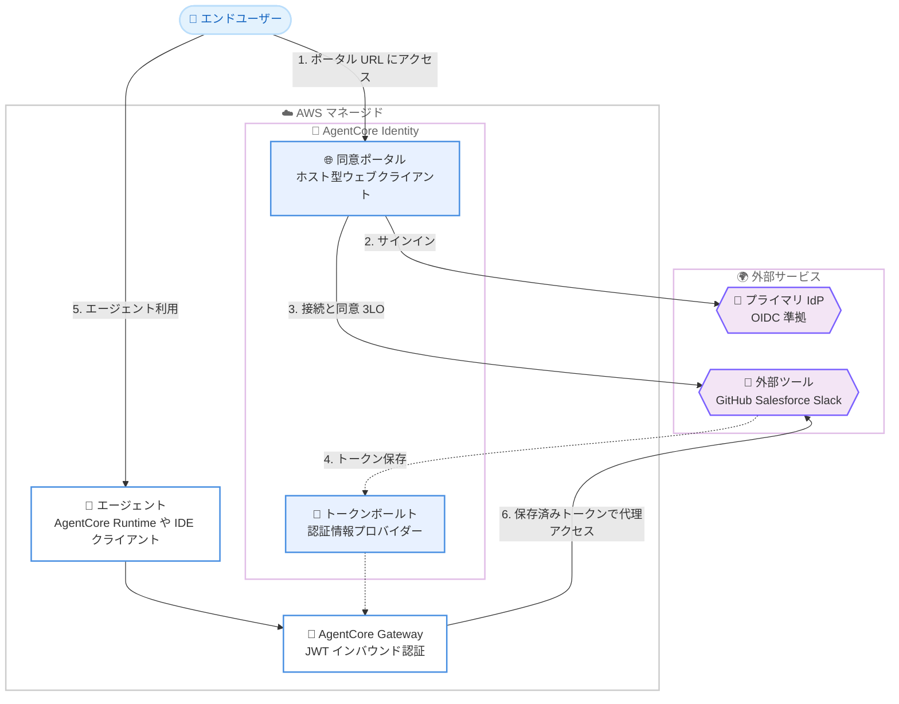

# Amazon Bedrock AgentCore Identity - マネージド同意ポータル

**リリース日**: 2026 年 9 月 1 日
**サービス**: Amazon Bedrock AgentCore (AgentCore Identity)
**機能**: マネージド同意ポータル (Managed Consent Portal)

📊 [このアップデートのインフォグラフィックを見る](https://takech9203.github.io/aws-news-summary/20260901-amazon-bedrock-agentcore.html)

## 概要

Amazon Bedrock AgentCore Identity が、AI エージェントをサードパーティのツールやサービスに接続する際に必要だったカスタム OAuth コールバック基盤を不要にする、マネージド同意ポータルの提供を開始しました。同意ポータルは AWS がホストするマネージドなウェブポータルで、エンドユーザーを OpenID Connect (OIDC) の ID プロバイダーで認証し、エージェントがユーザーに代わって外部リソースへアクセスすることへの同意を収集します。

これまで、AgentCore Gateway を使用して GitHub、Salesforce、Slack などのサービスにエージェントを接続する開発者は、OAuth 2.0 の 3-Legged 認可 (3LO) フローを完結させるために、カスタムの OAuth コールバック基盤を自前で構築・ホスティング・保守する必要がありました。今回のアップデートにより、この差別化につながらない重労働 (undifferentiated heavy lifting) が解消されます。

各 AgentCore Gateway には専用の同意ポータル (ホスト型ウェブクライアントと認証情報プロバイダー一覧を含む) が提供されます。プラットフォーム管理者はセッション開始前にポータル URL をチームに共有して、エージェントが外部ツールをユーザーの代理で呼び出すための同意を取得できます。エンドユーザーは管理者に問い合わせることなく、セルフサービスのインターフェイスからいつでも接続状態を確認できます。

**アップデート前の課題**

- OAuth 2.0 の 3LO フローを完結させるために、開発者がカスタムの OAuth コールバック基盤 (コールバックエンドポイント、同意画面、セッション管理) を構築・ホスティング・保守する必要があった
- IDE ベースのエージェントクライアント (コーディングエージェントなど) は OAuth の同意 URL をネイティブに表示できず、同意後のセッションバインディングも処理できないため、3LO を伴うツール連携が困難だった
- エンドユーザーが外部サービスとの接続状態を確認するには管理者への問い合わせが必要だった

**アップデート後の改善**

- AWS がホストするマネージド同意ポータルにより、カスタム OAuth コールバック基盤の構築・運用が不要になった
- 各 Gateway に専用のポータル (ホスト型ウェブクライアントと認証情報プロバイダー一覧) が提供され、管理者はポータル URL を共有するだけで同意の取得を開始できるようになった
- エンドユーザーはセルフサービスで接続状態を確認・管理できるようになった
- IDE ベースのエージェントクライアントは、同意ポータルを専用の認可インターフェイスとして利用できるようになった
- OAuth フローはサーバーサイドで完結し、ブラウザーがトークンを保持しない設計によりセキュリティが向上した

## アーキテクチャ図



エンドユーザーはマネージド同意ポータルでプライマリ IdP にサインインし、外部ツールへの接続と同意 (3LO) を事前に完了します。取得されたトークンは AgentCore Identity のトークンボールトに保存され、エージェントは Gateway 経由でユーザーの代理として外部ツールにアクセスできます。

## サービスアップデートの詳細

### 主要機能

1. **マネージド同意ポータル**
   - AWS がホスト・管理するウェブポータルで、エンドユーザーの認証と同意取得を代行
   - 各同意ポータルは 1 つの AgentCore Gateway (ソースタイプ `agentcore-gateway`) にアタッチされる
   - OAuth フローはサーバーサイドで完結し、ブラウザーはトークンを一切保持しない
   - ポータルの作成後、ステータスが `ACTIVE` になると専用の `portalUrl` が発行される

2. **接続 (Connections) ページによるセルフサービス管理**
   - Gateway にアタッチされたターゲットのうち、`AUTHORIZATION_CODE` グラント (3LO) を使用するものが接続候補として表示される
   - エンドユーザーは各接続の「Connect」から外部プロバイダーのサインインと同意を完了できる
   - 接続状態はいつでもセルフサービスで確認可能で、管理者への問い合わせが不要
   - `CLIENT_CREDENTIALS` グラント (2LO、マシン間認証) のターゲットはユーザー同意が不要なため表示されない

3. **IDE ベースのエージェントクライアント対応**
   - OAuth の同意 URL を表示できず、同意後のセッションバインディングを処理できない IDE ベースのクライアント向けに、専用の認可インターフェイスとして機能
   - 有効な保存済み認証情報なしでターゲットが直接呼び出された場合、AgentCore Identity はアクセストークンの代わりに認可 URL を返し、ユーザーは同意ポータルで同意を付与できる

4. **プラットフォーム管理者向けの運用簡素化**
   - 管理者はセッション開始前にポータル URL をチームへ共有するだけで、エージェントによる外部ツール呼び出しの同意を取得できる
   - ポータルに表示されるターゲット名・認証情報プロバイダー名は設定時の名前がそのまま表示されるため、エンドユーザーにわかりやすい名前を設定可能

## 技術仕様

### 同意ポータルの構成要素

| 項目 | 詳細 |
|------|------|
| ソース | AgentCore Gateway を 1 つだけ指定 (タイプ `agentcore-gateway`) |
| プライマリ IdP | JWT アクセストークンを発行する OIDC 準拠 IdP (Gateway の JWT オーソライザーと同一の OIDC 発行者) |
| IdP 構成 | `idpConfig.credentialProviderArn` (必須)、`scopes`、`audience` (任意)。`openid` スコープが必須 |
| 実行ロール | ポータルが Gateway・認証情報プロバイダーの設定と OAuth クライアントシークレットを読み取るために引き受ける IAM ロール |
| プライマリ IdP コールバック | `<portalUrl>/callback` (末尾スラッシュ不可) |
| アウトバウンド同意コールバック | `<portalUrl>/connect/callback` (ターゲットの `defaultReturnUrl` に設定) |
| ステータス | `CREATING` → `ACTIVE` (失敗時は `FAILED`、`statusReason` で診断) |
| 接続一覧のキャッシュ | 最大 5 分間キャッシュされる |

### プライマリ IdP とアウトバウンドプロバイダーの違い

| 項目 | プライマリ IdP | アウトバウンドプロバイダー |
|------|----------------|------------------------------|
| 役割 | エンドユーザーがポータルにサインインする ID | エージェントが代理アクセスする外部リソース |
| 要件 | JWT アクセストークンを発行する OIDC 準拠 IdP (認可コードグラント + クライアントシークレット) | 任意のサポート対象ベンダー |
| OAuth2 専用ベンダー | 利用不可 (GitHub、Slack、Salesforce、Atlassian、LinkedIn など) | 利用可能 |
| コールバック URL | `<portalUrl>/callback` を IdP アプリに登録 | プロバイダー固有の `callbackUrl` を外部アプリに登録 |

### 新しい API 操作

同意ポータルの管理には、コントロールプレーン (`bedrock-agentcore-control`) の以下の操作を使用します (AgentCore Identity ドキュメントで確認)。

| 操作 | 説明 |
|------|------|
| `create-consent-portal` | 同意ポータルを作成 (`name`、`executionRoleArn`、`idpConfig`、`sources` が必須) |
| `get-consent-portal` | ポータルのステータスと `portalUrl` を取得 |
| `update-consent-portal` | ポータル設定を更新 |
| `delete-consent-portal` | ポータルを削除 |

## 設定方法

### 前提条件

1. JWT インバウンド認証 (OIDC の JWT オーソライザー) を構成した AgentCore Gateway が作成済みであること
2. プライマリ IdP 用の OAuth2 認証情報プロバイダーが作成済みであること (Gateway の JWT オーソライザーと同一の OIDC 発行者を参照し、`openid` スコープが許可されていること)
3. 同意ポータルが引き受ける実行ロール (信頼ポリシーと権限ポリシーを設定した IAM ロール) が作成済みであること
4. プライマリ IdP に認可コードグラント + クライアントシークレットを使用する OIDC ウェブアプリケーションとアクティブなテストユーザーが用意されていること (リダイレクト URI はポータル作成後に登録)

### 手順

#### ステップ 1: 同意ポータルの作成

```bash
aws bedrock-agentcore-control create-consent-portal \
    --name "my-consent-portal" \
    --execution-role-arn "arn:aws:iam::<account-id>:role/<execution-role-name>" \
    --idp-config '{
        "credentialProviderArn": "arn:aws:bedrock-agentcore:<region>:<account-id>:token-vault/default/oauth2credentialprovider/<credential-provider-id>",
        "scopes": ["openid", "email", "profile"],
        "audience": "<audience>"
    }' \
    --sources '[{
        "identifier": "<gateway-id>",
        "type": "agentcore-gateway"
    }]'
```

同意ポータルを作成します。プライマリ IdP の OAuth2 認証情報プロバイダー ARN と実行ロール ARN、ソースとなる Gateway ID を指定します。レスポンスには `consentPortalId`、`consentPortalArn`、`status` が含まれます。設定するスコープには `openid` を必ず含め、すべてのスコープが IdP 側で許可されている必要があります (不足すると `invalid_scope` エラーで認可が失敗します)。

#### ステップ 2: ポータル URL の取得

```bash
aws bedrock-agentcore-control get-consent-portal \
    --consent-portal-identifier "<consent-portal-id>"
```

ポータルのステータスをポーリングします。作成直後は `CREATING` 状態で、`ACTIVE` になるとレスポンスから `portalUrl` を取得できます。`FAILED` の場合は `statusReason` フィールドで原因を確認します。

#### ステップ 3: プライマリ IdP へのコールバック URL 登録とサインイン確認

1. プライマリ IdP のアプリケーション設定に `<portalUrl>/callback` を認可済みリダイレクト URI として登録します (末尾のスラッシュを付けると IdP がコールバックを拒否するため、値を正確に入力します)
2. プライマリ IdP にアクティブなユーザーが存在することを確認します (Okta などではアプリケーションへのユーザー割り当ても必要)
3. ブラウザーで `portalUrl` を開き、IdP ユーザーでサインインして設定が正しいことを確認します

#### ステップ 4: 同意ポータルターゲットの構成

1. 外部リソース (GitHub、Slack など) 用のアウトバウンド OAuth2 認証情報プロバイダーを作成し、レスポンスの `callbackUrl` を外部プロバイダー側のアプリケーションに認可済みリダイレクト URI として登録します
2. Gateway にターゲットを追加し、`credentialProviderConfigurations` で `providerArn` にアウトバウンドプロバイダーの ARN、`grantType` に `AUTHORIZATION_CODE`、`defaultReturnUrl` に `<portalUrl>/connect/callback` を正確に設定します
3. 既存のターゲットを同意ポータルに含める場合も、各ターゲットの `defaultReturnUrl` を `<portalUrl>/connect/callback` に更新します
4. エンドユーザーは `portalUrl` にサインインし、Connections ページで「Connect」を選択して外部プロバイダーでの同意を完了します

## メリット

### ビジネス面

- **開発・運用コストの削減**: OAuth コールバック基盤の構築・ホスティング・保守が不要になり、エージェント本来の機能開発にリソースを集中できる
- **導入までの時間短縮**: 管理者はポータル URL を共有するだけで、チーム全体の外部ツール連携の同意取得を開始できる
- **サポート負荷の軽減**: エンドユーザーがセルフサービスで接続状態を確認できるため、管理者への問い合わせが減少する

### 技術面

- **セキュリティの向上**: OAuth フローがサーバーサイドで完結し、ブラウザーがトークンを保持しないため、トークン漏えいリスクを低減できる
- **IDE クライアント対応**: OAuth 同意 URL を表示できないコーディングエージェントなどの IDE ベースクライアントでも、3LO を伴うツール連携が可能になる
- **一貫した同意管理**: Gateway ごとに専用ポータルが提供され、ターゲット (外部ツール) 単位の同意状態を一元的に管理できる

## デメリット・制約事項

### 制限事項

- 同意ポータルは 1 つの AgentCore Gateway にのみアタッチできる (ソースは `agentcore-gateway` タイプ 1 つのみ)
- プライマリ IdP は JWT アクセストークンを発行する OIDC 準拠 IdP に限定される。opaque なアクセストークンを発行する IdP や、OAuth2 専用ベンダー (GitHub、Slack、Salesforce、Atlassian、LinkedIn など) はプライマリ IdP として利用できない (アウトバウンドプロバイダーとしては利用可能)
- Connections ページに表示されるのは `AUTHORIZATION_CODE` グラントのターゲットのみで、`CLIENT_CREDENTIALS` グラントのターゲットは表示されない
- 接続一覧は最大 5 分間キャッシュされるため、ターゲットの追加・更新が即座に反映されない

### 考慮すべき点

- 同意ポータル作成前に、プライマリ IdP 用 OAuth2 認証情報プロバイダー、JWT インバウンド認証付き Gateway、実行ロールの 3 つの前提リソースを準備する必要がある
- ポータル作成前に存在していた既存ターゲットは `defaultReturnUrl` が異なる (または未設定の) ため、`<portalUrl>/connect/callback` への更新が必要
- コールバック URL は末尾スラッシュの有無まで正確に登録する必要がある (`<portalUrl>/callback` と `<portalUrl>/connect/callback` は別物)
- ターゲット名と認証情報プロバイダー名はエンドユーザーにそのまま表示されるため、わかりやすい命名が必要

## ユースケース

### ユースケース 1: 社内エージェントプラットフォームの外部 SaaS 連携

**シナリオ**: プラットフォーム管理者が、AgentCore Gateway 経由で GitHub と Slack のツールを利用する社内エージェントを全社展開する。従来は各ユーザーの OAuth 同意を処理するコールバックアプリを自前で運用していた。

**実装例**:
```
1. Gateway に GitHub / Slack ターゲットを AUTHORIZATION_CODE グラントで構成
2. create-consent-portal でポータルを作成し portalUrl を取得
3. 各ターゲットの defaultReturnUrl を <portalUrl>/connect/callback に設定
4. 利用開始前に portalUrl を全社員へ共有し、各自が Connect で同意を完了
```

**効果**: カスタムコールバック基盤の運用が不要になり、ユーザーはセッション開始前に一度同意するだけでエージェントが代理アクセス可能になる。

### ユースケース 2: IDE ベースのコーディングエージェントからの 3LO 連携

**シナリオ**: 開発者が IDE 内のコーディングエージェントから Gateway 経由で外部ツールを呼び出したいが、IDE クライアントは OAuth の同意画面を表示できない。

**実装例**:
```
1. 開発者がブラウザーで portalUrl を開き、プライマリ IdP にサインイン
2. Connections ページで対象ツールに Connect し、同意を完了
3. IDE のエージェントが Gateway ターゲットを呼び出すと、保存済みトークンで代理アクセス
4. トークン失効時は AgentCore Identity が認可 URL を返すため、ポータルで再同意
```

**効果**: OAuth 同意 URL を扱えない IDE クライアントでも、同意ポータルを専用の認可インターフェイスとして 3LO フローを完結できる。

### ユースケース 3: エンドユーザーによる接続状態のセルフサービス確認

**シナリオ**: エージェント利用者が、自分のアカウントでどの外部サービスへの代理アクセスを許可しているかを確認したい。従来は管理者への問い合わせが必要だった。

**実装例**:
```
1. ユーザーが portalUrl にサインイン
2. Connections ページで各外部ツールの接続状態 (接続済み / 未接続) を確認
3. 未接続のツールは Connect から同意を付与
```

**効果**: 管理者を介さずに接続状態を可視化でき、同意の付与もユーザー自身で完結するため、運用負荷とリードタイムが削減される。

## 料金

What's New での公式発表に、本機能の追加料金に関する記載はありません。Amazon Bedrock AgentCore の最新の料金体系は [Amazon Bedrock AgentCore の料金ページ](https://aws.amazon.com/bedrock/agentcore/pricing/) を参照してください。

## 利用可能リージョン

Amazon Bedrock AgentCore Identity が利用可能なすべての商用リージョンで利用できます。

## 関連サービス・機能

- **Amazon Bedrock AgentCore Gateway**: 同意ポータルのソースとなるゲートウェイ。エージェントと外部ツール (MCP ツールなど) を接続し、ターゲットのアウトバウンド認証を管理する
- **Amazon Bedrock AgentCore Identity**: エージェントの ID とアクセス管理を提供するサービス。OAuth2 認証情報プロバイダーとトークンボールトにより、外部サービスの認証情報を安全に管理する
- **AWS IAM**: 同意ポータルが Gateway や認証情報プロバイダーの設定、OAuth クライアントシークレットを読み取るための実行ロールを提供する
- **Amazon Cognito / Okta などの OIDC IdP**: エンドユーザーがポータルにサインインするプライマリ IdP として利用できる

## 参考リンク

- 📊 [インフォグラフィック](https://takech9203.github.io/aws-news-summary/20260901-amazon-bedrock-agentcore.html)
- [公式発表 (What's New)](https://aws.amazon.com/about-aws/whats-new/2026/09/amazon-bedrock-agentcore/)
- [AgentCore Identity の概要 (ドキュメント)](https://docs.aws.amazon.com/bedrock-agentcore/latest/devguide/identity-overview.html)
- [同意ポータルの設定 (ドキュメント)](https://docs.aws.amazon.com/bedrock-agentcore/latest/devguide/identity-consent-portal.html)
- [同意ポータルの前提条件 (ドキュメント)](https://docs.aws.amazon.com/bedrock-agentcore/latest/devguide/identity-consent-portal-prerequisites.html)
- [AWS CLI での同意ポータル作成 (ドキュメント)](https://docs.aws.amazon.com/bedrock-agentcore/latest/devguide/identity-create-consent-portal.html)
- [同意ポータルターゲットの構成 (ドキュメント)](https://docs.aws.amazon.com/bedrock-agentcore/latest/devguide/identity-configure-consent-portal-target.html)
- [料金ページ](https://aws.amazon.com/bedrock/agentcore/pricing/)

## まとめ

Amazon Bedrock AgentCore Identity のマネージド同意ポータルにより、エージェントと外部ツールを 3LO で連携する際のカスタム OAuth コールバック基盤が不要になり、同意管理がセルフサービス化されました。AgentCore Gateway で GitHub、Salesforce、Slack などのツール連携を構築しているチームは、既存ターゲットの `defaultReturnUrl` 更新を含めて同意ポータルへの移行を検討することを推奨します。特に IDE ベースのコーディングエージェントで 3LO 連携を実現したい場合の有力な選択肢となります。
