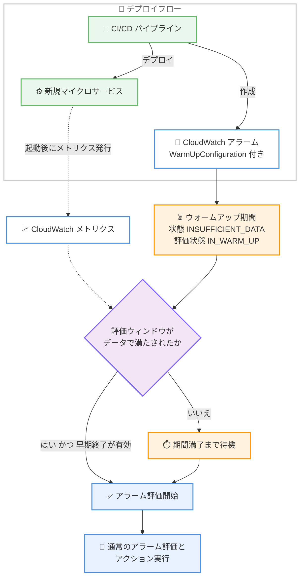

# Amazon CloudWatch - アラームのウォームアップ期間サポート

**リリース日**: 2026 年 9 月 1 日
**サービス**: Amazon CloudWatch
**機能**: アラームのウォームアップ期間 (Warm-up periods for alarms)

📊 [このアップデートのインフォグラフィックを見る](https://takech9203.github.io/aws-news-summary/20260901-amazon-cloudwatch-alarms-warmup-period.html)

## 概要

Amazon CloudWatch が、メトリクスアラームおよびログアラームに対するウォームアップ期間 (warm-up period) の設定をサポートしました。ウォームアップ期間を設定すると、アラーム作成後の指定した時間だけアラーム評価が遅延され、新しく起動したリソースやサービスがメトリクスを発行し始めるまでの間に発生するデータ欠損による誤検知 (false alert) を削減できます。

たとえば、CI/CD パイプラインでマイクロサービスとそのアラームを同時にデプロイするケースでは、サービス起動中にメトリクスが未発行のため、アラームが欠損データに基づいて状態遷移し、オンコールエンジニアへ不要な通知が送られることがありました。ウォームアップ期間により、こうした起動時のノイズを抑制できます。

**アップデート前の課題**

このアップデート以前は、アラーム作成直後の評価動作を制御する手段が限られていました。

- 以前は、メトリクスがデータを報告する前にアラームを作成すると、「欠損データの扱い (treat missing data)」設定に基づいて即座に評価が開始されていた
- 起動に時間がかかるリソースでは、起動中の欠損データにより不要な状態遷移や通知が発生していた
- CI/CD でアプリケーションとアラームを同時デプロイする場合、誤報を避けるためにアラーム作成を遅らせる、通知を一時的に抑止するなどの回避策が必要だった

**アップデート後の改善**

今回のアップデートにより、アラーム作成時に評価開始タイミングを制御できるようになりました。

- アラーム作成時に `WarmUpConfiguration` パラメータで 1〜2,880 分 (最大 2 日間) のウォームアップ期間を指定可能になった
- デフォルトでは、評価ウィンドウを満たすデータが揃った時点でウォームアップが早期終了し、自動的に評価が開始される
- オプションで、データの到着有無にかかわらずウォームアップ期間の満了まで評価を待機させることも可能になった (起動時の CPU スパイクなどによる誤検知を回避)
- ウォームアップ中はアラームが `INSUFFICIENT_DATA` 状態に保たれ、アラームアクションは実行されない

## アーキテクチャ図



CI/CD パイプラインでアプリケーションとアラームを同時にデプロイした場合の動作フローです。ウォームアップ期間中はアラームが `INSUFFICIENT_DATA` 状態に保たれ、評価ウィンドウがデータで満たされるか期間が満了した時点で通常の評価が開始されます。

## サービスアップデートの詳細

### 主要機能

1. **ウォームアップ期間の設定**
   - アラームの作成時または更新時に `WarmUpConfiguration` パラメータで設定する
   - `WarmUpPeriodDurationInMinutes` (必須) でウォームアップ期間を 1〜2,880 分 (2 日間) の範囲で指定する
   - メトリクスアラームとログアラームの両方で利用可能

2. **データ到着による早期終了 (デフォルト動作)**
   - `OnlyStartEvaluatingAfterWarmUpPeriodEnds` が `false` (デフォルト) の場合、評価ウィンドウを満たすデータが揃った時点でウォームアップが早期終了する
   - 評価ウィンドウは `Period` × `Evaluation Periods` で決まり、直近の期間にデータポイントが存在すると「満たされた」と判定される
   - 例: 5 分間隔 × 3 評価期間 = 15 分の評価ウィンドウを持つアラームを 10:00 に作成し、リソースが 10:04 にデータ発行を開始した場合、約 10:19 に完全な 15 分ウィンドウが揃い評価が開始される
   - `Datapoints to Alarm` の設定はウォームアップ終了タイミングに影響しない

3. **期間満了までの評価待機 (オプション)**
   - `OnlyStartEvaluatingAfterWarmUpPeriodEnds` を `true` に設定すると、データが早く到着してもウォームアップ期間の満了まで評価を待機する
   - 起動時の CPU スパイクなど、一時的な変動による早期のアラーム遷移を防ぎたい場合に有効

4. **ウォームアップ状態の可視化と変更**
   - ウォームアップ中はアラーム状態が `INSUFFICIENT_DATA`、評価状態が `IN_WARM_UP` となり、`DescribeAlarms` API で確認できる
   - ウォームアップ期間中に設定の変更や早期終了が可能
   - ウォームアップはアラーム作成時に 1 回のみ適用され、期間終了後に設定を更新しても再開されない

## 技術仕様

### WarmUpConfiguration パラメータ

| 項目 | 詳細 |
|------|------|
| `WarmUpPeriodDurationInMinutes` | 必須。ウォームアップ期間 (分)。1〜2,880 分 (最大 2 日間) |
| `OnlyStartEvaluatingAfterWarmUpPeriodEnds` | オプション。デフォルトは `false`。`true` にすると期間満了まで評価を開始しない |
| 対象アラームタイプ | メトリクスアラーム、ログアラーム |
| ウォームアップ中のアラーム状態 | `INSUFFICIENT_DATA` (アラームアクションは実行されない) |
| ウォームアップ中の評価状態 | `IN_WARM_UP` |
| 適用タイミング | アラーム作成時に 1 回のみ (再起動はされない) |

### API 変更履歴

| 日付 | サービス | 変更内容 |
|------|----------|----------|
| 2026/08/21 | [Amazon CloudWatch](https://awsapichanges.com/archive/changes/29afe8-monitoring.html) | 4 updated api methods - メトリクスアラームおよびログアラームの作成時に、メトリクス到着を待つ初期ウォームアップ期間を指定可能に |

### 設定例 (PutMetricAlarm)

```json
{
  "AlarmName": "my-service-high-cpu",
  "MetricName": "CPUUtilization",
  "Namespace": "AWS/EC2",
  "Statistic": "Average",
  "Period": 300,
  "EvaluationPeriods": 3,
  "Threshold": 80,
  "ComparisonOperator": "GreaterThanThreshold",
  "WarmUpConfiguration": {
    "WarmUpPeriodDurationInMinutes": 30,
    "OnlyStartEvaluatingAfterWarmUpPeriodEnds": false
  }
}
```

## 設定方法

### 前提条件

1. CloudWatch アラームを作成・更新できる IAM 権限 (`cloudwatch:PutMetricAlarm`、`cloudwatch:DescribeAlarms` など) があること
2. AWS CLI を使用する場合は、ウォームアップ期間に対応したバージョンへ更新されていること
3. 監視対象のメトリクスの `Period` と `Evaluation Periods` (評価ウィンドウ) を把握していること

### 手順

#### ステップ 1: ウォームアップ期間付きのアラームを作成する

```bash
aws cloudwatch put-metric-alarm \
  --alarm-name "my-service-high-cpu" \
  --metric-name CPUUtilization \
  --namespace AWS/EC2 \
  --statistic Average \
  --period 300 \
  --evaluation-periods 3 \
  --threshold 80 \
  --comparison-operator GreaterThanThreshold \
  --alarm-actions arn:aws:sns:ap-northeast-1:123456789012:oncall-topic \
  --warm-up-configuration WarmUpPeriodDurationInMinutes=30
```

`put-metric-alarm` コマンドで、30 分間のウォームアップ期間を持つ CPU 使用率アラームを作成しています。デフォルト動作のため、評価ウィンドウ (この例では 5 分 × 3 = 15 分) を満たすデータが揃った時点でウォームアップは早期終了し、評価が開始されます。

#### ステップ 2: 期間満了まで評価を待機させる場合

```bash
aws cloudwatch put-metric-alarm \
  --alarm-name "my-service-high-cpu-strict" \
  --metric-name CPUUtilization \
  --namespace AWS/EC2 \
  --statistic Average \
  --period 300 \
  --evaluation-periods 3 \
  --threshold 80 \
  --comparison-operator GreaterThanThreshold \
  --alarm-actions arn:aws:sns:ap-northeast-1:123456789012:oncall-topic \
  --warm-up-configuration WarmUpPeriodDurationInMinutes=60,OnlyStartEvaluatingAfterWarmUpPeriodEnds=true
```

`OnlyStartEvaluatingAfterWarmUpPeriodEnds=true` を指定することで、データが早く到着しても 60 分間は評価を開始しません。起動直後の CPU スパイクなどによる誤検知を確実に回避したい場合に使用します。

#### ステップ 3: ウォームアップ状態を確認する

```bash
aws cloudwatch describe-alarms \
  --alarm-names "my-service-high-cpu" \
  --query "MetricAlarms[].{Name:AlarmName,State:StateValue,WarmUp:WarmUpConfiguration}"
```

`describe-alarms` コマンドでアラームの状態とウォームアップ設定を確認しています。ウォームアップ中はアラーム状態が `INSUFFICIENT_DATA`、評価状態が `IN_WARM_UP` と表示されます。ウォームアップ期間中であれば、設定の変更や早期終了も可能です。

## メリット

### ビジネス面

- **アラート疲れの軽減**: デプロイのたびに発生する誤報が減ることで、オンコールエンジニアの負担と通知ノイズが軽減される
- **運用の自動化促進**: CI/CD パイプラインでアプリケーションとアラームを同時にデプロイしても誤報が発生しないため、Infrastructure as Code による監視設定の自動化を安心して進められる
- **追加コストなし**: 標準の CloudWatch アラーム料金以外の追加料金なしで利用できる

### 技術面

- **回避策の排除**: アラーム作成の遅延処理や通知の一時抑止といった独自の回避ロジックが不要になり、デプロイパイプラインがシンプルになる
- **柔軟な評価制御**: データ到着による早期終了 (デフォルト) と期間満了までの待機 (オプション) の 2 つのモードから、ワークロードの起動特性に応じて選択できる
- **状態の可視性**: `IN_WARM_UP` 評価状態により、アラームがウォームアップ中であることを API で明確に確認できる

## デメリット・制約事項

### 制限事項

- ウォームアップ期間は 1〜2,880 分 (2 日間) の範囲に限られる
- ウォームアップはアラーム作成時に 1 回のみ適用され、期間終了後に設定を更新しても新しいウォームアップ期間は開始されない
- `Datapoints to Alarm` の設定はウォームアップの終了タイミングに影響しない

### 考慮すべき点

- ウォームアップ期間中はアラームアクションが実行されないため、期間を長くしすぎると実際の障害の検知が遅れるリスクがある
- `OnlyStartEvaluatingAfterWarmUpPeriodEnds=true` を使用する場合、データが揃っていても評価が開始されないため、監視の空白期間とのトレードオフを考慮する必要がある
- 既存のアラームには自動では適用されないため、デプロイテンプレート (CloudFormation、Terraform など) の更新が必要

## ユースケース

### ユースケース 1: CI/CD パイプラインでのマイクロサービスとアラームの同時デプロイ

**シナリオ**: 新しいマイクロサービスをデプロイする際、CloudFormation でアプリケーションとアラームを同時に作成する。サービスの起動とメトリクス発行開始まで数分かかるため、従来はデプロイ直後にオンコールへ誤報が飛んでいた。

**実装例**:
```yaml
HighErrorRateAlarm:
  Type: AWS::CloudWatch::Alarm
  Properties:
    AlarmName: my-service-error-rate
    MetricName: Errors
    Namespace: MyService
    Statistic: Sum
    Period: 60
    EvaluationPeriods: 5
    Threshold: 10
    ComparisonOperator: GreaterThanThreshold
    WarmUpConfiguration:
      WarmUpPeriodDurationInMinutes: 15
```

**効果**: サービスがメトリクスを発行し始めるまでアラーム評価が保留され、デプロイ直後の誤報とオンコール呼び出しがなくなる。データが揃い次第、自動的に評価が開始されるため監視の空白も最小限になる。

### ユースケース 2: 起動時に CPU スパイクが発生するワークロードの監視

**シナリオ**: JVM ベースのアプリケーションなど、起動直後にウォームアップ処理で CPU 使用率が一時的に高騰するワークロードを監視する。データが到着した時点で評価が始まると、起動時のスパイクでアラームが発火してしまう。

**実装例**:
```bash
aws cloudwatch put-metric-alarm \
  --alarm-name "jvm-app-high-cpu" \
  --metric-name CPUUtilization \
  --namespace AWS/EC2 \
  --statistic Average \
  --period 60 \
  --evaluation-periods 5 \
  --threshold 70 \
  --comparison-operator GreaterThanThreshold \
  --warm-up-configuration WarmUpPeriodDurationInMinutes=30,OnlyStartEvaluatingAfterWarmUpPeriodEnds=true
```

**効果**: データの到着有無にかかわらず 30 分間は評価が開始されないため、起動時の一時的な CPU スパイクによる誤検知を確実に回避できる。

### ユースケース 3: ログアラームによる新規サービスのエラー監視

**シナリオ**: 新規サービスのログベースのエラー監視をサービス公開と同時に設定したい。ログの出力が始まるまでに時間がかかるため、欠損データによる状態遷移を避けたい。

**実装例**:
```bash
# メトリクスフィルタで抽出したエラーメトリクスへのログアラームに
# ウォームアップ期間を設定する
aws cloudwatch put-metric-alarm \
  --alarm-name "new-service-log-errors" \
  --metric-name ErrorCount \
  --namespace MyService/Logs \
  --statistic Sum \
  --period 300 \
  --evaluation-periods 2 \
  --threshold 5 \
  --comparison-operator GreaterThanOrEqualToThreshold \
  --treat-missing-data notBreaching \
  --warm-up-configuration WarmUpPeriodDurationInMinutes=60
```

**効果**: ログ出力が始まるまでアラームは `INSUFFICIENT_DATA` に保たれ、ログが評価ウィンドウを満たした時点で評価が開始される。欠損データ扱いの設定と組み合わせることで、公開直後から安定した監視を実現できる。

## 料金

ウォームアップ期間の利用に追加料金はかかりません。標準の CloudWatch アラーム料金のみが適用されます。

### 料金例

| 使用量 | 月額料金 (概算、米国東部リージョン) |
|--------|------------------|
| 標準解像度アラーム 1 個 (ウォームアップ設定あり) | $0.10 |
| 標準解像度アラーム 100 個 | $10.00 |

詳細は [CloudWatch 料金ページ](https://aws.amazon.com/cloudwatch/pricing/) を参照してください。

## 利用可能リージョン

CloudWatch が提供されているすべての AWS リージョンで利用可能です (東京・大阪リージョンを含む)。

## 関連サービス・機能

- **Amazon CloudWatch アラーム**: 本機能のベースとなるメトリクスアラームとログアラーム。既存の「欠損データの扱い」設定と組み合わせて評価動作を制御できる
- **Amazon SNS**: アラームアクションの通知先。ウォームアップ期間中はアクションが実行されないため、不要な通知が抑止される
- **AWS CloudFormation / Terraform**: アプリケーションとアラームを同時にデプロイする IaC ツール。ウォームアップ期間の設定をテンプレートに含めることで誤報のないデプロイを自動化できる
- **Amazon CloudWatch Logs メトリクスフィルタ**: ログアラームの元となるメトリクスを生成する機能。新規サービスのログ監視でウォームアップ期間と組み合わせて活用できる

## 参考リンク

- 📊 [インフォグラフィック](https://takech9203.github.io/aws-news-summary/20260901-amazon-cloudwatch-alarms-warmup-period.html)
- [公式発表 (What's New)](https://aws.amazon.com/about-aws/whats-new/2026/08/amazon-cloudwatch-alarms-warmup-period)
- [ドキュメント: Alarm warm-up periods](https://docs.aws.amazon.com/AmazonCloudWatch/latest/monitoring/alarm-warm-up.html)
- [ドキュメント: Create an alarm that uses a warm-up period](https://docs.aws.amazon.com/AmazonCloudWatch/latest/monitoring/Create_WarmUp_Alarm.html)
- [料金ページ](https://aws.amazon.com/cloudwatch/pricing/)

## まとめ

CloudWatch アラームのウォームアップ期間は、CI/CD によるアラームの自動デプロイで長年の課題だった「デプロイ直後の誤報」を、追加料金なしのシンプルなパラメータ 1 つで解決するアップデートです。アプリケーションとアラームを同時にデプロイしているチームは、CloudFormation や Terraform のテンプレートに `WarmUpConfiguration` を追加し、ワークロードの起動特性に合わせて早期終了モードか期間満了待機モードを選択することを推奨します。
