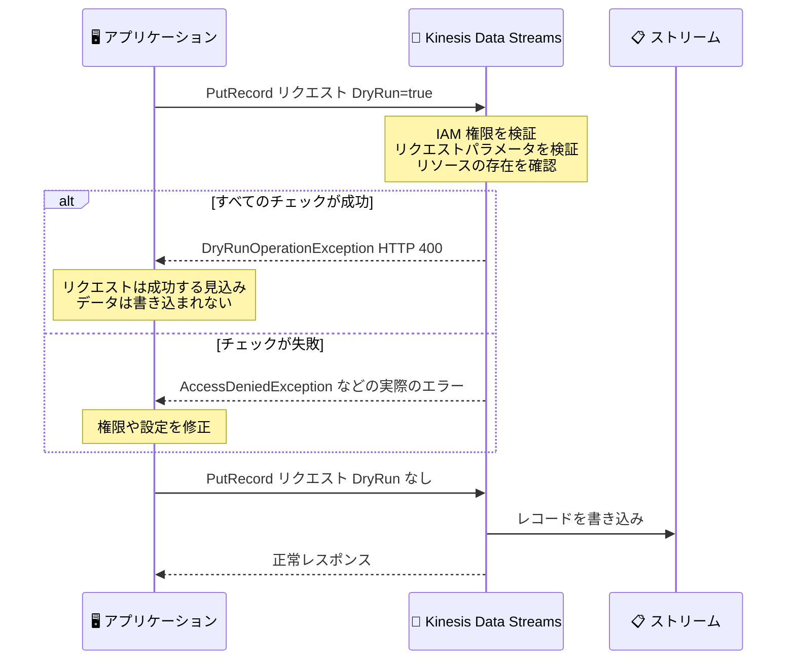

# Amazon Kinesis Data Streams - API リクエストを検証する Dry Run 機能

**リリース日**: 2026 年 9 月 1 日
**サービス**: Amazon Kinesis Data Streams
**機能**: データプレーン API の Dry Run (DryRun パラメータ) による事前検証

📊 [このアップデートのインフォグラフィックを見る](https://takech9203.github.io/aws-news-summary/20260901-amazon-kinesis-data-streams-api.html)

## 概要

Amazon Kinesis Data Streams が、API リクエストを実際に実行することなく成功するかどうかを事前に検証できる Dry Run 機能をサポートしました。API リクエストに新しいオプションパラメータ `DryRun` を `true` として指定するだけで、本番ストリームに影響を与えることなく、IAM 権限、リクエストパラメータ、対象リソースの存在をまとめて検証できます。

すべてのチェックが成功した場合、API は `DryRunOperationException` (HTTP 400) を返し、「`DryRun` パラメータなしであればリクエストは成功していた」ことを確認できます。チェックに失敗した場合は、実際の操作が返すものと同じエラー (例: `AccessDeniedException`) が返されるため、失敗原因の切り分けも容易です。

この機能は、本番環境へのデプロイ前にプロデューサー / コンシューマーアプリケーションの権限設定を安全に確認したい開発者や運用チームにとって、大きな価値があります。

**アップデート前の課題**

このアップデート以前は、アプリケーションがストリームへアクセスする権限を持っているかを安全にテストする方法がありませんでした。

- 権限を確認するために、意図的に失敗するよう設計したリクエスト (例: 最大サポートサイズを超えるペイロードの `PutRecord`) を送信する回避策が使われていた
- この回避策はサービスの制限値に依存しており、制限値が変更されると予期せずリクエストが成功し、本番ストリームと下流のコンシューマーに意図しないレコードが書き込まれるリスクがあった
- 読み取り系 API (GetRecords、SubscribeToShard など) の権限を、実データを読まずに検証する手段がなかった

**アップデート後の改善**

- `DryRun` パラメータを `true` に設定するだけで、操作を実行せずに IAM 権限・リクエストパラメータ・リソースの存在を検証できるようになった
- 意図的に失敗させるリクエストなどの壊れやすい回避策が不要になり、本番ストリームへ意図しないデータが書き込まれるリスクを排除できるようになった
- 検証成功時は `DryRunOperationException`、失敗時は実際の操作と同じエラーが返るため、デプロイ前の権限トラブルシューティングが容易になった

## アーキテクチャ図



Dry Run リクエストでは、Kinesis Data Streams が権限・パラメータ・リソースの検証のみを実施し、データの読み書きは一切行いません。検証成功後に `DryRun` パラメータを外して実際の操作を実行します。

## サービスアップデートの詳細

### 主要機能

1. **DryRun パラメータによる事前検証**
   - リクエストに `DryRun: true` を指定すると、操作を実行せずに検証のみを行う
   - IAM 権限の有無、リクエストパラメータの妥当性、対象リソース (ストリームやコンシューマー) の存在を確認する
   - データの読み取り・書き込みは一切発生しない

2. **5 つのデータプレーン API をサポート**
   - 書き込み系: `PutRecord`、`PutRecords`
   - 読み取り系: `GetRecords`、`GetShardIterator`、`SubscribeToShard`
   - プロデューサーとコンシューマーの両方の権限を事前検証できる

3. **明確な検証結果のフィードバック**
   - 検証成功時: `DryRunOperationException` (HTTP 400) が返り、リクエストが成功する見込みであることを確認できる
   - 検証失敗時: 実際の操作と同じエラー (`AccessDeniedException`、`ResourceNotFoundException`、`ValidationException`、`InvalidArgumentException` など) が返る

4. **AWS CloudTrail によるログ記録**
   - CloudTrail のデータイベントを有効化すると、`DryRun` を指定した API 呼び出しもログに記録される
   - イベントのリクエストに `DryRun` パラメータが含まれ、検証成功時は `errorCode` フィールドに `DryRunOperationException` が記録される

## 技術仕様

### Dry Run 機能の仕様

| 項目 | 詳細 |
|------|------|
| 対象 API | PutRecord、PutRecords、GetRecords、GetShardIterator、SubscribeToShard |
| パラメータ | `DryRun` (boolean、オプション、デフォルトは false) |
| 検証内容 | IAM 権限、リクエストパラメータ、リソースの存在 |
| 成功時のレスポンス | `DryRunOperationException` (HTTP 400) |
| 失敗時のレスポンス | 実際の操作と同じエラー |
| スロットリング | ストリームあたり 1 TPS の専用制限 (対象 5 API で共有、超過時は `ThrottlingException`) |
| 追加料金 | なし (DryRun 無効時の同等リクエストと同じ課金) |
| KMS 権限の検証 | 対象外 (暗号化ストリームの KMS キー権限は別途検証が必要) |

### 返却される主な例外

| 例外 | 意味 |
|------|------|
| `DryRunOperationException` | DryRun パラメータなしであればリクエストは成功していた (検証成功) |
| `AccessDeniedException` | 呼び出し元に API アクションに必要な IAM 権限がない |
| `ResourceNotFoundException` | 指定したストリームまたはコンシューマーが存在しない |
| `ValidationException` | 必須フィールドの欠落や不正な ARN など、リクエストパラメータが無効 |
| `InvalidArgumentException` | パラメータ値が範囲外または未サポート (無効な ShardIteratorType、未来のタイムスタンプなど) |
| `ThrottlingException` | Dry Run 専用のスロットリング制限 (1 TPS/ストリーム) を超過 |

### API変更履歴

| 日付 | サービス | 変更内容 |
|------|----------|----------|
| 2026/09/01 | [kinesis](https://awsapichanges.com/archive/changes/31b875-kinesis.html) | 5 updated api methods - PutRecord、PutRecords、GetRecords、GetShardIterator、SubscribeToShard に `DryRun` (boolean) パラメータを追加 |

## 設定方法

### 前提条件

1. Amazon Kinesis Data Streams のストリームが作成済みであること
2. AWS CLI または AWS SDK が最新バージョンに更新されていること
3. 検証対象の API アクションを呼び出す IAM プリンシパル (ロールまたはユーザー) を用意していること

### 手順

#### ステップ1: AWS CLI で PutRecord の権限を検証する

```bash
aws kinesis put-record \
  --stream-name my-stream \
  --data "dGVzdC1kYXRh" \
  --partition-key test-key \
  --dry-run
```

`--dry-run` フラグを指定して `PutRecord` を呼び出します。データは書き込まれず、権限とパラメータの検証のみが行われます。検証に成功すると「DryRunOperation validation succeeded while calling PutRecord」というメッセージを含むレスポンスが返ります。

#### ステップ2: AWS SDK (Python) で読み取り権限を検証する

```python
import boto3
from botocore.exceptions import ClientError

client = boto3.client("kinesis")

try:
    client.get_shard_iterator(
        StreamName="my-stream",
        ShardId="shardId-000000000000",
        ShardIteratorType="TRIM_HORIZON",
        DryRun=True,
    )
except ClientError as e:
    code = e.response["Error"]["Code"]
    if code == "DryRunOperationException":
        print("検証成功: リクエストは成功する見込みです")
    else:
        print(f"検証失敗: {code}")
```

`DryRun=True` を指定して `GetShardIterator` を呼び出し、返却される例外の種類で検証結果を判定します。`DryRunOperationException` であれば権限とパラメータは正しく、それ以外のエラーであれば修正が必要です。

#### ステップ3: CloudTrail で Dry Run 呼び出しを確認する

CloudTrail のデータイベントを有効化している場合、`DryRun` を指定した API 呼び出しがログに記録されます。検証成功のイベントは `errorCode` フィールドが `DryRunOperationException` となるため、デプロイ前検証の実施状況を監査できます。

## メリット

### ビジネス面

- **本番障害リスクの低減**: デプロイ前に権限不備を検出できるため、本番環境でのデータ書き込み失敗や読み取り失敗による障害を未然に防げる
- **データ品質の保護**: 意図的に失敗させるテストリクエストが不要になり、本番ストリームと下流コンシューマーへの意図しないデータ混入を防止できる
- **追加コストなし**: Dry Run の利用に追加料金は発生しない

### 技術面

- **安全な権限検証**: データの読み書きを一切行わずに、IAM 権限・パラメータ・リソース存在を検証できる
- **実際のエラーと同一のフィードバック**: 検証失敗時は実際の操作と同じ例外が返るため、トラブルシューティングのロジックを共通化できる
- **CI/CD への組み込み**: デプロイパイプラインのスモークテストとして権限検証を自動化できる

## デメリット・制約事項

### 制限事項

- 対象はデータプレーンの 5 API (PutRecord、PutRecords、GetRecords、GetShardIterator、SubscribeToShard) のみで、コントロールプレーン API は対象外
- Dry Run リクエストはストリームあたり 1 TPS の専用スロットリング制限があり、対象 5 API で共有される (超過時は `ThrottlingException`)
- `DryRun` パラメータは Kinesis Data Streams の API アクションに対する IAM 権限のみを検証し、AWS KMS キーの権限は検証しない

### 考慮すべき点

- サーバー側暗号化でカスタマーマネージド KMS キーを使用するストリームでは、プロデューサーの `kms:GenerateDataKey` 権限とコンシューマーの `kms:Decrypt` 権限を別途検証する必要がある
- 検証成功時のレスポンスが HTTP 400 の例外 (`DryRunOperationException`) である点に注意し、アプリケーションのエラーハンドリングで「成功」として扱うロジックを実装する必要がある
- Dry Run リクエストにも通常のリクエストと同じ課金が適用される (例: Provisioned モードの PutRecord は入力ペイロードサイズに基づき課金)

## ユースケース

### ユースケース1: 本番デプロイ前のプロデューサー権限検証

**シナリオ**: 新しいマイクロサービスを本番環境にデプロイする前に、サービスの IAM ロールが本番ストリームへの書き込み権限を持っているかを、実データを書き込まずに確認したい。

**実装例**:
```bash
aws kinesis put-record \
  --stream-name prod-orders-stream \
  --data "dGVzdA==" \
  --partition-key validation \
  --dry-run
```

**効果**: 本番ストリームにテストデータを混入させることなく権限を確認でき、デプロイ後の書き込み失敗やデータ汚染を防止できる。

### ユースケース2: CI/CD パイプラインでの権限スモークテスト

**シナリオ**: デプロイパイプラインの最終ステージで、プロデューサーとコンシューマー両方の権限を自動検証し、権限不備があればデプロイを中断したい。

**実装例**:
```python
def validate_kinesis_permissions(client, stream_name, shard_id):
    checks = [
        lambda: client.put_record(
            StreamName=stream_name, Data=b"x",
            PartitionKey="ci-check", DryRun=True),
        lambda: client.get_shard_iterator(
            StreamName=stream_name, ShardId=shard_id,
            ShardIteratorType="LATEST", DryRun=True),
    ]
    for check in checks:
        try:
            check()
        except ClientError as e:
            if e.response["Error"]["Code"] != "DryRunOperationException":
                raise RuntimeError(f"権限検証に失敗: {e}")
```

**効果**: 権限不備をデプロイ前に自動検出でき、本番リリース後の障害対応コストを削減できる。

### ユースケース3: Enhanced Fan-Out コンシューマーの事前検証

**シナリオ**: Enhanced Fan-Out を使用する新しいコンシューマーアプリケーションが、`SubscribeToShard` を呼び出す権限とコンシューマー ARN の設定が正しいかを、実際にサブスクライブする前に確認したい。

**実装例**:
```python
client.subscribe_to_shard(
    ConsumerARN="arn:aws:kinesis:ap-northeast-1:123456789012:stream/my-stream/consumer/my-consumer:1234567890",
    ShardId="shardId-000000000000",
    StartingPosition={"Type": "LATEST"},
    DryRun=True,
)
```

**効果**: コンシューマー ARN の誤りや権限不足を、実際のデータ購読を開始する前に検出できる。

## 料金

Dry Run 機能の利用に追加料金はありません。`DryRun` を有効にしたリクエストは、無効にした同等のリクエストと同じ料金体系で課金されます。例えば、Provisioned モードの `PutRecord` および `PutRecords` は入力ペイロードサイズに基づいて課金されます。ストリームおよびシャード時間に対する料金は引き続き適用されます。

詳細は [Amazon Kinesis Data Streams の料金ページ](https://aws.amazon.com/kinesis/data-streams/pricing/) を参照してください。

## 利用可能リージョン

Amazon Kinesis Data Streams が利用可能なすべての AWS リージョンで利用できます (東京リージョン、大阪リージョンを含む)。

## 関連サービス・機能

- **AWS IAM**: Dry Run が検証する権限の定義元。ストリームへのアクセスポリシーを管理する
- **AWS CloudTrail**: データイベントを有効化すると Dry Run 呼び出しがログに記録され、検証の監査が可能
- **AWS KMS**: サーバー側暗号化を使用するストリームでは、KMS キー権限の検証は Dry Run の対象外のため別途確認が必要
- **Amazon EC2**: 多くの EC2 API で以前から同様の `DryRun` パラメータが提供されており、同じ検証パターンを Kinesis Data Streams でも利用できるようになった

## 参考リンク

- 📊 [インフォグラフィック](https://takech9203.github.io/aws-news-summary/20260901-amazon-kinesis-data-streams-api.html)
- [公式発表 (What's New)](https://aws.amazon.com/about-aws/whats-new/2026/09/amazon-kinesis-data-streams-api/)
- [ドキュメント: Test your permissions and request inputs with dry run](https://docs.aws.amazon.com/streams/latest/dev/kds-dryrun-validation.html)
- [Amazon Kinesis Data Streams API Reference](https://docs.aws.amazon.com/kinesis/latest/APIReference/)
- [料金ページ](https://aws.amazon.com/kinesis/data-streams/pricing/)

## まとめ

Amazon Kinesis Data Streams の Dry Run 機能により、本番ストリームに影響を与えることなく、データプレーン API の権限とリクエストパラメータを安全に検証できるようになりました。これまで使われてきた「意図的に失敗させるリクエスト」のような壊れやすい回避策を排除できるため、Kinesis Data Streams を利用するチームは、デプロイパイプラインへの権限検証の組み込みを検討することを推奨します。KMS キー権限は検証対象外である点にのみ注意が必要です。
