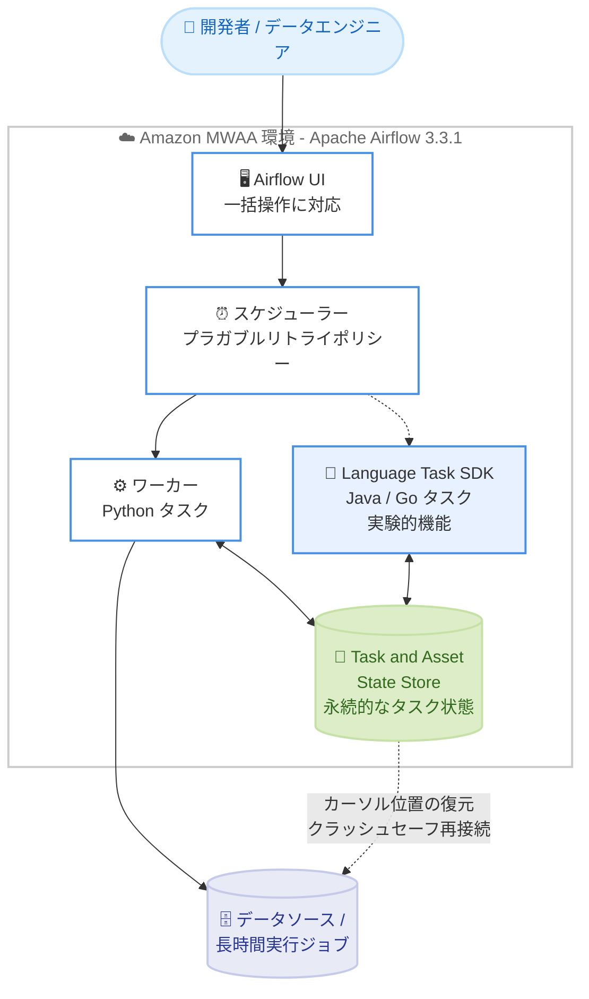

# Amazon MWAA - Apache Airflow バージョン 3.3.1 のサポート

**リリース日**: 2026 年 9 月 1 日
**サービス**: Amazon Managed Workflows for Apache Airflow (MWAA)
**機能**: Apache Airflow バージョン 3.3.1 のサポート

📊 [このアップデートのインフォグラフィックを見る](https://takech9203.github.io/aws-news-summary/20260901-amazon-mwaa-apache-airflow-3-3-1.html)

## 概要

Amazon Managed Workflows for Apache Airflow (MWAA) が、オープンソースのワークフローオーケストレーションフレームワークである Apache Airflow の最新リリース、バージョン 3.3.1 をサポートしました。Amazon MWAA は Apache Airflow のマネージドオーケストレーションサービスであり、クラウド上でエンドツーエンドのデータパイプラインを容易にセットアップ・運用できます。

Apache Airflow 3.3 では、ステートフルタスクとマルチ言語サポートが導入されました。新しい Task and Asset State Store により、タスクはリトライや再実行をまたいで永続的な状態を保持できるようになり、カーソルトラッキングや長時間実行ジョブへのクラッシュセーフな再接続が可能になります。また、実験的機能である Language Task SDK により、オーケストレーションは Python で維持しながら、タスクロジックを Java や Go で記述できます。さらに、アセットパーティショニングの拡張、プラガブルなリトライポリシー、DAG 実行およびタスクインスタンスへの一括操作などの改善も含まれます。Apache Airflow 3.3.1 は、これらの機能に加えて安定性、セキュリティ、UI の改善を提供します。

AWS Management Console から数クリックで、新しい Apache Airflow 3.3.1 環境を起動するか、バージョン 3.2 以降の既存環境からアップグレードできます。

**アップデート前の課題**

- 以前はタスクの状態をリトライや再実行をまたいで保持する標準的な仕組みがなく、増分処理のカーソル位置などを XCom や外部ストア (S3、DynamoDB など) に独自実装で保存する必要があった
- タスクが失敗・クラッシュした場合、長時間実行ジョブへ安全に再接続する手段がなく、処理を最初からやり直すケースがあった
- タスクロジックは実質的に Python での記述が前提であり、Java や Go の既存資産を持つチームはラッパーや外部実行の工夫が必要だった
- 多数の DAG 実行やタスクインスタンスに対する操作を個別に行う必要があり、大規模環境での運用負荷が高かった

**アップデート後の改善**

- Task and Asset State Store により、タスクがリトライ・再実行をまたいで永続的な状態を保持できるようになり、カーソルトラッキングや長時間実行ジョブへのクラッシュセーフな再接続が可能になった
- Language Task SDK (実験的機能) により、オーケストレーションを Python に保ちながらタスクロジックを Java や Go で記述できるようになった
- アセットパーティショニングの拡張とプラガブルなリトライポリシーにより、データ指向のパイプライン設計と障害時の挙動制御がより柔軟になった
- DAG 実行およびタスクインスタンスへの一括操作 (バルクアクション) により、大規模環境の運用効率が向上した
- マネージドサービスである MWAA 上で、これらの最新機能をインフラ管理なしで利用できるようになった

## アーキテクチャ図



Apache Airflow 3.3.1 環境の主要コンポーネントと新機能の関係を示しています。Task and Asset State Store がタスク状態を永続化し、リトライや再実行後もカーソル位置の復元や長時間実行ジョブへの安全な再接続を可能にします。

## サービスアップデートの詳細

### 主要機能

1. **Task and Asset State Store (ステートフルタスク)**
   - タスクがリトライや再実行をまたいで永続的な状態 (durable state) を保持可能
   - 増分データ処理におけるカーソルトラッキングを標準機能として実現
   - 長時間実行ジョブに対するクラッシュセーフな再接続をサポートし、障害時に処理を途中から再開可能

2. **Language Task SDK (実験的機能)**
   - タスクロジックを Java または Go で記述可能
   - オーケストレーション (DAG 定義) は従来どおり Python で維持
   - Python 以外の言語資産を持つチームが既存コードを活かしてパイプラインを構築可能

3. **アセットパーティショニングの拡張**
   - データアセットをパーティション単位で扱う機能が拡張され、データ指向スケジューリングの粒度が向上

4. **プラガブルなリトライポリシー**
   - タスクのリトライ挙動をポリシーとして差し替え可能になり、障害時の再試行戦略を柔軟に制御

5. **DAG 実行・タスクインスタンスへの一括操作**
   - 複数の DAG 実行やタスクインスタンスに対するバルクアクションをサポートし、大規模環境の運用作業を効率化

6. **Apache Airflow 3.3.1 での改善**
   - 3.3 系の機能に加えて、安定性、セキュリティ、UI の改善を提供 (3.3.1 は 2026 年 8 月 12 日にリリース)

## 技術仕様

### バージョンとアップグレードパス

| 項目 | 詳細 |
|------|------|
| サポートバージョン | Apache Airflow 3.3.1 |
| 新規環境の作成 | AWS Management Console などから Apache Airflow 3.3.1 を選択して作成可能 |
| アップグレード元バージョン | Apache Airflow 3.2 以降の環境からインプレースアップグレード可能 |
| Language Task SDK | 実験的機能 (Java / Go に対応) |
| 提供リージョン | 現在サポートされているすべての Amazon MWAA リージョン |

### API 変更履歴

本アップデートに伴う Amazon MWAA の API 変更は、awsapichanges.com では確認されていません (2026 年 9 月 1 日時点)。既存の `CreateEnvironment` / `UpdateEnvironment` API の `AirflowVersion` パラメータで `3.3.1` を指定します。

## 設定方法

### 前提条件

1. AWS アカウントと Amazon MWAA に対する適切な IAM 権限
2. DAG を配置する Amazon S3 バケット (バージョニング有効)
3. 既存環境をアップグレードする場合は、Apache Airflow 3.2 以降で稼働していること
4. DAG やカスタムプラグイン、requirements.txt が Apache Airflow 3.3.1 と互換であることの事前確認

### 手順

#### ステップ 1: 新規環境を Apache Airflow 3.3.1 で作成する

```bash
aws mwaa create-environment \
  --name my-airflow-331-environment \
  --airflow-version 3.3.1 \
  --source-bucket-arn arn:aws:s3:::my-mwaa-bucket \
  --dag-s3-path dags \
  --execution-role-arn arn:aws:iam::123456789012:role/my-mwaa-execution-role \
  --network-configuration SubnetIds=subnet-xxxx,subnet-yyyy,SecurityGroupIds=sg-zzzz
```

`create-environment` コマンドで `--airflow-version 3.3.1` を指定し、新しい MWAA 環境を作成します。S3 バケット、実行ロール、ネットワーク設定は環境に合わせて指定します。

#### ステップ 2: 既存環境を 3.3.1 にアップグレードする

```bash
aws mwaa update-environment \
  --name my-existing-environment \
  --airflow-version 3.3.1
```

`update-environment` コマンドで `--airflow-version 3.3.1` を指定し、Apache Airflow 3.2 以降の既存環境をインプレースアップグレードします。AWS Management Console からも数クリックで実行できます。

#### ステップ 3: 動作確認

アップグレード完了後、Airflow UI にアクセスして DAG が正常にパース・実行されることを確認します。requirements.txt に記載したプロバイダーパッケージやカスタムプラグインについても、Airflow 3.3.1 との互換性を検証します。本番環境への適用前に、検証用環境での動作確認を推奨します。

## メリット

### ビジネス面

- **開発言語の選択肢拡大**: Language Task SDK により Java や Go のエンジニアリソースや既存資産を活用でき、チーム編成の柔軟性が向上する
- **運用コストの削減**: ステートフルタスクにより失敗時の再処理を途中から再開でき、再実行にかかる時間とコンピュートコストを削減できる
- **最新 OSS 機能の迅速な活用**: マネージドサービス上で Airflow の最新機能をインフラ管理なしで利用でき、コミュニティの進化に追随しやすい

### 技術面

- **状態管理の標準化**: カーソル位置などのタスク状態を外部ストアに独自実装する必要がなくなり、Task and Asset State Store で一元管理できる
- **耐障害性の向上**: 長時間実行ジョブへのクラッシュセーフな再接続により、障害発生時もジョブを安全に継続できる
- **柔軟な再試行制御**: プラガブルなリトライポリシーにより、ワークロード特性に応じた再試行戦略を実装できる
- **大規模運用の効率化**: DAG 実行やタスクインスタンスへの一括操作により、多数のワークフローを扱う環境での運用作業を省力化できる

## デメリット・制約事項

### 制限事項

- インプレースアップグレードの対象は Apache Airflow 3.2 以降の環境であり、それより古いバージョン (2.x 系など) からは段階的な移行計画が必要
- Language Task SDK は実験的機能 (experimental) であり、仕様変更の可能性があるため本番利用は慎重に判断する必要がある
- MWAA がサポートする Airflow バージョンにはサポート期限があるため、継続的なバージョンアップ計画が必要

### 考慮すべき点

- DAG、カスタムプラグイン、requirements.txt のプロバイダーパッケージが Airflow 3.3.1 と互換であるかを事前に検証する必要がある
- Task and Asset State Store を活用するには、既存の独自状態管理 (XCom や外部ストアベース) からの移行設計が必要
- アップグレード前に環境のスナップショットに相当する構成情報 (設定、依存関係) を整理し、ロールバック手順を準備しておくことが望ましい

## ユースケース

### ユースケース 1: 増分データ取り込みのカーソルトラッキング

**シナリオ**: 外部データベースや API から増分データを定期的に取り込むパイプラインで、前回処理した位置 (カーソル) を確実に記録し、リトライ時も重複や欠損なく処理を継続したい。

**実装例**:
```
1. 取り込みタスク内で Task and Asset State Store にカーソル位置 (最終処理 ID やタイムスタンプ) を保存
2. タスク開始時に State Store からカーソルを読み込み、続きから取り込みを実行
3. リトライや再実行が発生しても、保存済みカーソルから安全に再開
```

**効果**: 独自の状態管理実装が不要になり、重複処理やデータ欠損のリスクを抑えながら増分処理を安定運用できる。

### ユースケース 2: 長時間実行ジョブへのクラッシュセーフな再接続

**シナリオ**: 外部の分散処理基盤で数時間かかるジョブを起動・監視するタスクにおいて、ワーカーの再起動や一時的な障害が発生しても、実行中のジョブを最初からやり直したくない。

**実装例**:
```
1. ジョブ起動時に外部ジョブ ID を Task and Asset State Store に保存
2. タスクがリトライされた際、State Store からジョブ ID を取得
3. 新規起動ではなく既存ジョブへ再接続し、監視を継続
```

**効果**: 長時間ジョブの二重起動やゼロからの再実行を防ぎ、処理時間とコンピュートコストを大幅に削減できる。

### ユースケース 3: Java / Go 資産を活用したポリグロットなパイプライン

**シナリオ**: データ変換ロジックが Java で実装済みの企業が、Airflow によるオーケストレーションを導入したいが、ロジックを Python に書き換えるコストは避けたい。

**実装例**:
```
1. DAG 定義 (スケジュール、依存関係) は従来どおり Python で記述
2. 変換ロジックは Language Task SDK を使って Java タスクとして実装
3. MWAA 上でオーケストレーションと Java タスクを統合実行
```

**効果**: 既存の Java 資産を書き換えずに活用でき、移行コストを抑えながら Airflow ベースの統合オーケストレーションを実現できる (実験的機能のため検証環境での評価を推奨)。

## 料金

Amazon MWAA の料金体系に変更はありません。環境サイズ (Small / Medium / Large など) に応じた環境の稼働時間、追加のワーカーおよびスケジューラーのインスタンス時間、メタデータデータベースのストレージ使用量に基づく従量課金です。Apache Airflow 3.3.1 の利用自体に追加料金は発生しません。

詳細は [Amazon MWAA 料金ページ](https://aws.amazon.com/managed-workflows-for-apache-airflow/pricing/) を参照してください。

## 利用可能リージョン

現在サポートされているすべての Amazon MWAA リージョンで利用可能です。最新のリージョン対応状況は [AWS リージョン別サービス一覧](https://aws.amazon.com/about-aws/global-infrastructure/regional-product-services/) を参照してください。

## 関連サービス・機能

- **Amazon S3**: DAG ファイル、requirements.txt、カスタムプラグインの配置先として MWAA 環境と連携
- **AWS Step Functions**: AWS ネイティブなワークフローオーケストレーションの選択肢。Airflow エコシステムを活用したい場合は MWAA が適する
- **Amazon EMR / AWS Glue**: MWAA からオーケストレーションされる代表的なデータ処理サービス。長時間実行ジョブへの再接続ユースケースと相性が良い
- **Amazon CloudWatch**: MWAA 環境のメトリクスと Airflow ログの監視に使用

## 参考リンク

- 📊 [インフォグラフィック](https://takech9203.github.io/aws-news-summary/20260901-amazon-mwaa-apache-airflow-3-3-1.html)
- [公式発表 (What's New)](https://aws.amazon.com/about-aws/whats-new/2026/09/amazon-mwaa-apache-airflow-3-3-1/)
- [Amazon MWAA ドキュメント](https://docs.aws.amazon.com/mwaa/latest/userguide/what-is-mwaa.html)
- [Apache Airflow 3.3.1 リリースノート](https://airflow.apache.org/docs/apache-airflow/3.3.1/release_notes.html#airflow-3-3-1-2026-08-12)
- [Amazon MWAA 料金ページ](https://aws.amazon.com/managed-workflows-for-apache-airflow/pricing/)

## まとめ

Amazon MWAA が Apache Airflow 3.3.1 をサポートし、ステートフルタスクによる永続的な状態管理、Java / Go に対応した Language Task SDK (実験的機能)、一括操作などの新機能をマネージド環境で利用できるようになりました。増分処理のカーソル管理や長時間ジョブの耐障害性に課題を持つチームには特に価値の大きいアップデートです。まずは検証環境で DAG や依存パッケージの互換性を確認し、Apache Airflow 3.2 以降の環境からのアップグレードを計画することを推奨します。

*Apache、Apache Airflow、Airflow は、米国およびその他の国における [Apache Software Foundation](https://www.apache.org/) の登録商標または商標です。*
