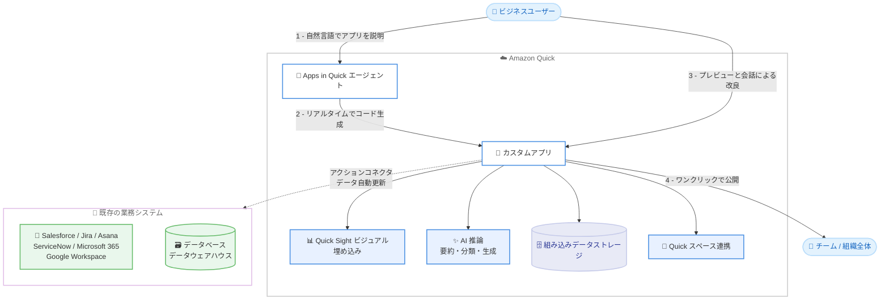

# Amazon Quick - 自然言語によるカスタムアプリケーション構築

**リリース日**: 2026 年 9 月 1 日
**サービス**: Amazon Quick
**機能**: Apps in Amazon Quick (自然言語によるカスタムアプリケーション構築)

📊 [このアップデートのインフォグラフィックを見る](https://takech9203.github.io/aws-news-summary/20260901-amazon-quick-custom-apps-natural-language.html)

## 概要

Amazon Quick のアプリケーション構築機能が一般提供 (GA) となりました。ユーザーは作りたいアプリケーションを自然言語で説明するだけで、コーディングなしにカスタムアプリケーションを構築できます。Quick のエージェントがリアルタイムでアプリを生成し、会話を続けながら改良し、完成したアプリはワンクリックで組織内に公開できます。

本機能は、プロダクトマネージャー、財務担当者、人事担当者、オペレーション分析者などのビジネスユーザーを主な対象としており、プロジェクトトラッカー、顧客ダッシュボード、トレーニングポータルといった業務ツールを「数か月ではなく数分で」作成できるとしています。Salesforce、Jira、Asana、ServiceNow、Microsoft 365、Google Workspace などの既存の業務システムや、データベース・データウェアハウスに接続でき、データの変更はアプリに自動的に反映されます。接続は組織の ID 管理、認可、アクセス制御ポリシーに準拠します。

プレビュー期間中の事例として、New York Life が Institutional Life チーム向けにオンボーディング・トレーニング・コンプライアンス講座を集約した e ラーニングポータルを構築したほか、Amazon Quick チーム自身が 4 つのシステムからの手動データ収集を置き換える週次リーダーシップレビューアプリを構築したことが紹介されています。

**アップデート前の課題**

このアップデート以前は、業務用のカスタムアプリケーションを用意するために以下のような課題がありました。

- 業務ツールの開発には開発チームへの依頼とコーディングが必要で、完成までに数か月かかることがあった
- ビジネスユーザーは複数のシステム (CRM、チケット管理、スプレッドシートなど) から手動でデータを収集・集計する必要があった
- データの可視化 (ダッシュボード) とカスタムアプリケーション開発の間にギャップがあり、データ入力や業務フローを含むツールを気軽に作る手段がなかった

**アップデート後の改善**

今回の一般提供により、以下が可能になりました。

- 自然言語で説明するだけで、コーディングなしに動作するアプリケーションを数分で構築できるようになった
- Salesforce、Jira、Asana、ServiceNow、Microsoft 365、Google Workspace、データベース、データウェアハウスと接続し、データ変更が自動的にアプリへ反映されるようになった
- AI 機能の追加、デザイン変更、新しい連携の追加といった修正も、変更内容を説明するだけで行えるようになった
- 完成したアプリを特定のユーザーまたは組織全体にワンクリックで公開できるようになった

## アーキテクチャ図



ビジネスユーザーが自然言語でアプリを説明すると、Apps in Quick エージェントがリアルタイムでアプリを生成し、既存の業務システムやデータソースと接続した上で、組織内にワンクリックで公開できる流れを示しています。

## サービスアップデートの詳細

### 主要機能

1. **会話によるアプリ作成 (Conversational Authoring)**
   - 作りたいアプリの目的、対象ユーザー、必要なデータを自然言語で伝えると、エージェントがリアルタイムでコードを生成する
   - 生成中の様子を確認しながら、ライブプレビューで即座に動作をテストできる
   - フォローアップのリクエストを重ねることで、会話形式でアプリを改良できる

2. **業務システムとの連携 (Action Connectors)**
   - Salesforce、Jira、Asana、ServiceNow、Microsoft 365、Google Workspace などの外部 API やサービスをアプリから呼び出せる
   - データベースやデータウェアハウスにも接続でき、データの変更はアプリに自動的に反映される
   - 接続は組織の ID 管理、認可、アクセス制御ポリシーに準拠する

3. **Quick Sight ビジュアルの埋め込み**
   - Amazon Quick Sight のインタラクティブなビジュアルをアプリに直接埋め込める
   - データ可視化とカスタムアプリケーションのギャップを埋め、ダッシュボードと業務機能を 1 つのアプリに統合できる

4. **組み込み AI 推論**
   - 基盤モデルを利用したテキスト要約、分類、コンテンツ生成などの AI 機能をアプリに追加できる
   - 「AI 機能を追加して」と説明するだけで組み込める

5. **スペース連携と永続データストレージ**
   - Amazon Quick のスペース内のドキュメントやリソースをアプリから読み取り・管理できる
   - 組み込みのキーバリューストレージにより、セッションをまたいでデータを保存・取得できる

6. **エンタープライズ認証とワンクリック公開**
   - Quick のセキュリティモデルを継承し、シングルサインオン (SSO) をサポートする
   - 完成したアプリは特定のユーザーまたは組織全体にワンクリックで公開できる

## 技術仕様

### アプリ構築ワークフロー

| ステップ | 内容 |
|------|------|
| 1. Describe | 作りたいアプリを自然言語で説明する |
| 2. Generate | AI がリアルタイムでコードを生成する |
| 3. Preview | ライブプレビューで即座に動作を確認・テストする |
| 4. Iterate | フォローアップのリクエストで改良する |
| 5. Publish | ワンクリックでチームに公開する |

### 主な連携先

| 分類 | 対象 |
|------|------|
| SaaS アプリケーション | Salesforce、Jira、Asana、ServiceNow、Microsoft 365、Google Workspace |
| データソース | データベース、データウェアハウス |
| Amazon Quick 内機能 | Quick Sight ビジュアル、スペース、組み込み AI 推論、キーバリューストレージ |
| セキュリティ | 組織の ID 管理・認可・アクセス制御ポリシーに準拠、SSO サポート |

## 設定方法

### 前提条件

1. Amazon Quick の Plus、Professional、または Enterprise プランのサブスクリプションがあること
2. アプリから業務システムに接続する場合、対象システムへのアクセス権限と連携 (インテグレーション) の設定があること
3. アプリを公開する対象ユーザーが Amazon Quick にアクセスできること

### 手順

#### ステップ 1: アプリの内容を自然言語で説明する

Amazon Quick でアプリ作成を開始し、アプリの目的、対象ユーザー、必要なデータをエージェントに伝えます。例:「営業パイプラインと採用状況を週次でレビューするアプリを作成して。データは Salesforce と Jira から取得して」のように説明します。

#### ステップ 2: プレビューを確認しながら会話で改良する

エージェントがリアルタイムでアプリを生成するので、ライブプレビューで動作を確認します。「グラフを追加して」「入力フォームを付けて」「文章の要約機能を追加して」のようにフォローアップのリクエストを重ねて改良します。

#### ステップ 3: 業務システムとの接続を設定する

必要に応じて Salesforce、Jira、Microsoft 365 などとの連携を設定します。接続は組織の ID 管理、認可、アクセス制御ポリシーに準拠し、データの変更はアプリへ自動的に反映されます。

#### ステップ 4: アプリを公開する

完成したアプリを特定のユーザーまたは組織全体にワンクリックで公開します。公開後も、変更内容を説明するだけでアプリを更新できます。

## メリット

### ビジネス面

- **開発リードタイムの大幅短縮**: 従来は数か月かかっていた業務ツールの開発を数分で完了でき、ビジネスのスピードに合わせてツールを整備できる
- **開発チームへの依存の軽減**: プロダクトマネージャー、財務、人事、オペレーションなどのビジネスユーザー自身がツールを作成でき、開発リソースをコア業務に集中させられる
- **手作業の削減**: 複数システムからの手動データ収集を自動化でき、Amazon Quick チームの事例では 4 つのシステムからの手動データ収集を 1 つのアプリで置き換えた

### 技術面

- **ガバナンスの維持**: 業務システムへの接続が組織の ID 管理、認可、アクセス制御ポリシーに準拠するため、シャドー IT 化を防ぎながらユーザー主導の開発を実現できる
- **データの鮮度**: データソースの変更がアプリへ自動的に反映されるため、更新処理の実装や運用が不要
- **拡張性のある構成要素**: Quick Sight ビジュアル埋め込み、AI 推論、キーバリューストレージ、スペース連携など、業務アプリに必要な部品が組み込みで提供される

## デメリット・制約事項

### 制限事項

- Amazon Quick の Plus、Professional、Enterprise プランの顧客のみ利用可能 (Free プランでは利用不可)
- 公式発表にはリージョンごとの提供状況の記載がないため、利用可能リージョンはドキュメントでの確認が必要
- 連携先は Quick がサポートするインテグレーションに依存するため、対象外の社内システムとの接続には別途検討が必要

### 考慮すべき点

- 自然言語による生成のため、要件が複雑な場合は意図した動作になるまで反復的な指示が必要になる可能性がある
- ビジネスユーザーが自由にアプリを作成・公開できるため、組織としてアクセス制御ポリシーや公開範囲の運用ルールを整備しておくことが望ましい
- ミッションクリティカルな業務プロセスに組み込む場合は、生成されたアプリの動作検証やデータ権限の確認を行うべきである

## ユースケース

### ユースケース 1: 社内トレーニング・オンボーディングポータル

**シナリオ**: 部門ごとにオンボーディング資料、トレーニング教材、コンプライアンス講座が複数の場所に分散しており、新メンバーの立ち上がりに時間がかかっている。

**実装例**:
```text
プロンプト例:
「Institutional Life チーム向けの e ラーニングポータルを作成して。
オンボーディング、トレーニング、コンプライアンス講座を 1 か所に
集約し、受講状況を記録できるようにして」
```

**効果**: New York Life のプレビュー事例のように、分散していた教材を 1 つのポータルに集約し、開発チームに依頼することなく短期間で立ち上げられる。

### ユースケース 2: 週次リーダーシップレビューアプリ

**シナリオ**: 経営レビューのために、営業パイプラインや利用状況のメトリクスを毎週 4 つの異なるシステムから手動で収集・集計しており、担当者の負荷が高い。

**実装例**:
```text
プロンプト例:
「週次のリーダーシップレビュー用アプリを作成して。
パイプラインと adoption メトリクスを各システムから自動取得し、
週ごとの推移をダッシュボードで表示して」
```

**効果**: Amazon Quick チームの事例のように、複数システムからの手動データ収集をアプリで置き換え、データは自動更新されるため、レビュー準備の工数を大幅に削減できる。

### ユースケース 3: プロジェクトトラッカー・顧客ダッシュボード

**シナリオ**: プロダクトマネージャーが Jira のチケット状況と Salesforce の顧客情報を横断して確認したいが、既製ツールでは要件に合わず、開発を依頼するほどの規模でもない。

**実装例**:
```text
プロンプト例:
「Jira の進行中チケットと Salesforce の対応顧客を突き合わせた
プロジェクトトラッカーを作成して。ステータス更新のメモを
入力できるフォームも付けて」
```

**効果**: コーディングなしで自部門専用のトラッカーを構築でき、組み込みストレージによりメモなどの入力データもセッションをまたいで保持できる。

## 料金

アプリ構築機能は、Amazon Quick の Plus、Professional、Enterprise の各プランの顧客が利用できます。公式発表には追加料金に関する記載はありません。プランごとの料金の詳細は [Amazon Quick 料金ページ](https://aws.amazon.com/quick/pricing/) を参照してください。

## 利用可能リージョン

2026 年 9 月 1 日より、Amazon Quick の Plus、Professional、Enterprise プランの顧客が利用できます。公式発表にはリージョンごとの提供状況の記載がないため、最新の提供状況は公式ドキュメントを参照してください。

## 関連サービス・機能

- **Amazon Quick Sight**: インタラクティブなビジュアルをアプリに直接埋め込み、ダッシュボードとカスタムアプリを統合できる
- **Amazon Quick スペース**: スペース内のドキュメントやリソースをアプリから読み取り・管理できる
- **Amazon Quick インテグレーション**: Salesforce、Jira、ServiceNow などの外部サービスとの接続を提供し、アプリのアクションコネクタとして利用できる

## 参考リンク

- 📊 [インフォグラフィック](https://takech9203.github.io/aws-news-summary/20260901-amazon-quick-custom-apps-natural-language.html)
- [公式発表 (What's New)](https://aws.amazon.com/about-aws/whats-new/2026/09/amazon-quick-custom-apps-natural-language/)
- [ドキュメント: Build web applications with apps in Amazon Quick](https://docs.aws.amazon.com/quick/latest/userguide/using-amazon-quick-apps.html)
- [Amazon Quick 製品ページ](https://aws.amazon.com/quick/)
- [料金ページ](https://aws.amazon.com/quick/pricing/)

## まとめ

Amazon Quick のアプリ構築機能の一般提供により、ビジネスユーザーが自然言語だけで業務アプリケーションを数分で構築・公開できるようになりました。既存の業務システムとの接続が組織のアクセス制御ポリシーに準拠する点も、エンタープライズでの採用を後押しします。Plus、Professional、Enterprise プランを利用中の組織は、手作業のデータ収集や小規模な社内ツールの開発依頼をこの機能で置き換えられないか、まず身近な業務から試してみることを推奨します。
