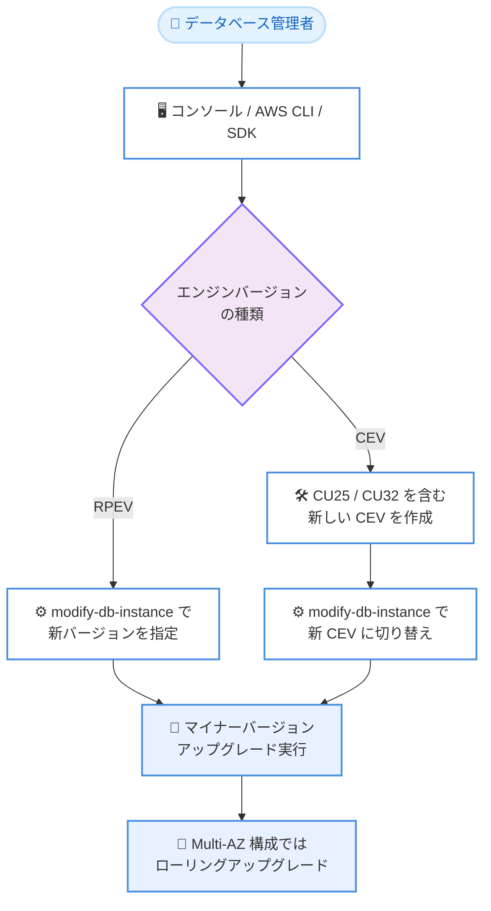

# Amazon RDS Custom - Microsoft SQL Server の最新 CU および GDR 更新プログラムのサポート

**リリース日**: 2026 年 9 月 1 日
**サービス**: Amazon RDS Custom for SQL Server
**機能**: Microsoft SQL Server 向け最新 Cumulative Update (CU) および General Distribution Release (GDR) のサポート

📊 [このアップデートのインフォグラフィックを見る](https://takech9203.github.io/aws-news-summary/20260901-amazon-rds-custom-supports-latest-cu-gdr-microsoft-sql-server.html)

## 概要

Amazon RDS Custom for SQL Server が、Microsoft SQL Server の最新の Cumulative Update (CU) および General Distribution Release (GDR) 更新プログラムをサポートしました。今回のアップデートにより、SQL Server 2019 向けの CU32 + GDR (KB5102335、RDS バージョン 15.00.4480.2.v1) と、SQL Server 2022 向けの CU25 + GDR (KB5101347、RDS バージョン 16.00.4262.2.v1) が利用可能になります。

GDR 更新プログラムには、CVE-2026-47295、CVE-2026-47296、CVE-2026-54118、CVE-2026-55002 の 4 件の脆弱性に対する修正が含まれており、セキュリティ面で重要な意味を持つアップデートです。RDS Custom は OS やデータベース環境へのアクセスを必要とするレガシーアプリケーションやサードパーティ製アプリケーション、カスタマイズが必要なワークロード向けのマネージドサービスであり、こうした環境でも AWS が検証済みの最新パッチを適用できます。

アップデートの適用は、Amazon RDS マネジメントコンソール、AWS SDK、AWS CLI のいずれからでも実行できます。

**アップデート前の課題**

このアップデート以前に存在していた課題や制限は以下のとおりです。

- SQL Server 2019 CU32 および SQL Server 2022 CU25 に含まれる不具合修正や改善を RDS Custom for SQL Server で利用できなかった
- 上記 4 件の CVE に対応する GDR セキュリティ修正を、AWS が提供するエンジンバージョンとして適用できなかった
- 最新パッチを適用するには、Microsoft のリリースを AWS がサポートするまで待つか、独自の運用でリスクを管理する必要があった

**アップデート後の改善**

今回のアップデートにより可能になったことは以下のとおりです。

- SQL Server 2019 CU32 + GDR および SQL Server 2022 CU25 + GDR を含む新しいエンジンバージョンへアップグレードできるようになった
- 4 件の CVE に対応するセキュリティ修正を、コンソール、AWS SDK、AWS CLI から適用できるようになった
- Microsoft の最新の不具合修正、パフォーマンス改善をマネージドな手順で取り込めるようになった

## アーキテクチャ図



RDS Custom for SQL Server のアップグレードフローを示しています。RDS 提供エンジンバージョン (RPEV) の場合は直接バージョンを変更し、カスタムエンジンバージョン (CEV) の場合は新しい CEV を作成してから切り替える 2 段階の手順になります。

## サービスアップデートの詳細

### 主要機能

1. **SQL Server 2019 CU32 + GDR のサポート**
   - Microsoft KB5102335 に対応
   - RDS エンジンバージョン: 15.00.4480.2.v1
   - CU32 までの累積的な不具合修正と GDR のセキュリティ修正を含む

2. **SQL Server 2022 CU25 + GDR のサポート**
   - Microsoft KB5101347 に対応
   - RDS エンジンバージョン: 16.00.4262.2.v1
   - CU25 までの累積的な不具合修正と GDR のセキュリティ修正を含む

3. **セキュリティ脆弱性への対応**
   - CVE-2026-47295、CVE-2026-47296、CVE-2026-54118、CVE-2026-55002 に対する修正を含む
   - 修正内容の詳細は Microsoft の KB5102335 および KB5101347 のドキュメントを参照

## 技術仕様

### 対応バージョン

| SQL Server バージョン | 更新プログラム | Microsoft KB | RDS エンジンバージョン |
|------|------|------|------|
| SQL Server 2019 | CU32 + GDR | KB5102335 | 15.00.4480.2.v1 |
| SQL Server 2022 | CU25 + GDR | KB5101347 | 16.00.4262.2.v1 |

### アップグレード方式

| 項目 | 詳細 |
|------|------|
| RPEV | AWS が提供するエンジンバージョン。最新の OS パッチと SQL Server CU を含み、直接アップグレード可能 |
| CEV | カスタムエンジンバージョン。対象バージョンの CEV を新規作成し、インスタンスを新 CEV に変更する 2 段階の手順が必要 |
| Multi-AZ | ローリングアップグレードを実行。スタンバイを先にアップグレードし、フェイルオーバー後に旧プライマリをアップグレード |
| 適用タイミング | 即時適用、またはメンテナンスウィンドウでの適用を選択可能 |

## 設定方法

### 前提条件

1. Amazon RDS Custom for SQL Server の DB インスタンスが稼働していること
2. アップグレード先のエンジンバージョンが現在のバージョン以降であること (アップグレードは不可逆)
3. CEV を使用している場合は、対象の CU を含む新しい CEV を事前に作成すること

### 手順

#### ステップ 1: アップグレード可能なターゲットバージョンの確認

```bash
aws rds describe-db-engine-versions \
    --engine custom-sqlserver-se \
    --engine-version 15.00.4430.1.v1 \
    --query "DBEngineVersions[*].ValidUpgradeTarget[*].{EngineVersion:EngineVersion}" \
    --output table
```

現在のエンジンバージョンからアップグレード可能なターゲットバージョンの一覧を表形式で表示します。`--engine` にはエディションに応じて `custom-sqlserver-se`、`custom-sqlserver-ee`、`custom-sqlserver-web` などを指定します。

#### ステップ 2: DB インスタンスのエンジンバージョン変更

```bash
aws rds modify-db-instance \
    --db-instance-identifier my-custom-sqlserver-instance \
    --engine-version 16.00.4262.2.v1 \
    --no-apply-immediately
```

DB インスタンスのエンジンバージョンを新しいバージョンに変更します。`--no-apply-immediately` を指定すると次回のメンテナンスウィンドウで適用され、`--apply-immediately` を指定すると即時に適用されます。

#### ステップ 3: アップグレード状況の確認

```bash
aws rds describe-db-instances \
    --db-instance-identifier my-custom-sqlserver-instance \
    --query "DBInstances[*].{Status:DBInstanceStatus,EngineVersion:EngineVersion}"
```

DB インスタンスのステータスとエンジンバージョンを確認し、アップグレードの完了を検証します。

## メリット

### ビジネス面

- **セキュリティコンプライアンスの維持**: 4 件の CVE に対応する修正を迅速に適用でき、組織のセキュリティ要件や監査要件を満たしやすくなる
- **運用リスクの低減**: AWS が検証したエンジンバージョンとして提供されるため、独自パッチ適用に伴う障害リスクを抑えられる
- **サポート継続性の確保**: Microsoft の最新更新プログラムに追随することで、既知の不具合による業務影響を回避できる

### 技術面

- **マネージドなアップグレード手順**: コンソール、AWS CLI、AWS SDK から一貫した手順でアップグレードを実行できる
- **Multi-AZ でのダウンタイム最小化**: ローリングアップグレードにより、ダウンタイムはフェイルオーバーに要する時間のみに抑えられる
- **累積修正の一括適用**: CU は累積的な更新であるため、過去の修正を含めて一度に適用できる

## デメリット・制約事項

### 制限事項

- アップグレードは不可逆であり、以前のバージョンへのダウングレードはできない
- CEV を使用している場合、稼働中のインスタンスへ CU をインプレース適用することはサポートされない。適用するとサポート境界の外となりエラー SP-S3006 が報告される
- カスタム DB オプショングループおよびパラメータグループはアップグレードでサポートされない
- インスタンスに追加でアタッチしたストレージボリュームは、アップグレード後に再アタッチされない

### 考慮すべき点

- 後方互換性の問題を避けるため、本番環境への適用前に非本番環境でアプリケーションのテストを実施することが推奨される
- アップグレード後も既存データベースの互換性レベルは元のまま維持される。必要に応じて `ALTER DATABASE ... SET COMPATIBILITY_LEVEL` で変更する
- Single-AZ 構成ではアップグレード中にダウンタイムが発生するため、メンテナンスウィンドウでの適用を検討する

## ユースケース

### ユースケース 1: セキュリティ脆弱性への迅速な対応

**シナリオ**: 社内のセキュリティポリシーで、公表された CVE に対して一定期間内のパッチ適用が義務付けられている企業が、RDS Custom for SQL Server 2022 を運用している。

**実装例**:
```bash
aws rds modify-db-instance \
    --db-instance-identifier prod-sqlserver-2022 \
    --engine-version 16.00.4262.2.v1 \
    --apply-immediately
```

**効果**: GDR に含まれる 4 件の CVE 修正を即時適用し、セキュリティコンプライアンス要件を期限内に満たせる。

### ユースケース 2: Multi-AZ 構成でのダウンタイム最小化アップグレード

**シナリオ**: 24 時間稼働の基幹システムで RDS Custom for SQL Server 2019 を Multi-AZ 構成で運用しており、停止時間を最小限に抑えてパッチを適用したい。

**実装例**:
```bash
aws rds modify-db-instance \
    --db-instance-identifier prod-sqlserver-2019-maz \
    --engine-version 15.00.4480.2.v1 \
    --no-apply-immediately
```

**効果**: ローリングアップグレードにより、ダウンタイムをフェイルオーバー時間のみに抑えながら CU32 + GDR を適用できる。

### ユースケース 3: CEV 利用環境での計画的なパッチ運用

**シナリオ**: サードパーティ製エージェントを組み込んだカスタムエンジンバージョン (CEV) で SQL Server 2022 を運用しており、最新 CU を安全に取り込みたい。

**実装例**:
```
1. SQL Server 2022 CU25 のインストールメディアを準備し、新しい CEV を作成
2. 検証環境で新 CEV へのアップグレードをテスト
3. modify-db-instance で本番インスタンスを新 CEV に切り替え
```

**効果**: インプレース適用によるサポート境界外エラー SP-S3006 を回避しつつ、カスタマイズ内容を維持したまま最新 CU を適用できる。

## 料金

今回のアップデートによる追加料金はありません。Amazon RDS Custom for SQL Server の通常料金 (インスタンス、ストレージ、ライセンスなど) が適用されます。詳細は [Amazon RDS Custom の料金ページ](https://aws.amazon.com/rds/custom/pricing/) を参照してください。

## 利用可能リージョン

公式発表ではリージョンに関する記載はありません。Amazon RDS Custom for SQL Server が利用可能なリージョンについては、[AWS リージョン別サービス一覧](https://aws.amazon.com/about-aws/global-infrastructure/regional-product-services/) を参照してください。

## 関連サービス・機能

- **Amazon RDS for SQL Server**: OS アクセスが不要な標準的なワークロード向けのフルマネージド SQL Server。同様に CU / GDR 更新が順次提供される
- **AWS Systems Manager**: RDS Custom の基盤となる EC2 インスタンスへのアクセスや自動化に使用される
- **Amazon RDS Custom for Oracle**: OS / データベースレベルのカスタマイズが必要な Oracle ワークロード向けの同種のサービス

## 参考リンク

- 📊 [インフォグラフィック](https://takech9203.github.io/aws-news-summary/20260901-amazon-rds-custom-supports-latest-cu-gdr-microsoft-sql-server.html)
- [公式発表 (What's New)](https://aws.amazon.com/about-aws/whats-new/2026/08/amazon-rds-custom-supports-latest-cu-gdr-microsoft-sql-server/)
- [AWS Blog: Performing a minor version upgrade for Amazon RDS Custom for SQL Server CEV with Multi-AZ](https://aws.amazon.com/blogs/database/performing-a-minor-version-upgrade-for-amazon-rds-custom-for-sql-server-cev-with-multi-az/)
- [ドキュメント: Upgrading an Amazon RDS Custom for SQL Server DB instance](https://docs.aws.amazon.com/AmazonRDS/latest/UserGuide/custom-upgrading-sqlserver.html)
- [Amazon RDS Custom 製品ページ](https://aws.amazon.com/rds/custom/)
- [Microsoft KB5102335 (SQL Server 2019 CU32 + GDR)](https://support.microsoft.com/help/5102335)
- [Microsoft KB5101347 (SQL Server 2022 CU25 + GDR)](https://support.microsoft.com/help/5101347)

## まとめ

Amazon RDS Custom for SQL Server で SQL Server 2019 CU32 + GDR および SQL Server 2022 CU25 + GDR が利用可能になり、4 件の CVE に対応するセキュリティ修正を含む最新パッチをマネージドな手順で適用できるようになりました。セキュリティ修正が含まれるため、非本番環境での検証を経て早期にアップグレードすることを推奨します。CEV を利用している場合は、インプレース適用を避け、新しい CEV を作成して切り替える手順に従ってください。
