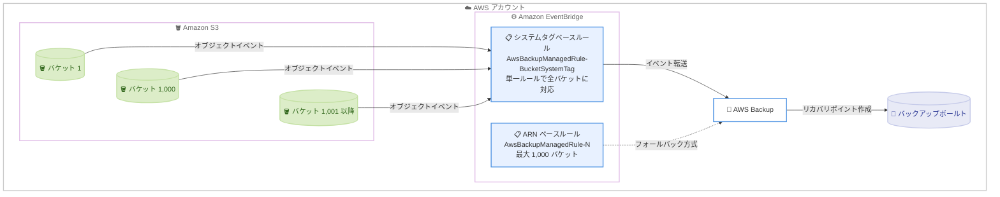

# AWS Backup - Amazon S3 バケットのアカウントあたり 1,000 個超の保護をサポート

**リリース日**: 2026 年 9 月 1 日
**サービス**: AWS Backup
**機能**: アカウントあたり 1,000 個を超える Amazon S3 バケットのバックアップ・リストア対応

📊 [このアップデートのインフォグラフィックを見る](https://takech9203.github.io/aws-news-summary/20260901-aws-backup-more-than-1000-s3-buckets.html)

## 概要

AWS Backup が、アカウントあたり 1,000 個を超える Amazon S3 バケットのバックアップおよびリストアをサポートするようになりました。これまで AWS Backup for Amazon S3 はアカウントあたり最大 1,000 バケットまでの保護に制限されていましたが、今回のアップデートにより、アカウントに設定された Amazon S3 バケットクォータと同じ数まで、すべての汎用バケット (general purpose buckets) を保護できるようになりました。

この機能拡張は、多数の S3 バケットを運用する大規模環境のお客様、特にデータレイク、マルチテナント SaaS、部門ごとにバケットを分割している大企業などで、AWS Backup による一元的なデータ保護を実現するうえで重要な改善です。AWS Backup のデフォルトのマネージドポリシーを使用している場合、既存のバックアップは変更なしで継続して動作します。カスタム IAM ポリシーを使用している場合のみ、追加の権限設定の確認が必要です。

技術的には、AWS Backup の S3 継続バックアップが依存する Amazon EventBridge のイベント設定方式が拡張されています。従来のバケット ARN ベースのイベントルール (最大 1,000 バケット) に加えて、`aws:backup:enabled` システムタグに基づくイベント設定方式 (推奨) が導入され、単一のマネージドルールでアカウント内のすべての汎用バケットをカバーできるようになりました。

**アップデート前の課題**

- AWS Backup for Amazon S3 はアカウントあたり最大 1,000 バケットまでしか保護できなかった
- 1,000 バケットを超える環境では、複数アカウントへの分割や AWS Backup 以外の保護手段の併用など、回避策の検討が必要だった
- バケット ARN を列挙する EventBridge マネージドルールの方式では、保護対象バケット数に構造的な上限があった

**アップデート後の改善**

- アカウントに設定された S3 バケットクォータと同数まで、すべての汎用バケットをバックアップ・リストアできるようになった
- `aws:backup:enabled` システムタグと単一のマネージド EventBridge ルールによるスケーラブルなイベント設定方式が導入された
- デフォルトの AWS Backup マネージドポリシーを使用している場合は、既存のバックアッププランが変更なしでそのまま動作する

## アーキテクチャ図



AWS Backup は `aws:backup:enabled` システムタグをバケットに付与し、このタグでフィルタリングする単一のマネージド EventBridge ルールを通じてオブジェクトイベントを受信します。この方式により、バケット ARN を列挙する従来方式の 1,000 バケット上限を超えて、アカウント内のすべての汎用バケットを保護できます。

## サービスアップデートの詳細

### 主要機能

1. **1,000 バケット超の保護サポート**
   - アカウントに設定された Amazon S3 バケットクォータと同数まで、バックアップ・リストアが可能
   - 対象はすべての汎用バケット (general purpose buckets)
   - ディレクトリバケットは引き続き非対応

2. **システムタグベースのイベント設定方式 (推奨)**
   - AWS Backup がバケットに `aws:backup:enabled` システムタグを自動的に付与・削除する
   - `AwsBackupManagedRule-BucketSystemTag` という名前の単一のマネージド EventBridge ルールがこのタグでイベントをフィルタリングする
   - S3 は EventBridge に送信するすべてのイベント通知にこのタグを含める
   - システムタグの付与・削除に追加の IAM 権限は不要で、バケットあたり 50 個のユーザータグ制限にもカウントされない

3. **バケット ARN ベース方式へのフォールバック**
   - バックアップロールに `s3:ListTagsForResource` 権限がない場合、AWS Backup は個々のバケット ARN を列挙するマネージドルール (`AwsBackupManagedRule-{N}`) を作成する従来方式にフォールバックする
   - この方式ではアカウントあたり最大 1,000 バケットまでの保護となる

4. **既存バックアッププランへの影響なし**
   - デフォルトの AWS Backup マネージドポリシー (`AWSBackupServiceRolePolicyForS3Backup`) を使用している場合、変更は不要
   - 既存のバックアッププランはそのまま動作を継続する

## 技術仕様

### イベント設定方式の比較

| 項目 | システムタグベース方式 (推奨) | バケット ARN ベース方式 |
|------|------------------------------|------------------------|
| 保護可能なバケット数 | S3 バケットクォータと同数 | 最大 1,000 バケット |
| EventBridge ルール | 単一ルール (AwsBackupManagedRule-BucketSystemTag) | 複数ルール (AwsBackupManagedRule-{N}) |
| フィルタリング方法 | `aws:backup:enabled` システムタグ | バケット ARN の列挙 |
| 必要な追加権限 | `s3:ListTagsForResource` | なし |
| 適用条件 | バックアップロールに上記権限がある場合 | 上記権限がない場合のフォールバック |

### 対象リソースと対応イベント

| 項目 | 詳細 |
|------|------|
| 対象バケットタイプ | 汎用バケット (ディレクトリバケットは非対応) |
| 対応オブジェクトサイズ | S3 がサポートする最大オブジェクトサイズまで |
| 購読イベント | Object Created、Object ACL Updated、Object Tags Added、Object Tags Deleted、Object Deleted |
| バックアップタイプ | 継続バックアップ (PITR、最大 35 日)、定期バックアップ (最大 99 年) |
| 前提条件 | S3 バージョニングの有効化、EventBridge 通知の有効化 (継続バックアップの場合) |

### カスタム IAM ロールに必要な権限

システムタグベースのイベント設定を使用して 1,000 個を超える S3 バケットを保護するには、S3 バックアップジョブに使用する IAM ロールに以下の権限が必要です。AWS マネージドポリシー `AWSBackupServiceRolePolicyForS3Backup` にはこの権限が既に含まれています。

```json
{
  "Sid": "S3BucketTagReadPermissions",
  "Effect": "Allow",
  "Action": [
    "s3:ListTagsForResource"
  ],
  "Resource": "arn:aws:s3:::*"
}
```

この権限がない場合、AWS Backup はバケット ARN ベースのイベント設定にフォールバックし、保護対象は最大 1,000 バケットに制限されます。

## 設定方法

### 前提条件

1. バックアップ対象の S3 バケットで S3 バージョニングが有効化されていること
2. 継続バックアップを使用する場合、バケットの Amazon EventBridge 通知設定が有効であること
3. バックアップロールに `AWSBackupServiceRolePolicyForS3Backup` および `AWSBackupServiceRolePolicyForS3Restore` (または同等のカスタムポリシー) がアタッチされていること

### 手順

#### ステップ 1: バックアップロールの権限を確認する

```bash
# バックアップロールにアタッチされたポリシーを確認
aws iam list-attached-role-policies \
    --role-name AWSBackupDefaultServiceRole
```

バックアップに使用する IAM ロールにアタッチされているマネージドポリシーの一覧を表示します。`AWSBackupServiceRolePolicyForS3Backup` が含まれていれば、1,000 バケット超の保護に必要な `s3:ListTagsForResource` 権限は既に付与されています。カスタムポリシーを使用している場合は、前述の権限を追加してください。

#### ステップ 2: S3 バケットの EventBridge 通知設定を確認する

```bash
# バケットの通知設定を確認
aws s3api get-bucket-notification-configuration \
    --bucket amzn-s3-demo-bucket
```

継続バックアップに必要な EventBridge 通知が有効かを確認します。レスポンスに `"EventBridgeConfiguration": {}` が含まれていれば有効です。含まれていない場合は `put-bucket-notification-configuration` で有効化します。なお、このコマンドは置換操作であるため、既存の SNS、SQS、Lambda などの通知ターゲットがある場合は同じ呼び出しに含める必要があります。

#### ステップ 3: バックアッププランにバケットを割り当てる

```bash
# タグベースの選択で S3 リソースをバックアッププランに割り当てる例
aws backup create-backup-selection \
    --backup-plan-id "your-backup-plan-id" \
    --backup-selection '{
        "SelectionName": "S3AllBuckets",
        "IamRoleArn": "arn:aws:iam::123456789012:role/AWSBackupDefaultServiceRole",
        "Resources": ["arn:aws:s3:::*"]
    }'
```

バックアッププランに S3 リソースの選択を作成します。ワイルドカードを使用してアカウント内の S3 バケットを一括で保護対象に含めることができ、今回のアップデートにより 1,000 個を超えるバケットもそのまま保護対象になります。

## メリット

### ビジネス面

- **大規模環境での一元的なデータ保護**: 1,000 バケット超を運用する組織でも、AWS Backup による集中管理型のバックアップガバナンスを単一アカウントで実現できる
- **アカウント分割の回避**: バックアップ上限を理由としたアカウント分割やワークロード再配置が不要になり、運用コストと複雑性を削減できる
- **コンプライアンス対応の強化**: Backup Audit Manager などと組み合わせ、全バケットに対する保護状況の監査・証明が容易になる

### 技術面

- **移行作業が不要**: デフォルトのマネージドポリシー使用時は既存のバックアッププランが変更なしで動作する
- **スケーラブルなイベントアーキテクチャ**: 単一のシステムタグベース EventBridge ルールで全バケットをカバーするため、ルール数の管理が不要
- **システムタグによる透過的な管理**: `aws:backup:enabled` タグは AWS Backup が自動管理し、ユーザータグの 50 個制限にもカウントされない

## デメリット・制約事項

### 制限事項

- ディレクトリバケットは引き続きバックアップ非対応 (汎用バケットのみ対応)
- カスタム IAM ポリシー使用時は `s3:ListTagsForResource` 権限がないとバケット ARN ベース方式にフォールバックし、最大 1,000 バケットに制限される
- S3 on Outposts のバックアップ、SSE-C 暗号化オブジェクト、バケット設定 (バケットポリシー、設定、名前、アクセスポイント) のバックアップは非対応

### 考慮すべき点

- バケットレベルの EventBridge 通知設定が無効化されると、継続バックアップは通知なしに停止する (サイレント障害)。CloudTrail + EventBridge や AWS Config ルール `s3-event-notifications-enabled` による監視を推奨
- 保護対象バケット数の増加に伴い、バックアップストレージコストも増加するため、ACL・オブジェクトタグの除外設定やライフサイクル設定によるコスト最適化を検討する
- 大量のバケットを一括で保護対象に追加した場合、初回フルバックアップの完了までに相応の時間がかかる (例: 800 TB・6.7 億オブジェクトのバケットで約 38 時間)

## ユースケース

### ユースケース 1: 大規模データレイクの一括保護

**シナリオ**: 単一アカウントで部門・プロジェクトごとに 3,000 個以上の S3 バケットを運用しており、これまで AWS Backup の 1,000 バケット制限により一部のバケットしか保護できなかった。

**実装例**:
```json
{
  "SelectionName": "AllS3Buckets",
  "IamRoleArn": "arn:aws:iam::123456789012:role/AWSBackupDefaultServiceRole",
  "Resources": ["arn:aws:s3:::*"]
}
```

**効果**: ワイルドカード指定のバックアップ選択だけで全バケットが保護対象となり、保護漏れのリスクを排除できる。

### ユースケース 2: マルチテナント SaaS のテナント別バケット保護

**シナリオ**: テナントごとに専用の S3 バケットを作成する SaaS アーキテクチャで、テナント数の増加に伴いバケット数が 1,000 個を超過。バックアップ制限がテナント数拡大のボトルネックになっていた。

**実装例**:
```json
{
  "SelectionName": "TenantBuckets",
  "IamRoleArn": "arn:aws:iam::123456789012:role/BackupRole",
  "Conditions": {
    "StringEquals": [
      { "ConditionKey": "aws:ResourceTag/backup", "ConditionValue": "enabled" }
    ]
  }
}
```

**効果**: タグベースのリソース選択により、新規テナントのバケットも自動的に保護対象に追加され、バケット数の上限を意識せずにテナントを拡大できる。

### ユースケース 3: カスタム IAM ポリシー環境の権限アップデート

**シナリオ**: セキュリティ要件により最小権限のカスタム IAM ポリシーでバックアップロールを構成しており、1,000 バケット超の保護に対応するため権限の見直しが必要。

**実装例**:
```json
{
  "Sid": "S3BucketTagReadPermissions",
  "Effect": "Allow",
  "Action": ["s3:ListTagsForResource"],
  "Resource": "arn:aws:s3:::*"
}
```

**効果**: カスタムポリシーに 1 つのアクションを追加するだけでシステムタグベース方式が有効になり、最小権限の原則を維持しながら 1,000 バケット超の保護を実現できる。

## 料金

今回のアップデートによる追加料金はありません。AWS Backup for Amazon S3 の既存の料金体系 (バックアップストレージ容量とリストアに基づく従量課金) が適用されます。保護対象バケット数の増加に伴いバックアップストレージ使用量が増加する点には注意が必要です。詳細は [AWS Backup 料金ページ](https://aws.amazon.com/backup/pricing/) を参照してください。

## 利用可能リージョン

すべての AWS 商用リージョンおよび AWS GovCloud (US) リージョンで利用可能です。

## 関連サービス・機能

- **Amazon S3**: バックアップ対象のオブジェクトストレージ。バージョニングの有効化が前提条件となり、バケットクォータが保護可能バケット数の上限を決定する
- **Amazon EventBridge**: S3 継続バックアップのオブジェクトイベント配信基盤。今回のアップデートで導入されたシステムタグベースのマネージドルールが 1,000 バケット超の保護を実現する
- **AWS IAM**: バックアップロールの権限管理。マネージドポリシー `AWSBackupServiceRolePolicyForS3Backup` に必要な権限が含まれる
- **AWS Backup Audit Manager**: バックアップポリシーへの準拠状況の監査。全バケット保護と組み合わせてコンプライアンス証明を強化できる

## 参考リンク

- 📊 [インフォグラフィック](https://takech9203.github.io/aws-news-summary/20260901-aws-backup-more-than-1000-s3-buckets.html)
- [公式発表 (What's New)](https://aws.amazon.com/about-aws/whats-new/2026/09/aws-backup-more-than-1000-s3-buckets/)
- [ドキュメント: Amazon S3 backups (AWS Backup Developer Guide)](https://docs.aws.amazon.com/aws-backup/latest/devguide/s3-backups.html)
- [ドキュメント: AWSBackupServiceRolePolicyForS3Backup](https://docs.aws.amazon.com/aws-managed-policy/latest/reference/AWSBackupServiceRolePolicyForS3Backup.html)
- [料金ページ](https://aws.amazon.com/backup/pricing/)

## まとめ

AWS Backup for Amazon S3 の 1,000 バケット制限が撤廃され、アカウントの S3 バケットクォータと同数まで汎用バケットを保護できるようになりました。デフォルトのマネージドポリシーを使用している場合は追加作業なしで恩恵を受けられますが、カスタム IAM ポリシーを使用している環境では `s3:ListTagsForResource` 権限の有無を確認することを推奨します。多数のバケットを運用する組織は、これを機に AWS Backup による S3 データ保護の一元化を検討する価値があります。
