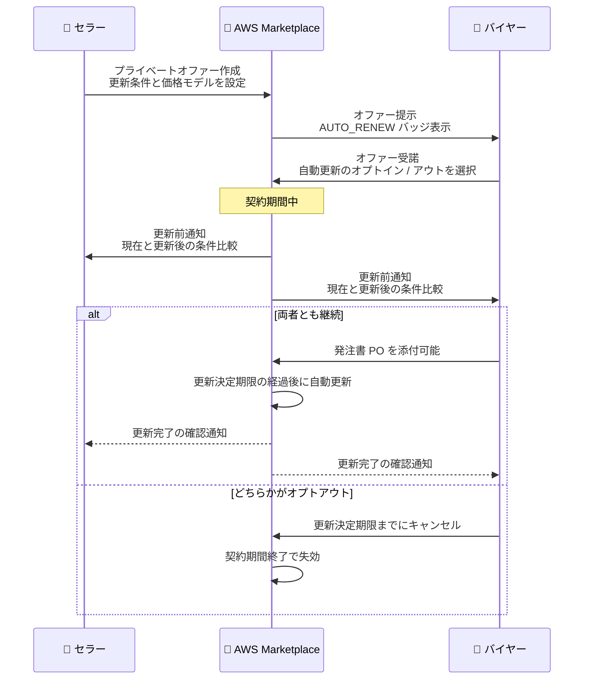

# AWS Marketplace - プライベートオファーの自動更新サポート

**リリース日**: 2026 年 9 月 1 日
**サービス**: AWS Marketplace
**機能**: プライベートオファーの自動更新 (Auto-Renewals for Private Offers)

📊 [このアップデートのインフォグラフィックを見る](https://takech9203.github.io/aws-news-summary/20260901-aws-marketplace-auto-renewals-for-private-offers.html)

## 概要

AWS Marketplace がプライベートオファーの自動更新 (Auto-Renewal) をサポートしました。これにより、販売者 (セラー) と購入者 (バイヤー) は、契約期間終了時の再交渉や再購入なしに、ソフトウェアやサービスのサブスクリプションを継続できるようになります。

セラーはプライベートオファーの作成時に更新条件を設定でき、価格モデルとして「価格変更なし」「固定率の価格変更」「定義された範囲内での価格変更」の 3 つから選択できます。バイヤーはオファーの受諾時に自動更新へのオプトイン / オプトアウトを選択でき、後から設定を変更することも可能です。更新前には AWS Marketplace が両者に通知を送り、現在の条件と更新後の条件の比較 (価格変更を含む) を提示します。

本機能は、コントラクト価格の直接プライベートオファー (Direct Private Offer) を作成するセラー向けに、すべての商用 AWS リージョンで一般提供が開始されています。追加のセットアップやオンボーディングは不要です。

**アップデート前の課題**

- プライベートオファーの契約期間が終了すると、サブスクリプションを継続するために毎回再交渉と再購入の手続きが必要だった
- 更新手続きの遅延により、サブスクリプションの失効やサービス利用の中断が発生するリスクがあった
- バイヤーの調達部門は、更新のたびに新規購入と同様のプロセスを繰り返す必要があり、調達オーバーヘッドが大きかった
- セラーにとって、既存顧客の契約維持 (リテンション) に営業工数がかかっていた

**アップデート後の改善**

- 契約期間終了時に、事前に合意した条件でサブスクリプションが自動的に更新されるようになった
- 更新前に両者へ通知が送られ、現在の条件と更新後の条件 (価格変更を含む) を比較できるようになった
- セラー / バイヤーのどちらも、更新決定期限 (Renewal Decision Deadline) までに次回の更新をキャンセルできるようになった
- バイヤーは更新時に発注書 (Purchase Order) を添付でき、調達統制を維持したまま更新プロセスを自動化できるようになった

## アーキテクチャ図



プライベートオファーの自動更新フローを示したシーケンス図です。セラーが更新条件を設定したオファーをバイヤーが受諾すると、契約期間終了前に両者へ通知が送られ、更新決定期限までにオプトアウトされなければ自動的に契約が更新されます。

## サービスアップデートの詳細

### 主要機能

1. **セラーによる更新条件の設定**
   - プライベートオファーの作成時に、AWS Marketplace Management Portal で更新条件を定義可能
   - 価格モデルは 3 種類から選択: 価格変更なし、固定率の価格変更、定義された範囲内での価格変更
   - 最大更新回数 (maxRenewals)、ロックアウト期間 (lockoutPeriod)、価格調整期限 (adjustmentDeadline)、支払いスケジュールテンプレート (termTemplates) を設定可能

2. **バイヤーによる更新設定の管理**
   - オファーの初回受諾時に自動更新へのオプトイン / オプトアウトを選択可能
   - AWS Marketplace コンソールから、受諾後も更新設定を変更可能
   - 更新時に発注書 (Purchase Order) を添付でき、社内の調達プロセスと整合させることが可能

3. **更新前の通知と条件比較**
   - 更新の実行前に、AWS Marketplace がセラーとバイヤーの両者に通知
   - 現在の条件と更新後の条件の比較 (価格変更を含む) を提示
   - セラー / バイヤーのどちらも、更新決定期限までに次回の更新をキャンセル可能
   - 更新が完了すると両者に確認通知が送信される

4. **API での更新状態の可視化**
   - AWS Marketplace Discovery API の `GetOffer` / `GetOfferSet` に `AUTO_RENEW` バッジが追加され、自動更新付きオファーを識別可能
   - `GetOfferTerms` が `renewalTerm` (更新条件の詳細) を返却
   - AWS Marketplace Agreement Service API の `DescribeAgreement` / `SearchAgreements` が、契約終了時の動作 (`RENEW` / `REPLACE` / `EXPIRE`) と、更新されない場合の理由コードを返却

## 技術仕様

### 更新条件 (renewalTerm) の主な要素

| 項目 | 詳細 |
|------|------|
| `enableAutoRenew` | 自動更新の有効 / 無効 (バイヤーが設定可能) |
| `maxRenewals` | 最大更新回数 |
| `lockoutPeriod` | ロックアウト期間 (更新確定前の猶予期間の制御) |
| `adjustmentDeadline` | 更新決定期限 (価格調整やオプトアウトの期限) |
| `priceIncrease.fixedPercentage` | 固定率の価格変更 (例: 更新ごとに 5% 増額) |
| `priceIncrease.percentageRange` | 範囲指定の価格変更 (最小値 / 最大値 / デフォルト値) |
| `termTemplates` | 更新後の支払いスケジュールテンプレート |

### 契約終了時の動作 (endTimeBehavior)

| 項目 | 値 | 説明 |
|------|-----|------|
| `type` | `RENEW` / `REPLACE` / `EXPIRE` | 契約期間終了時の動作 |
| `reasonCode` | `PROPOSER_RENEW_OPTED_OUT` | セラーが更新をオプトアウト |
| | `ACCEPTOR_RENEW_OPTED_OUT` | バイヤーが更新をオプトアウト |
| | `NO_RENEWAL_TERM` | 更新条件が設定されていない |
| | `RENEWAL_LIMIT_EXHAUSTED` | 最大更新回数に到達 |

### API変更履歴

| 日付 | サービス | 変更内容 |
|------|----------|----------|
| 2026/09/01 | [AWS Marketplace Agreement Service](https://awsapichanges.com/archive/changes/31b875-agreement-marketplace.html) | 3 updated api methods - `DescribeAgreement` / `SearchAgreements` に `endTimeBehavior` (更新有無と理由コード) と `initialAgreementId` を追加。`GetAgreementTerms` の `renewalTerm` に価格変更、更新回数上限、更新決定期限、支払いスケジュールテンプレートを追加 |
| 2026/09/01 | [AWS Marketplace Discovery](https://awsapichanges.com/archive/changes/31b875-discovery-marketplace.html) | 4 updated api methods - `GetOffer` / `GetOfferSet` に `AUTO_RENEW` バッジを追加。`GetOfferTerms` が事前承認済み更新付きオファーの `renewalTerm` (maxRenewals、lockoutPeriod、adjustmentDeadline、priceIncrease、termTemplates) を返却 |

## 設定方法

### 前提条件

1. セラー: AWS Marketplace に登録済みのセラーアカウントを保有していること
2. セラー: コントラクト価格の直接プライベートオファー (Direct Private Offer) を作成すること
3. バイヤー: AWS Marketplace でプライベートオファーを受諾できる権限を持っていること

### 手順

#### ステップ1: セラーが更新条件付きのプライベートオファーを作成

AWS Marketplace Management Portal でプライベートオファーを作成し、ドラフト時に更新条件を設定します。価格モデルとして「価格変更なし」「固定率の価格変更」「範囲内の価格変更」のいずれかを選択します。

#### ステップ2: バイヤーがオファーを受諾し、自動更新を選択

バイヤーはオファーの受諾時に自動更新へのオプトイン / オプトアウトを選択します。受諾後も AWS Marketplace コンソールのサブスクリプション管理画面から設定を変更できます。

#### ステップ3: 契約状態を API で確認

```bash
# 契約の詳細と契約終了時の動作を確認
aws marketplace-agreement describe-agreement \
  --agreement-id "agmt-xxxxxxxxxxxx"

# 契約の更新条件 renewalTerm を確認
aws marketplace-agreement get-agreement-terms \
  --agreement-id "agmt-xxxxxxxxxxxx"
```

`describe-agreement` はレスポンスの `endTimeBehavior` フィールドで契約終了時の動作 (`RENEW` / `REPLACE` / `EXPIRE`) と、更新されない場合の理由コードを返します。`get-agreement-terms` は `renewalTerm` で更新回数上限、更新決定期限、価格変更の設定内容を返します。

## メリット

### ビジネス面

- **サブスクリプション失効の防止**: 更新手続きの遅延によるサービス利用の中断リスクを回避できる
- **調達オーバーヘッドの削減**: バイヤーは更新のたびに再交渉や再購入のプロセスを繰り返す必要がなくなる
- **顧客維持の効率化**: セラーは交渉済みの条件を維持したまま、少ない営業工数で既存顧客との契約を継続できる

### 技術面

- **透明性の高い更新プロセス**: 更新前に現在と更新後の条件比較が両者に提示され、想定外の価格変更を防止できる
- **柔軟な価格モデル**: 固定率または範囲指定の価格変更を事前に合意でき、複数年にわたる価格戦略を組み込める
- **API による自動化**: Agreement Service API と Discovery API で更新状態や更新条件をプログラムから取得でき、社内の契約管理システムと連携できる

## デメリット・制約事項

### 制限事項

- 対象はコントラクト価格の直接プライベートオファー (Direct Private Offer) に限定される
- 商用 AWS リージョンでの提供であり、AWS GovCloud (US) などは対象に含まれない
- 更新のキャンセルは更新決定期限までに行う必要がある

### 考慮すべき点

- バイヤーは、範囲指定の価格変更が設定されたオファーでは、更新時の実際の価格を通知で確認する運用が必要
- 自動更新をオプトインしたまま放置すると意図しない契約継続が発生するため、更新前通知を確実に確認する体制 (通知先の管理) を整備することが望ましい
- セラーは最大更新回数 (`maxRenewals`) や価格調整期限 (`adjustmentDeadline`) の設計を、自社の価格改定サイクルと整合させる必要がある

## ユースケース

### ユースケース1: SaaS 製品の年間契約の自動継続

**シナリオ**: ISV が企業顧客と 1 年契約のプライベートオファーを締結しており、毎年の更新交渉に営業工数がかかっている。

**実装例**:
```
セラー側の設定:
- 契約期間: 12 か月
- 価格モデル: 価格変更なし
- 最大更新回数: 3 回
```

**効果**: 同一条件で最大 3 年間の契約継続が自動化され、更新交渉の工数と契約失効リスクを削減できる。

### ユースケース2: 段階的な値上げを組み込んだ複数年契約

**シナリオ**: セラーが初年度は割引価格で提供し、更新時に段階的に標準価格へ近づけたい。

**実装例**:
```
セラー側の設定:
- 価格モデル: 固定率の価格変更 (更新ごとに +5%)
- 更新決定期限: 契約終了の 30 日前
```

**効果**: 値上げ条件を事前に合意した上で契約を自動更新でき、更新のたびの価格交渉が不要になる。バイヤーは更新前通知で価格変更を確認し、合わなければ期限までにオプトアウトできる。

### ユースケース3: 調達統制を維持したままの更新自動化

**シナリオ**: バイヤー企業の調達部門は、すべてのソフトウェア支出に発注書 (PO) の紐付けを義務付けている。

**実装例**:
```
バイヤー側の運用:
1. オファー受諾時に自動更新へオプトイン
2. 更新前通知を受領し、条件比較を確認
3. 更新に対して発注書を添付
4. 更新完了の確認通知を受領し、契約管理システムに記録
```

**効果**: 社内の調達ポリシーを満たしながら更新プロセスを自動化でき、契約失効による業務影響を防止できる。

## 料金

自動更新機能自体に追加料金はありません。更新後のサブスクリプション料金は、オファー作成時にセラーが設定した価格モデル (価格変更なし、固定率の変更、範囲内の変更) に従って決定されます。

## 利用可能リージョン

すべての商用 AWS リージョンで一般提供されています。コントラクト価格の直接プライベートオファーを作成するセラーが対象です。

## 関連サービス・機能

- **AWS Marketplace プライベートオファー**: セラーとバイヤーが個別に交渉した価格・条件で取引する仕組み。本アップデートの対象機能
- **AWS Marketplace Agreement Service API**: 契約の検索・詳細取得を行う API。今回のアップデートで更新状態や更新条件の取得に対応
- **AWS Marketplace Discovery API**: オファーの検索・詳細取得を行う API。`AUTO_RENEW` バッジと `renewalTerm` の返却に対応
- **AWS License Manager**: AWS Marketplace で購入した製品のエンタイトルメント管理に利用

## 参考リンク

- 📊 [インフォグラフィック](https://takech9203.github.io/aws-news-summary/20260901-aws-marketplace-auto-renewals-for-private-offers.html)
- [公式発表 (What's New)](https://aws.amazon.com/about-aws/whats-new/2026/09/aws-marketplace-auto-renewals-for-private-offers)
- [AWS Marketplace Seller Guide - Private offers](https://docs.aws.amazon.com/marketplace/latest/userguide/private-offers-overview.html)
- [AWS Marketplace Buyer Guide - Private offers](https://docs.aws.amazon.com/marketplace/latest/buyerguide/buyer-private-offers.html)
- [API 変更履歴 - AWS Marketplace Agreement Service](https://awsapichanges.com/archive/changes/31b875-agreement-marketplace.html)
- [API 変更履歴 - AWS Marketplace Discovery](https://awsapichanges.com/archive/changes/31b875-discovery-marketplace.html)

## まとめ

AWS Marketplace のプライベートオファーが自動更新に対応したことで、セラーは既存顧客の契約継続を効率化し、バイヤーは調達統制を維持したままサブスクリプション失効のリスクを排除できるようになりました。プライベートオファーで SaaS やソフトウェアを販売・購入している場合は、更新条件の設計 (価格モデル、最大更新回数、更新決定期限) と、更新前通知を確認する運用体制の整備から始めることを推奨します。
