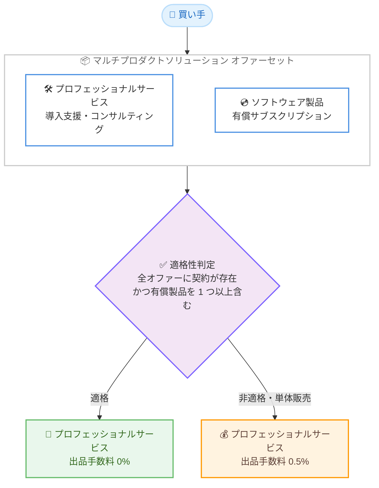

# AWS Marketplace - マルチプロダクトソリューション内のプロフェッショナルサービスに対する出品手数料の引き下げ

**リリース日**: 2026 年 9 月 1 日
**サービス**: AWS Marketplace
**機能**: マルチプロダクトソリューションにおけるプロフェッショナルサービスの出品手数料 0% 化

📊 [このアップデートのインフォグラフィックを見る](https://takech9203.github.io/aws-news-summary/20260901-aws-marketplace-fee-professional-services.html)

## 概要

AWS Marketplace は、対象となるマルチプロダクトソリューションの一部として購入されたプロフェッショナルサービスに対する出品手数料 (リスティングフィー) を 0% に引き下げることを発表しました。これは、先般実施されたプロフェッショナルサービスの出品手数料 0.5% への引き下げをさらに発展させるものです。

マルチプロダクトソリューションとは、プロフェッショナルサービスと少なくとも 1 つの有効な有償サブスクリプションを組み合わせたオファーセットです。ソフトウェア製品と導入支援・コンサルティングなどのサービスをまとめて販売するパートナー (ISV およびチャネルパートナー) にとって、手数料負担が軽減され、AWS Marketplace 経由での複合的なソリューション販売がより魅力的になります。

AWS Marketplace は過去 1 年間で、Agent Mode による AI を活用したパートナー検索、ソフトウェアとサービスを組み合わせたトランザクション、タイムアンドマテリアル (T&M) などの変動型支払いモデルといったサービス販売向け機能を拡充しており、今回の手数料引き下げはその流れを補完するものです。

**アップデート前の課題**

このアップデート以前は、以下の課題がありました。

- プロフェッショナルサービスをプライベートオファーで販売する場合、単体・ソリューション組み込みを問わず 0.5% の出品手数料が発生していた
- ソフトウェアとサービスを組み合わせて販売しても、サービス部分の手数料面での優遇はなく、マージンの薄いサービスビジネスではコスト負担が相対的に大きかった
- パートナーが AWS Marketplace 外の直接契約と比較した際、手数料分だけ Marketplace 経由の販売にコスト面の差があった

**アップデート後の改善**

今回のアップデートにより、以下が可能になりました。

- 対象となるマルチプロダクトソリューションの一部として販売されるプロフェッショナルサービスの出品手数料が 0% になった
- ソフトウェアとサービスをセットで販売するインセンティブが強化され、パートナーはサービス収益をより多く確保できるようになった
- 買い手にとっても、ソフトウェアと導入支援を AWS Marketplace で一括調達するソリューション型購買が促進される

## アーキテクチャ図



マルチプロダクトソリューションとしてプロフェッショナルサービスが有償製品とセットで契約された場合、適格性判定を経てサービス部分の出品手数料が 0% になる流れを示しています。

## サービスアップデートの詳細

### 主要機能

1. **プロフェッショナルサービスの出品手数料 0% 化**
   - 対象となるマルチプロダクトソリューションの一部として販売されるプロフェッショナルサービスの出品手数料が 0.5% から 0% に引き下げ
   - 単体で販売されるプロフェッショナルサービスのプライベートオファーは、引き続き 0.5% の出品手数料が適用される
   - 手数料は税抜の総契約金額 (TCV) に基づいて計算される

2. **適格条件 (マルチプロダクトソリューションの要件)**
   - プロフェッショナルサービス製品が、オファーセット内のすべてのオファーに契約が存在するオファーセットの一部であること
   - オファーセット内にプロフェッショナルサービス以外の有償製品 (価格ディメンションが 0 ドルでない製品) が少なくとも 1 つ含まれていること
   - 適格性を担保する関連契約 (sibling agreement) がキャンセルまたは終了されていないこと。有効・期限切れ・更新済み・置換済みの契約はいずれも適格性を維持する

3. **適用タイミングと評価方法**
   - 適格性は、各出品手数料の請求書 (インボイス) が生成されるタイミングで評価される
   - 0% の手数料は、機能リリース以降に作成された適格なプロフェッショナルサービス契約にのみ適用され、既存契約には遡及適用されない

## 技術仕様

### AWS Marketplace 出品手数料の体系

| 項目 | 手数料 |
|------|--------|
| プロフェッショナルサービス (適格なマルチプロダクトソリューション内) | **0%** (今回のアップデート) |
| プロフェッショナルサービス (単体のプライベートオファー) | 0.5% |
| SaaS / AWS Data Exchange のパブリックオファー | 3% |
| サーバー製品 (AMI、コンテナ、機械学習) のパブリックオファー | 20% |
| プライベートオファー (TCV 100 万ドル未満) | 3% |
| プライベートオファー (TCV 100 万ドル以上 1,000 万ドル未満) | 2% |
| プライベートオファー (TCV 1,000 万ドル以上、およびすべての更新) | 1.5% |
| チャネルパートナープライベートオファー (CPPO) のアップリフト | +0.5% |

### 手数料のアップリフトに関する注意

- リージョン別の追加手数料および CPPO のアップリフトは、プロフェッショナルサービスの出品手数料に加算して適用される
- 例: 適格なプロフェッショナルサービスを CPPO 経由で販売した場合、ベースの出品手数料 0% に CPPO アップリフト 0.5% が加算される
- 例: 韓国の買い手向け取引には 1% のリージョン別追加手数料が適用される

## 設定方法

### 前提条件

1. AWS Marketplace の登録済み出品者 (セラー) であること
2. プロフェッショナルサービス製品が AWS Marketplace に出品されていること
3. 組み合わせる有償のソフトウェア製品 (SaaS、AMI、コンテナなど) が出品されていること

### 手順

#### ステップ 1: マルチプロダクトソリューションの作成

AWS Partner Central のソリューション管理画面 (https://console.aws.amazon.com/partnercentral/solutions) にアクセスし、プロフェッショナルサービス製品と有償ソフトウェア製品を組み合わせたソリューションを作成します。

#### ステップ 2: オファーセットの提示と契約締結

買い手に対してオファーセットを提示し、セット内のすべてのオファーについて契約を締結します。プロフェッショナルサービス以外に少なくとも 1 つの有償製品が含まれている必要があります。

#### ステップ 3: 手数料適用の確認

出品手数料の請求書が生成されるタイミングで適格性が評価されます。適格な場合、プロフェッショナルサービス部分の出品手数料が 0% として計上されていることを請求書で確認します。

## メリット

### ビジネス面

- **サービス収益の最大化**: プロフェッショナルサービス部分の手数料が 0% になり、パートナーは売上をほぼそのまま確保できる
- **ソリューション販売の促進**: ソフトウェアとサービスのセット販売に手数料面のインセンティブが働き、単価の大きい複合案件の獲得につながる
- **調達の一元化**: 買い手はソフトウェアと導入支援を AWS Marketplace で一括契約でき、請求と調達プロセスを簡素化できる

### 技術面

- **既存の仕組みをそのまま活用**: オファーセットや契約の仕組みは既存のマルチプロダクトソリューション機能に基づいており、追加の技術的な設定は不要
- **柔軟な支払いモデルとの併用**: タイムアンドマテリアルなどの変動型支払いモデルと組み合わせてサービスを提供できる
- **自動的な適格性評価**: 請求書生成時に適格性が自動評価されるため、手動での申請作業は不要

## デメリット・制約事項

### 制限事項

- 0% の手数料は機能リリース以降に作成された新規契約にのみ適用され、既存契約には遡及適用されない
- 単体で販売されるプロフェッショナルサービスは引き続き 0.5% の手数料が適用される
- オファーセット内の有償製品の契約がキャンセルまたは終了された場合、適格性を失う可能性がある

### 考慮すべき点

- リージョン別追加手数料 (例: 韓国向け 1%) や CPPO アップリフト (0.5%) は 0% のベース手数料に加算して適用される
- 適格性は請求書生成のたびに評価されるため、関連契約の状態管理に注意が必要
- オファーセット内のプロフェッショナルサービス以外の製品には、それぞれの製品タイプに応じた通常の出品手数料が適用される

## ユースケース

### ユースケース 1: ISV によるソフトウェアと導入支援のセット販売

**シナリオ**: SaaS 製品を提供する ISV が、自社製品の導入・設定支援をプロフェッショナルサービスとして組み合わせて販売する。

**実装例**:
```
オファーセット構成:
- SaaS 製品のプライベートオファー (年間 20 万ドル)
- 導入支援サービス (5 万ドル)

手数料:
- SaaS 部分: 3% (TCV 100 万ドル未満のプライベートオファー)
- サービス部分: 0% (適格なマルチプロダクトソリューション)
```

**効果**: サービス部分の手数料 250 ドル (0.5% 時) が 0 ドルになり、サービス収益を全額確保できる。

### ユースケース 2: チャネルパートナーによる再販とサービス提供

**シナリオ**: チャネルパートナーが ISV のソフトウェアを CPPO で再販し、自社のマネージドサービスや導入コンサルティングを組み合わせて提供する。

**実装例**:
```
オファーセット構成:
- ISV ソフトウェアの CPPO
- チャネルパートナーのプロフェッショナルサービス

手数料:
- サービス部分: ベース 0% + CPPO アップリフト 0.5%
```

**効果**: サービス部分のベース手数料が 0% になり、CPPO 経由でも従来より低い手数料でサービスを提供できる。

### ユースケース 3: 大型移行プロジェクトの一括契約

**シナリオ**: エンタープライズ顧客のクラウド移行プロジェクトで、移行ツールのライセンスと移行支援サービスを AWS Marketplace で一括契約する。

**実装例**:
```
オファーセット構成:
- 移行ツールのプライベートオファー (150 万ドル)
- 移行支援サービス (タイムアンドマテリアル型、上限 50 万ドル)

手数料:
- ツール部分: 2% (TCV 100 万ドル以上のプライベートオファー)
- サービス部分: 0%
```

**効果**: 50 万ドル規模のサービス契約で最大 2,500 ドル (0.5% 時) の手数料が不要になり、買い手は調達を一元化できる。

## 料金

今回のアップデートは料金 (出品手数料) 自体の変更です。

### 手数料比較

| 販売形態 | 出品手数料 |
|----------|------------|
| プロフェッショナルサービス単体のプライベートオファー | 0.5% |
| 適格なマルチプロダクトソリューション内のプロフェッショナルサービス | **0%** |

手数料は税抜の総契約金額 (TCV) に基づいて計算され、出品手数料の請求書に単一の項目として表示されます。リージョン別追加手数料と CPPO アップリフトは加算適用されます。

## 利用可能リージョン

AWS Marketplace が運営されているすべての商用 AWS リージョンで利用可能です。

## 関連サービス・機能

- **AWS Marketplace マルチプロダクトソリューション**: ソフトウェアとサービスを組み合わせたオファーセットを構成・販売する機能。今回の 0% 手数料の適用対象
- **AWS Partner Central**: パートナーがソリューションを登録・管理するポータル。マルチプロダクトソリューションの出品に使用
- **チャネルパートナープライベートオファー (CPPO)**: チャネルパートナーによる再販の仕組み。0% のベース手数料に 0.5% のアップリフトが加算される
- **AWS Marketplace Agent Mode**: AI を活用したパートナー検索機能。サービス販売強化施策の一環

## 参考リンク

- 📊 [インフォグラフィック](https://takech9203.github.io/aws-news-summary/20260901-aws-marketplace-fee-professional-services.html)
- [公式発表 (What's New)](https://aws.amazon.com/about-aws/whats-new/2026/09/aws-marketplace-fee-professional-services/)
- [ドキュメント: AWS Marketplace 出品手数料](https://docs.aws.amazon.com/marketplace/latest/userguide/listing-fees.html)
- [AWS Partner Central: ソリューション管理](https://console.aws.amazon.com/partnercentral/solutions)
- [AWS Marketplace: マルチプロダクトソリューション検索](https://aws.amazon.com/marketplace/search/results?ref_=header_nav_dm_saas&NUMBER_OF_PRODUCTS=MULTI_PRODUCT&filters=NUMBER_OF_PRODUCTS)

## まとめ

AWS Marketplace は、適格なマルチプロダクトソリューション内のプロフェッショナルサービスに対する出品手数料を 0% に引き下げ、ソフトウェアとサービスを組み合わせたソリューション販売のコスト面の障壁を取り除きました。プロフェッショナルサービスを提供するパートナーは、有償ソフトウェアとのオファーセット化により手数料を削減できるため、既存のサービス販売形態をマルチプロダクトソリューションへ移行することを検討する価値があります。0% の適用は新規契約のみが対象であるため、今後の契約設計の際に適格条件を確認することを推奨します。
