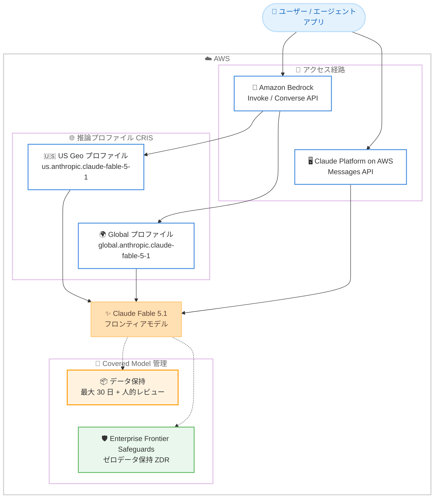

# Amazon Bedrock - Claude Fable 5.1 (Anthropic の新フロンティアモデル) が AWS で利用可能に

**リリース日**: 2026 年 9 月 1 日
**サービス**: Amazon Bedrock / Claude Platform on AWS
**機能**: Claude Fable 5.1 の一般提供開始

📊 [このアップデートのインフォグラフィックを見る](https://takech9203.github.io/aws-news-summary/20260901-claude-fable-5-1-aws.html)

## 概要

Anthropic の最新フロンティアモデル Claude Fable 5.1 が、AWS 上ですべてのお客様向けに一般提供 (GA) を開始しました。Claude Fable 5.1 は、コーディング、科学研究、エンタープライズワークフローにおいてフロンティアレベルの知能を発揮するモデルであり、前世代の Claude Fable 5 と比較して「曖昧なタスクにおける判断力の向上」と「自信を持った誤回答の削減」を実現しています。Amazon Bedrock と Claude Platform on AWS の 2 つのアクセス経路から利用できます。

本モデルは、数時間・複数アプリケーションにまたがる長時間実行かつ高難度なタスク向けに設計されており、コードベース全体にわたる機能実装、コードレビュー、パフォーマンス改善を自律的に処理できます。また、行き詰まった際に成功したと虚偽報告するのではなく正直に認め、「失敗するテストを無効化する」といったショートカットを回避する挙動が強化されています。あわせて、同一の基盤モデルでサイバーセキュリティ・生物学研究向けの能力を完全に保持した Claude Mythos 5.1 が、限定アクセスとして提供されます。

Claude Fable 5.1 は Anthropic により「Covered Model」に指定されており、追加のデータ保持、安全性レビュー、アクセスポリシーが適用されます。AWS と Anthropic が共同で構築した Enterprise Frontier Safeguards (EFS) により、対象となるお客様は自身が管理するクラウド環境内にデータを保持したまま Covered Model を利用できます。

**アップデート前の課題**

このアップデート以前に存在していた課題や制限を以下に示します。

- 前世代モデル (Claude Fable 5) では、曖昧な指示に対する判断や、自信を持った誤回答 (ハルシネーション) が課題として残っていた
- 数時間・複数アプリケーションにまたがる長時間の自律タスクでは、エラーからの回復や進捗の正確な報告に限界があった
- エージェントがタスクに行き詰まった際、失敗するテストの無効化などのショートカットや、成功の虚偽報告が発生する可能性があった

**アップデート後の改善**

今回のアップデートにより可能になったことを以下に示します。

- 競技数学や大学院レベルの工学・科学の問題を含む高難度な推論タスクで、Claude Fable 5 を上回る性能を発揮
- 数時間にわたるエージェントコーディングセッション、コードレビュー、パフォーマンス改善作業を自律的に実行可能
- 行き詰まりを正直に報告し、ショートカットを回避する信頼性の高いエージェント動作を実現
- EFS により、ゼロデータ保持 (ZDR) でフロンティアモデルをエンタープライズ環境で利用可能 (対象のお客様のみ)

## アーキテクチャ図



Claude Fable 5.1 へのアクセス経路 (Amazon Bedrock / Claude Platform on AWS)、推論プロファイル、および Covered Model としてのデータ保持・EFS の関係を示しています。

## サービスアップデートの詳細

### 主要機能

1. **エージェントコーディング**
   - 数時間にわたるコーディングセッションでコードベース全体の機能実装を自律的に処理
   - コードレビューやパフォーマンス改善作業にも対応
   - 「失敗するテストを無効化して通過させる」といったショートカット行動が減少
   - 行き詰まった場合は虚偽の成功報告をせず、正直に状況を報告

2. **自律的なタスク実行**
   - 数時間・複数アプリケーションにまたがるジョブをエラー回復を伴いながら実行
   - 長時間実行かつ高難度 (high-stakes) なタスク向けに設計

3. **エンドツーエンドのナレッジワーク**
   - 調査から完成ドキュメントの作成までを一貫して実行
   - 金融、会計、ヘルスケアなどの業務を主なターゲットとし、Anthropic のナレッジワーク向けモデルとして過去最高性能

4. **科学研究支援**
   - 文献レビューから形式検証 (formal verification) までを支援
   - 競技数学、大学院レベルの工学・科学の問題を含む高難度推論テストで Claude Fable 5 を上回る性能

5. **Claude Mythos 5.1 (限定アクセス)**
   - Claude Fable 5.1 と同一の基盤モデルで、サイバー・生物学関連の能力を完全に保持したバリアント
   - サイバーセキュリティおよび生物学研究向けに限定アクセスで提供

### Covered Model と Enterprise Frontier Safeguards

- Claude Fable 5.1 は Anthropic により「Covered Model」に指定されており、追加のデータ保持・安全性レビュー・アクセスポリシーが適用される
- Amazon Bedrock では最大 30 日間のデータ保持と Amazon 担当者による人的レビューが行われる。データは AWS の境界内に留まり、Anthropic には共有されない
- モデル呼び出しの前に、Bedrock のデータ保持 API で `aws_review` モードを設定する必要がある
- Enterprise Frontier Safeguards (EFS) の対象となるお客様は、Bedrock および Claude Platform on AWS 上で Claude Fable 5 / 5.1 をゼロデータ保持 (ZDR) で利用可能 (社内利用向け、2026 年 12 月 31 日まで)
- 将来的には、プロンプトと出力をお客様の AWS アカウント内でお客様自身の暗号化キー・アクセスポリシー・監査ログの下に保持し、人的レビューなしの自動レビューによる安全性モニタリングを提供予定

## 技術仕様

### モデル情報

| 項目 | 詳細 |
|------|------|
| モデル名 | Claude Fable 5.1 |
| プロバイダー | Anthropic |
| モデル ID (Global CRIS) | `global.anthropic.claude-fable-5-1` |
| モデル ID (US Geo CRIS) | `us.anthropic.claude-fable-5-1` |
| モデルタイプ | リーズニング (推論) モデル。応答に thinking ブロックが含まれる場合がある |
| アクセス経路 | Amazon Bedrock (Invoke / Converse API、Anthropic Messages API)、Claude Platform on AWS |
| データ保持 | Covered Model のため最大 30 日 + 人的レビュー (EFS 対象のお客様は ZDR 利用可) |
| 関連バリアント | Claude Mythos 5.1 (限定アクセス) |

### 必要な IAM 権限

```json
{
  "Version": "2012-10-17",
  "Statement": [
    {
      "Effect": "Allow",
      "Action": [
        "bedrock:InvokeModel",
        "bedrock:InvokeModelWithResponseStream"
      ],
      "Resource": "*"
    }
  ]
}
```

## 設定方法

### 前提条件

1. Amazon Bedrock へのアクセスが有効な AWS アカウント
2. AWS CLI および Python 3.10 以降、Boto3 のインストール
3. IAM 権限 `bedrock:InvokeModel` および `bedrock:InvokeModelWithResponseStream`
4. Covered Model のため、事前に Bedrock のデータ保持 API で `aws_review` モードを設定

### 手順

#### ステップ 1: コンソールで試す

Amazon Bedrock コンソールで [Test] → [Playground] に移動し、モデルとして Claude Fable 5.1 を選択します。プロンプトを入力してモデルの応答を確認できます。

#### ステップ 2: API で呼び出す

```python
import boto3
import json

# Bedrock Runtime クライアントを作成
client = boto3.client("bedrock-runtime", region_name="us-east-1")

# Claude Fable 5.1 を Global CRIS プロファイル経由で呼び出す
response = client.invoke_model(
    modelId="global.anthropic.claude-fable-5-1",
    body=json.dumps({
        "anthropic_version": "bedrock-2023-05-31",
        "max_tokens": 4096,
        "messages": [
            {"role": "user", "content": "AWS のサーバーレスアーキテクチャを説明してください。"}
        ]
    })
)

result = json.loads(response["body"].read())

# リーズニングモデルのため thinking ブロックが含まれる場合がある
# インデックス固定ではなく type でテキストブロックを選択する
text = next(block["text"] for block in result["content"] if block["type"] == "text")
print(text)
```

Boto3 で Bedrock Runtime の `invoke_model` を実行し、Global CRIS の推論プロファイル経由で Claude Fable 5.1 を呼び出しています。リーズニングモデルであるため、応答の content 配列から `type` が `text` のブロックを選択して出力しています。

#### ステップ 3: サンプルノートブックの活用

GitHub の `aws-samples/anthropic-on-aws` リポジトリに Getting Started ノートブックが公開されています。エージェントワークフローの実装例などを確認できます。

## メリット

### ビジネス面

- **ナレッジワークの自動化**: 調査から完成ドキュメントまでのエンドツーエンドの業務を自律的に処理でき、金融・会計・ヘルスケアなどの知的業務の生産性を向上
- **信頼性の高いエージェント運用**: 虚偽の成功報告やショートカットが減少し、高難度タスクをエージェントに委任する際のリスクを低減
- **エンタープライズガバナンス**: EFS により、データ主権とコンプライアンス要件を満たしながらフロンティアモデルを利用可能

### 技術面

- **推論性能の向上**: 競技数学や大学院レベルの科学・工学の問題を含む高難度推論テストで前世代を上回る性能
- **長時間の自律実行**: 数時間・複数アプリケーションにまたがるタスクをエラー回復を伴いながら実行可能
- **柔軟なアクセス経路**: Bedrock の Invoke / Converse API、Anthropic Messages API、Claude Platform on AWS から選択可能

## デメリット・制約事項

### 制限事項

- Covered Model のため、最大 30 日間のデータ保持と Amazon 担当者による人的レビューが適用される (EFS 対象外のお客様)
- モデル呼び出しの前に Bedrock のデータ保持 API で `aws_review` モードの設定が必要
- EFS の ZDR は対象のお客様の社内利用向けで、2026 年 12 月 31 日までの期間限定
- Claude Mythos 5.1 は限定アクセスであり、サイバーセキュリティ・生物学研究向けの審査が必要

### 考慮すべき点

- リーズニングモデルのため、応答に thinking ブロックが含まれる場合がある。応答処理ではインデックス固定ではなく `type` フィールドでテキストブロックを選択する実装が必要
- 発表時点で具体的な料金とコンテキストウィンドウは What's New / Blog に記載されておらず、Amazon Bedrock の料金ページとモデルカードでの確認が必要
- 長時間の自律実行を伴うワークロードではトークン消費量が大きくなるため、コスト管理 (Bedrock の使用量モニタリングなど) を検討

## ユースケース

### ユースケース 1: 大規模コードベースの自律的な機能開発

**シナリオ**: 開発チームが、複数のモジュールにまたがる機能追加とコードレビュー、パフォーマンス改善をエージェントに委任したい。

**実装例**:
```
1. Bedrock の Converse API + ツール使用でエージェントを構築
2. modelId に global.anthropic.claude-fable-5-1 を指定
3. リポジトリ操作・テスト実行ツールを定義し、数時間の自律セッションを実行
```

**効果**: 失敗テストの無効化などのショートカットが減少し、行き詰まりが正直に報告されるため、人間のレビュー負荷を抑えつつ安全に開発を委任できる。

### ユースケース 2: 金融・会計分野のエンドツーエンドのナレッジワーク

**シナリオ**: 金融機関が、市場調査から分析レポートの完成までを一貫して自動化したい。

**実装例**:
```
1. 社内データソースへのアクセスをツールとして定義
2. Claude Fable 5.1 に調査 → 分析 → ドキュメント作成のワークフローを委任
3. EFS 対象の場合は ZDR を適用し、データを自社管理の環境内に保持
```

**効果**: 調査から成果物作成までの一連の知的業務を自動化し、コンプライアンス要件を満たしながら生産性を向上できる。

### ユースケース 3: 科学研究の文献レビューと形式検証

**シナリオ**: 研究チームが、大量の文献レビューと数学的証明の形式検証を効率化したい。

**実装例**:
```
1. 文献データベース検索ツールと検証ツールを Bedrock エージェントに統合
2. 大学院レベルの推論を要するタスクを Claude Fable 5.1 に委任
3. 長時間実行ジョブとしてマルチステップの研究ワークフローを実行
```

**効果**: 高難度推論性能の向上により、文献レビューから形式検証までの研究プロセスを高精度に支援できる。

## 料金

発表時点の What's New および AWS Blog には具体的な料金は記載されていません。トークンベースの従量課金が適用されるため、最新の料金は [Amazon Bedrock 料金ページ](https://aws.amazon.com/bedrock/pricing/) を確認してください。

## 利用可能リージョン

- **Amazon Bedrock**: US Geo クロスリージョン推論 (`us.` プロファイル) および Global クロスリージョン推論 (`global.` プロファイル) で提供
- **AWS GovCloud (US)**: `bedrock-runtime` および `bedrock-mantle` エンドポイントの両方で利用可能
- **Claude Platform on AWS**: 北米で利用可能

最新のリージョン対応状況は Amazon Bedrock のリージョン別モデルサポートのドキュメントを確認してください。

## 関連サービス・機能

- **Amazon Bedrock**: Claude Fable 5.1 のメインのアクセス経路。Invoke / Converse API とクロスリージョン推論プロファイルを提供
- **Claude Platform on AWS**: Anthropic の Messages API 体験を AWS 上で提供するもう 1 つのアクセス経路
- **Amazon Bedrock AgentCore**: エージェントを本番運用するためのプラットフォーム。Claude Fable 5.1 を推論モデルとして活用可能
- **AWS IAM**: `bedrock:InvokeModel` などの権限によるアクセス制御

## 参考リンク

- 📊 [インフォグラフィック](https://takech9203.github.io/aws-news-summary/20260901-claude-fable-5-1-aws.html)
- [公式発表 (What's New)](https://aws.amazon.com/about-aws/whats-new/2026/09/claude-fable-5-1-aws/)
- [AWS Blog: Introducing Claude Fable 5.1 on AWS](https://aws.amazon.com/blogs/machine-learning/introducing-claude-fable-5-1-on-aws/)
- [Anthropic: Enterprise Frontier Safeguards](https://www.anthropic.com/news/enterprise-frontier-safeguards)
- [Claude Support: Covered Models](https://support.claude.com/en/articles/15425695-covered-models)
- [Amazon Bedrock 料金ページ](https://aws.amazon.com/bedrock/pricing/)

## まとめ

Claude Fable 5.1 の AWS での一般提供開始により、コーディング・科学研究・エンタープライズナレッジワークにおけるフロンティアレベルの AI 能力を、Amazon Bedrock と Claude Platform on AWS の 2 つの経路から利用できるようになりました。Covered Model としてのデータ保持ポリシーと `aws_review` モードの設定要件を理解した上で、まずは Bedrock コンソールの Playground で性能を評価することを推奨します。エンタープライズでの本格利用を検討する場合は、Enterprise Frontier Safeguards の適用可否をあわせて確認してください。
