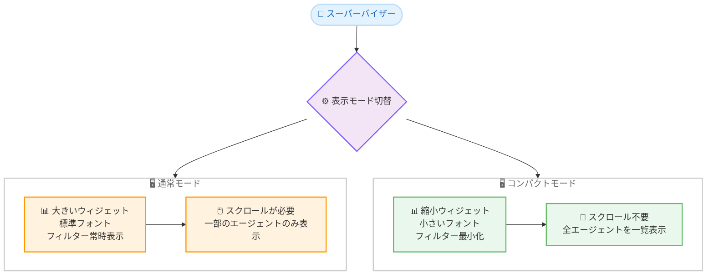

# Amazon Connect - Customer ダッシュボードのコンパクトモード対応

**リリース日**: 2026 年 9 月 1 日
**サービス**: Amazon Connect (Amazon Connect Customer)
**機能**: 分析ダッシュボードのコンパクトモード

📊 [このアップデートのインフォグラフィックを見る](https://takech9203.github.io/aws-news-summary/20260901-connect-dashboards-compact-mode.html)

## 概要

Amazon Connect Customer の分析ダッシュボードで、コンパクトモードが利用可能になりました。コンパクトモードを有効にすると、ウィジェットのサイズやフォントが縮小され、フィルター表示が最小化されることで画面スペースが最大限活用され、データ密度が向上します。これにより、スーパーバイザーはスクロールすることなく、より多くの運用データを一度に確認できます。

公式発表では、13 インチのラップトップを使用するスーパーバイザーの例が紹介されています。コンパクトモードに切り替えることで行の高さが縮小され、チームの全エージェントをスクロールなしでウィジェット上に表示できるようになり、スケジュールを遵守していないエージェントをより迅速に発見できます。

コンタクトセンターのスーパーバイザーや管理者など、リアルタイムダッシュボードを日常的に監視するユーザーにとって、特に小型ディスプレイ環境での視認性と運用効率を大きく改善するアップデートです。

**アップデート前の課題**

- 以前はダッシュボードのウィジェットサイズやフォントサイズ、フィルター表示領域が固定的で、1 画面に表示できるデータ量が限られていた
- 小型ディスプレイ (13 インチラップトップなど) では、チーム全体のエージェント状況を確認するために頻繁なスクロールが必要だった
- スクロール操作により、非遵守エージェントの発見など、即応が求められる監視業務に時間がかかっていた

**アップデート後の改善**

- コンパクトモードの切り替えにより、ウィジェットサイズ、フォント、行の高さが縮小され、1 画面あたりの表示データ量が増加した
- フィルター表示が最小化され、画面スペースをデータ表示に最大限活用できるようになった
- 小型ディスプレイでもスクロールなしでチーム全体を俯瞰でき、問題のあるエージェントをより迅速に特定できるようになった

## アーキテクチャ図



通常モードとコンパクトモードの表示の違いを示した図です。コンパクトモードではウィジェットとフォントが縮小され、フィルターが最小化されるため、同じ画面サイズでもより多くのデータを一覧できます。

## サービスアップデートの詳細

### 主要機能

1. **コンパクトモードの切り替え**
   - 分析ダッシュボード上でコンパクトモードをトグル操作で有効化できる
   - ウィジェットのサイズとフォントサイズが縮小され、データ密度が向上する
   - 行の高さが縮小され、テーブル系ウィジェットでより多くの行を表示できる

2. **フィルター表示の最小化**
   - コンパクトモードではフィルター表示が最小化される
   - フィルターが占有していた領域がデータ表示に割り当てられ、画面スペースを最大限活用できる

3. **小型ディスプレイでの視認性向上**
   - 13 インチラップトップなどの小型画面でも、チームの全エージェントをスクロールなしで一覧できる
   - 非遵守エージェントの発見など、リアルタイム監視業務の効率が向上する

## 技術仕様

### ダッシュボードの基本仕様

| 項目 | 詳細 |
|------|------|
| 対象機能 | Amazon Connect Customer 分析ダッシュボード |
| 表示モード | 通常モード / コンパクトモード (トグル切替) |
| コンパクトモードの効果 | ウィジェットサイズ縮小、フォント縮小、行高さ縮小、フィルター最小化 |
| リアルタイムダッシュボードの更新間隔 | 15 秒ごと (時系列ウィジェットは 15 分ごと) |
| 履歴データの参照範囲 | 過去 3 か月まで |
| その他のカスタマイズ | ウィジェットのリサイズ・再配置、時間範囲指定、CSV / PDF ダウンロード、共有・公開 |

### 必要な権限

ダッシュボードへのアクセスには、セキュリティプロファイルで以下のいずれかの権限が必要です。

- Access metrics - Access 権限
- Dashboard - Access 権限

また、各ダッシュボードのデータを表示するには、対象機能ごとの表示権限 (例: フローデータの場合は Flows - View 権限) が必要です。

## 設定方法

### 前提条件

1. Amazon Connect インスタンスが作成済みであること
2. ユーザーにダッシュボードへのアクセス権限 (Access metrics - Access または Dashboard - Access) が付与されていること
3. 表示するデータに応じた各機能の表示権限が付与されていること

### 手順

#### ステップ 1: ダッシュボードを開く

Amazon Connect Customer の管理 Web サイトにサインインし、[Analytics and Optimization] から [Dashboards and reports] に移動して、表示したいダッシュボードを選択します。

#### ステップ 2: コンパクトモードに切り替える

ダッシュボード上でコンパクトモードをトグルで有効にします。ウィジェットサイズ、フォント、行の高さが縮小され、フィルター表示が最小化されます。

#### ステップ 3: 表示を確認・カスタマイズする

コンパクトモードでの表示を確認し、必要に応じてウィジェットのリサイズ・再配置や時間範囲・フィルターの調整を行います。カスタマイズしたダッシュボードは [Actions] > [Save] で保存できます。

## メリット

### ビジネス面

- **監視業務の迅速化**: スクロール操作が不要になり、非遵守エージェントなどの問題をより迅速に発見できる
- **運用効率の向上**: 1 画面でチーム全体を俯瞰できるため、スーパーバイザーの状況把握にかかる時間が短縮される
- **追加コスト不要**: 既存のダッシュボード機能の表示改善であり、追加料金なしで利用できる

### 技術面

- **データ密度の向上**: ウィジェット・フォント・行高さの縮小により、同一画面での表示情報量が増加する
- **画面スペースの最大活用**: フィルター最小化により、データ表示領域が拡大する
- **多様なディスプレイ環境への対応**: 13 インチラップトップなどの小型画面でも実用的な監視体験を提供できる

## デメリット・制約事項

### 制限事項

- Amazon Connect Customer が提供されているリージョンでのみ利用可能
- ダッシュボードの表示にはセキュリティプロファイルによる適切な権限設定が必要

### 考慮すべき点

- フォントやウィジェットが縮小されるため、視認性の好みや利用者のディスプレイ環境に応じてモードを使い分ける必要がある
- 大型ディスプレイを利用している場合は、通常モードの方が見やすいケースもある

## ユースケース

### ユースケース 1: 小型ラップトップでのエージェント遵守状況の監視

**シナリオ**: 13 インチラップトップを使用するスーパーバイザーが、チーム全体のエージェントのスケジュール遵守状況をリアルタイムで監視したい。

**実装例**:
```
1. Queue and agent performance ダッシュボードを開く
2. コンパクトモードをトグルで有効化
3. 行の高さが縮小され、全エージェントがスクロールなしで表示される
```

**効果**: スクロール操作なしで非遵守エージェントを即座に特定でき、迅速な是正アクションにつながる。

### ユースケース 2: 壁掛けモニターでの運用状況一覧表示

**シナリオ**: コンタクトセンターのフロアに設置した共有モニターで、キューやエージェントの状況をチーム全員が一目で確認できるようにしたい。

**実装例**:
```
1. リアルタイムダッシュボードをコンパクトモードで表示
2. フィルターが最小化され、データ表示領域が最大化される
3. 保存・公開機能でチームに共有する
```

**効果**: 限られた画面領域により多くの運用メトリクスを表示でき、チーム全体の状況認識が向上する。

### ユースケース 3: 複数ダッシュボードの並行監視

**シナリオ**: スーパーバイザーが、キュー状況とエージェントパフォーマンスなど複数のダッシュボードをブラウザーの分割ウィンドウで同時に監視したい。

**実装例**:
```
1. 各ダッシュボードをブラウザーの別ウィンドウで開く
2. それぞれコンパクトモードを有効化
3. 分割表示でも各ダッシュボードの主要データが収まる
```

**効果**: 縮小されたウィンドウ幅でも必要なデータが表示され、複数領域の並行監視が可能になる。

## 料金

コンパクトモードは既存の分析ダッシュボード機能の表示オプションであり、追加料金はありません。Amazon Connect は従量課金制で、使用したサービス (音声、チャット、各種機能) に応じて課金されます。詳細は [Amazon Connect の料金ページ](https://aws.amazon.com/connect/pricing/) を参照してください。

## 利用可能リージョン

Amazon Connect Customer が提供されているすべての AWS リージョンで利用可能です。対象リージョンの一覧は [リージョン別の利用可否](https://docs.aws.amazon.com/connect/latest/adminguide/regions.html#amazonconnect_region) を参照してください。

## 関連サービス・機能

- **Amazon Connect Customer 分析ダッシュボード**: リアルタイムおよび履歴メトリクスを可視化する本アップデートの対象機能
- **エージェントワークスペース**: 公開したダッシュボードを埋め込んで、エージェント自身がパフォーマンスを確認できる
- **Amazon Connect セキュリティプロファイル**: ダッシュボードへのアクセス権限を制御する仕組み

## 参考リンク

- 📊 [インフォグラフィック](https://takech9203.github.io/aws-news-summary/20260901-connect-dashboards-compact-mode.html)
- [公式発表 (What's New)](https://aws.amazon.com/about-aws/whats-new/2026/09/connect-dashboards-compact-mode/)
- [Amazon Connect Customer Administrator Guide - Dashboards](https://docs.aws.amazon.com/connect/latest/adminguide/dashboards.html)
- [Amazon Connect 製品ページ](https://aws.amazon.com/connect/)
- [料金ページ](https://aws.amazon.com/connect/pricing/)

## まとめ

Amazon Connect Customer の分析ダッシュボードにコンパクトモードが追加され、小型ディスプレイでもスクロールなしでより多くの運用データを一覧できるようになりました。追加コストなしで利用できる表示改善のため、リアルタイム監視を行うスーパーバイザーはまずコンパクトモードを試し、自身のディスプレイ環境に合わせて表示モードを使い分けることを推奨します。
