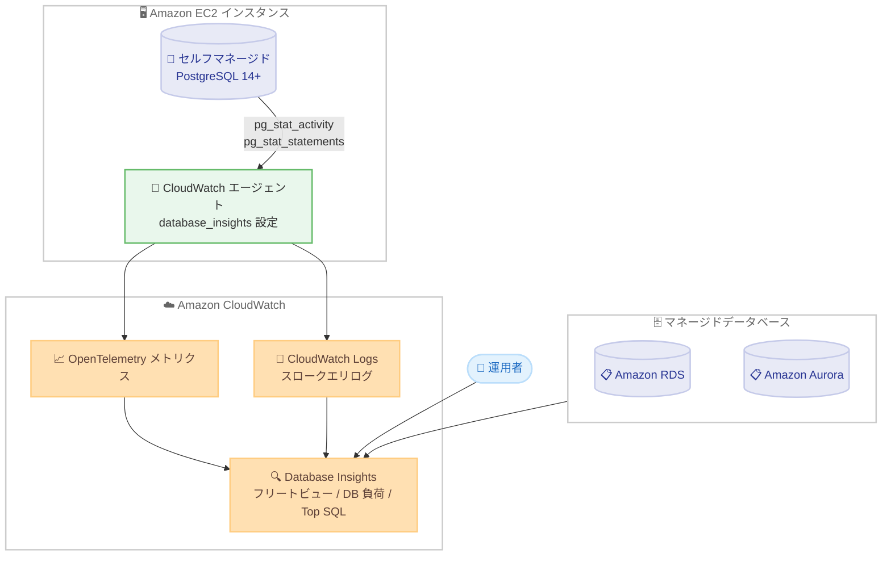

# Amazon CloudWatch Database Insights - セルフマネージド PostgreSQL のサポート

**リリース日**: 2026 年 9 月 1 日
**サービス**: Amazon CloudWatch (Database Insights)
**機能**: セルフマネージド PostgreSQL データベースのモニタリング対応

📊 [このアップデートのインフォグラフィックを見る](https://takech9203.github.io/aws-news-summary/20260901-database-insights-self-managed-postgresql.html)

## 概要

Amazon CloudWatch Database Insights が、セルフマネージド PostgreSQL データベースのモニタリングに対応しました。Amazon EC2 上で自己管理する PostgreSQL インスタンスを、Amazon RDS や Amazon Aurora のデータベースと並べて単一のコンソールでモニタリングできるようになり、データベースフリート全体を一元的に可視化できます。

Database Insights は、データベースフリートの健全性のモニタリング、問題の診断、パフォーマンスボトルネックの解決を支援するキュレーションされたオブザーバビリティソリューションです。セルフマネージドデータベースの場合は、データベースホストに CloudWatch エージェントをインストールして健全性およびパフォーマンスデータを収集します。設定が完了すると、数分以内にデータベースがフリートビューに表示され、データベース負荷 (平均アクティブセッション)、待機イベント分析、クエリレベルの統計、ホストメトリクスといったライブパフォーマンスデータを確認できます。

マネージドデータベースとセルフマネージドデータベースが混在する環境を運用するユーザーにとって、同じコンソールと使い慣れたワークフローで一貫した診断とトラブルシューティングを実現できる点が大きな価値です。

**アップデート前の課題**

- Database Insights は Amazon RDS / Amazon Aurora のみが対象であり、EC2 上のセルフマネージド PostgreSQL は監視できなかった
- セルフマネージドデータベースの監視には、サードパーティー製ツールや自作の監視基盤 (pg_stat_statements の手動集計など) を別途構築・運用する必要があった
- マネージドとセルフマネージドでツールが分かれるため、フリート全体の健全性を横断的に把握しにくく、障害調査時にコンソールを行き来する必要があった

**アップデート後の改善**

- EC2 上のセルフマネージド PostgreSQL を RDS / Aurora と同じ Database Insights コンソールでモニタリングできるようになった
- CloudWatch エージェントをインストールするだけで、データベース負荷、待機イベント分析、クエリレベル統計、ホストメトリクスを数分で取得開始できるようになった
- 異種混在のデータベースフリートに対して、一貫した診断ワークフローとトラブルシューティング体験を単一コンソールから適用できるようになった

## アーキテクチャ図



EC2 ホスト上の CloudWatch エージェントが PostgreSQL の統計ビューとログからテレメトリを収集し、CloudWatch に送信します。Database Insights のフリートビューでは、マネージドデータベースとセルフマネージドデータベースを単一コンソールで横断的に確認できます。

## サービスアップデートの詳細

### 主要機能

1. **セルフマネージド PostgreSQL のフリートビュー統合**
   - EC2 上で稼働する PostgreSQL 14 以降のインスタンスを Database Insights のフリートビューに表示
   - RDS / Aurora と同一のコンソール・ワークフローで異種混在フリートを一元管理
   - エージェント設定後、数分以内にライブパフォーマンスデータの表示を開始

2. **データベース負荷と待機イベント分析**
   - `pg_stat_activity` から収集した平均アクティブセッションをデータベース負荷 (DB Load) として可視化
   - 待機イベントタイプ別の内訳により、ロック競合や I/O 待ちなどのボトルネック原因を特定可能

3. **クエリレベル統計 (Top SQL)**
   - `pg_stat_statements` からクエリ単位の実行統計を収集し、負荷の高い SQL を特定
   - モニタリングユーザーに対象スキーマの読み取り権限を付与することで、`EXPLAIN` による実行計画のキャプチャにも対応
   - スロークエリログ (`log_min_duration_statement`) を CloudWatch Logs に収集

4. **ホストメトリクスの収集**
   - CloudWatch エージェントが CPU、メモリ、ディスク I/O などのホストメトリクスを収集
   - データベース内部の指標と OS レベルの指標を同一ダッシュボードで相関分析可能

## 技術仕様

### サポート要件

| 項目 | 詳細 |
|------|------|
| 対応エンジン | PostgreSQL (セルフマネージドとして現時点で唯一の対応エンジン) |
| PostgreSQL バージョン | 14 以降 |
| 実行環境 | Amazon EC2 インスタンス上での稼働 |
| エージェント配置 | PostgreSQL と同一ホストに CloudWatch エージェントをインストール (リモートデータベースの監視は非対応) |
| 必須拡張 | `pg_stat_statements` (`shared_preload_libraries` でロード) |
| データベースユーザー | `pg_monitor` ロールを付与した専用の最小権限モニタリングユーザーを推奨 |
| IAM 権限 | EC2 インスタンスロールに `CloudWatchAgentServerPolicy` 管理ポリシーをアタッチ |
| メトリクス保持期間 | 15 か月 |
| ログ保持期間 | 配信先ロググループの保持設定に従う |
| モード | Standard / Advanced モードの区分は適用されない |

### CloudWatch エージェント設定例

```json
{
  "agent": {
    "region": "ap-northeast-1"
  },
  "opentelemetry": {
    "collect": {
      "database_insights": {
        "postgresql": [
          {
            "endpoint": "localhost:5432",
            "instance_name": "my-postgres-instance",
            "username": "cw_monitor",
            "password_file": "/opt/aws/amazon-cloudwatch-agent/etc/pgpass",
            "logs": {
              "file_path": "/var/lib/pgsql/data/log/postgresql-*.log"
            }
          }
        ]
      }
    }
  }
}
```

エージェント設定ファイルの `opentelemetry.collect.database_insights` セクションに監視対象の PostgreSQL インスタンスを定義します。パスワードは pgpass 形式のファイルに分離し、設定ファイル本体に平文で記載しない構成が採用されています。

## 設定方法

### 前提条件

1. PostgreSQL 14 以降が Amazon EC2 インスタンス上で稼働していること
2. CloudWatch エージェントを PostgreSQL と同一ホストにインストールできること
3. EC2 インスタンスに `CloudWatchAgentServerPolicy` を含む IAM ロールがアタッチされていること
4. モニタリング専用のデータベースユーザーを作成できること

### 手順

#### ステップ 1: PostgreSQL の設定変更

```bash
# postgresql.conf に以下を追加
# shared_preload_libraries = 'pg_stat_statements'
# track_activities = on
# track_activity_query_size = 4096
# pg_stat_statements.track = all
# logging_collector = on
# log_min_duration_statement = 500
# compute_query_id = on

sudo systemctl restart postgresql
```

`postgresql.conf` で `pg_stat_statements` 拡張とサーバーログ設定を有効化します。`shared_preload_libraries` は起動時のみ読み込まれるため、reload ではなく restart が必要です。ログファイル名に曜日パターン (`postgresql-%a.log`) を使い日次ローテーションと組み合わせることで、ログディレクトリの肥大化を防止できます。

#### ステップ 2: 拡張の作成とモニタリングユーザーの準備

```sql
-- postgres データベースに接続して拡張を作成
CREATE EXTENSION IF NOT EXISTS pg_stat_statements;

-- 専用モニタリングユーザーを作成し pg_monitor ロールを付与
CREATE ROLE cw_monitor WITH LOGIN PASSWORD 'your-password';
GRANT pg_monitor TO cw_monitor;

-- 実行計画キャプチャ用にスキーマの読み取り権限を付与
GRANT USAGE ON SCHEMA public TO cw_monitor;
GRANT SELECT ON ALL TABLES IN SCHEMA public TO cw_monitor;
ALTER DEFAULT PRIVILEGES IN SCHEMA public GRANT SELECT ON TABLES TO cw_monitor;
```

エージェントは `postgres` データベースに接続してクラスター全体の統計を読み取るため、拡張は `postgres` データベースに作成します。管理者アカウントの流用は非推奨で、`pg_monitor` ロールによりスーパーユーザー権限なしで監視ビューへの読み取りアクセスを付与します。あわせて `pg_hba.conf` で IPv4 / IPv6 両方のループバックアドレスからの `scram-sha-256` 接続を許可します。

#### ステップ 3: CloudWatch エージェントの設定と起動

```bash
# パスワードファイルを作成し権限を制限
# /opt/aws/amazon-cloudwatch-agent/etc/pgpass
# localhost:5432:*:cw_monitor:your-password
sudo chmod 600 /opt/aws/amazon-cloudwatch-agent/etc/pgpass
sudo chown cwagent:cwagent /opt/aws/amazon-cloudwatch-agent/etc/pgpass

# 設定を読み込んでエージェントを起動
sudo /opt/aws/amazon-cloudwatch-agent/bin/amazon-cloudwatch-agent-ctl \
    -a fetch-config \
    -m ec2 \
    -s \
    -c file:/opt/aws/amazon-cloudwatch-agent/etc/amazon-cloudwatch-agent.json

# エージェントの稼働確認
sudo /opt/aws/amazon-cloudwatch-agent/bin/amazon-cloudwatch-agent-ctl -a status
```

pgpass 形式のパスワードファイルをエージェントユーザーのみ読み取り可能に制限したうえで、`database_insights` セクションを含む設定ファイルを読み込ませてエージェントを起動します。起動後、CloudWatch コンソールの Database Insights を開き、フリートビューにインスタンスが表示され DB Load、Top SQL、Wait Events、Host Metrics の各パネルにデータが表示されることを確認します。

## メリット

### ビジネス面

- **監視ツールの統合によるコスト削減**: セルフマネージドデータベース向けのサードパーティー監視ツールや自作監視基盤の運用が不要になり、ライセンス費用と運用工数を削減できる
- **障害対応時間の短縮**: フリート全体を単一コンソールで横断的に確認できるため、ボトルネックの特定から解決までの時間 (MTTR) を短縮できる
- **移行戦略の柔軟性**: RDS / Aurora への移行途中や、要件上セルフマネージド運用を継続するデータベースも同じ監視体験でカバーできる

### 技術面

- **エージェントベースの簡単なセットアップ**: CloudWatch エージェントの設定に `database_insights` セクションを追加するだけで、数分でモニタリングを開始できる
- **標準ビューに基づく低侵襲な収集**: `pg_stat_activity` や `pg_stat_statements` という PostgreSQL 標準の統計ビューを利用し、スーパーユーザー権限不要の最小権限ユーザーで収集できる
- **一貫した診断ワークフロー**: RDS / Aurora の Database Insights と同じ DB 負荷・待機イベント・Top SQL の分析手法をセルフマネージド環境にも適用できる
- **長期のメトリクス保持**: 収集したメトリクスは 15 か月間保持され、長期的なパフォーマンストレンド分析が可能

## デメリット・制約事項

### 制限事項

- セルフマネージドで対応するエンジンは現時点で PostgreSQL のみ (MySQL などは未対応)
- PostgreSQL 14 以降が必要
- CloudWatch エージェントはデータベースと同一ホストで稼働する必要があり、リモートデータベースの監視は非対応
- セルフマネージドデータベースには Database Insights の Standard モード / Advanced モードの区分は適用されない

### 考慮すべき点

- `shared_preload_libraries` の変更には PostgreSQL の再起動が必要なため、本番環境ではメンテナンスウィンドウの計画が必要
- `pg_stat_statements.track = all` や `log_min_duration_statement` の設定は、ワークロードによってはわずかなオーバーヘッドやログ量増加を伴う
- 実行計画のキャプチャには、モニタリングユーザーへの対象スキーマの読み取り権限付与が必要 (テーブル所有者が複数の場合は `ALTER DEFAULT PRIVILEGES FOR ROLE` の追加設定に注意)
- OpenTelemetry メトリクスと CloudWatch Logs の標準料金が発生するため、監視対象台数に応じたコスト見積もりが必要

## ユースケース

### ユースケース 1: 異種混在データベースフリートの一元監視

**シナリオ**: RDS for PostgreSQL と Aurora PostgreSQL を利用しつつ、特殊な拡張やチューニング要件のために一部のデータベースを EC2 上でセルフマネージド運用している企業が、監視コンソールの分断に課題を抱えている。

**実装例**:
```
1. 各 EC2 ホストに CloudWatch エージェントをインストール
2. database_insights セクションに各 PostgreSQL インスタンスを定義
3. Database Insights のフリートビューで RDS / Aurora / セルフマネージドを横断表示
```

**効果**: フリート全体の健全性を単一画面で把握でき、監視ツールの二重運用が解消される。

### ユースケース 2: セルフマネージド環境のスロークエリ分析

**シナリオ**: EC2 上の PostgreSQL でアプリケーションのレスポンス劣化が断続的に発生しており、原因となるクエリを特定したい。

**実装例**:
```
1. pg_stat_statements と log_min_duration_statement = 500 を有効化
2. エージェントの logs.file_path でスロークエリログを CloudWatch Logs に収集
3. Database Insights の Top SQL と Wait Events で負荷の高いクエリと待機要因を特定
4. EXPLAIN による実行計画キャプチャで改善ポイントを分析
```

**効果**: クエリレベルの統計と待機イベント分析により、劣化の根本原因を迅速に特定できる。

### ユースケース 3: RDS / Aurora 移行前後のパフォーマンス比較

**シナリオ**: セルフマネージド PostgreSQL を Aurora PostgreSQL へ移行する計画があり、移行前後で同じ指標を用いてパフォーマンスを比較評価したい。

**実装例**:
```
1. 移行前のセルフマネージド環境を Database Insights で監視し、DB 負荷のベースラインを取得
2. 移行後の Aurora 環境も同じ Database Insights で監視
3. 平均アクティブセッションや Top SQL を同一の指標体系で比較
```

**効果**: 移行前後を同一ツール・同一指標で比較でき、移行の効果測定と回帰検知が容易になる。

## 料金

セルフマネージドデータベースのモニタリングには、CloudWatch の OpenTelemetry メトリクスおよび CloudWatch Logs の標準料金が適用されます。具体的な単価はリージョンにより異なるため、詳細は [Amazon CloudWatch 料金ページ](https://aws.amazon.com/cloudwatch/pricing/) を参照してください。

## 利用可能リージョン

すべての AWS 商用リージョンで利用可能です。

## 関連サービス・機能

- **Amazon CloudWatch エージェント**: セルフマネージドデータベースのテレメトリ収集を担うコンポーネント。`database_insights` 設定セクションで監視対象を定義する
- **Amazon RDS / Amazon Aurora**: Database Insights が従来から対応するマネージドデータベース。今回のアップデートによりセルフマネージド PostgreSQL と同一コンソールで監視可能になった
- **CloudWatch Logs**: エージェントが収集するスロークエリログの保存先。ロググループの保持設定でログ保持期間を制御する
- **AWS IAM**: EC2 インスタンスロールに `CloudWatchAgentServerPolicy` をアタッチし、エージェントのメトリクス・ログ発行を許可する

## 参考リンク

- 📊 [インフォグラフィック](https://takech9203.github.io/aws-news-summary/20260901-database-insights-self-managed-postgresql.html)
- [公式発表 (What's New)](https://aws.amazon.com/about-aws/whats-new/2026/08/database-insights-self-managed-postgresql/)
- [ドキュメント: Monitoring Self-Managed Databases](https://docs.aws.amazon.com/AmazonCloudWatch/latest/monitoring/Database-Insights-Self-Managed.html)
- [ドキュメント: Monitoring Self-Managed PostgreSQL](https://docs.aws.amazon.com/AmazonCloudWatch/latest/monitoring/Database-Insights-Self-Managed-PostgreSQL.html)
- [Amazon CloudWatch ユーザーガイド](https://docs.aws.amazon.com/AmazonCloudWatch/latest/monitoring/WhatIsCloudWatch.html)
- [料金ページ](https://aws.amazon.com/cloudwatch/pricing/)

## まとめ

CloudWatch Database Insights のセルフマネージド PostgreSQL 対応により、マネージドとセルフマネージドが混在するデータベースフリートを単一コンソールで監視できるようになりました。EC2 上で PostgreSQL を運用しているユーザーは、CloudWatch エージェントの設定追加だけで DB 負荷、待機イベント、クエリレベル統計による本格的なデータベースオブザーバビリティを導入できます。まずは開発環境の PostgreSQL で `pg_stat_statements` の有効化とエージェント設定を試し、監視の統合効果を確認することを推奨します。
