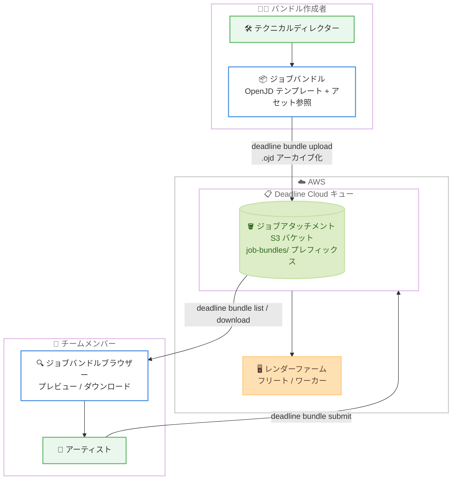

# AWS Deadline Cloud - ジョブバンドル共有機能

**リリース日**: 2026 年 9 月 1 日
**サービス**: AWS Deadline Cloud
**機能**: ジョブバンドルのキュー共有 (Job Bundle Sharing)

📊 [このアップデートのインフォグラフィックを見る](https://takech9203.github.io/aws-news-summary/20260901-job-bundle-sharing.html)

## 概要

AWS Deadline Cloud が、ジョブバンドルをキュー上で共有する機能をサポートしました。ジョブバンドルは、Open Job Description (OpenJD) テンプレート、ジョブパラメータ、アセット参照をまとめたレンダージョブの定義パッケージであり、今回のアップデートにより、手動でのファイル配布なしにチーム間でレンダージョブテンプレートを配布・再利用できるようになりました。

共有されたバンドルは、キューの既存のジョブアタッチメント用 S3 バケットにポータブルなアーカイブ (`.ojd` ファイル) として保存されるため、追加のインフラストラクチャや設定は不要です。サブミッターまたはコマンドラインから直接キューにバンドルを公開でき、キューにジョブを送信できるチームメンバーは誰でも、共有バンドルの参照、ダウンロード、送信が可能です。

このアップデートは、視覚効果 (VFX)、アニメーション、プロダクトデザイン、シミュレーション、ゲーム開発などのレンダリングワークロードで、複数のアーティストやテクニカルディレクターが共通のジョブテンプレートを利用するチームに特に有用です。

**アップデート前の課題**

以前は、ジョブバンドルをチームで共有するための標準的な仕組みがありませんでした。

- ジョブバンドルの配布には、共有ドライブや手動でのファイルコピーが必要だった
- テンプレートのバージョン管理や最新版の把握がチーム内で困難だった
- パイプラインスクリプトからバンドルを配布・取得する標準的な方法がなかった

**アップデート後の改善**

今回のアップデートにより、以下が可能になりました。

- サブミッターまたは CLI から、ジョブバンドルをキューに直接公開できるようになった
- 共有バンドルはキューの既存のジョブアタッチメント S3 バケットに保存されるため、追加のインフラや権限設定が不要になった
- ジョブバンドルブラウザーで、キュー上のバンドル、ローカルファイルシステム、送信履歴からバンドルを参照し、名前・説明・ステップ・パラメータをプレビューできるようになった
- 新しい CLI コマンド (`deadline bundle upload` など) により、パイプラインスクリプトへの統合が容易になった

## アーキテクチャ図



バンドル作成者が CLI またはサブミッターからジョブバンドルを `.ojd` アーカイブとしてキューの S3 バケットに公開し、チームメンバーがジョブバンドルブラウザーや CLI で参照・ダウンロード・送信するフローを示しています。

## サービスアップデートの詳細

### 主要機能

1. **キューへのバンドル公開**
   - サブミッターのジョブ送信ダイアログで [Save bundle as] を選択し、保存先に [Queue] を指定して公開できる
   - CLI では `deadline bundle upload` コマンドでバンドルディレクトリをアップロードできる
   - コマンドがディレクトリを `.ojd` アーカイブにパッケージ化し、S3 へのアップロードまで自動で行う
   - デフォルトではバンドルディレクトリ名が共有バンドル名になり、`--name` オプションで別名を指定できる

2. **既存インフラの活用**
   - 共有バンドルは、キューのジョブアタッチメント S3 バケットの `job-bundles/` フォルダ (例: `s3://amzn-s3-demo-bucket/DeadlineCloud/job-bundles/`) に保存される
   - 追加のインフラストラクチャや権限設定は不要
   - キューにジョブを送信できるユーザーは、そのまま共有バンドルの参照・ダウンロード・送信が可能

3. **ジョブバンドルブラウザーによる参照とプレビュー**
   - キュー上の共有バンドル、ローカルファイルシステム、送信履歴からバンドルを参照できる
   - 送信前にバンドルの名前、説明、ステップ、パラメータをプレビューできる
   - ワークステーション単位でバンドルの表示 / 非表示を切り替えられる (非表示はローカル設定であり、キュー上のバンドルには影響しない)

4. **パイプライン統合向けの新しい CLI コマンド**
   - `deadline bundle list --queue`: キュー上の共有バンドルを一覧表示
   - `deadline bundle info <name> --queue`: バンドルの名前・説明・ステップ・パラメータを表示
   - `deadline bundle download <name> -o <dir>`: 共有バンドルをダウンロード (ダウンロードはキャッシュされ、変更がなければローカルコピーを再利用)
   - `deadline bundle hide / unhide <name>`: ローカルでの表示 / 非表示を切り替え

## 技術仕様

### 共有バンドルの構成

| 項目 | 詳細 |
|------|------|
| アーカイブ形式 | `.ojd` ファイル (ジョブバンドルディレクトリをパッケージ化した単一アーカイブ) |
| 含まれる内容 | OpenJD テンプレート、アセット参照、スクリプトやデータファイル |
| 保存先 | キューのジョブアタッチメント S3 バケットの `job-bundles/` プレフィックス |
| アクセス制御 | キューへのジョブ送信権限を持つユーザーが参照・ダウンロード・送信可能 |
| 追加インフラ | 不要 (既存のジョブアタッチメント設定を利用) |
| キャッシュ | ダウンロードはローカルにキャッシュされ、変更がない場合は再利用される |

### 主要 CLI コマンド

```bash
# バンドルをキューに公開 (ディレクトリを .ojd 化してアップロード)
deadline bundle upload /path/to/job/bundle

# 別名を付けて公開
deadline bundle upload /path/to/job/bundle --name my_render_job_v2

# キュー上の共有バンドルを一覧表示
deadline bundle list --queue

# バンドルの詳細 (名前、説明、ステップ、パラメータ) を表示
deadline bundle info my_render_job --queue

# バンドルをダウンロードして送信
deadline bundle download my_render_job -o ~/job-bundles
deadline bundle submit ~/job-bundles/my_render_job
```

## 設定方法

### 前提条件

1. ジョブバンドル (OpenJD テンプレート) を作成済みであること
2. Deadline Cloud CLI をインストールし、デフォルトのファームとキューを設定済みであること (または各コマンドに `--farm-id` と `--queue-id` を指定)
3. キューにジョブアタッチメントを設定済みであること

### 手順

#### ステップ 1: ジョブバンドルをキューに公開する

```bash
deadline bundle upload /path/to/job/bundle
```

バンドルディレクトリを `.ojd` アーカイブとしてパッケージ化し、キューのジョブアタッチメント S3 バケットの `job-bundles/` フォルダにアップロードします。サブミッターの GUI から公開する場合は、ジョブ送信ダイアログで [Save bundle as] を選択し、名前を入力して保存先に [Queue] を選択します。

#### ステップ 2: 共有バンドルを確認する

```bash
deadline bundle list --queue
deadline bundle info my_render_job --queue
```

`list` コマンドでキュー上の共有バンドルを一覧表示し、`info` コマンドで OpenJD テンプレートに定義された名前、説明、ステップ、パラメータを送信前に確認します。

#### ステップ 3: 共有バンドルをダウンロードして送信する

```bash
deadline bundle download my_render_job -o ~/job-bundles
deadline bundle submit ~/job-bundles/my_render_job
```

`download` コマンドで共有バンドルを指定ディレクトリに展開し、`submit` コマンドで通常のジョブバンドルと同様にジョブを送信します。`-o` オプションを省略した場合はローカルキャッシュにダウンロードされ、パスが表示されます。

## メリット

### ビジネス面

- **チームの生産性向上**: 検証済みのレンダージョブテンプレートをチーム全体で即座に再利用でき、アーティストごとのセットアップ作業を削減できる
- **運用コストの削減**: 共有ドライブの管理や手動でのファイル配布が不要になり、テンプレート配布に関する運用負荷を軽減できる
- **標準化の促進**: キューを単位として承認済みのジョブテンプレートを配布でき、スタジオ内のワークフロー標準化を進めやすくなる

### 技術面

- **追加インフラ不要**: 既存のジョブアタッチメント S3 バケットをそのまま利用するため、新しいバケットや IAM 権限の追加設定が不要
- **パイプライン統合が容易**: `deadline bundle` サブコマンド群により、CI/CD やパイプラインスクリプトからバンドルの公開・取得を自動化できる
- **効率的なダウンロード**: ダウンロードキャッシュにより、変更のないバンドルの再取得を回避し、転送量と待ち時間を削減できる

## デメリット・制約事項

### 制限事項

- 共有バンドルの利用には、キューにジョブアタッチメントが設定されている必要がある
- アクセス制御はキュー単位であり、キューにジョブを送信できるユーザーは全員が共有バンドルにアクセスできる (バンドル単位の細かなアクセス制御は提供されない)
- `hide` / `unhide` によるバンドルの非表示はワークステーションローカルの設定であり、キュー上の他のユーザーの表示には影響しない

### 考慮すべき点

- 同名のバンドルをダウンロードすると既存のローカルコピーが置き換えられるため、ローカルでの編集内容の管理に注意が必要
- バンドル名によるバージョン管理 (例: `--name my_render_job_v2`) の運用ルールをチーム内で決めておくことが望ましい
- 共有バンドルは S3 に保存されるため、バンドルに含まれるスクリプトやデータファイルのサイズに応じた S3 ストレージコストが発生する

## ユースケース

### ユースケース 1: VFX スタジオでの承認済みテンプレート配布

**シナリオ**: テクニカルディレクターが検証済みのレンダリング設定を持つジョブバンドルを作成し、プロジェクトのアーティスト全員に配布したい。

**実装例**:
```bash
# テクニカルディレクターが承認済みバンドルをキューに公開
deadline bundle upload ./approved_render_setup --name project_x_render_v1
```

**効果**: アーティストはジョブバンドルブラウザーからバンドルを選択してプレビューし、そのまま送信できるため、設定ミスによる再レンダリングを削減できます。

### ユースケース 2: パイプラインスクリプトからの自動配布

**シナリオ**: パイプラインチームが、ジョブテンプレートの更新を CI/CD パイプラインで自動的にキューへ配布したい。

**実装例**:
```bash
# CI/CD パイプライン内でテンプレート更新を自動公開
deadline bundle upload ./templates/comp_render \
  --name comp_render_latest \
  --farm-id farm-xxxx --queue-id queue-yyyy
```

**効果**: テンプレートの更新がリポジトリへのマージと同時にキューへ反映され、チームメンバーは常に最新のテンプレートを利用できます。

### ユースケース 3: 送信履歴からのジョブ再利用

**シナリオ**: アーティストが過去に送信したジョブと同じ設定で、パラメータのみ変更して再送信したい。

**実装例**:
```bash
# 共有バンドルをダウンロードしてパラメータを変更して送信
deadline bundle download my_render_job
deadline bundle submit <ダウンロードされたパス> -p FrameRange=1-100
```

**効果**: 送信履歴やキュー上のバンドルから過去のジョブ設定を再利用でき、繰り返し作業の効率が向上します。

## 料金

ジョブバンドル共有機能自体に追加料金はありません。共有バンドルはキューのジョブアタッチメント S3 バケットに保存されるため、通常の Amazon S3 のストレージ料金およびリクエスト / データ転送料金が適用されます。Deadline Cloud 自体の料金は、使用したコンピューティングリソースとライセンスに基づく従量課金です。

詳細は [AWS Deadline Cloud の料金ページ](https://aws.amazon.com/deadline-cloud/pricing/) を参照してください。

## 利用可能リージョン

AWS Deadline Cloud が利用可能なすべての AWS リージョンで利用できます。

## 関連サービス・機能

- **Amazon S3**: 共有バンドルの保存先。キューのジョブアタッチメント用バケットの `job-bundles/` プレフィックスにアーカイブが保存される
- **Open Job Description (OpenJD)**: ジョブバンドルのテンプレート仕様。共有バンドルのプレビュー情報 (名前、説明、ステップ、パラメータ) は OpenJD テンプレートから取得される
- **Deadline Cloud ジョブアタッチメント**: ジョブのアセットファイルを共有する既存機能。今回の共有バンドル機能はこの仕組みの上に構築されている

## 参考リンク

- 📊 [インフォグラフィック](https://takech9203.github.io/aws-news-summary/20260901-job-bundle-sharing.html)
- [公式発表 (What's New)](https://aws.amazon.com/about-aws/whats-new/2026/09/deadline-cloud/job-bundle-sharing)
- [ドキュメント: Share job bundles on your queue](https://docs.aws.amazon.com/deadline-cloud/latest/developerguide/share-job-bundles.html)
- [ドキュメント: Load and submit shared job bundles](https://docs.aws.amazon.com/deadline-cloud/latest/userguide/jobs-shared-bundles.html)
- [料金ページ](https://aws.amazon.com/deadline-cloud/pricing/)

## まとめ

AWS Deadline Cloud のジョブバンドル共有機能により、レンダージョブテンプレートの配布が既存のキューと S3 バケットだけで完結するようになりました。追加のインフラや権限設定なしに導入できるため、Deadline Cloud を利用中のチームは、まず承認済みテンプレートを `deadline bundle upload` でキューに公開し、ジョブバンドルブラウザーからの利用を試すことを推奨します。
