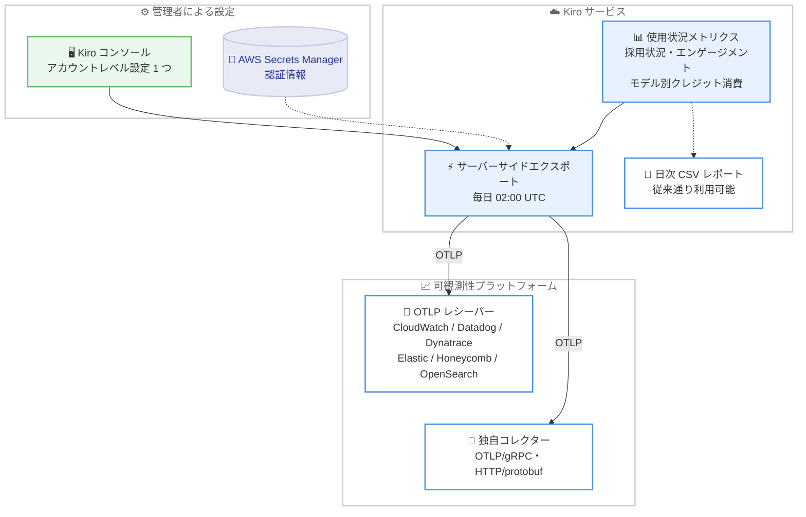

# Kiro - 使用状況メトリクスの OpenTelemetry エクスポート

**リリース日**: 2026 年 9 月 1 日
**サービス**: Kiro
**機能**: Export Kiro usage metrics to OpenTelemetry

📊 [このアップデートのインフォグラフィックを見る](https://takech9203.github.io/aws-news-summary/20260901-kiro-changelog-2026-09-01.html)

## 概要

Kiro は、アカウント管理者がユーザー単位の Kiro 使用状況メトリクスを OpenTelemetry 互換の可観測性プラットフォームへ送信できる機能を発表しました。採用状況 (アダプション)、エンゲージメント、ユーザー別・モデル別のクレジット消費を、個々の開発者環境に設定を加えることなくモニタリングできます。

エクスポートは OTLP (OpenTelemetry Protocol) を使用し、既存の日次 CSV レポートと併用可能です。Amazon CloudWatch、Datadog、Dynatrace、Elastic、Honeycomb、OpenSearch などのプラットフォームに OTLP レシーバー経由で接続できるほか、OTLP/gRPC または HTTP/protobuf を使用して独自のコレクターにも接続できます。Kiro を組織で導入している管理者が、既存のダッシュボードやモニタリングワークフローに Kiro のメトリクスを直接統合したい場合に有用なアップデートです。

**アップデート前の課題**

このアップデート以前は、Kiro の使用状況の把握に以下の課題がありました。

- 使用状況の確認手段は日次 CSV レポートが中心で、組織の可観測性プラットフォームへの取り込みには CSV の取得・変換・ロードを行う独自の仕組みが必要だった
- Datadog や Amazon CloudWatch などの既存ダッシュボードで、他のシステムメトリクスと並べて Kiro の利用状況を継続的に可視化することが難しかった
- ユーザー別・モデル別のクレジット消費をリアルタイムに近い形でモニタリングワークフローに組み込むことができなかった

**アップデート後の改善**

今回のアップデートにより、以下が可能になりました。

- ユーザー単位の使用状況メトリクス (採用状況、エンゲージメント、モデル別クレジット消費) を OpenTelemetry 互換プラットフォームへ直接送信できるようになった
- Kiro コンソールでアカウントレベルのエクスポートを 1 つ設定するだけでよく、個々の開発者環境の設定変更が不要になった
- メトリクスは毎日 02:00 UTC にサーバーサイドから配信され、既存の日次 CSV レポートと併用しながらダッシュボードやアラートに統合できるようになった

## アーキテクチャ図



Kiro のサーバーサイドが毎日 02:00 UTC に使用状況メトリクスを集約し、OTLP 経由で各種可観測性プラットフォームまたは独自コレクターへ配信するフローを示しています。

## サービスアップデートの詳細

### 主要機能

1. **ユーザー単位の使用状況メトリクスのエクスポート**
   - 採用状況 (アダプション)、エンゲージメント、クレジット消費をユーザー別・モデル別に送信
   - 個々の開発者環境に設定を加える必要がなく、管理者側の設定のみで完結
   - 既存の日次 CSV レポートと併用可能で、段階的な移行や使い分けができる

2. **幅広い可観測性プラットフォームとの接続**
   - Amazon CloudWatch、Datadog、Dynatrace、Elastic、Honeycomb、OpenSearch などに OTLP レシーバー経由で接続
   - 独自のコレクターには OTLP/gRPC または HTTP/protobuf で接続可能
   - OpenTelemetry 互換であれば、上記以外のプラットフォームにも柔軟に対応

3. **シンプルなアカウントレベル設定**
   - Kiro コンソールでアカウントレベルのエクスポート設定を 1 つ作成するだけで有効化
   - 認証情報は AWS Secrets Manager のシークレットとして管理
   - メトリクスは毎日 02:00 UTC にサーバーサイドから自動配信

## 技術仕様

### エクスポート仕様

| 項目 | 詳細 |
|------|------|
| プロトコル | OTLP (OTLP/gRPC または HTTP/protobuf) |
| 対象メトリクス | 採用状況、エンゲージメント、ユーザー別・モデル別クレジット消費 |
| 配信方式 | サーバーサイドからのプッシュ配信 (開発者環境の設定不要) |
| 配信頻度 | 毎日 02:00 UTC |
| 設定単位 | アカウントレベルで 1 つ |
| 認証情報の管理 | AWS Secrets Manager のシークレット |
| エンドポイント要件 | パブリックに到達可能な OTLP エンドポイント |
| 接続先の例 | Amazon CloudWatch、Datadog、Dynatrace、Elastic、Honeycomb、OpenSearch、独自コレクター |
| 既存機能との関係 | 日次 CSV レポートと併用可能 |

## 設定方法

### 前提条件

1. Kiro のアカウント管理者権限を持っていること
2. OpenTelemetry 互換の可観測性プラットフォームまたは OTLP コレクターの、パブリックに到達可能な OTLP エンドポイントを用意していること
3. 接続先の認証情報を AWS Secrets Manager のシークレットとして作成できること

### 手順

#### ステップ 1: 接続先の OTLP エンドポイントを準備する

利用する可観測性プラットフォーム (Amazon CloudWatch、Datadog など) の OTLP レシーバー、または独自の OpenTelemetry コレクターのエンドポイントを用意します。エンドポイントは Kiro のサーバーサイドから到達できるよう、パブリックにアクセス可能である必要があります。

#### ステップ 2: AWS Secrets Manager にシークレットを作成する

```bash
# 接続先プラットフォームの認証情報をシークレットとして保存する例
aws secretsmanager create-secret \
  --name kiro-otel-export-credentials \
  --secret-string '{"api-key":"<接続先の API キーなど>"}'
```

このコマンドは、OTLP エンドポイントへの認証に使用する情報を AWS Secrets Manager のシークレットとして保存します。実際に必要なキー名や値は、接続先プラットフォームの認証方式に合わせて設定します。

#### ステップ 3: Kiro コンソールでエクスポートを設定する

Kiro コンソールで、アカウントレベルの OpenTelemetry エクスポート設定を 1 つ作成します。OTLP エンドポイントの URL と、ステップ 2 で作成した AWS Secrets Manager のシークレットを指定します。設定完了後、メトリクスは毎日 02:00 UTC にサーバーサイドから自動的に配信されます。詳細な手順は [公式ドキュメント](https://kiro.dev/docs/enterprise/monitor-and-track/user-activity/opentelemetry/) を参照してください。

## メリット

### ビジネス面

- **導入効果の可視化**: 組織内での Kiro の採用状況やエンゲージメントをユーザー単位で継続的に把握でき、AI コーディングツール導入の投資対効果を評価しやすくなる
- **コスト管理の強化**: ユーザー別・モデル別のクレジット消費をダッシュボードで監視でき、予算超過の早期検知やチーム間のコスト配分の判断に活用できる
- **運用負荷の削減**: CSV の取得・変換・ロードを行う独自の仕組みが不要になり、管理者の運用工数を削減できる

### 技術面

- **既存の可観測性スタックとの統合**: OpenTelemetry 標準に準拠しているため、CloudWatch や Datadog など既に運用中のプラットフォームにベンダーロックインなく統合できる
- **開発者環境への影響ゼロ**: サーバーサイドからの配信のため、各開発者の IDE や端末に設定やエージェントを追加する必要がない
- **アラートや自動化への応用**: メトリクスがモニタリング基盤に入ることで、クレジット消費の閾値アラートや利用状況レポートの自動生成といった既存のワークフローを再利用できる

## デメリット・制約事項

### 制限事項

- OTLP エンドポイントはパブリックに到達可能である必要があり、プライベートネットワーク内に閉じたコレクターには直接配信できない
- メトリクスの配信は毎日 02:00 UTC の 1 回であり、リアルタイムのストリーミング配信ではない
- エクスポート設定はアカウントレベルで 1 つのため、複数の宛先へ同時に直接配信する場合は独自コレクターでのルーティングなどの工夫が必要

### 考慮すべき点

- 認証情報の管理に AWS Secrets Manager を使用するため、AWS アカウントとシークレットの管理体制が必要
- ユーザー単位のメトリクスを外部プラットフォームへ送信するため、組織のプライバシーポリシーやデータ取り扱い規程との整合性を事前に確認することが望ましい
- Secrets Manager のシークレット保管や接続先プラットフォーム側の取り込みに伴う費用が別途発生する可能性がある

## ユースケース

### ユースケース 1: CloudWatch ダッシュボードでの全社利用状況の可視化

**シナリオ**: AWS を主要基盤とする企業が、Kiro の全社導入の進捗をユーザー単位で追跡し、既存の CloudWatch ダッシュボードで他の開発メトリクスと並べて確認したい。

**実装例**:
```
1. CloudWatch の OTLP エンドポイントを用意する
2. 認証情報を AWS Secrets Manager のシークレットとして作成する
3. Kiro コンソールでエンドポイントとシークレットを指定してエクスポートを設定する
4. CloudWatch ダッシュボードに採用状況・エンゲージメントのウィジェットを追加する
```

**効果**: 導入推進チームが毎日更新される利用状況を一目で確認でき、利用が低調なチームへのフォローアップを迅速に実施できる。

### ユースケース 2: Datadog でのモデル別クレジット消費のアラート運用

**シナリオ**: 可観測性基盤として Datadog を利用している組織が、ユーザー別・モデル別のクレジット消費を監視し、想定以上の消費を早期に検知したい。

**実装例**:
```
1. Datadog の OTLP レシーバーへのエクスポートを Kiro コンソールで設定する
2. モデル別クレジット消費のメトリクスに対してモニターを作成する
3. 日次配信後に閾値を超えたユーザーやモデルがあれば Slack へ通知する
```

**効果**: クレジットの予算超過を翌日には検知でき、高コストなモデルの使い方に関するガイドラインの周知など、早期の是正アクションにつなげられる。

### ユースケース 3: 独自 OpenTelemetry コレクターによる複数宛先への配信

**シナリオ**: メトリクスを長期保管用の OpenSearch と、リアルタイム監視用の商用プラットフォームの両方に取り込みたい組織が、配信を一元管理したい。

**実装例**:
```
1. パブリックに到達可能な OpenTelemetry コレクターを構築する
2. Kiro コンソールからコレクターへ OTLP/gRPC でエクスポートを設定する
3. コレクターのパイプラインで OpenSearch と商用プラットフォームの両方へルーティングする
```

**効果**: アカウントレベルの設定は 1 つのまま、複数の宛先へのメトリクス配信とフィルタリングや変換を柔軟に制御できる。

## 料金

このエクスポート機能自体の追加料金に関する記載は Changelog にはありません。ただし、AWS Secrets Manager のシークレット保管や、接続先の可観測性プラットフォーム側でのメトリクス取り込み・保管には、各サービスの料金が適用される場合があります。Kiro 自体の料金は [Kiro の料金ページ](https://kiro.dev/pricing/) を参照してください。

## 利用可能リージョン

グローバル (Kiro はグローバルサービスとして提供)

## 関連サービス・機能

- **AWS Secrets Manager**: エクスポート先への認証情報をシークレットとして安全に管理するために使用
- **Amazon CloudWatch**: OTLP レシーバー経由で Kiro メトリクスを取り込み、ダッシュボードやアラームで活用可能
- **Amazon OpenSearch Service**: メトリクスの長期保管・分析基盤として OTLP 経由で連携可能
- **OpenTelemetry Collector**: 独自コレクターとして OTLP/gRPC または HTTP/protobuf で受信し、複数宛先へのルーティングに活用可能

## 参考リンク

- 📊 [インフォグラフィック](https://takech9203.github.io/aws-news-summary/20260901-kiro-changelog-2026-09-01.html)
- [Kiro Changelog](https://kiro.dev/changelog/)
- [Changelog エントリ: Export Kiro usage metrics to OpenTelemetry](https://kiro.dev/changelog/general/open-telemetry-exports/)
- [ドキュメント: OpenTelemetry によるユーザーアクティビティのモニタリング](https://kiro.dev/docs/enterprise/monitor-and-track/user-activity/opentelemetry/)
- [Kiro ドキュメント](https://kiro.dev/docs/)

## まとめ

Kiro の使用状況メトリクスを OpenTelemetry 経由で既存の可観測性プラットフォームに直接統合できるようになり、組織での AI コーディングツールの採用状況とコストの継続的なモニタリングが大幅に容易になりました。Kiro を組織導入している管理者は、まず AWS Secrets Manager のシークレットとパブリックな OTLP エンドポイントを準備し、Kiro コンソールでアカウントレベルのエクスポート設定を試すことを推奨します。
