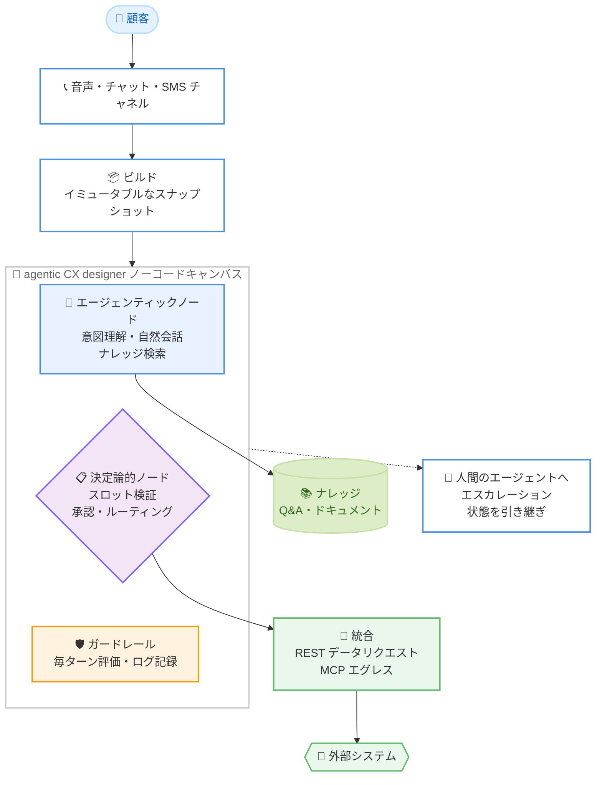

# Amazon Connect Customer - agentic CX designer の一般提供開始

**リリース日**: 2026 年 9 月 2 日
**サービス**: Amazon Connect Customer
**機能**: agentic CX designer (エージェンティック CX デザイナー)

📊 [このアップデートのインフォグラフィックを見る](https://takech9203.github.io/aws-news-summary/20260902-agentic-cx-designer.html)

## 概要

AWS は、Amazon Connect Customer の新機能である **agentic CX designer** の一般提供 (GA) を発表しました。agentic CX designer は、AI を活用したセルフサービス体験を設計・デプロイするためのノーコードキャンバスです。Amazon Connect Customer は、エンタープライズ向けの顧客体験 (CX) を実現するエージェンティック AI ソリューションであり、本機能はその中核となる設計ツールです。

最大の特徴は、「フローチャートの明確さと大規模言語モデル (LLM) のパワー」を 1 つのビジュアルキャンバスで融合している点です。自然な会話や意図理解はエージェンティック AI に任せつつ、資格確認、承認、ルーティング、コンプライアンスといった正確な結果が求められる処理は、決定論的 (deterministic) なワークフローとして定義できます。モデルの出力が決定論的ノードと矛盾する場合は、モデルではなくフローが常に優先されるため、制御性と信頼性を保ちながら柔軟な会話体験を提供できます。

構築、テスト、デプロイまでを 1 つの環境で完結できるため、コードやエンジニアリングチームへの引き継ぎなしに、数ヶ月ではなく数週間で本番稼働可能な体験をリリースできるとされています。音声チャネルとデジタルチャネルの両方に対応します。

**アップデート前の課題**

- LLM を活用した会話型セルフサービスは柔軟だが、資格確認やコンプライアンス開示など、厳密さが求められる処理で出力を完全に制御することが難しかった
- 会話 AI の構築には、プロンプト設計、ガードレール、外部システム連携、テストなどでエンジニアリングチームの関与が必要で、リリースまでに数ヶ月かかることがあった
- 会話フローの設計、テスト、デプロイ、分析が別々のツールに分かれており、CX 担当者だけで改善サイクルを回すことが難しかった

**アップデート後の改善**

- エージェンティックノードと決定論的ノードを同一キャンバス上で組み合わせ、柔軟性と制御性を両立した会話体験をノーコードで設計できるようになった
- ビジネスロジック、ガードレール、システム連携をキャンバス上で定義し、自然な会話はモデルに任せる分業が可能になった
- 構築からテスト、デプロイ、分析までを 1 つの環境で完結でき、コード不要で数週間での本番リリースが可能になった

## アーキテクチャ図



agentic CX designer では、エージェンティックノードと決定論的ノードを同一キャンバス上で組み合わせ、ガードレールが毎ターン評価される構成で、音声・チャット・SMS の各チャネルに単一のビルドから体験を提供します。

## サービスアップデートの詳細

### 主要機能

1. **ビジュアルキャンバスによるノーコード設計**
   - 約 15 種類のノードを組み合わせて会話体験を設計できる
   - フローチャートのような明確さで、LLM を活用した会話ロジックを表現できる
   - ステップごとに異なるモデル (低レイテンシー重視、推論性能重視など) を割り当て可能

2. **エージェンティック AI と決定論的ワークフローの融合**
   - エージェンティックノード (Generative Journey) が意図理解、自然な会話、トーン調整、ツール選択、ナレッジ検索を担当
   - 決定論的ノードは、正規表現による検証、リトライ回数、エスカレーションパスを持つスロットで、本人確認や与信判定、コンプライアンス開示など厳密さが必要な処理を担当
   - 日付、メールアドレス、電話番号などの組み込みスロットタイプと、制約付きの値を扱うカスタムスロットタイプを提供
   - モデル出力と決定論的ノードが矛盾する場合は、常にフローが優先される

3. **ガードレールと監査**
   - ガードレールは毎ターン評価され、ログに記録される
   - プロンプトインジェクションの試行を含め、何が評価され、通過・ブロックされたかをターン単位で可視化
   - ガードレール評価と監査ログ (実行者、タイムスタンプ、リソース) はコンプライアンス用途でエクスポート可能

4. **外部システム統合**
   - REST データリクエスト: GET/POST/PUT/DELETE に対応し、認証、ペイロード、エラーハンドリングを設定可能
   - MCP エグレス: 登録した Model Context Protocol エンドポイント経由でツールを直接呼び出し可能 (Lambda や API Gateway の中間層が不要)
   - シークレットはノードにハードコードせず、ワークスペースレベルで管理
   - CX 担当者が会話を設計し、プラットフォーム管理者がエンドポイントや認証情報を管理する職務分掌が可能

5. **テストとデバッグ**
   - キャンバス内テスト: アプリケーション、フロー、ルーティング、保存済みリグレッションテストの 4 モード
   - ターンごとのデバッガーで、ノードの入出力、スロット値、モデルの推論、ガードレール判定、ナレッジ検索、データリクエストのペイロードを確認可能
   - コンタクトパス全体のシミュレーションでは、自然言語によるテストケース、外部システムのモック、セマンティックマッチング、DTMF/テキスト入力のシミュレーションに対応

6. **ビルドによるデプロイ管理**
   - 公開時に、フロー、設定、ガードレール割り当てのイミュータブルなスナップショットである「ビルド」を作成
   - ビルド間の比較、レビューゲート、ワンアクションでのロールバックが可能
   - 1 つのビルドで音声、チャット、SMS の複数チャネルに対応

7. **分析と最適化**
   - デザインキャンバス上にトラフィックと離脱率のメトリクスをオーバーレイ表示
   - 会話分析により、コンタクトごとにモデルの推論、ナレッジ検索、ハンドオフポイントを追跡可能
   - エスカレーション時にはスロット、変数、ツール実行結果などの状態を人間のエージェントに引き継ぎ、顧客が最初からやり直す必要がない

## 技術仕様

### 主要コンポーネント

| 項目 | 詳細 |
|------|------|
| agentic CX designer | 約 15 種類のノードを持つノーコードキャンバス。ステップごとにモデルを選択可能 |
| Live Sync | 音声会話と画面表示をリアルタイムに同期。通話中に顧客の画面に選択肢を表示し、タップ操作をフローに反映 |
| Touchpoint | チャット、アプリ内音声、Live Sync カードを Web サイトやアプリに組み込むクライアント SDK |
| エージェンティック音声 | 50 以上の言語、100 以上の音声に対応。割り込み、感情トーンの変化、会話中の言語切り替えに対応 |
| ナレッジ | Q&A エントリとドキュメントアップロードに対応。モデルの学習データではなく、承認済みコンテンツから回答を検索 |
| 統合 | REST データリクエストと MCP エグレスに対応 |
| チャネル | 音声、チャット、SMS (単一ビルドで提供) |

## 設定方法

### 前提条件

1. Amazon Connect Customer が利用可能な AWS アカウント
2. 利用可能リージョン (東京リージョンを含む 9 リージョン) での利用
3. 外部システム統合を行う場合は、接続先エンドポイントと認証情報 (プラットフォーム管理者が管理)

### 手順

#### ステップ 1: キャンバスで会話体験を設計する

agentic CX designer のビジュアルキャンバスを開き、エージェンティックノードと決定論的ノードを組み合わせて会話フローを設計します。自然な会話が必要な部分にはエージェンティックノードを、本人確認やコンプライアンス開示など厳密さが必要な部分には決定論的ノードとスロット検証を配置します。

#### ステップ 2: ガードレールと統合を設定する

会話に適用するガードレールを定義し、REST データリクエストまたは MCP エグレスで外部システムとの連携を設定します。認証情報はワークスペースレベルのシークレットとして管理します。

#### ステップ 3: テストを実施する

キャンバス内のテストモード (アプリケーション、フロー、ルーティング、リグレッション) とターンごとのデバッガーで動作を検証します。変更は再デプロイなしで即座に反映されます。さらに、コンタクトパス全体のシミュレーションでルーティングや音声ブロック、キュー設定を検証します。

#### ステップ 4: ビルドを公開してデプロイする

公開操作によりイミュータブルなビルドを作成し、レビューを経て本番環境にデプロイします。問題が発生した場合はワンアクションでロールバックできます。

## メリット

### ビジネス面

- **リリース期間の短縮**: コードやエンジニアリングチームへの引き継ぎなしに、数ヶ月ではなく数週間で本番稼働可能なセルフサービス体験を構築できる
- **CX 担当者主導の改善サイクル**: 設計、テスト、デプロイ、分析が 1 つの環境で完結するため、CX 担当者が自律的に体験を改善できる
- **コンプライアンス対応**: ガードレール評価と監査ログのエクスポートにより、規制要件への対応を支援

### 技術面

- **制御性と柔軟性の両立**: 決定論的ノードが常に優先されるため、LLM の柔軟性を活かしつつ、厳密な業務ロジックを保証できる
- **中間層不要の統合**: MCP エグレスにより、Lambda や API Gateway を介さずに外部ツールを直接呼び出せる
- **安全なデプロイ**: イミュータブルなビルド、レビューゲート、ワンアクションのロールバックにより、変更を安全に管理できる

## デメリット・制約事項

### 制限事項

- 利用可能リージョンは 9 リージョンに限定される (2026 年 9 月時点)
- Amazon Connect Customer の一部として提供されるため、Amazon Connect Customer の利用が前提となる

### 考慮すべき点

- どの処理をエージェンティックノードに任せ、どの処理を決定論的ノードで厳密に制御するかの設計判断が体験品質を左右する
- ガードレールやテストが提供されるとはいえ、本番リリース前にリグレッションテストとコンタクトパス全体のシミュレーションを十分に実施することが推奨される
- 外部システム統合では、エンドポイントや認証情報の管理をプラットフォーム管理者側で整備する必要がある

## ユースケース

### ユースケース 1: 障害問い合わせのセルフサービス対応

**シナリオ**: 通信事業者や公共事業者で、サービス障害発生時に問い合わせが急増する。障害状況の案内、影響確認、復旧見込みの提示をセルフサービス化したい。

**実装例**:
```
1. エージェンティックノードで顧客の意図を理解し、自然な会話で状況をヒアリング
2. 決定論的ノードで顧客の契約情報と障害影響範囲を照合
3. REST データリクエストで障害管理システムから最新の復旧見込みを取得
4. Live Sync で通話中に顧客の画面へ選択肢や手順を表示
```

**効果**: 数ヶ月かかっていた構築を数日から数週間に短縮し、顧客は情報を繰り返し伝えることなく短時間で問題を解決できる。

### ユースケース 2: コンプライアンス開示を伴う金融手続き

**シナリオ**: 金融機関で、与信判定や規約への同意取得など、正確性と記録が求められる手続きを会話型で提供したい。

**実装例**:
```
1. 決定論的ノードのスロット検証で本人確認 (正規表現による検証、リトライ回数、エスカレーションパスを定義)
2. 規約開示は決定論的ノードで必ず所定の文言を提示
3. ガードレール評価と監査ログをエクスポートし、コンプライアンス記録として保管
```

**効果**: モデルが即興で回答することを防ぎ、必ずフローに従った正確な開示と記録を実現できる。

### ユースケース 3: 会話体験の継続的な最適化

**シナリオ**: 既存のセルフサービス体験で特定ステップの離脱率が高い。原因を特定し、迅速に改善したい。

**実装例**:
```
1. キャンバス上の分析オーバーレイでトラフィックと離脱率を確認
2. 離脱率の高いステップの文言を修正
3. リグレッションテストで既存動作を検証後、新しいビルドを公開
```

**効果**: AWS Blog の例では、規約開示プロンプトの文言変更により、該当ステップの離脱率が数日で 28% から 9% に改善したと紹介されている。

## 料金

今回の発表には具体的な料金情報は含まれていません。なお、AWS Blog によると、ステップごとのモデル選択にモデル単位・トークン単位の追加料金は発生しないとされています。詳細は Amazon Connect の料金ページを確認してください。

## 利用可能リージョン

以下の 9 リージョンで一般提供されています。

- 米国東部 (バージニア北部)
- 米国西部 (オレゴン)
- カナダ (中部)
- アジアパシフィック (東京)
- アジアパシフィック (ソウル)
- アジアパシフィック (シンガポール)
- アジアパシフィック (シドニー)
- 欧州 (フランクフルト)
- 欧州 (ロンドン)

## 関連サービス・機能

- **Amazon Connect**: クラウドベースのコンタクトセンターサービス。Amazon Connect Customer はそのエージェンティック AI ソリューション
- **Amazon Connect Customer Profiles**: 顧客プロファイル管理機能。会話体験でのパーソナライズに活用可能
- **Model Context Protocol (MCP)**: MCP エグレスにより、登録した MCP エンドポイント経由で外部ツールを直接呼び出し可能

## 参考リンク

- 📊 [インフォグラフィック](https://takech9203.github.io/aws-news-summary/20260902-agentic-cx-designer.html)
- [公式発表 (What's New)](https://aws.amazon.com/about-aws/whats-new/2026/09/agentic-cx-designer/)
- [AWS Blog: Blend structured business logic with agentic AI](https://aws.amazon.com/blogs/contact-center/blend-structured-business-logic-with-agentic-ai/)
- [ドキュメント: agentic CX designer](https://docs.aws.amazon.com/connect/latest/adminguide/acxd)
- [ドキュメント: Amazon Connect の概要](https://docs.aws.amazon.com/connect/latest/adminguide/what-is-amazon-connect.html)
- [料金ページ](https://aws.amazon.com/connect/pricing/)

## まとめ

agentic CX designer の GA により、エージェンティック AI の柔軟性と決定論的ワークフローの制御性を 1 つのノーコードキャンバスで両立した顧客体験の構築が可能になりました。東京リージョンを含む 9 リージョンで利用可能なため、コンタクトセンターのセルフサービス化や AI 活用を検討している場合は、キャンバス内テスト機能を使った小規模な検証から始めることを推奨します。
