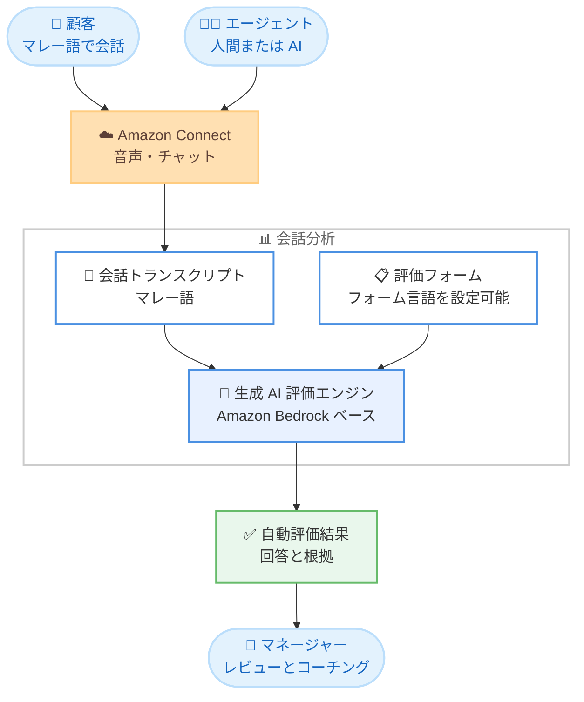

# Amazon Connect Customer - 生成 AI による自動パフォーマンス評価のマレー語対応

**リリース日**: 2026 年 9 月 2 日
**サービス**: Amazon Connect (Connect Customer)
**機能**: 生成 AI による自動パフォーマンス評価のマレー語サポート

📊 [このアップデートのインフォグラフィックを見る](https://takech9203.github.io/aws-news-summary/20260902-amazon-connect-customer-automated-evaluations-malay.html)

## 概要

Amazon Connect Customer は、生成 AI を活用した人間のエージェントおよび AI エージェントの自動パフォーマンス評価において、マレー語の会話をサポートしました。マネージャーは評価基準を自然言語で記述するだけで、マレー語の会話に対する AI 生成の評価結果を、根拠 (ジャスティフィケーション) とともに希望する言語で受け取ることができます。

本機能はクロスリンガル評価にも対応しており、会話がマレー語で行われていても、評価フォームへの回答を英語で完成させることが可能です。これにより、多言語のコンタクトセンターを運営する企業は、言語ごとに評価の仕組みを分けることなく、単一の標準化された評価フレームワークを全言語に適用できます。

**アップデート前の課題**

このアップデート以前に存在していた課題は以下のとおりです。

- 生成 AI による自動評価の対象言語にマレー語が含まれておらず、マレー語の会話は人手による評価が必要だった
- マレーシアやシンガポールなど、マレー語話者の顧客を持つコンタクトセンターでは、評価担当者がマレー語を理解できる必要があり、評価作業がボトルネックになりやすかった
- 言語ごとに評価プロセスが分断され、多言語コンタクトセンター全体で一貫した品質基準を適用することが難しかった

**アップデート後の改善**

今回のアップデートにより、以下が可能になりました。

- マレー語の会話に対して、生成 AI による自動パフォーマンス評価を最大 100% のコンタクトに適用できるようになった
- 評価フォームの言語としてマレー語を明示的に設定でき、AI が生成する回答と根拠をマレー語で一貫して受け取れるようになった
- クロスリンガル評価により、マレー語の会話を英語の評価フォームで評価でき、多言語環境でも標準化された評価フレームワークを利用できるようになった

## アーキテクチャ図



マレー語の会話トランスクリプトを生成 AI が評価フォームの基準に照らして分析し、回答と根拠を自動生成するフローです。評価フォームの言語設定により、マレー語または英語で評価結果を受け取ることができます。

## サービスアップデートの詳細

### 主要機能

1. **マレー語会話の自動評価**
   - 生成 AI が会話トランスクリプトを分析し、評価フォームの質問に自動で回答する
   - 人間のエージェントと AI エージェントの両方の会話を評価対象にできる
   - 回答には根拠と、トランスクリプト内の該当箇所への参照が付与され、コーチングに活用できる

2. **評価フォームの言語設定**
   - 評価フォームの「Additional settings」タブで「Form language」を設定できる
   - フォーム言語を明示的に設定することで、AI 生成の回答と根拠を希望する言語で一貫して受け取れる
   - 対応言語は英語、スペイン語、ポルトガル語、フランス語、ドイツ語、イタリア語、中国語、日本語、韓国語、マレー語の 10 言語

3. **クロスリンガル評価**
   - 会話がマレー語であっても、英語の評価フォームで評価を完成させることが可能
   - 多言語コンタクトセンターで、言語をまたいだ標準化された評価フレームワークを利用できる

4. **自然言語による評価基準の定義**
   - マネージャーは各質問の「Instructions to evaluators」に評価基準を自然言語で記述するだけでよい
   - Ask AI ボタンによる回答レコメンデーションと、評価の自動入力・自動送信の両方に対応する

## 技術仕様

### 生成 AI パフォーマンス評価の仕様

| 項目 | 詳細 |
|------|------|
| 基盤技術 | Amazon Bedrock 上に構築 (Bedrock の不正利用検出などの制御が適用される) |
| 評価対象 | 人間のエージェントおよび AI エージェントの会話 |
| 対応フォーム言語 | 英語、スペイン語、ポルトガル語、フランス語、ドイツ語、イタリア語、中国語、日本語、韓国語、マレー語 |
| 自動化範囲 | 最大 100% の顧客対応を自動評価可能 |
| 質問数の上限 | 自動送信される評価では生成 AI による回答は 1 コンタクトあたり最大 10 問 |
| 出力内容 | 回答、根拠、トランスクリプト内の参照箇所 |

### API 変更履歴

本アップデートは既存の生成 AI 評価機能の対応言語拡大であり、関連する API 変更はありません。

## 設定方法

### 前提条件

1. Amazon Connect インスタンスで会話分析 (Contact Lens) が有効化されていること
2. 評価フォームの作成・更新権限、および評価実行の権限が付与されたセキュリティプロファイルを持つこと
3. Ask AI アシスタントを利用する場合は、該当ユーザーに Ask AI の権限を付与すること

### 手順

#### ステップ 1: 評価フォームの言語を設定する

1. Connect Customer の管理画面で評価フォームを作成または更新する
2. 「Additional settings」タブを選択する
3. 「Form language」のドロップダウンから「Malay」を選択する
4. フォームの質問、評価者向けの指示、回答の選択肢をフォーム言語と同じ言語で記述する

フォーム言語と質問の言語を一致させることで、AI の評価精度が最適化されます。

#### ステップ 2: 評価基準を自然言語で記述する

各質問の「Instructions to evaluators」に、回答の判定基準を具体的に記述します。たとえば「エージェントが顧客の本人確認を行った場合は Yes、行わなかった場合は No」のように、各回答選択肢を選ぶ条件を明示します。

#### ステップ 3: 自動評価を有効化する

評価フォーム上で、生成 AI により自動回答する質問を事前設定します。評価者が送信前にレビューする運用と、自動入力・自動送信する運用のいずれかを選択できます。

## メリット

### ビジネス面

- **評価カバレッジの拡大**: マレー語の会話を含め、最大 100% の顧客対応を自動評価でき、サンプリング評価による見落としを減らせる
- **評価工数の削減**: マレー語を理解できる評価担当者への依存が減り、マネージャーは評価作業ではなくコーチングに時間を使える
- **多言語での品質標準化**: クロスリンガル評価により、マレーシアやシンガポールを含む多言語コンタクトセンター全体で単一の評価フレームワークを適用できる

### 技術面

- **自然言語での基準定義**: 評価基準はコードではなく自然言語で記述でき、業務部門が直接メンテナンスできる
- **根拠付きの評価結果**: 回答にはトランスクリプトの参照箇所と根拠が付属し、評価結果の妥当性を検証しやすい
- **Amazon Bedrock の安全性制御**: Bedrock 上に構築されているため、責任ある AI 利用のための制御が適用される

## デメリット・制約事項

### 制限事項

- 自動送信される評価では、生成 AI による回答は 1 コンタクトあたり最大 10 問までに制限される
- 複数言語が混在する会話や、複数の話者が同時に発話する会話 (電話会議、ウォームトランスファーなど) では文字起こし精度が低下し、評価精度にも影響する
- 画面録画の分析、CRM など外部システムの情報参照、複数コンタクトにまたがる評価には対応していない
- 声のトーンに依存する質問や、主観性の高い質問には適していない

### 考慮すべき点

- AI 生成の評価は 100% 正確ではないため、報酬やコーチングなどの意思決定に使う前に、サンプルをレビューして精度を確認することが推奨される
- AI による評価と人手による評価の乖離 (ドリフト) を検出するため、手動評価プロセスも並行して維持することが推奨される
- 最適な精度を得るには、フォームの質問・指示・回答選択肢を設定したフォーム言語と一致させる必要がある

## ユースケース

### ユースケース 1: マレーシア国内コンタクトセンターの品質管理自動化

**シナリオ**: マレーシアの通信事業者が、マレー語で応対するコンタクトセンターの品質評価を人手のサンプリングで実施しており、評価対象が全体の 5% 程度に留まっている。

**実装例**:
```text
1. 評価フォームの Form language を Malay に設定
2. 質問と評価基準をマレー語で記述
   例: 「エージェントは顧客の本人確認を行いましたか?」
3. 自動評価を有効化し、全コンタクトに適用
```

**効果**: マレー語の会話を含む全コンタクトが自動評価され、コンプライアンス違反や品質問題の検出漏れを削減できます。

### ユースケース 2: シンガポールの多言語コンタクトセンターでの標準化評価

**シナリオ**: 英語、中国語、マレー語で顧客対応を行うシンガポールの金融機関が、言語ごとに異なる評価チームと評価基準を運用しており、品質基準の一貫性に課題がある。

**実装例**:
```text
1. 英語で標準評価フォームを 1 つ作成
2. クロスリンガル評価により、マレー語や中国語の会話も
   英語のフォームで自動評価
3. 評価結果を英語で一元的にレビュー
```

**効果**: 言語をまたいだ単一の評価フレームワークにより、全言語で一貫した品質基準を適用し、評価チームの体制をシンプルにできます。

### ユースケース 3: AI エージェント導入後の応対品質モニタリング

**シナリオ**: マレー語対応の AI エージェントを導入した企業が、AI エージェントの応対品質を人間のエージェントと同じ基準で継続的に監視したい。

**実装例**:
```text
1. 人間のエージェントと AI エージェントに共通の評価フォームを適用
2. 生成 AI による自動評価で両者のスコアを比較
3. ルールを使用して特定キューの会話に自動評価を適用
```

**効果**: 人間と AI エージェントの応対品質を同一基準で比較でき、AI エージェントの改善ポイントを早期に特定できます。

## 料金

生成 AI によるパフォーマンス評価は Amazon Connect の会話分析機能の一部として提供されます。詳細は [Amazon Connect の料金ページ](https://aws.amazon.com/connect/pricing/) を参照してください。

## 利用可能リージョン

以下の 8 リージョンで利用可能です。

- 米国東部 (バージニア北部)
- 米国西部 (オレゴン)
- 欧州 (フランクフルト)
- 欧州 (ロンドン)
- カナダ (中部)
- アジアパシフィック (シドニー)
- アジアパシフィック (東京)
- アジアパシフィック (シンガポール)

## 関連サービス・機能

- **Amazon Connect Contact Lens**: 会話分析機能として文字起こしと評価の基盤を提供し、本機能のトランスクリプト生成を担う
- **Amazon Bedrock**: 生成 AI 評価エンジンの基盤であり、安全性・セキュリティ・責任ある AI 利用のための制御を提供する
- **Amazon Connect ルール**: 特定のキューやカテゴリの会話に自動評価を適用するトリガーとして利用できる

## 参考リンク

- 📊 [インフォグラフィック](https://takech9203.github.io/aws-news-summary/20260902-amazon-connect-customer-automated-evaluations-malay.html)
- [公式発表 (What's New)](https://aws.amazon.com/about-aws/whats-new/2026/09/amazon-connect-customer-automated-evaluations-malay/)
- [ドキュメント: 生成 AI によるエージェントパフォーマンス評価](https://docs.aws.amazon.com/connect/latest/adminguide/generative-ai-performance-evaluations.html#set-up-generative-ai-evals-in-non-english-language)
- [製品ページ: Amazon Connect Contact Lens](https://aws.amazon.com/connect/contact-lens/)
- [料金ページ](https://aws.amazon.com/connect/pricing/)

## まとめ

Amazon Connect Customer の生成 AI による自動パフォーマンス評価がマレー語に対応し、対応言語は 10 言語に拡大しました。マレーシアやシンガポールなどマレー語話者の顧客を持つコンタクトセンターでは、評価フォームの言語設定とクロスリンガル評価を活用することで、評価工数を削減しつつ多言語で一貫した品質管理を実現できます。まずは評価フォームの Form language 設定と Ask AI による回答レコメンデーションから精度を確認し、段階的に自動評価へ移行することを推奨します。
