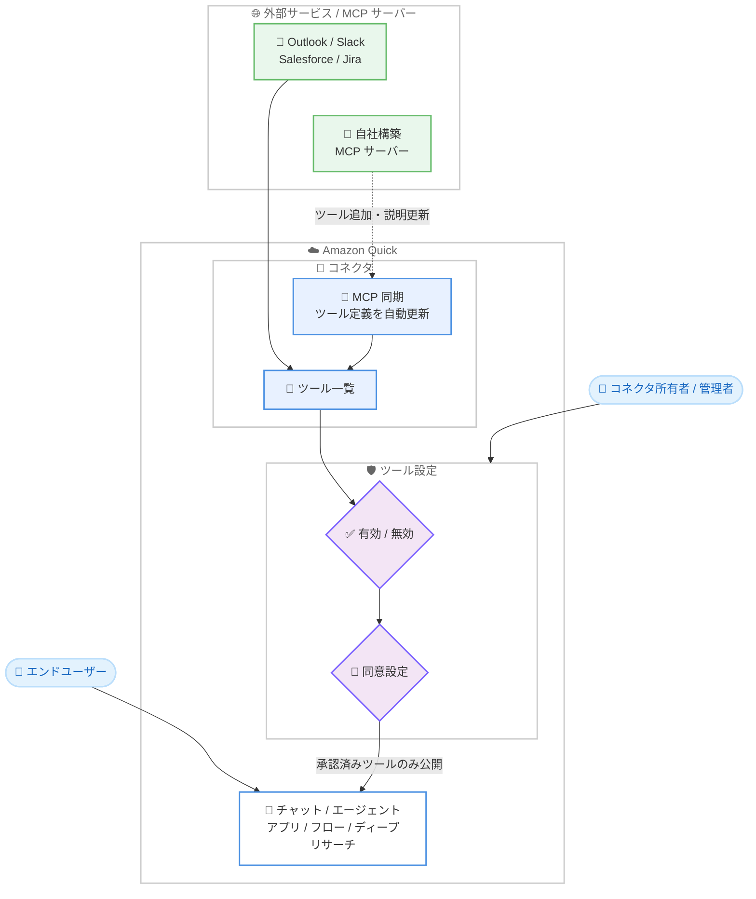

# Amazon Quick - コネクタ向けツール設定と MCP 同期サポート

**リリース日**: 2026 年 9 月 2 日
**サービス**: Amazon Quick (Amazon Quick Suite)
**機能**: コネクタのツール設定 (Tool Settings) と Model Context Protocol (MCP) 同期サポート

📊 [このアップデートのインフォグラフィックを見る](https://takech9203.github.io/aws-news-summary/20260902-amazon-quick-adds-tool-settings-mcp-sync.html)

## 概要

Amazon Quick のコネクタに、新しいツール設定と MCP 同期 (MCP sync) のサポートが追加されました。Amazon Quick のコネクタは、Outlook、Slack、Salesforce、Jira などの外部サービスや、組織内で独自に構築した MCP サーバーのツールを、チャット、エージェント、アプリ、フロー、ディープリサーチといったワークフローから直接利用できるようにする機能です。

今回のアップデートにより、管理者とコネクタ所有者は、コネクタのデプロイ方法と最新状態の維持について、よりきめ細かなコントロールを持てるようになりました。具体的には、コネクタ内の個々のツールの有効化/無効化、ツールごとの実行前同意 (consent) 設定、そして外部 MCP サーバーの変更を自動的に反映する MCP 同期の 3 つの機能が提供されます。

エンタープライズ環境で AI エージェントに外部ツールへのアクセスを許可する際のガバナンス要件に応えるアップデートであり、Amazon Quick を組織全体に展開する管理者や、MCP サーバーを社内提供するプラットフォームチームにとって重要な機能強化です。

**アップデート前の課題**

- コネクタを有効化すると、そのコネクタに含まれるツール群を個別に制御することが難しく、承認していないツールがエンドユーザーに公開されるリスクがあった
- ツール実行時の同意の扱いをツール単位で柔軟に設定できなかった
- 外部の MCP サーバー側でツールの追加や説明の更新が行われても、コネクタ側に自動反映されず、ユーザーが古いツール情報のまま作業する可能性があった

**アップデート後の改善**

- コネクタ所有者と管理者が、コネクタ内の個々のツールを選択的に有効化/無効化し、承認済みツールのみをエンドユーザーに公開できるようになった
- どのツールが実行前に同意を必要とするかをコネクタ所有者が指定でき、エンドユーザー自身に判断を委ねる設定も選択できるようになった
- MCP 同期により、外部 MCP サーバーでのツール追加、説明の更新、機能の進化がコネクタに自動的に反映され、ユーザーが常に最新のツール情報を利用できるようになった

## アーキテクチャ図



外部 MCP サーバーのツール定義が MCP 同期によりコネクタへ自動反映され、管理者が設定したツールの有効化/無効化と同意設定を経て、承認済みツールのみがエンドユーザーのワークフローに公開される流れを示しています。

## サービスアップデートの詳細

### 主要機能

1. **ツールの選択的な有効化/無効化**
   - コネクタ所有者と管理者が、コネクタ内の個々のツールを選択して有効化または無効化できる
   - 承認済みのツールのみをエンドユーザーに公開でき、意図しないツールの利用を防止できる
   - コネクタ全体の有効/無効ではなく、ツール単位での粒度の細かい制御が可能

2. **ツールごとの権限 (同意) 設定**
   - どのツールが実行前にユーザーの同意 (consent) を必要とするかをコネクタ所有者が指定できる
   - 同意の要否をエンドユーザー自身の判断に委ねる柔軟な設定も選択できる
   - 書き込み系や影響の大きいツールには同意を必須にする、といったリスクに応じた運用が可能

3. **MCP 同期 (MCP sync)**
   - 外部の MCP サーバーが新しいツールを追加したり、ツールの説明を更新したり、機能を進化させた場合に、コネクタを最新の状態に保つ
   - ユーザーは常に最新のツール情報を利用して作業を進められる
   - MCP サーバー側の変更のたびにコネクタを手動で再構成する運用負荷を軽減

## 技術仕様

### 機能の整理

| 項目 | 詳細 |
|------|------|
| 対象機能 | Amazon Quick のコネクタ (Outlook、Slack、Salesforce、Jira、自社構築 MCP サーバーなど) |
| ツール設定 | コネクタ内の個々のツールの有効化/無効化 |
| 同意設定 | ツールごとに実行前同意を必須化、またはエンドユーザーの判断に委任 |
| MCP 同期 | 外部 MCP サーバーのツール追加・説明更新・機能変更をコネクタに反映 |
| 設定主体 | コネクタ所有者および管理者 |
| 利用シーン | チャット、エージェント、アプリ、フロー、ディープリサーチ |

## 設定方法

### 前提条件

1. Amazon Quick (Quick Suite) が利用可能な環境であること
2. コネクタの管理権限 (コネクタ所有者または管理者) を持っていること
3. 接続対象の外部サービスまたは MCP サーバーがセットアップ済みであること

### 手順

#### ステップ 1: コネクタの設定画面を開く

Amazon Quick の管理画面でコネクタの一覧を表示し、設定対象のコネクタを選択します。コネクタ所有者または管理者の権限が必要です。

#### ステップ 2: ツールの有効化/無効化を設定する

コネクタに含まれるツールの一覧から、エンドユーザーに公開するツールのみを有効化します。承認していないツールは無効化することで、ユーザーのワークフローに表示されなくなります。

#### ステップ 3: ツールごとの同意設定を行う

各ツールについて、実行前にユーザーの同意を必須とするか、同意の要否をエンドユーザー自身に委ねるかを設定します。データの書き込みや外部への通知など、影響の大きい操作を行うツールには同意を必須にすることを推奨します。

#### ステップ 4: MCP 同期の動作を確認する

外部 MCP サーバー側でツールの追加や説明の更新が行われた際に、コネクタへ反映されることを確認します。同期後に新しく追加されたツールについても、ステップ 2 と 3 の設定方針に沿って公開範囲を確認します。

## メリット

### ビジネス面

- **ガバナンスの強化**: 承認済みツールのみをエンドユーザーに公開でき、組織のコンプライアンス要件やセキュリティポリシーに沿った AI エージェント活用を実現できる
- **運用負荷の削減**: MCP 同期により、外部 MCP サーバーの変更のたびに手動でコネクタを更新する作業が不要になる
- **安全な展開の促進**: ツール単位の制御と同意設定により、リスクを管理しながら組織全体へコネクタを展開しやすくなる

### 技術面

- **粒度の細かいアクセス制御**: コネクタ全体ではなくツール単位で有効/無効を制御でき、最小権限の原則に沿った構成が可能
- **柔軟な同意モデル**: ツールの特性に応じて、同意必須と、エンドユーザーへの判断の委任を使い分けられる
- **ツール定義の鮮度維持**: MCP サーバー側のツール追加や説明更新が自動的に反映され、エージェントが常に正確なツール情報に基づいて動作できる

## デメリット・制約事項

### 制限事項

- Amazon Quick が利用可能なリージョンでのみ利用できる
- 設定はコネクタ所有者または管理者の権限が必要であり、権限管理の設計が前提となる

### 考慮すべき点

- MCP 同期により新しいツールが自動的に取り込まれるため、同期後に追加されたツールの公開範囲と同意設定を確認する運用プロセスを整備することが望ましい
- 同意を必須にするツールが多すぎるとユーザー体験が損なわれる可能性があるため、リスクに応じたバランス設計が必要
- 自社構築 MCP サーバーを利用する場合、MCP サーバー側のツール説明の品質がエージェントの動作精度に影響する

## ユースケース

### ユースケース 1: 承認済みツールのみを全社に公開

**シナリオ**: 情報システム部門が Salesforce コネクタを全社導入するが、レコードの参照系ツールのみを許可し、更新系ツールは特定部門の検証が完了するまで公開したくない。

**実装例**:
```text
1. Salesforce コネクタのツール一覧を表示
2. 参照系ツール (検索、レコード取得など) のみを有効化
3. 更新系ツール (レコード作成・更新など) を無効化
4. 検証完了後、更新系ツールを段階的に有効化
```

**効果**: 承認済みの操作のみをエンドユーザーに提供でき、段階的かつ安全な全社展開が可能になる。

### ユースケース 2: 影響の大きい操作への同意必須化

**シナリオ**: Slack コネクタでメッセージ送信ツールを利用可能にするが、エージェントが自動でメッセージを送信する前に、必ずユーザーの確認を挟みたい。

**実装例**:
```text
1. Slack コネクタのツール設定を開く
2. メッセージ送信ツールに「実行前の同意必須」を設定
3. チャンネル情報の参照ツールは「ユーザーの判断に委任」を設定
```

**効果**: 外部への影響がある操作は必ずユーザーが確認したうえで実行され、意図しない送信を防止しつつ、参照系操作はスムーズに利用できる。

### ユースケース 3: 自社 MCP サーバーの継続的な機能拡張

**シナリオ**: プラットフォームチームが社内システム連携用の MCP サーバーを提供しており、新しいツールの追加や説明の改善を頻繁にリリースしている。

**実装例**:
```text
1. 自社 MCP サーバーを Amazon Quick のコネクタとして登録
2. MCP サーバー側で新ツールを追加・説明を更新
3. MCP 同期によりコネクタへ自動反映
4. 管理者が新ツールの公開設定と同意設定を確認
```

**効果**: MCP サーバーの更新のたびにコネクタを手動で再構成する必要がなくなり、社内ツールの改善サイクルを高速化できる。

## 料金

今回のツール設定と MCP 同期の機能は、Amazon Quick のコネクタ機能の一部として提供されます。料金の詳細は Amazon Quick Suite の料金ページを参照してください。

## 利用可能リージョン

Amazon Quick が利用可能なすべての AWS リージョンで利用できます。

## 関連サービス・機能

- **Amazon Quick Suite**: 本アップデートの対象となるエージェント型 AI ワークスペース。チャット、エージェント、アプリ、フロー、ディープリサーチなどの機能を提供
- **Model Context Protocol (MCP)**: AI アプリケーションと外部ツール・データソースを接続するためのオープンプロトコル。本アップデートの MCP 同期の対象
- **Amazon Q Business**: 同様に外部データソースとの連携機能を持つ生成 AI アシスタント。エンタープライズでの AI 活用という観点で関連

## 参考リンク

- 📊 [インフォグラフィック](https://takech9203.github.io/aws-news-summary/20260902-amazon-quick-adds-tool-settings-mcp-sync.html)
- [公式発表 (What's New)](https://aws.amazon.com/about-aws/whats-new/2026/09/amazon-quick-adds-tool-settings-mcp-sync/)
- [ドキュメント (Amazon Quick Suite User Guide)](https://docs.aws.amazon.com/quicksight/latest/user/welcome.html)
- [Amazon Quick Suite 製品ページ](https://aws.amazon.com/quicksuite/)

## まとめ

Amazon Quick のコネクタに、ツール単位の有効化/無効化、実行前同意の設定、外部 MCP サーバーとの自動同期が追加され、エンタープライズでのエージェント型 AI 活用に不可欠なガバナンスと運用性が大きく向上しました。Amazon Quick でコネクタや自社 MCP サーバーを利用している組織は、承認済みツールのみを公開する設定と、影響の大きいツールへの同意必須化の適用を検討することを推奨します。
