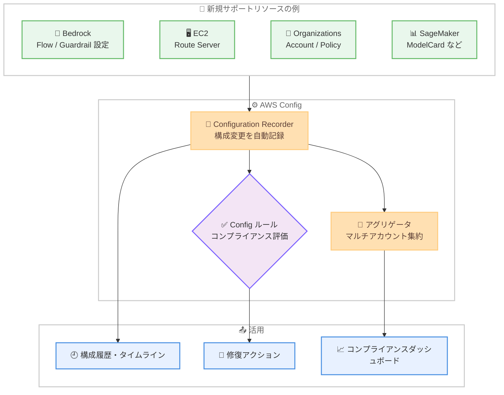

# AWS Config - 60 種類の新規リソースタイプのサポート追加

**リリース日**: 2026 年 9 月 2 日
**サービス**: AWS Config
**機能**: 60 種類の新規リソースタイプのサポート

📊 [このアップデートのインフォグラフィックを見る](https://takech9203.github.io/aws-news-summary/20260902-aws-config-new-resource-types.html)

## 概要

AWS Config が新たに 60 種類のリソースタイプをサポートしました。今回の追加により、Amazon Bedrock、Amazon EC2、Amazon SageMaker、AWS Organizations など幅広いサービスのリソースが AWS Config の記録・評価の対象となり、AWS 環境全体のリソースの検出、評価、監査、修復のカバレッジが大幅に拡大します。

追加されたリソースタイプには、Amazon Bedrock の Flow や Guardrail 設定、Bedrock AgentCore の各種リソース、Amazon EC2 の Route Server、Amazon EKS の Pod Identity Association、AWS Organizations のアカウントやポリシーなど、近年利用が拡大している生成 AI 関連やガバナンス関連のリソースが多く含まれています。コンプライアンス管理や構成変更の追跡を担当するクラウド管理者、セキュリティチームにとって重要なアップデートです。

**アップデート前の課題**

今回のアップデート以前は、以下の課題がありました。

- 上記 60 種類のリソースタイプは AWS Config の記録対象外であり、構成変更の履歴を自動的に追跡できなかった
- Bedrock の Flow や Organizations のポリシーなどの構成状態を Config ルールで自動評価できず、独自のスクリプトや手動監査が必要だった
- マルチアカウント環境において、これらのリソースの構成情報をアグリゲータで一元的に集約できなかった

**アップデート後の改善**

今回のアップデートにより、以下が可能になりました。

- 60 種類の新規リソースタイプについて、構成変更の記録と履歴の追跡が可能になった
- すべてのリソースタイプを記録する設定を有効にしている場合、追加のリソースタイプが自動的に記録対象となり、設定変更は不要
- 新規リソースタイプを Config ルールによる自動評価と、Config アグリゲータによるマルチアカウント・マルチリージョンの集約の両方で利用可能になった

## アーキテクチャ図



新規サポートされたリソースタイプの構成変更が AWS Config の Configuration Recorder により自動記録され、Config ルールでの評価、アグリゲータでのマルチアカウント集約、構成履歴の追跡に利用できる流れを示しています。

## サービスアップデートの詳細

### 主要機能

1. **60 種類の新規リソースタイプの記録**
   - 生成 AI 関連 (Bedrock、Bedrock AgentCore、S3 Vectors)、ガバナンス関連 (Organizations、Identity Store)、ネットワーク関連 (EC2 Route Server、Network Manager) など幅広い分野をカバー
   - リソースタイプは `AWS::Service::Type` 形式で識別される (例: `AWS::EC2::RouteServer`)
   - すべてのリソースタイプを記録する設定の場合、自動的に記録が開始される

2. **Config ルールによる評価**
   - 新規リソースタイプをカスタム Config ルールの評価対象として利用可能
   - 組織のコンプライアンス要件に基づいた自動評価と修復が可能

3. **Config アグリゲータによる集約**
   - マルチアカウント・マルチリージョン環境で新規リソースタイプの構成情報を一元的に集約可能
   - AWS Organizations と連携した組織全体の可視化に対応

### 新規サポートリソースタイプ一覧

| サービス | リソースタイプ |
|------|------|
| AppSync | ChannelNamespace, SourceApiAssociation |
| Bedrock | EnforcedGuardrailConfiguration, Flow, FlowVersion, PromptVersion |
| BedrockAgentCore | OAuth2CredentialProvider, PaymentManager, Policy, PolicyEngine, TokenVault |
| Chime | AppInstance |
| CloudTrail | ResourcePolicy |
| CodePipeline | Webhook |
| Config | OrganizationConformancePack |
| Connect | AgentStatus, EvaluationForm, View, ViewVersion |
| EC2 | NetworkPerformanceMetricSubscription, RouteServer, RouteServerEndpoint, RouteServerPeer |
| EKS | PodIdentityAssociation |
| ElasticLoadBalancingV2 | ListenerRule |
| GameLiftStreams | Application, StreamGroup |
| IdentityStore | Group |
| IoT | TopicRuleDestination |
| Lightsail | Container, Database, Distribution, Domain, Instance, LoadBalancer |
| Logs | ResourcePolicy |
| MediaConnect | Bridge |
| NetworkManager | CoreNetwork |
| Organizations | Account, Organization, Policy, ResourcePolicy |
| QuickSight | RefreshSchedule |
| RDS | DBProxy |
| S3Vectors | Index |
| SageMaker | Action, Algorithm, App, Context, Hub, MlflowApp, ModelCard, ModelPackage |
| SES | MailManagerArchive |
| Transfer | WebApp |
| WorkSpacesWeb | TrustStore, UserAccessLoggingSettings |
| XRay | Group, ResourcePolicy, SamplingRule |

## 技術仕様

### 記録の仕組み

| 項目 | 詳細 |
|------|------|
| 記録方式 | Configuration Recorder による構成変更の自動記録 |
| リソースタイプ形式 | `AWS::Service::Type` (例: `AWS::Organizations::Account`) |
| 自動記録 | すべてのリソースタイプを記録する設定の場合、追加設定不要 |
| ルール評価 | カスタム Config ルールで新規リソースタイプを評価可能 |
| 集約 | Config アグリゲータでマルチアカウント・マルチリージョン集約に対応 |

## 設定方法

### 前提条件

1. AWS Config が有効化されており、Configuration Recorder が設定されていること
2. Config 用の IAM ロールに必要な権限が付与されていること
3. 特定のリソースタイプのみ記録している場合は、記録対象の見直しが必要

### 手順

#### ステップ1: 現在の記録設定を確認

```bash
aws configservice describe-configuration-recorders
```

Configuration Recorder の設定を確認します。`allSupported` が `true` の場合、新規リソースタイプは自動的に記録対象となるため、追加の設定は不要です。

#### ステップ2: 特定リソースタイプのみ記録している場合の設定変更

```bash
aws configservice put-configuration-recorder \
  --configuration-recorder name=default,roleARN=arn:aws:iam::123456789012:role/config-role \
  --recording-group resourceTypes="AWS::EC2::RouteServer","AWS::Organizations::Account"
```

記録対象を個別に指定している場合、`resourceTypes` に新規リソースタイプを追加します。このコマンドは Configuration Recorder の記録グループを更新し、指定したリソースタイプの記録を開始します。

#### ステップ3: 記録されたリソースの確認

```bash
aws configservice list-discovered-resources \
  --resource-type "AWS::EKS::PodIdentityAssociation"
```

AWS Config が検出したリソースの一覧を取得し、新規リソースタイプが正しく記録されていることを確認します。

## メリット

### ビジネス面

- **コンプライアンス対応の強化**: 生成 AI やガバナンス関連リソースを含む幅広いリソースの構成を自動監査でき、規制要件への対応が容易になる
- **監査工数の削減**: これまで手動確認が必要だったリソースの構成履歴が自動記録され、監査準備の負担が軽減される
- **ガバナンスの一元化**: Organizations のアカウントやポリシーが記録対象となり、組織全体の統制状況を可視化できる

### 技術面

- **設定変更不要の自動対応**: すべてのリソースタイプを記録する設定であれば、新規タイプが自動的に記録対象となる
- **変更追跡の網羅性向上**: Bedrock Flow や EKS Pod Identity Association など新しいサービス機能の構成変更も時系列で追跡可能
- **既存ワークフローとの統合**: Config ルールやアグリゲータなど既存の仕組みをそのまま新規リソースタイプに適用できる

## デメリット・制約事項

### 制限事項

- 各リソースタイプの記録は、そのリソースが利用可能なリージョンでのみサポートされる
- AWS マネージドルールの多くは既存リソースタイプ向けであり、新規リソースタイプの評価にはカスタムルールの作成が必要な場合がある

### 考慮すべき点

- すべてのリソースタイプを記録する設定の場合、記録対象の増加に伴い構成項目の記録数が増え、コストが増加する可能性がある
- 特定リソースタイプのみを記録する運用の場合、新規タイプを記録対象へ追加する明示的な設定変更が必要

## ユースケース

### ユースケース1: 生成 AI リソースのガバナンス強化

**シナリオ**: Amazon Bedrock を活用した生成 AI アプリケーションを運用しており、Guardrail 設定や Flow の構成変更を統制したい。

**実装例**:
```bash
# Bedrock の Guardrail 強制設定の構成履歴を確認
aws configservice get-resource-config-history \
  --resource-type "AWS::Bedrock::EnforcedGuardrailConfiguration" \
  --resource-id <resource-id>
```

**効果**: Guardrail 設定の変更履歴を追跡し、意図しない安全対策の緩和を検出できる。

### ユースケース2: 組織全体のアカウント・ポリシー監査

**シナリオ**: AWS Organizations で多数のアカウントを管理しており、アカウントの追加やポリシーの変更を監査証跡として残したい。

**実装例**:
```bash
# Organizations のポリシーリソースを検出
aws configservice list-discovered-resources \
  --resource-type "AWS::Organizations::Policy"
```

**効果**: SCP などの組織ポリシーの変更を自動記録し、ガバナンス変更の監査対応を効率化できる。

### ユースケース3: EKS の Pod Identity 設定のコンプライアンス評価

**シナリオ**: Amazon EKS クラスターで Pod Identity Association を利用しており、Pod に付与される IAM ロールが組織の基準に準拠しているか継続的に評価したい。

**実装例**:
```bash
# カスタム Config ルールの評価対象に新規リソースタイプを指定
aws configservice put-config-rule --config-rule '{
  "ConfigRuleName": "eks-pod-identity-check",
  "Source": {"Owner": "CUSTOM_LAMBDA", "SourceIdentifier": "<lambda-arn>",
    "SourceDetails": [{"EventSource": "aws.config", "MessageType": "ConfigurationItemChangeNotification"}]},
  "Scope": {"ComplianceResourceTypes": ["AWS::EKS::PodIdentityAssociation"]}
}'
```

**効果**: Pod Identity の関連付け変更をトリガーに自動評価を実行し、非準拠の設定を即座に検出できる。

## 料金

AWS Config の料金は、記録された構成項目 (Configuration Item) の数、Config ルールの評価回数、コンフォーマンスパックの評価回数に基づく従量課金です。新規リソースタイプの記録により構成項目の記録数が増加すると、その分の料金が発生します。

### 料金例 (米国東部バージニア北部リージョン)

| 使用量 | 月額料金 (概算) |
|--------|------------------|
| 構成項目の記録 | 0.003 USD / 項目 |
| Config ルール評価 (最初の 10 万回) | 0.001 USD / 評価 |

## 利用可能リージョン

各リソースタイプが利用可能なすべての AWS リージョンで利用できます。リソースタイプごとのリージョン対応状況は、[AWS Config がサポートするリソースタイプのドキュメント](https://docs.aws.amazon.com/config/latest/developerguide/what-is-resource-config-coverage.html)を参照してください。

## 関連サービス・機能

- **AWS Config ルール**: 新規リソースタイプを評価対象としたコンプライアンス自動評価が可能
- **AWS Config アグリゲータ**: マルチアカウント・マルチリージョンでの構成情報の一元集約に対応
- **AWS Organizations**: 今回追加された Account や Policy リソースタイプにより、組織構造自体の変更追跡が可能
- **AWS CloudTrail**: API 呼び出しの記録と組み合わせることで、誰がいつ構成を変更したかを特定可能

## 参考リンク

- 📊 [インフォグラフィック](https://takech9203.github.io/aws-news-summary/20260902-aws-config-new-resource-types.html)
- [公式発表 (What's New)](https://aws.amazon.com/about-aws/whats-new/2026/09/aws-config-new-resource-types/)
- [ドキュメント: サポートされるリソースタイプ](https://docs.aws.amazon.com/config/latest/developerguide/what-is-resource-config-coverage.html)
- [料金ページ](https://aws.amazon.com/config/pricing/)

## まとめ

AWS Config のリソースカバレッジが 60 種類拡大し、Bedrock などの生成 AI 関連リソースや Organizations などのガバナンス関連リソースの構成追跡が可能になりました。すべてのリソースタイプを記録する設定であれば追加作業なしで恩恵を受けられます。特定リソースタイプのみを記録している場合は、記録対象の見直しと、新規タイプを対象としたカスタム Config ルールの整備を検討することを推奨します。
