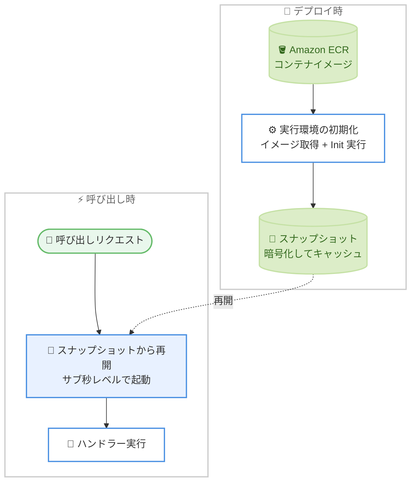

# AWS Lambda - コンテナイメージ関数の SnapStart サポート

**リリース日**: 2026 年 9 月 2 日
**サービス**: AWS Lambda
**機能**: SnapStart for container image functions

📊 [このアップデートのインフォグラフィックを見る](https://takech9203.github.io/aws-news-summary/20260902-aws-lambda-snapstart-container.html)

## 概要

AWS Lambda が、コンテナイメージとしてパッケージ化された関数での SnapStart をサポートしました。SnapStart はオプトインの機能で、デプロイ時に初期化済みの実行環境のスナップショットを作成してキャッシュし、呼び出し時にはコールドスタートの初期化処理を行う代わりにスナップショットから再開します。これにより、数秒かかっていた起動時間をサブ秒レベルまで短縮できます。

Lambda のコンテナイメージ関数は最大 10 GB のイメージを利用できる一方、呼び出し時にイメージレイヤーのダウンロードと初期化が必要になるため、ZIP パッケージの関数と比べてコールドスタートが長くなりやすいという課題がありました。今回のアップデートにより、ML 推論やインタラクティブな API など、レイテンシーに敏感なワークロードを大きなコンテナイメージで実装する場合でも、高速な起動を実現できます。

新規・既存を問わず、Lambda API、AWS マネジメントコンソール、AWS CLI、AWS CloudFormation、AWS SAM、AWS SDK、AWS CDK から SnapStart を設定できます。

**アップデート前の課題**

- SnapStart は ZIP アーカイブ形式でデプロイされたマネージドランタイム (Java、Python、.NET) の関数でのみ利用可能だった
- コンテナイメージ関数 (最大 10 GB) は、呼び出し時のイメージレイヤーのダウンロードにより起動に数秒かかることがあった
- 大きな依存関係を含む ML 推論などのワークロードでは、コンテナイメージを使いたくてもコールドスタートの長さが導入の障壁になっていた

**アップデート後の改善**

- コンテナイメージ関数でも SnapStart を有効化し、起動時間をサブ秒レベルまで短縮できるようになった
- AWS ベースイメージの Java (11 以降)、Python (3.12 以降)、.NET (8 以降) では、ZIP アーカイブの場合と同等の体験で SnapStart を利用できるようになった
- その他のベースイメージ (Node.js、Ruby など) やカスタムベースイメージでも、ランタイムフックを実装することで SnapStart を利用できるようになった

## アーキテクチャ図



SnapStart は、新しい関数バージョンの発行時に初期化済み実行環境のスナップショットを作成してキャッシュし、呼び出し時にはコールドスタートの初期化を行わずスナップショットから再開します。

## サービスアップデートの詳細

### 主要機能

1. **コンテナイメージ関数での SnapStart 有効化**
   - コンテナイメージとしてパッケージ化された Lambda 関数で SnapStart をオプトインで有効化できる
   - デプロイ時に初期化済み実行環境のスナップショットを作成・キャッシュし、呼び出し時にスナップショットから再開する
   - 数秒かかっていた起動時間をサブ秒レベルまで短縮できる

2. **AWS ベースイメージでのシームレスな利用**
   - AWS ベースイメージの Java (11 以降)、Python (3.12 以降)、.NET (8 以降) では、ZIP アーカイブデプロイと同等の体験で利用可能
   - その他のベースイメージ (Node.js、Ruby など) やカスタムベースイメージでは、開発者ガイドに従いランタイムフックを実装することで利用可能

3. **幅広い設定手段**
   - 新規・既存の関数に対して、Lambda API、AWS マネジメントコンソール、AWS CLI、AWS CloudFormation、AWS SAM、AWS SDK、AWS CDK から設定できる

## 技術仕様

### SnapStart 対応パッケージ形式の比較

| 項目 | 詳細 |
|------|------|
| 対応パッケージ形式 | ZIP アーカイブに加え、コンテナイメージに対応 |
| コンテナイメージサイズ | 最大 10 GB (Lambda コンテナイメージの上限) |
| シームレス対応ランタイム | AWS ベースイメージの Java 11 以降、Python 3.12 以降、.NET 8 以降 |
| その他のランタイム | Node.js、Ruby、カスタムベースイメージはランタイムフックの実装が必要 |
| 有効化方法 | Lambda API、コンソール、AWS CLI、CloudFormation、SAM、SDK、CDK |
| 動作方式 | バージョン発行時にスナップショットを作成し、呼び出し時に再開 |

### 設定例 (AWS CLI)

```bash
# コンテナイメージ関数で SnapStart を有効化
aws lambda update-function-configuration \
  --function-name my-container-function \
  --snap-start ApplyOn=PublishedVersions

# 新しいバージョンを発行 (スナップショットが作成される)
aws lambda publish-version \
  --function-name my-container-function
```

`SnapStart` の `ApplyOn` を `PublishedVersions` に設定すると、バージョン発行時にスナップショットが作成されます。SnapStart は発行済みバージョンおよびそのバージョンを指すエイリアスに対して機能します。

## 設定方法

### 前提条件

1. コンテナイメージとしてパッケージ化された Lambda 関数 (Amazon ECR にイメージを格納)
2. シームレスに利用する場合: AWS ベースイメージの Java 11 以降、Python 3.12 以降、または .NET 8 以降
3. その他のベースイメージやカスタムベースイメージの場合: ランタイムフックの実装

### 手順

#### ステップ 1: コンテナイメージ関数の作成または確認

```bash
aws lambda create-function \
  --function-name my-container-function \
  --package-type Image \
  --code ImageUri=123456789012.dkr.ecr.ap-northeast-1.amazonaws.com/my-image:latest \
  --role arn:aws:iam::123456789012:role/lambda-execution-role
```

Amazon ECR に格納したコンテナイメージを指定して Lambda 関数を作成しています。既存のコンテナイメージ関数がある場合はこのステップは不要です。

#### ステップ 2: SnapStart の有効化

```bash
aws lambda update-function-configuration \
  --function-name my-container-function \
  --snap-start ApplyOn=PublishedVersions
```

関数設定を更新し、発行済みバージョンに対して SnapStart を適用するように設定しています。

#### ステップ 3: バージョンの発行と動作確認

```bash
aws lambda publish-version \
  --function-name my-container-function

aws lambda get-function-configuration \
  --function-name my-container-function:1 \
  --query "SnapStartResponse"
```

バージョンを発行するとスナップショットが作成されます。`SnapStartResponse` の `OptimizationStatus` が `On` になっていることを確認し、発行したバージョン (またはエイリアス) を呼び出して起動時間を検証します。

## メリット

### ビジネス面

- **ユーザー体験の向上**: レイテンシーに敏感な API やインタラクティブなアプリケーションで、コールドスタートによる応答遅延を大幅に削減できる
- **コンテナ移行の促進**: 起動時間を理由にコンテナイメージ採用を見送っていたワークロードでも、既存のコンテナベースの CI/CD やツールチェーンを活用できる
- **ML 推論のサーバーレス化**: 大きな依存関係やモデルを含む推論ワークロードを、プロビジョニング済み同時実行なしで低レイテンシーに提供しやすくなる

### 技術面

- **サブ秒起動**: 数秒かかっていたコンテナイメージ関数の起動をサブ秒レベルまで短縮できる
- **初期化処理の再利用**: 依存関係のロードやフレームワークの初期化をスナップショットに含めることで、呼び出しごとの初期化を回避できる
- **既存ツールとの統合**: コンソール、CLI、CloudFormation、SAM、CDK など既存のデプロイ手段でそのまま設定できる

## デメリット・制約事項

### 制限事項

- アジアパシフィック (ニュージーランド) およびアジアパシフィック (台北) リージョンでは利用できない
- AWS ベースイメージでシームレスに利用できるのは Java 11 以降、Python 3.12 以降、.NET 8 以降のみ
- Node.js、Ruby などのベースイメージやカスタムベースイメージでは、ランタイムフックの実装が必要

### 考慮すべき点

- SnapStart には Java 以外のランタイムでキャッシュとスナップショットからの再開に対する追加料金が発生するため、料金ページの SnapStart Pricing セクションで確認が必要
- スナップショットから複数の実行環境が再開されるため、初期化時に生成する一意性が必要な値 (乱数シード、一時的な認証情報など) の扱いには注意が必要
- SnapStart は発行済みバージョンに対して機能するため、バージョン管理を前提とした運用設計が必要

## ユースケース

### ユースケース 1: コンテナイメージによる ML 推論 API

**シナリオ**: 数 GB のモデルや依存ライブラリを含む推論処理をコンテナイメージ関数で提供しているが、コールドスタートが長くリアルタイム推論に使いにくい。

**実装例**:
```bash
aws lambda update-function-configuration \
  --function-name ml-inference \
  --snap-start ApplyOn=PublishedVersions
aws lambda publish-version --function-name ml-inference
```

**効果**: モデルロードを含む初期化処理をスナップショットに取り込み、呼び出し時はサブ秒レベルで起動できるため、リアルタイム性が求められる推論 API にも対応しやすくなる。

### ユースケース 2: Java フレームワークを使ったコンテナベースの Web API

**シナリオ**: Spring Boot など初期化の重い Java フレームワークをコンテナイメージで運用しており、コールドスタート時の応答遅延がユーザー体験を損なっている。

**実装例**:
```yaml
# AWS SAM テンプレート
Resources:
  ApiFunction:
    Type: AWS::Serverless::Function
    Properties:
      PackageType: Image
      SnapStart:
        ApplyOn: PublishedVersions
      AutoPublishAlias: live
```

**効果**: フレームワークの初期化完了後の状態から再開できるため、ピーク時のスケールアウトでも安定した低レイテンシーを維持できる。

### ユースケース 3: 既存コンテナ CI/CD パイプラインの活用

**シナリオ**: 組織のビルド・スキャン・配布の仕組みがコンテナイメージ前提で整備されており、Lambda でも同じパイプラインを使いたいが、起動時間の懸念から ZIP デプロイを併用していた。

**実装例**:
```bash
# 既存の CI/CD で ECR にプッシュ後、SnapStart 有効の関数を更新
aws lambda update-function-code \
  --function-name my-service \
  --image-uri 123456789012.dkr.ecr.ap-northeast-1.amazonaws.com/my-service:v2
aws lambda publish-version --function-name my-service
```

**効果**: コンテナ前提の CI/CD とセキュリティスキャンを維持したまま、ZIP デプロイ相当の起動性能を得られ、デプロイ方式を統一できる。

## 料金

SnapStart の料金は、対象ランタイムに応じてスナップショットのキャッシュ量と復元回数に基づく追加料金が発生します (Java マネージドランタイムは追加料金なしの体系)。コンテナイメージ関数での具体的な料金は、AWS Lambda 料金ページの SnapStart Pricing セクションを参照してください。

- [AWS Lambda 料金 (SnapStart Pricing)](https://aws.amazon.com/lambda/pricing/#SnapStart_Pricing)

## 利用可能リージョン

アジアパシフィック (ニュージーランド) およびアジアパシフィック (台北) を除く、すべての AWS 商用リージョンで利用可能です。東京・大阪リージョンを含みます。最新の対応状況は [AWS リージョン別サービス一覧](https://aws.amazon.com/about-aws/global-infrastructure/regional-product-services/) を参照してください。

## 関連サービス・機能

- **Amazon ECR**: コンテナイメージ関数のイメージ格納先。既存のイメージ配布フローをそのまま利用できる
- **AWS SAM / AWS CDK / CloudFormation**: SnapStart 設定を IaC として管理し、バージョン発行やエイリアス運用を自動化できる
- **Lambda プロビジョニング済み同時実行**: コールドスタート対策の代替手段。常時ウォームな環境を確保する方式で、SnapStart とはコスト特性が異なる

## 参考リンク

- 📊 [インフォグラフィック](https://takech9203.github.io/aws-news-summary/20260902-aws-lambda-snapstart-container.html)
- [公式発表 (What's New)](https://aws.amazon.com/about-aws/whats-new/2026/07/aws-lambda-snapstart-container/)
- [ドキュメント: Lambda SnapStart](https://docs.aws.amazon.com/lambda/latest/dg/snapstart.html)
- [ドキュメント: コンテナイメージ関数の作成](https://docs.aws.amazon.com/lambda/latest/dg/images-create.html)
- [ドキュメント: カスタムランタイムフック](https://docs.aws.amazon.com/lambda/latest/dg/snapstart-runtime-hooks-custom.html)
- [料金ページ](https://aws.amazon.com/lambda/pricing/#SnapStart_Pricing)

## まとめ

コンテナイメージ関数の最大の弱点であったコールドスタートの長さが、SnapStart によりサブ秒レベルまで短縮可能になりました。ML 推論や Java フレームワークなど初期化の重いワークロードをコンテナで運用しているチームは、まず AWS ベースイメージ (Java 11 以降、Python 3.12 以降、.NET 8 以降) の関数で SnapStart を有効化し、起動時間とコストへの影響を検証することを推奨します。
