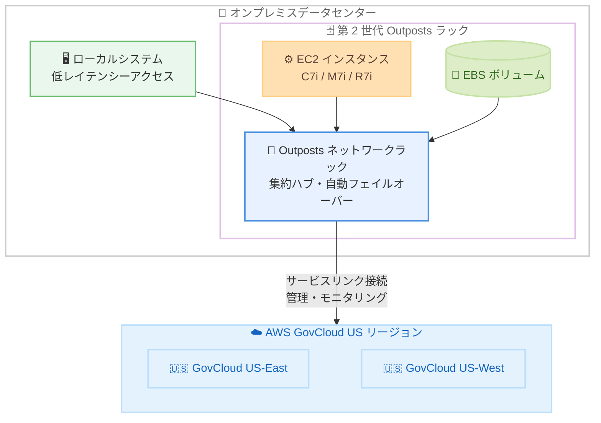

# AWS Outposts - 第 2 世代 Outposts ラックの AWS GovCloud (US) リージョン対応

**リリース日**: 2026 年 9 月 2 日
**サービス**: AWS Outposts
**機能**: 第 2 世代 AWS Outposts ラックの AWS GovCloud (US-East) / AWS GovCloud (US-West) リージョンサポート

📊 [このアップデートのインフォグラフィックを見る](https://takech9203.github.io/aws-news-summary/20260902-aws-outposts-govcloud-us-regions.html)

## 概要

第 2 世代 AWS Outposts ラックが、AWS GovCloud (US-East) および AWS GovCloud (US-West) リージョンでサポートされるようになりました。Outposts ラックは、AWS のインフラストラクチャ、AWS サービス、API、ツールをオンプレミスのデータセンターやコロケーションスペースに拡張し、クラウドと一貫性のあるハイブリッド体験を提供するフルマネージド型のソリューションです。

今回の拡大により、スタートアップからエンタープライズ、公共部門までの組織が、GovCloud (US) リージョンをホームリージョンとして第 2 世代 Outposts ラックを注文できるようになりました。オンプレミスシステムへの低レイテンシーアクセスが必要なワークロードをローカルで実行しながら、アプリケーション管理はホームリージョンに接続して行うことができます。また、データレジデンシー要件を満たすためにオンプレミスに保持する必要があるデータの管理・処理にも活用できます。

特に、厳格なコンプライアンス要件 (FedRAMP High、ITAR など) を持つ米国政府機関やその関連組織にとって、GovCloud (US) リージョンと接続した最新世代の Outposts ラックを利用できることは、ハイブリッド環境の選択肢を大きく広げるアップデートです。

**アップデート前の課題**

第 2 世代 Outposts ラック (2025 年 4 月 GA) は商用リージョンのみのサポートであり、GovCloud (US) リージョンでは利用できませんでした。

- GovCloud (US) をホームリージョンとする場合、第 1 世代 Outposts ラックしか選択できなかった
- 第 2 世代で提供される最新の第 7 世代 EC2 インスタンス (C7i / M7i / R7i) や高速ネットワーキングインスタンスを、GovCloud 接続のオンプレミス環境で利用できなかった
- 政府系ワークロードで低レイテンシーとデータレジデンシーを両立するための最新インフラ選択肢が限られていた

**アップデート後の改善**

- AWS GovCloud (US-East) / AWS GovCloud (US-West) をホームリージョンとして第 2 世代 Outposts ラックを注文できるようになった
- 第 2 世代の強化されたパフォーマンス (前世代の C5 / M5 / R5 比で最大 40% 向上した第 7 世代インスタンス) を GovCloud 接続環境でも利用可能になった
- 接続先リージョンの選択肢が増え、レイテンシーとデータレジデンシーの要件に応じた柔軟な構成が可能になった

## アーキテクチャ図



オンプレミスに設置した第 2 世代 Outposts ラックが、サービスリンクを介して AWS GovCloud (US-East) / AWS GovCloud (US-West) リージョンに接続し、ローカルシステムへの低レイテンシーアクセスとクラウドからの一元管理を両立する構成を示しています。

## サービスアップデートの詳細

### 主要機能

1. **GovCloud (US) リージョンをホームリージョンとした注文**
   - AWS GovCloud (US-East) および AWS GovCloud (US-West) に接続する第 2 世代 Outposts ラックを注文可能
   - オンプレミスで実行するワークロードのアプリケーション管理を GovCloud リージョンから実施
   - レイテンシーとデータレジデンシーの要件に応じて接続先リージョンを最適化

2. **第 2 世代 Outposts ラックの特長 (2025 年 4 月 GA)**
   - 最新の第 7 世代 x86 EC2 インスタンス (C7i コンピューティング最適化、M7i 汎用、R7i メモリ最適化) をサポート
   - 前世代 Outposts ラックの C5 / M5 / R5 と比較して、vCPU・メモリ・ネットワーク帯域幅が 2 倍、パフォーマンスが最大 40% 向上
   - 第 4 世代 Intel Xeon スケーラブルプロセッサを搭載

3. **簡素化されたネットワークスケーリングと構成**
   - コンピューティングとストレージのトラフィックを集約する新しい Outposts ネットワークラックを導入
   - コンピューティングリソースをネットワークインフラから独立してスケール可能
   - ネットワークデバイス障害時の自動フェイルオーバーによる耐障害性を標準装備
   - IP アドレス、VLAN、BGP 設定を API またはコンソールから簡単に構成可能

4. **高速ネットワーキング対応の特化型 EC2 インスタンス**
   - 超低レイテンシー向けの bmn-sf2e インスタンス (AMD Solarflare X2522 ネットワークカード搭載、全コア 3.9 GHz 持続動作)
   - 高スループット向けの bmn-cx2 インスタンス (NVIDIA ConnectX-7 400G NIC 搭載、最大 800 Gbps のベアメタル帯域幅)
   - ネイティブ L2 マルチキャスト、PTP (高精度時刻同期) をサポートし、金融取引システムや通信 5G コアなどのミッションクリティカルワークロードに対応

## 技術仕様

### 第 2 世代 Outposts ラックの主要スペック

| 項目 | 詳細 |
|------|------|
| 対応 EC2 インスタンス | C7i / M7i / R7i (第 7 世代 x86)、bmn-sf2e / bmn-cx2 (高速ネットワーキング) |
| プロセッサ | 第 4 世代 Intel Xeon スケーラブルプロセッサ (Sapphire Rapids) |
| パフォーマンス | 前世代比で vCPU・メモリ・ネットワーク帯域幅 2 倍、最大 40% 性能向上 |
| ネットワーク構成 | Outposts ネットワークラックによる集約、API / コンソールでの VLAN・BGP 設定 |
| 新規サポートリージョン | AWS GovCloud (US-East)、AWS GovCloud (US-West) |

### 高速ネットワーキングインスタンスの仕様

| インスタンス | vCPU | メモリ (DDR5) | ネットワーク帯域幅 | NVMe SSD | 高速ネットワーク帯域幅 |
|------|------|------|------|------|------|
| bmn-sf2e.metal-16xl | 64 | 512 GiB | 25 Gbps | 16 TB | 100 Gbps |
| bmn-sf2e.metal-32xl | 128 | 1,024 GiB | 50 Gbps | 32 TB | 200 Gbps |
| bmn-cx2.metal-48xl | 192 | 1,024 GiB | 50 Gbps | 16 TB | 800 Gbps |

## 設定方法

### 前提条件

1. AWS GovCloud (US) アカウントを保有していること (米国事業体および適格性の要件を満たす必要あり)
2. Outposts ラックの設置要件 (電源、冷却、ネットワーク接続、設置スペース) を満たすオンプレミス施設があること
3. サービスリンク接続用のネットワーク帯域幅を確保していること

### 手順

#### ステップ 1: Outposts の注文

AWS コンソールの AWS Outposts ページから、ホームリージョンとして AWS GovCloud (US-East) または AWS GovCloud (US-West) を選択し、第 2 世代 Outposts ラックの構成を選択して注文します。サイト要件の確認と設置スケジュールの調整は AWS が支援します。

#### ステップ 2: サイトの準備と設置

AWS の担当者がオンプレミス施設に Outposts ラックを設置します。設置後、サービスリンクを介してホームリージョンとの接続が確立されます。

#### ステップ 3: リソースの起動

```bash
# Outposts の一覧を確認
aws outposts list-outposts --region us-gov-west-1

# Outposts 上にサブネットを作成
aws ec2 create-subnet \
  --vpc-id vpc-xxxxxxxx \
  --cidr-block 10.0.3.0/24 \
  --outpost-arn arn:aws-us-gov:outposts:us-gov-west-1:123456789012:outpost/op-xxxxxxxx \
  --availability-zone us-gov-west-1a \
  --region us-gov-west-1

# Outposts サブネットに EC2 インスタンスを起動
aws ec2 run-instances \
  --instance-type c7i.4xlarge \
  --subnet-id subnet-xxxxxxxx \
  --image-id ami-xxxxxxxx \
  --region us-gov-west-1
```

GovCloud リージョンのエンドポイントに対して、Outposts の確認、Outposts 上のサブネット作成、EC2 インスタンスの起動を実行しています。通常のリージョン内リソースと同じ API・ツールで操作できる点が Outposts の特長です。

## メリット

### ビジネス面

- **政府系ワークロードへの対応**: GovCloud (US) の厳格なコンプライアンス基盤と接続した最新世代のオンプレミスインフラを利用でき、公共部門のハイブリッドクラウド戦略を推進できる
- **データレジデンシー要件への適合**: オンプレミスに保持すべきデータをローカルで処理しつつ、管理はクラウドから一元的に実施できる
- **接続先リージョンの柔軟性向上**: レイテンシーやデータ管轄の要件に応じて、商用リージョンに加えて GovCloud (US) リージョンも選択可能になった

### 技術面

- **最新世代のパフォーマンス**: 第 7 世代 EC2 インスタンスにより、前世代比で最大 40% の性能向上と 2 倍のリソース容量を実現
- **ネットワークの独立スケーリング**: Outposts ネットワークラックにより、コンピューティングとネットワークを独立して拡張可能
- **一貫した運用体験**: リージョン内と同じ AWS API、ツール、コンソールでオンプレミスリソースを管理可能

## デメリット・制約事項

### 制限事項

- GovCloud (US) アカウントの取得には米国事業体であることなどの適格性要件がある
- 第 2 世代 Outposts ラックで利用できる EC2 インスタンスタイプは第 1 世代と異なる (GPU インスタンスなどは今後対応予定とされている)
- Outposts の稼働にはホームリージョンへのサービスリンク接続が必要であり、完全なオフライン運用はできない

### 考慮すべき点

- 設置には電源、冷却、スペースなどの物理的なサイト要件を満たす必要がある
- サポートされる国・地域とリージョンの最新の組み合わせは Outposts rack FAQ ページで確認が必要
- 既存の第 1 世代 Outposts ラックからの移行を検討する場合は、ワークロードの互換性とインスタンスタイプの対応状況を確認する必要がある

## ユースケース

### ユースケース 1: 政府機関のデータレジデンシー対応

**シナリオ**: 米国政府機関が、規制によりオンプレミスでの保持が必要な機密データを処理しつつ、GovCloud (US) の管理基盤と統合したい。

**実装例**:
```
1. GovCloud (US-West) をホームリージョンとして第 2 世代 Outposts ラックを注文
2. オンプレミスの Outposts 上で R7i インスタンスとローカル EBS にデータを保持
3. IAM、CloudWatch、CloudTrail などの管理・監査は GovCloud リージョンで一元化
```

**効果**: データレジデンシー要件を満たしながら、クラウドと同一のセキュリティ・運用モデルを適用できる。

### ユースケース 2: 低レイテンシーが必要なミッションクリティカルシステム

**シナリオ**: 公共安全や防衛関連のシステムで、現場のオンプレミスシステムとミリ秒単位の低レイテンシー連携が必要。

**実装例**:
```
1. 現場データセンターに第 2 世代 Outposts ラックを設置
2. C7i インスタンスでリアルタイム処理アプリケーションをローカル実行
3. ローカルゲートウェイ経由でオンプレミスシステムと直接通信
4. 処理結果の集約・分析は GovCloud リージョンで実施
```

**効果**: ローカル処理による低レイテンシーと、クラウドでのスケーラブルな分析を両立できる。

### ユースケース 3: 高スループット処理基盤の刷新

**シナリオ**: 既存の第 1 世代 Outposts を利用中の組織が、データ量の増加に伴い、より高いスループットとメモリ容量を必要としている。

**実装例**:
```
1. 第 2 世代 Outposts ラックを GovCloud ホームリージョンで追加注文
2. M5 ベースのワークロードを M7i インスタンスへ移行 (最大 40% 性能向上)
3. Outposts ネットワークラックによりネットワークを独立して増強
```

**効果**: ラック全体の処理能力を向上させつつ、ネットワークとコンピューティングを個別に最適化できる。

## 料金

AWS Outposts ラックの料金は、選択する構成 (EC2 インスタンス容量、EBS ストレージ容量) に基づく従量課金または一括払い (All Upfront / Partial Upfront / No Upfront の 3 年契約) で提供されます。料金には設置、インフラの保守、ソフトウェアのパッチ適用・アップグレードが含まれます。

GovCloud (US) リージョン向けの具体的な料金は、AWS Outposts 料金ページまたは AWS 営業担当への問い合わせで確認してください。

## 利用可能リージョン

第 2 世代 AWS Outposts ラックのホームリージョンとして、今回新たに以下がサポートされました。

- AWS GovCloud (US-East)
- AWS GovCloud (US-West)

第 2 世代 Outposts ラックがサポートされる国・地域および AWS リージョンの最新リストは、Outposts rack FAQ ページで確認できます。

## 関連サービス・機能

- **Amazon EC2**: Outposts ラック上で C7i / M7i / R7i などの最新世代インスタンスをローカル実行
- **Amazon EBS**: Outposts 上のローカルブロックストレージとして利用
- **AWS Local Zones**: 低レイテンシー要件に対応するもう 1 つの選択肢 (AWS 管理施設で提供される点が Outposts と異なる)
- **AWS Direct Connect**: オンプレミスと GovCloud リージョン間のサービスリンク接続の帯域幅・安定性を強化

## 参考リンク

- 📊 [インフォグラフィック](https://takech9203.github.io/aws-news-summary/20260902-aws-outposts-govcloud-us-regions.html)
- [公式発表 (What's New)](https://aws.amazon.com/about-aws/whats-new/2026/09/aws-outposts-govcloud-us-regions/)
- [AWS Blog: Announcing second-generation AWS Outposts racks](https://aws.amazon.com/blogs/aws/announcing-second-generation-aws-outposts-racks-with-breakthrough-performance-and-scalability-on-premises/)
- [ドキュメント: AWS Outposts User Guide](https://docs.aws.amazon.com/outposts/latest/network-userguide/what-is-outposts.html)
- [Outposts rack FAQ](https://aws.amazon.com/outposts/rack/faqs/)
- [料金ページ](https://aws.amazon.com/outposts/rack/pricing/)

## まとめ

第 2 世代 AWS Outposts ラックが AWS GovCloud (US-East) / (US-West) リージョンに対応し、米国政府機関や公共部門の組織が、最新世代のパフォーマンスを備えたハイブリッドインフラを厳格なコンプライアンス基盤とともに利用できるようになりました。GovCloud をホームリージョンとするオンプレミスワークロードを運用中、または計画中の組織は、第 2 世代ラックの第 7 世代 EC2 インスタンスと簡素化されたネットワーク構成を評価し、既存の第 1 世代環境からのアップグレードや新規導入を検討することを推奨します。
