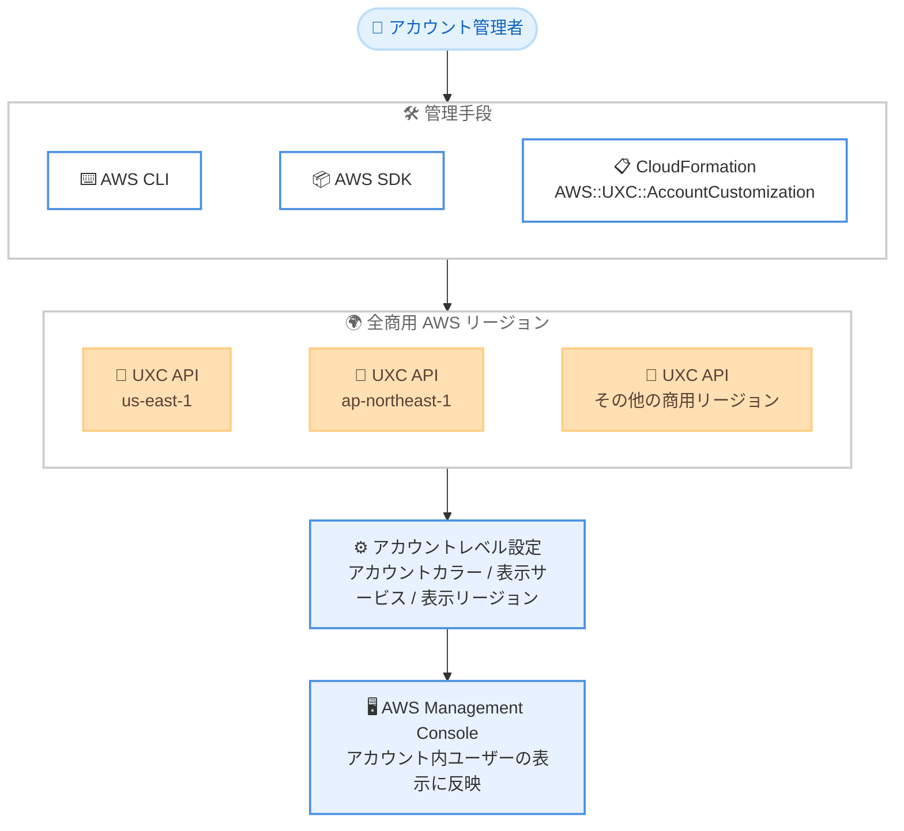

# AWS Management Console - AWS User Experience Customization (UXC) が全商用リージョンで利用可能に

**リリース日**: 2026 年 9 月 2 日
**サービス**: AWS Management Console (AWS User Experience Customization)
**機能**: AWS User Experience Customization (UXC) の全商用 AWS リージョンへの拡大

📊 [このアップデートのインフォグラフィックを見る](https://takech9203.github.io/aws-news-summary/20260902-aws-uxc-aws-regions.html)

## 概要

AWS User Experience Customization (UXC) が、すべての商用 AWS リージョンで利用可能になりました。UXC は、アカウント管理者が AWS Management Console の見た目をアカウントレベルでカスタマイズできるユーティリティです。アカウントカラーの設定、コンソールに表示するサービスの制御 (サービス可視性)、リージョンセレクターに表示するリージョンの制御 (リージョン可視性) の 3 つの設定を管理できます。

今回のアップデートにより、UXC の設定を任意の商用リージョンのエンドポイントから AWS CLI、AWS SDK、AWS CloudFormation で管理できるようになりました。既存のインフラストラクチャ自動化と同じリージョンでコンソール体験の設定を一緒に管理できるため、IaC への組み込みが容易になります。

マルチアカウント環境を運用する組織にとって、開発・検証・本番アカウントの視覚的な区別 (アカウントカラー) や、利用サービスを絞り込んだシンプルなコンソール表示を、自動化パイプラインから一元的に展開できる点が価値となります。

**アップデート前の課題**

これまで UXC は米国東部 (バージニア北部) リージョンのみで提供されていました。

- 課題 1: UXC の設定をプログラムで管理する場合、API 呼び出しを us-east-1 の単一リージョンに向ける必要があった
- 課題 2: 他リージョンで完結しているインフラ自動化 (CLI、SDK、CloudFormation) に、us-east-1 向けの例外的な設定を組み込む必要があった
- 課題 3: リージョンを限定して運用する環境では、UXC のためだけに us-east-1 へのアクセスを許可する考慮が必要だった

**アップデート後の改善**

- 改善 1: すべての商用 AWS リージョンのエンドポイントから UXC の設定を管理できるようになった
- 改善 2: 既存のインフラ自動化と同じリージョンで、AWS CLI、AWS SDK、AWS CloudFormation を使ってコンソールカスタマイズを構成できるようになった
- 改善 3: us-east-1 への API 呼び出しの振り分けが不要になり、IaC テンプレートやスクリプトがシンプルになった

## アーキテクチャ図



アカウント管理者は、任意の商用リージョンの UXC エンドポイントに対して CLI、SDK、CloudFormation から設定を適用でき、その結果はアカウントレベルの設定としてコンソール表示に反映されます。従来は us-east-1 のみが窓口でした。

## サービスアップデートの詳細

### 主要機能

1. **アカウントカラー (Account color)**
   - アカウントごとに色を設定し、コンソール上でアカウントを視覚的に区別できる
   - 例: 開発アカウントは緑、検証アカウントは黄、本番アカウントは赤
   - 有効な値: `none | pink | purple | darkBlue | lightBlue | teal | green | yellow | orange | red`
   - `none` を設定するとデフォルト (色なし) にリセットされる

2. **サービス可視性 (Service visibility)**
   - コンソールのナビゲーションに表示する AWS サービスを制御できる
   - アカウントに関係するサービスだけを表示し、コンソールをシンプルにできる
   - 有効なサービス識別子は `ListServices` API で取得できる

3. **リージョン可視性 (Region visibility)**
   - リージョンセレクターに表示する AWS リージョンを制御できる
   - アカウントで利用するリージョンだけを表示できる

4. **全商用リージョンからの管理 (今回のアップデート)**
   - AWS CLI、AWS SDK、AWS CloudFormation を使い、任意の商用リージョンから設定を管理できる
   - CloudFormation では `AWS::UXC::AccountCustomization` リソースタイプを使用する

## 技術仕様

### UXC の API

| API | 説明 |
|------|------|
| `GetAccountCustomizations` | 現在のアカウントカスタマイズ設定を取得 |
| `ListServices` | サービス可視性で使用できる有効なサービス識別子の一覧を取得 |
| `UpdateAccountCustomizations` | アカウントカラー、表示サービス、表示リージョンを 1 回のリクエストで更新 (冪等) |

### UpdateAccountCustomizations の設定項目

| 項目 | 型 | 制約 | デフォルトへのリセット |
|------|------|------|------|
| `accountColor` | String | `none` と 9 色から選択 | `none` を設定 |
| `visibleRegions` | 文字列配列 | 0〜100 項目 (リージョンコード) | `null` を設定 (全リージョン表示) |
| `visibleServices` | 文字列配列 | 0〜500 項目 (サービス識別子) | `null` を設定 (全サービス表示) |

### リクエスト例

```json
PATCH /v1/account-customizations
Content-type: application/json

{
  "accountColor": "red",
  "visibleRegions": ["us-east-1", "ap-northeast-1"],
  "visibleServices": ["ec2", "s3", "lambda"]
}
```

## 設定方法

### 前提条件

1. AWS アカウント
2. UXC に対する適切な IAM 権限 (AWS Management Console の IAM ドキュメントおよび AWS 管理ポリシーを参照)
3. プログラムで管理する場合は AWS CLI、AWS SDK、または AWS CloudFormation

### 手順

#### ステップ 1: 現在の設定を確認する

```bash
aws uxc get-account-customizations --region ap-northeast-1
```

現在のアカウントカスタマイズ設定 (アカウントカラー、表示サービス、表示リージョン) を取得します。今回のアップデートにより、`--region` に任意の商用リージョンを指定できます。

#### ステップ 2: 有効なサービス識別子を確認する

```bash
aws uxc list-services --region ap-northeast-1
```

サービス可視性の設定で使用できる有効なサービス識別子の一覧を取得します。

#### ステップ 3: アカウントカスタマイズを更新する

```bash
aws uxc update-account-customizations \
  --region ap-northeast-1 \
  --account-color red \
  --visible-regions us-east-1 ap-northeast-1 \
  --visible-services ec2 s3 lambda
```

アカウントカラーを赤に設定し、コンソールに表示するリージョンとサービスを絞り込みます。リクエストに含めた設定のみが更新され、省略した設定は変更されません。

#### ステップ 4: コンソールで設定する場合

- アカウントカラー: ナビゲーションバーのアカウント名 → [Account] → [Account display settings] で色を選択して [Update]
- 表示リージョン / 表示サービス: [Unified Settings] を開き、[Visible Regions] / [Visible services] セクションで [Edit] → 設定後に [Save changes]

## メリット

### ビジネス面

- **アカウント誤操作リスクの低減**: 本番アカウントを赤にするなど視覚的な区別により、マルチアカウント環境での誤ったアカウントでの操作を防ぎやすくなる
- **オンボーディングの簡素化**: 利用するサービスとリージョンだけを表示することで、新しいメンバーがコンソールで迷いにくくなる
- **追加コストなし**: UXC は追加料金なしで利用できる

### 技術面

- **リージョンローカルな自動化**: 既存のインフラ自動化と同じリージョンで UXC を管理でき、us-east-1 への例外的な API 呼び出しが不要になる
- **IaC 対応**: CloudFormation の `AWS::UXC::AccountCustomization` リソースで、アカウントカスタマイズをコードとして管理・展開できる
- **冪等な API**: `UpdateAccountCustomizations` は冪等であり、部分更新 (指定した項目のみ変更) をサポートするため自動化に組み込みやすい
- **CloudTrail 対応**: UXC の API 呼び出しは AWS CloudTrail に記録され、監査が可能

## デメリット・制約事項

### 制限事項

- `visibleServices` と `visibleRegions` はコンソールの表示のみを制御する。AWS CLI、SDK、その他の API 経由のアクセスは制限されない (アクセス制御には IAM や SCP を使用する)
- `visibleRegions` は最大 100 項目、`visibleServices` は最大 500 項目
- 商用リージョンが対象であり、設定はアカウントレベルで適用される (ユーザー個人ごとの設定ではない)

### 考慮すべき点

- 表示の制御はセキュリティ境界ではないため、サービスやリージョンの利用制限が目的の場合は SCP (Service Control Policies) や IAM ポリシーと併用する
- アカウントレベルの設定であるため、変更は同一アカウントを利用するすべてのユーザーのコンソール表示に影響する
- サービス識別子は `ListServices` で確認できる値のみが有効なため、自動化に組み込む際は事前検証を行う

## ユースケース

### ユースケース 1: マルチアカウント環境でのアカウントカラー標準化

**シナリオ**: 開発・検証・本番の 3 アカウント構成で、操作対象アカウントの取り違えを防ぎたい。

**実装例**:
```bash
# 本番アカウントで実行
aws uxc update-account-customizations --region ap-northeast-1 --account-color red

# 検証アカウントで実行
aws uxc update-account-customizations --region ap-northeast-1 --account-color yellow

# 開発アカウントで実行
aws uxc update-account-customizations --region ap-northeast-1 --account-color green
```

**効果**: コンソールの配色でアカウントを即座に判別でき、本番環境での誤操作リスクを低減できる。

### ユースケース 2: CloudFormation によるアカウント設定の一括展開

**シナリオ**: 新規アカウントの払い出し時に、コンソールカスタマイズを IaC で自動適用したい。

**実装例**:
```yaml
Resources:
  AccountCustomization:
    Type: AWS::UXC::AccountCustomization
    Properties:
      AccountColor: teal
      VisibleRegions:
        - ap-northeast-1
        - us-east-1
      VisibleServices:
        - ec2
        - s3
        - cloudwatch
```

**効果**: アカウントベンディングのパイプラインに組み込むことで、払い出し直後から統一されたコンソール体験を提供できる。今回のアップデートにより、他のリソースと同じリージョンのスタックで管理できる。

### ユースケース 3: 利用サービスを絞ったシンプルなコンソール表示

**シナリオ**: データ分析チーム向けアカウントで、利用するサービスとリージョンのみを表示してコンソールを簡素化したい。

**実装例**:
```bash
aws uxc update-account-customizations \
  --region ap-northeast-1 \
  --visible-regions ap-northeast-1 \
  --visible-services athena glue s3 quicksight
```

**効果**: ナビゲーションとリージョンセレクターが必要なものだけに絞られ、チームメンバーが目的のサービスへ迷わず到達できる。

## 料金

UXC は追加料金なしで利用できます。

## 利用可能リージョン

すべての商用 AWS リージョンで利用可能です (これまでは米国東部 (バージニア北部) のみ)。

## 関連サービス・機能

- **AWS Management Console Unified Settings**: 表示サービス・表示リージョンをコンソールから設定する際の入口となる設定画面
- **AWS CloudFormation**: `AWS::UXC::AccountCustomization` リソースタイプによる IaC 管理に対応
- **AWS CloudTrail**: UXC の API 呼び出しを記録し、設定変更の監査に利用できる
- **AWS Organizations / SCP**: 表示制御はアクセス制御ではないため、サービス・リージョンの実際の利用制限には SCP との併用が必要

## 参考リンク

- 📊 [インフォグラフィック](https://takech9203.github.io/aws-news-summary/20260902-aws-uxc-aws-regions.html)
- [公式発表 (What's New)](https://aws.amazon.com/about-aws/whats-new/2026/08/aws-uxc-aws-regions/)
- [AWS User Experience Customization ドキュメント](https://docs.aws.amazon.com/awsconsolehelpdocs/latest/gsg/uxc.html)
- [Getting started with AWS User Experience Customization](https://docs.aws.amazon.com/awsconsolehelpdocs/latest/gsg/getting-started-uxc.html)
- [UXC API Reference](https://docs.aws.amazon.com/awsconsolehelpdocs/latest/APIReference/Welcome.html)

## まとめ

AWS User Experience Customization (UXC) が全商用リージョンに拡大し、アカウントカラーや表示サービス・リージョンの設定を任意のリージョンから CLI、SDK、CloudFormation で管理できるようになりました。マルチアカウント環境を運用する組織は、アカウントベンディングや既存の IaC パイプラインに UXC を組み込み、誤操作防止とコンソールの簡素化を標準化することを推奨します。なお、表示制御はアクセス制御ではないため、利用制限が目的の場合は SCP や IAM と併用してください。
