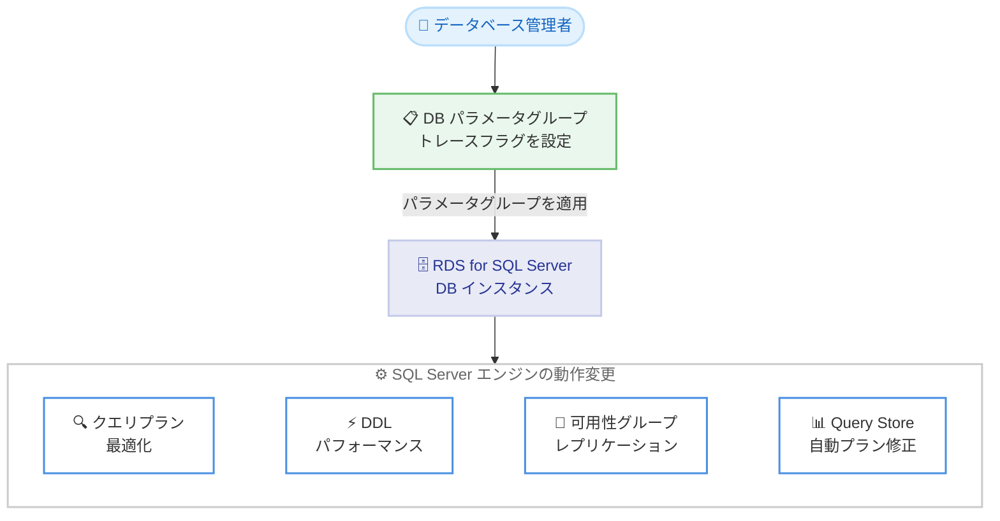

# Amazon RDS for SQL Server - 追加の SQL トレースフラグをサポート

**リリース日**: 2026 年 9 月 2 日
**サービス**: Amazon RDS for SQL Server
**機能**: 18 個の追加 SQL トレースフラグのサポート

📊 [このアップデートのインフォグラフィックを見る](https://takech9203.github.io/aws-news-summary/20260902-rds-sqlserver-supports-additional-trace-flags.html)

## 概要

Amazon RDS for SQL Server が、データベースパラメータグループを通じて有効化できる 18 個の追加 SQL トレースフラグをサポートしました。トレースフラグは、クエリオプティマイザのカーディナリティ推定、ロックエスカレーション、統計管理、メモリハンドリングなど、SQL Server エンジンの動作を変更する設定スイッチです。データベース管理者はこれらを使用して、パフォーマンスのファインチューニングやワークロード固有の課題への対処を行えます。

今回の拡張により、マネージド環境である RDS 上でも、SQL Server ワークロードの最適化と安定化をより柔軟に実施できるようになりました。オンプレミスやセルフマネージド環境からの移行時に、既存のトレースフラグ設定を維持しやすくなる点も重要です。

**アップデート前の課題**

RDS はマネージドサービスであるため、SQL Server の低レベルな設定変更には制約がありました。

- RDS for SQL Server で有効化できるトレースフラグが限られており、特定のパフォーマンス問題やエンジンの既知の不具合への対処が困難だった
- オンプレミス環境で利用していたトレースフラグが RDS でサポートされていない場合、移行の障壁となっていた
- クエリプランの最適化や可用性グループのレプリケーション動作などを細かく制御する手段が不足していた

**アップデート後の改善**

今回のアップデートにより、以下が可能になりました。

- 18 個の追加トレースフラグをパラメータグループ経由で有効化し、SQL Server エンジンの動作を細かく制御できる
- クエリプラン最適化、DDL パフォーマンス改善、可用性グループレプリケーション、Query Store の動作、自動プラン修正、既知のエンジン不具合の緩和といったシナリオに対応できる
- OS へのアクセスなしに、マネージド環境のままワークロード固有のチューニングを実施できる

## アーキテクチャ図



データベース管理者がパラメータグループでトレースフラグを設定し、DB インスタンスに適用することで、SQL Server エンジンの各種動作を変更する流れを示しています。

## サービスアップデートの詳細

### 主要機能

1. **18 個の追加トレースフラグのサポート**
   - 新たにサポートされたトレースフラグ: 647、652、1448、3654、4138、4139、7745、8285、8780、9432、9481、9492、9592、11024、11042、12502、12618、12656
   - データベースパラメータグループを通じて有効化する
   - OS レベルの操作や起動パラメータの直接編集は不要

2. **幅広いチューニングシナリオへの対応**
   - クエリプラン最適化: カーディナリティ推定やオプティマイザ動作の制御
   - DDL パフォーマンス改善
   - 可用性グループのレプリケーション動作の調整
   - Query Store の動作制御と自動プラン修正
   - 既知のエンジン不具合の緩和

3. **マネージド環境との統合**
   - パラメータグループによる一元管理のため、複数インスタンスへの一貫した適用が可能
   - パラメータグループの変更履歴により設定の追跡が容易

### 代表的なトレースフラグの例

以下は今回サポートされたフラグのうち、Microsoft のドキュメントで広く知られているものの例です。各フラグの正確な動作は Microsoft の公式ドキュメント (DBCC TRACEON - Trace Flags) を確認してください。

| トレースフラグ | 一般的な用途 |
|------|------|
| 4138 | クエリオプティマイザの row goal 変更を無効化し、特定のクエリプラン問題を回避 |
| 9481 | 新しいカーディナリティ推定器の環境でレガシーカーディナリティ推定 CE 70 を使用 |
| 7745 | シャットダウンやフェイルオーバー時の Query Store のディスク書き込みを抑制し、フェイルオーバー時間を短縮 |
| 1448 | 非同期セカンダリの確認応答を待たずにレプリケーションログリーダーを進行 |

## 技術仕様

### 設定方法の概要

| 項目 | 詳細 |
|------|------|
| 設定手段 | DB パラメータグループ |
| 対象 | Amazon RDS for SQL Server の DB インスタンス |
| 追加フラグ数 | 18 個 |
| 適用方法 | パラメータグループを更新し DB インスタンスに適用 |

## 設定方法

### 前提条件

1. Amazon RDS for SQL Server の DB インスタンスが稼働していること
2. カスタム DB パラメータグループを作成できる IAM 権限があること
3. 有効化するトレースフラグの動作と影響を非本番環境で検証済みであること

### 手順

#### ステップ1: カスタムパラメータグループの作成

```bash
aws rds create-db-parameter-group \
    --db-parameter-group-name my-sqlserver-traceflags \
    --db-parameter-group-family sqlserver-se-16.0 \
    --description "SQL Server trace flags parameter group"
```

SQL Server のエンジンバージョンに対応したパラメータグループファミリーを指定して、カスタムパラメータグループを作成します。

#### ステップ2: トレースフラグの有効化

```bash
aws rds modify-db-parameter-group \
    --db-parameter-group-name my-sqlserver-traceflags \
    --parameters "ParameterName='4138',ParameterValue='1',ApplyMethod=pending-reboot"
```

有効化したいトレースフラグのパラメータ値を 1 に設定します。トレースフラグの適用には再起動が必要な場合があります。

#### ステップ3: DB インスタンスへの適用

```bash
aws rds modify-db-instance \
    --db-instance-identifier my-sqlserver-instance \
    --db-parameter-group-name my-sqlserver-traceflags \
    --apply-immediately
```

作成したパラメータグループを DB インスタンスに関連付けます。パラメータグループの変更後、インスタンスの再起動が必要な場合はメンテナンスウィンドウまたは手動再起動で反映します。

## メリット

### ビジネス面

- **移行の促進**: オンプレミスで利用していたトレースフラグを RDS でも維持できるため、マネージドサービスへの移行障壁が低減される
- **運用コストの削減**: セルフマネージド環境に戻ることなく、マネージド環境のままきめ細かなチューニングが可能
- **安定性の向上**: 既知のエンジン不具合の緩和策を適用でき、本番ワークロードの安定稼働に寄与する

### 技術面

- **柔軟なパフォーマンスチューニング**: カーディナリティ推定、ロックエスカレーション、統計管理などエンジンレベルの制御が可能
- **高可用性構成の最適化**: 可用性グループのレプリケーションや Query Store のフェイルオーバー動作を調整できる
- **一元管理**: パラメータグループによって複数インスタンスへ一貫した設定を適用できる

## デメリット・制約事項

### 制限事項

- サポートされるトレースフラグは AWS が許可したものに限られる (今回の 18 個を含む)
- トレースフラグの適用には DB インスタンスの再起動が必要な場合がある
- パラメータグループファミリーはエンジンバージョンに依存する

### 考慮すべき点

- トレースフラグは SQL Server エンジンのコア動作を変更するため、本番環境に適用する前に必ず非本番環境でテストする必要がある
- 一部のトレースフラグはシステムパフォーマンスへの影響、メモリ使用量の増加、予期しないクエリ実行プランの変化を引き起こす可能性がある
- 各フラグの動作は SQL Server のバージョンによって異なる場合があるため、Microsoft の公式ドキュメントで確認が必要

## ユースケース

### ユースケース1: レガシーカーディナリティ推定への切り戻し

**シナリオ**: SQL Server のバージョンアップ後、新しいカーディナリティ推定器によって特定のクエリのプランが悪化し、パフォーマンスが劣化した。

**実装例**:
```bash
aws rds modify-db-parameter-group \
    --db-parameter-group-name my-sqlserver-traceflags \
    --parameters "ParameterName='9481',ParameterValue='1',ApplyMethod=pending-reboot"
```

**効果**: レガシーカーディナリティ推定を使用することで、アプリケーション改修なしに以前のクエリプラン動作を維持できる。

### ユースケース2: フェイルオーバー時間の短縮

**シナリオ**: マルチ AZ 構成の RDS for SQL Server で、Query Store のディスク書き込みによりフェイルオーバーに時間がかかっている。

**実装例**:
```bash
aws rds modify-db-parameter-group \
    --db-parameter-group-name my-sqlserver-traceflags \
    --parameters "ParameterName='7745',ParameterValue='1',ApplyMethod=pending-reboot"
```

**効果**: シャットダウン時の Query Store データ書き込みを抑制し、フェイルオーバー時間を短縮できる。直近の Query Store データが失われる可能性とのトレードオフを評価した上で適用する。

### ユースケース3: オンプレミスからの移行

**シナリオ**: オンプレミスの SQL Server で複数のトレースフラグを運用しており、RDS 移行後も同じエンジン動作を維持したい。

**実装例**:
```bash
aws rds modify-db-parameter-group \
    --db-parameter-group-name my-sqlserver-traceflags \
    --parameters \
      "ParameterName='4138',ParameterValue='1',ApplyMethod=pending-reboot" \
      "ParameterName='1448',ParameterValue='1',ApplyMethod=pending-reboot"
```

**効果**: 既存環境と同等のエンジン動作を RDS 上で再現でき、移行後の動作差異によるリスクを低減できる。

## 料金

トレースフラグの利用およびパラメータグループの作成・適用に追加料金は発生しません。通常の Amazon RDS for SQL Server のインスタンス料金、ストレージ料金、ライセンス料金のみが適用されます。

## 利用可能リージョン

Amazon RDS for SQL Server が提供されているすべての AWS リージョンで利用可能です。

## 関連サービス・機能

- **DB パラメータグループ**: トレースフラグを含む DB エンジン設定を管理する RDS の機能。今回のアップデートの設定手段
- **Amazon RDS Custom for SQL Server**: OS やデータベース環境へのより深いアクセスが必要な場合の選択肢。標準の RDS でトレースフラグがサポートされたことで、RDS Custom を選択せずに済むケースが増える
- **Amazon RDS マルチ AZ 配置**: 可用性グループ関連のトレースフラグは、マルチ AZ 構成のレプリケーションやフェイルオーバー動作の調整に関連する

## 参考リンク

- 📊 [インフォグラフィック](https://takech9203.github.io/aws-news-summary/20260902-rds-sqlserver-supports-additional-trace-flags.html)
- [公式発表 (What's New)](https://aws.amazon.com/about-aws/whats-new/2026/09/rds-sqlserver-supports-additional-trace-flags/)
- [Amazon RDS for SQL Server ユーザーガイド](https://docs.aws.amazon.com/AmazonRDS/latest/UserGuide/CHAP_SQLServer.html)
- [Amazon RDS for SQL Server 製品ページ](https://aws.amazon.com/rds/sqlserver/)
- [Amazon RDS for SQL Server 料金ページ](https://aws.amazon.com/rds/sqlserver/pricing/)

## まとめ

Amazon RDS for SQL Server で 18 個の追加トレースフラグがサポートされ、マネージド環境のままエンジンレベルのきめ細かなチューニングが可能になりました。オンプレミスからの移行や、クエリプラン・フェイルオーバー動作の最適化を検討しているチームにとって有用なアップデートです。トレースフラグはエンジンのコア動作を変更するため、必ず非本番環境で影響を検証してから本番適用することを推奨します。
