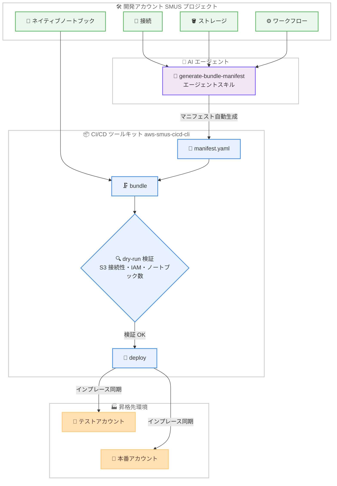

# Amazon SageMaker Unified Studio - CI/CD ノートブックプロモーションと AI 支援マニフェスト生成

**リリース日**: 2026 年 9 月 2 日
**サービス**: Amazon SageMaker Unified Studio
**機能**: CI/CD ツールキットのノートブックプロモーションと AI 支援マニフェスト生成

📊 [このアップデートのインフォグラフィックを見る](https://takech9203.github.io/aws-news-summary/20260902-sagemaker-cicd-notebook-ai-manifest.html)

## 概要

Amazon SageMaker Unified Studio (SMUS) の CI/CD 向けオープンソースデプロイツールキット (`aws-smus-cicd-cli`) に、2 つの新機能が追加されました。1 つ目は、マニフェスト作成を自動化する AI エージェントスキル「generate-bundle-manifest」、2 つ目は、環境間でネイティブノートブックを昇格 (プロモーション) させる「ネイティブノートブックプロモーション」です。

generate-bundle-manifest エージェントスキルは、プロジェクトの接続、ストレージ、ワークフローを検査し、すぐに使用できるデプロイマニフェストを生成します。最小権限の IAM ガイダンスの適用、ハードコードされたリソース識別子の環境変数への置換、カタログ処理のオプトインなどの安全なデフォルト設定が組み込まれています。ネイティブノートブックプロモーションは、コード、ワークフロー、カタログアセットに加えて、SMUS ネイティブノートブックを開発、テスト、本番の各環境に昇格させる機能です。

これらの機能により、データチームはプロジェクトから本番環境への移行を高速化しながら、ステージ間でベストプラクティスに基づくデフォルト設定を維持できます。両機能ともオープンソースとして提供されます。

**アップデート前の課題**

- デプロイマニフェスト (manifest.yaml) は手動で作成する必要があり、プロジェクトの接続やストレージ、ワークフロー構成を把握した上で記述する手間があった
- マニフェストにリソース識別子をハードコードしてしまうと、環境間での移植性が損なわれ、IAM 権限も過剰になりがちだった
- SMUS ネイティブノートブックは CI/CD ツールキットの昇格対象に含まれておらず、環境間での移行に別途手作業が必要だった

**アップデート後の改善**

- AI エージェントスキルがプロジェクトを検査し、最小権限 IAM ガイダンスと環境変数置換を適用したマニフェストを自動生成できるようになった
- ネイティブノートブックをコード、ワークフロー、カタログアセットと一緒に環境間で昇格できるようになった
- インプレース同期モデルにより、初回デプロイでノートブックを作成し、以降のデプロイで更新するため、リリースをまたいで実行履歴が保持されるようになった
- ドライランモードで S3 接続性、IAM 権限、ノートブック数をデプロイ前に検証できるようになった

## アーキテクチャ図



AI エージェントスキルが開発プロジェクトの構成を検査してマニフェストを自動生成し、CI/CD ツールキットがノートブックを含むアセットをテスト、本番環境へインプレース同期で昇格させる流れを示しています。

## サービスアップデートの詳細

### 主要機能

1. **AI 支援マニフェスト生成 (generate-bundle-manifest エージェントスキル)**
   - プロジェクトの接続、ストレージ、ワークフローを検査し、すぐに使用できるデプロイマニフェストを自動生成
   - 最小権限の IAM ガイダンスを適用し、過剰な権限付与を防止
   - ハードコードされたリソース識別子の代わりに環境変数を使用し、環境間の移植性を確保
   - カタログ処理のオプトインなど、安全なデフォルト設定を適用
   - チームは自社のエージェントにスキルをインポートし、開発、テスト、本番アカウント間での SMUS プロジェクトのパッケージングと昇格方法を標準化可能
   - AgentSkills 互換のコーディングエージェント (Kiro、Amazon Q CLI、Claude Code など) から利用可能

2. **ネイティブノートブックプロモーション**
   - SMUS ネイティブノートブックを、コード、ワークフロー、カタログアセットと一緒に環境間で昇格
   - インプレース同期モデルを採用し、初回デプロイでノートブックを作成、以降のデプロイでは更新することで、リリースをまたいで実行履歴を保持
   - プロジェクト内のすべてのノートブックの一括昇格と、ID 指定による特定ノートブックの選択的昇格の両方に対応
   - ドライランモードにより、S3 接続性、IAM 権限、ノートブック数をデプロイ前に検証
   - 既存の bundle、deploy、destroy、dry-run コマンドと統合されており、現行のパイプライン構造の変更は不要

## 技術仕様

### CI/CD ツールキットの主要コマンド

| コマンド | 用途 |
|------|------|
| `create` | マニフェストの初期化 |
| `describe --connect` | 設定の検証と接続確認 |
| `bundle` | バージョン管理されたデプロイアーティファクトの作成 |
| `deploy --targets <stage> --dry-run` | デプロイのプレビューとドライラン検証 |
| `deploy --targets <stage>` | 指定ステージへのデプロイ |
| `test --targets <stage>` | デプロイ後の検証テスト実行 |
| `destroy --targets <stage>` | リソースのクリーンアップ |
| `monitor` | ワークフロー監視 |

### マニフェストの主な構成要素

| セクション | 説明 |
|------|------|
| `applicationName` | アプリケーション名 |
| `content` | デプロイ対象 (ストレージ、Git リポジトリ、ワークフロー、QuickSight など) |
| `stages` | 環境定義。各ステージは独立した SMUS プロジェクトにマッピング |
| `environment_variables` | 環境固有の設定値 |
| `bootstrap.actions` | デプロイ時アクションの順次実行 (ワークフロー作成・実行、接続作成など) |

マニフェストでは `${AWS_ACCOUNT_ID}` のような変数置換や、`{proj.connection...}`、`{domain.region}` 形式の動的参照がサポートされます。

## 設定方法

### 前提条件

1. Amazon SageMaker Unified Studio のドメインとプロジェクトが作成済みであること (IAM ベースと IAM Identity Center ベースの両ドメインに対応)
2. Python 実行環境があり、`aws-smus-cicd-cli` をインストールできること
3. デプロイ先アカウントへの適切な IAM 権限が設定されていること

### 手順

#### ステップ 1: CLI のインストール

```bash
pip install aws-smus-cicd-cli
```

SMUS CI/CD ツールキットの CLI を PyPI からインストールします。

#### ステップ 2: AI エージェントスキルによるマニフェスト生成

GitHub リポジトリの `skills/generate-bundle-manifest` を、AgentSkills 互換のコーディングエージェント (Kiro、Amazon Q CLI、Claude Code など) にインポートし、「このプロジェクト用の SMUS CI/CD マニフェストを生成して」と依頼します。エージェントがプロジェクトの接続、ストレージ、ワークフローを検査し、環境変数置換と最小権限 IAM ガイダンスを適用した `manifest.yaml` を生成します。

#### ステップ 3: ドライランによる検証

```bash
smus-cli deploy --manifest manifest.yaml --targets test --dry-run
```

デプロイを実行する前に、S3 接続性、IAM 権限、ノートブック数などを検証します。問題がある場合はこの段階で検出できます。

#### ステップ 4: バンドル作成とデプロイ

```bash
smus-cli bundle --manifest manifest.yaml
smus-cli deploy --manifest manifest.yaml --targets test
```

バージョン管理されたデプロイアーティファクトを作成し、テストステージへデプロイします。ノートブックは初回デプロイで作成され、以降のデプロイでは実行履歴を保持したままインプレースで更新されます。検証後、`--targets prod` で本番ステージへ昇格します。

## メリット

### ビジネス面

- **本番化までの時間短縮**: マニフェスト作成の自動化とノートブック昇格の統合により、プロジェクトから本番環境への移行が高速化される
- **ガバナンスの標準化**: エージェントスキルを組織のエージェントにインポートすることで、チーム間でパッケージングと昇格の方法を標準化できる
- **追加コストなし**: ツールキットはオープンソースであり、CLI 自体の利用は無料。デプロイ時にプロビジョニングされる AWS リソースの料金のみが発生する

### 技術面

- **最小権限のデフォルト適用**: AI 生成マニフェストに最小権限 IAM ガイダンスが組み込まれ、セキュリティベストプラクティスを維持しやすい
- **環境間の移植性**: リソース識別子を環境変数に置換するため、開発、テスト、本番アカウント間で同一マニフェストを再利用できる
- **実行履歴の保持**: インプレース同期モデルにより、ノートブックの実行履歴がリリースをまたいで保持される
- **既存パイプラインとの互換性**: 既存の bundle、deploy、destroy、dry-run コマンドに統合されており、パイプライン構造の変更が不要

## デメリット・制約事項

### 制限事項

- ネイティブノートブックプロモーションの対象は SMUS ネイティブノートブックであり、昇格には S3 接続性と適切な IAM 権限が必要
- IAM Identity Center ベースの SMUS ドメインでは追加のセットアップが必要
- ツールキットはオープンソースの CLI であり、マネージドサービスとしての SLA は提供されない

### 考慮すべき点

- AI エージェントスキルが生成したマニフェストは、デプロイ前に内容 (対象リソース、IAM 設定、環境変数) をレビューすることが推奨される
- ステージごとに独立した SMUS プロジェクトへのマッピングが前提となるため、環境分離の設計を事前に検討する必要がある
- ドライランモードを CI/CD パイプラインに組み込み、本番デプロイ前の検証ゲートとして活用することが望ましい

## ユースケース

### ユースケース 1: データサイエンスチームのノートブック本番昇格

**シナリオ**: データサイエンスチームが開発プロジェクトで作成した分析ノートブックを、テスト環境での検証を経て本番環境へ定期的にリリースしたい。

**実装例**:
```bash
# 特定のノートブックのみを選択して昇格対象に含めたマニフェストでドライラン検証
smus-cli deploy --manifest manifest.yaml --targets test --dry-run

# 検証後にテスト環境、本番環境へ順次デプロイ
smus-cli deploy --manifest manifest.yaml --targets test
smus-cli deploy --manifest manifest.yaml --targets prod
```

**効果**: ノートブックの実行履歴を保持したまま環境間で同期でき、手作業によるノートブックのエクスポートやインポートが不要になる。

### ユースケース 2: AI エージェントによるマニフェスト作成の標準化

**シナリオ**: 複数のデータチームを抱える組織で、各チームがそれぞれ独自の方法でマニフェストを作成しており、IAM 権限の付与方法やリソース参照の書き方が統一されていない。

**実装例**:
```
1. GitHub リポジトリの skills/generate-bundle-manifest を組織標準のコーディングエージェントにインポート
2. 各チームがエージェントに「SMUS CI/CD マニフェストを生成して」と依頼
3. 最小権限 IAM ガイダンスと環境変数置換が適用されたマニフェストが自動生成される
```

**効果**: 組織全体でマニフェストの品質とセキュリティ設定が標準化され、レビュー負荷とセキュリティリスクが低減する。

### ユースケース 3: CI/CD パイプラインへのノートブックデプロイの組み込み

**シナリオ**: GitHub Actions で構築済みの SMUS デプロイパイプラインに、ノートブックの昇格も追加したい。ただし既存のパイプライン構造は変更したくない。

**実装例**:
```yaml
# 既存の GitHub Actions ワークフローに dry-run ステップを追加
- name: Validate deployment
  run: smus-cli deploy --manifest manifest.yaml --targets prod --dry-run
- name: Deploy to production
  run: smus-cli deploy --manifest manifest.yaml --targets prod
```

**効果**: ノートブックプロモーションは既存の bundle、deploy コマンドに統合されているため、マニフェストにノートブックを追加するだけで既存パイプラインをそのまま利用できる。

## 料金

CI/CD ツールキット (`aws-smus-cicd-cli`) および generate-bundle-manifest エージェントスキルはオープンソース (Apache-2.0 ライセンス) として無料で提供されます。デプロイ時にプロビジョニングされる AWS リソース (SageMaker Unified Studio プロジェクト、S3、ワークフローなど) に対して通常の料金が発生します。

## 利用可能リージョン

Amazon SageMaker Unified Studio が提供されているすべての AWS リージョンで利用可能です。

## 関連サービス・機能

- **Amazon SageMaker Unified Studio**: データと AI 開発のための統合環境。本ツールキットの昇格対象となるプロジェクト、ノートブック、ワークフローをホストする
- **Amazon DataZone**: SMUS のドメイン、プロジェクト、接続の基盤。ツールキットは DataZone API を抽象化してデプロイを自動化する
- **Amazon MWAA / SageMaker Unified Studio Workflows**: マニフェストで定義するワークフローの実行基盤。ノートブックの並列実行オーケストレーションにも利用される
- **Kiro / Amazon Q Developer CLI**: generate-bundle-manifest エージェントスキルをインポートして利用できる AgentSkills 互換のコーディングエージェント

## 参考リンク

- 📊 [インフォグラフィック](https://takech9203.github.io/aws-news-summary/20260902-sagemaker-cicd-notebook-ai-manifest.html)
- [公式発表 (What's New)](https://aws.amazon.com/about-aws/whats-new/2026/09/sagemaker-cicd-notebook-ai-manifest/)
- [GitHub リポジトリ: CICD-for-SageMakerUnifiedStudio](https://github.com/aws/CICD-for-SageMakerUnifiedStudio)
- [ドキュメント: CI/CD for Amazon SageMaker Unified Studio](https://docs.aws.amazon.com/sagemaker-unified-studio/latest/userguide/cicd.html)

## まとめ

このアップデートにより、SMUS プロジェクトの本番昇格における 2 つの大きな手作業、すなわちマニフェストの手動作成とノートブックの個別移行が自動化されました。既存の CI/CD パイプライン構造を変更せずに導入できるため、SMUS でデータや AI アプリケーションを運用しているチームは、GitHub リポジトリのエージェントスキルとノートブックプロモーション機能をまずドライランモードで試すことを推奨します。
