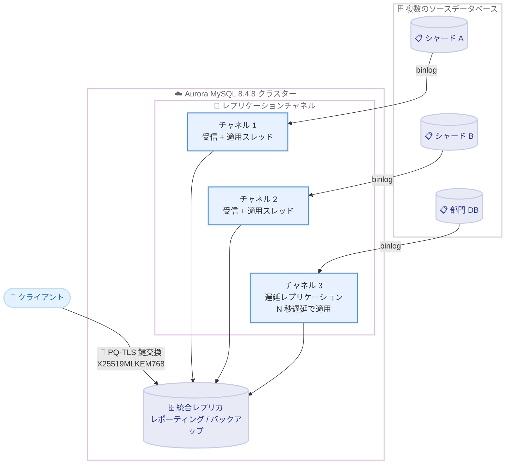

# Amazon Aurora MySQL - 8.4.8 (MySQL 8.4.8 互換) の一般提供開始

**リリース日**: 2026 年 9 月 3 日
**サービス**: Amazon Aurora MySQL-Compatible Edition
**機能**: Aurora MySQL 8.4.8 (MySQL 8.4.8 互換) の一般提供

📊 [このアップデートのインフォグラフィックを見る](https://takech9203.github.io/aws-news-summary/20260903-amazon-aurora-mysql-848-available.html)

## 概要

Amazon Aurora MySQL-Compatible Edition 8.4 が MySQL 8.4.8 をサポートしました。Aurora MySQL 8.4.8 は、コミュニティ版 MySQL 8.4.8 のセキュリティ強化とバグ修正を取り込むことに加え、ポスト量子 TLS (PQ-TLS) 鍵交換、トランザクションタイムアウト、マルチソースレプリケーション、遅延レプリケーションといった複数の重要な機能強化を含むリリースです。

PQ-TLS は転送中データの暗号化にポスト量子暗号のオプションを提供し、将来の量子コンピュータによる解読リスク (Harvest Now, Decrypt Later 攻撃) への備えとなります。トランザクションタイムアウトは、長時間実行トランザクションが InnoDB パージをブロックすることによる性能問題の防止に役立ちます。マルチソースレプリケーションは複数のソースデータベースから単一のレプリカクラスターへのデータ統合を可能にし、遅延レプリケーションは設定可能なレプリケーション遅延によって誤操作によるデータ損失からの保護を実現します。

アップグレードは、自動マイナーバージョンアップグレードによるメンテナンスウィンドウ中の適用、インプレースアップグレード、スナップショット復元のいずれかで実施できます。大規模環境では AWS Organizations の Upgrade Rollout Policy を使用して、複数クラスターへの段階的なアップグレード展開をオーケストレーションできます。

**アップデート前の課題**

- ポスト量子暗号による TLS 接続のオプションがなく、将来の量子コンピュータによる暗号解読リスクへの備えが限定的だった
- 長時間実行トランザクション (アクティブまたはアイドル) が InnoDB パージをブロックし、履歴リストの肥大化による性能劣化を引き起こす可能性があった
- Aurora MySQL クラスターは単一のソースからしかバイナリログレプリケーションを受けられず、複数データベースの統合には別の仕組みが必要だった
- レプリカはソースの変更を即時に適用するため、誤った `DROP TABLE` や `DELETE` がレプリカにも即座に伝播し、復旧にはフルリストアが必要だった

**アップデート後の改善**

- TLS 1.3 接続でポスト量子ハイブリッド鍵交換 (X25519MLKEM768、SecP256r1MLKEM768) がサポートされ、量子耐性のある暗号化通信が可能になった
- `aurora_transaction_timeout` パラメータにより InnoDB トランザクションの最大実行時間を制御し、パージブロックによる性能問題を予防できるようになった
- マルチソースレプリケーションにより、複数の MySQL 互換ソースから単一の Aurora MySQL クラスターへのデータ統合 (シャードのマージ、レポーティング、バックアップ集約) が可能になった
- 遅延レプリケーションにより、レプリカに意図的な適用遅延を設定でき、誤操作からの迅速な復旧手段を確保できるようになった
- 多数の CVE 修正 (高深刻度 3 件、中深刻度 17 件、低深刻度 1 件) と可用性・性能の改善が適用された

## アーキテクチャ図



Aurora MySQL 8.4.8 のマルチソースレプリケーションでは、ソースごとに専用のレプリケーションチャネル (受信スレッド、適用スレッド、リレーログ) を持ち、複数のソースから単一クラスターへデータを統合できます。遅延レプリケーションと PQ-TLS 鍵交換も本バージョンで利用可能です。

## サービスアップデートの詳細

### 主要機能

1. **ポスト量子 TLS (PQ-TLS) 鍵交換**
   - TLS 1.3 接続でポスト量子ハイブリッド鍵交換 (X25519MLKEM768 および SecP256r1MLKEM768) をサポート
   - ポスト量子鍵交換に対応したクライアントは、量子耐性のある共有シークレットを自動的にネゴシエート
   - 現在のセッションで使用されている鍵交換グループは `SHOW STATUS LIKE 'Ssl_named_group';` で確認可能
   - 「今収集して将来解読する」攻撃への対策として、転送中データの長期的な機密性を保護

2. **トランザクションタイムアウト**
   - 新しい `aurora_transaction_timeout` パラメータで InnoDB トランザクションの最大実行時間 (秒) を設定
   - アクティブまたはアイドル状態の長時間実行トランザクションが InnoDB パージをブロックすることによる性能問題を防止
   - 履歴リストの肥大化やストレージ使用量増加といった典型的な MySQL 性能課題への予防的な対策

3. **マルチソースレプリケーション**
   - 単一の Aurora MySQL クラスターが複数の MySQL 互換ソースから同時にバイナリログレプリケーションを受信可能
   - ソースごとに専用のレプリケーションチャネル (受信スレッド、適用スレッド、リレーログ) を割り当て
   - チャネル単位の新しいストアドプロシージャで各接続を設定・管理
   - シャードのマージ、地域別・部門別データベースの集約、レポーティングやバックアップの一元化に活用可能

4. **遅延レプリケーション**
   - binlog レプリカとして動作する Aurora MySQL クラスターに、ソースから受信したトランザクションの適用を指定秒数遅延させる設定が可能
   - 誤った `DROP TABLE` や `DELETE` などの人的ミスや論理的なデータ破損に対する復旧ウィンドウを確保
   - 有害な変更が適用される前にレプリケーションを停止してレプリカを昇格することで、フルリストアなしで迅速に復旧可能
   - アップグレード時のフォールバック先や、過去時点のデータ状態の確認手段としても活用可能

5. **セキュリティ修正**
   - 高深刻度 CVE 3 件、中深刻度 CVE 17 件、低深刻度 CVE 1 件の修正を含む
   - Advanced Audit ログが SQL SECURITY DEFINER ルーチン内の SQL 実行時に誤ったユーザー・ホストを記録する問題を修正
   - 書き込み転送使用時に `SET ROLE NONE` がロール権限を正しくクリアしない問題を修正

6. **可用性・性能の改善**
   - `ALTER TABLE ... REORGANIZE PARTITION` などのパーティション操作と並行処理の競合によるインスタンス再起動の問題を複数修正
   - Global Database スイッチオーバー中のライター再起動問題を修正し、スイッチオーバー時間を改善
   - ゼロダウンタイムパッチ適用 (ZDP) 時のダウンタイムを短縮
   - 新しい CloudWatch メトリクス `AuroraTempTableVolumeTotalBytes` を追加し、InnoDB 一時テーブルスペースのストレージ消費を監視可能に
   - パラレルクエリ有効時にハッシュ結合が誤った結果を返す可能性のある問題を修正

## 技術仕様

### バージョン情報

| 項目 | 詳細 |
|------|------|
| Aurora MySQL バージョン | 8.4.8 |
| 互換 MySQL バージョン | MySQL 8.4.8 (Community Edition) |
| 前バージョン | Aurora MySQL 8.4.7 (2026 年 5 月 21 日リリース) |
| PQ-TLS 鍵交換グループ | X25519MLKEM768、SecP256r1MLKEM768 (TLS 1.3) |
| 新パラメータ | `aurora_transaction_timeout` (InnoDB トランザクションの最大秒数) |
| 新 CloudWatch メトリクス | `AuroraTempTableVolumeTotalBytes` |
| マルチソース / 遅延レプリケーション | Aurora MySQL 8.4.8 以降でサポート |

### アップグレードパス

| アップグレード方法 | 説明 |
|------|------|
| 自動マイナーバージョンアップグレード | メンテナンスウィンドウ中に自動適用。大規模環境で推奨 |
| インプレースアップグレード | 既存クラスターを直接アップグレード。Aurora MySQL バージョン 3 からのメジャーバージョンアップグレードも可能 |
| スナップショット復元 | スナップショットから新バージョンのクラスターとして復元 |
| Blue/Green Deployments | マネージド Blue/Green アップグレードによりダウンタイムとリスクを最小化 |
| Upgrade Rollout Policy | AWS Organizations で組織内のクラスターへ段階的にアップグレードを展開 |

### PQ-TLS 鍵交換の確認方法

```sql
-- 現在のセッションでネゴシエートされた鍵交換グループを確認
SHOW STATUS LIKE 'Ssl_named_group';
```

ポスト量子鍵交換が使用されている場合、`X25519MLKEM768` または `SecP256r1MLKEM768` が表示されます。

## 設定方法

### 前提条件

1. Aurora MySQL クラスター (バージョン 3 系または 8.4 系) が稼働していること
2. アップグレード前にステージング環境でアプリケーションの互換性を検証すること
3. マルチソースレプリケーションを使用する場合、各ソースでバイナリログが有効であること

### 手順

#### ステップ 1: 利用可能なバージョンの確認

```bash
aws rds describe-db-engine-versions \
  --engine aurora-mysql \
  --query 'DBEngineVersions[?contains(EngineVersion, `8.4.8`)].{Version:EngineVersion,Description:DBEngineDescription}' \
  --output table
```

Aurora MySQL 8.4.8 がリージョンで利用可能かを確認します。`describe-db-engine-versions` は指定エンジンの利用可能なバージョン一覧を返します。

#### ステップ 2: クラスターのアップグレード

```bash
# インプレースでマイナーバージョンアップグレードを実行
aws rds modify-db-cluster \
  --db-cluster-identifier my-aurora-cluster \
  --engine-version 8.4.mysql_aurora.8.4.8 \
  --apply-immediately
```

既存の Aurora MySQL 8.4 クラスターを 8.4.8 へアップグレードします。`--apply-immediately` を省略すると次回メンテナンスウィンドウで適用されます。本番環境ではメンテナンスウィンドウでの適用または Blue/Green Deployments の利用を推奨します。

#### ステップ 3: 自動マイナーバージョンアップグレードの有効化 (推奨)

```bash
aws rds modify-db-instance \
  --db-instance-identifier my-aurora-instance \
  --auto-minor-version-upgrade \
  --apply-immediately
```

自動マイナーバージョンアップグレードを有効化し、今後のマイナーバージョンをメンテナンスウィンドウ中に自動適用します。複数クラスターを運用する組織では、AWS Organizations の Upgrade Rollout Policy と組み合わせることで、開発環境から本番環境へ段階的にアップグレードを展開できます。

#### ステップ 4: トランザクションタイムアウトの設定 (必要に応じて)

```bash
# カスタム DB クラスターパラメータグループでタイムアウトを設定 (例: 300 秒)
aws rds modify-db-cluster-parameter-group \
  --db-cluster-parameter-group-name my-aurora-params \
  --parameters "ParameterName=aurora_transaction_timeout,ParameterValue=300,ApplyMethod=immediate"
```

InnoDB トランザクションの最大実行時間を 300 秒に設定します。長時間トランザクションによる InnoDB パージのブロックを防止し、性能の安定化に寄与します。ワークロードに応じて適切な値を検証のうえ設定してください。

## メリット

### ビジネス面

- **将来のセキュリティリスクへの備え**: PQ-TLS により、量子コンピュータ時代を見据えた転送中データの長期的な保護が可能となり、金融・医療など規制の厳しい業界のコンプライアンス要件に対応しやすくなる
- **データ損失リスクの低減**: 遅延レプリケーションにより、人的ミスによるデータ破壊からの復旧時間が大幅に短縮され、事業継続性が向上する
- **運用コストの削減**: マルチソースレプリケーションにより、複数データベースの統合に別途 ETL ツールや中間システムを構築する必要がなくなる

### 技術面

- **予防的な性能管理**: `aurora_transaction_timeout` により長時間トランザクションを自動的に制御し、InnoDB パージのブロックや履歴リストの肥大化を未然に防止できる
- **柔軟なレプリケーショントポロジ**: チャネル単位のマルチソースレプリケーションにより、シャードのマージや部門別データベースの集約といった複雑な構成をマネージドサービス上で実現できる
- **安定性の向上**: パーティション DDL、書き込み転送、Global Database スイッチオーバー、Enhanced Binlog に関する多数の再起動・不具合修正により、クラスターの安定性が向上する
- **可観測性の強化**: 新メトリクス `AuroraTempTableVolumeTotalBytes` で一時テーブルスペースのストレージ消費を監視し、CloudWatch アラームによる早期検知が可能になる

## デメリット・制約事項

### 制限事項

- マルチソースレプリケーションと遅延レプリケーションは Aurora MySQL 8.4.8 以降でのみ利用可能 (バージョン 3 系では利用不可)
- PQ-TLS 鍵交換の利用には、ポスト量子鍵交換に対応したクライアントライブラリが必要 (非対応クライアントは従来の鍵交換にフォールバック)
- マルチソースレプリケーションでは、複数ソースからの書き込みが競合しないようスキーマ設計 (データベース名やテーブルの分離) に注意が必要

### 考慮すべき点

- アップグレード前にステージング環境でアプリケーションの互換性テストを実施することを推奨
- `aurora_transaction_timeout` の設定値が短すぎると、正常なバッチ処理や長時間クエリが中断される可能性があるため、ワークロードの特性を踏まえた検証が必要
- 遅延レプリケーションの遅延時間は、復旧ウィンドウの確保とデータ鮮度のトレードオフを考慮して設定する必要がある
- MySQL 8.0.42 で導入されたパーティションテーブルへの prepared statement 挿入に関するリグレッション (ERROR 1748) が本バージョンで修正されているため、該当環境では早期のアップグレードが望ましい

## ユースケース

### ユースケース 1: シャーディングされたデータベースの統合レポーティング

**シナリオ**: アプリケーションを複数の MySQL シャードで運用しており、全シャードを横断した分析・レポーティング用の統合ビューが必要。

**実装例**:
```sql
-- チャネルごとにソースを設定 (Aurora のストアドプロシージャを使用)
CALL mysql.rds_set_external_source_with_auto_position_for_channel(
  'shard-a.example.com', 3306, 'repl_user', 'password', 0, 'channel_shard_a');
CALL mysql.rds_start_replication_for_channel('channel_shard_a');

CALL mysql.rds_set_external_source_with_auto_position_for_channel(
  'shard-b.example.com', 3306, 'repl_user', 'password', 0, 'channel_shard_b');
CALL mysql.rds_start_replication_for_channel('channel_shard_b');
```

**効果**: 複数シャードのデータが単一の Aurora MySQL クラスターへリアルタイムに統合され、ETL パイプラインを構築することなく横断的なレポーティングとバックアップの一元化が実現する。

### ユースケース 2: 遅延レプリカによる誤操作対策

**シナリオ**: 運用担当者の誤った `DELETE` 文や `DROP TABLE` によるデータ損失に備え、フルリストアより高速な復旧手段を確保したい。

**実装例**:
```sql
-- レプリカに 1 時間 (3600 秒) の適用遅延を設定
CALL mysql.rds_set_source_delay(3600);

-- 誤操作が発覚した場合、レプリケーションを停止して調査
CALL mysql.rds_stop_replication;
-- 問題のトランザクションの直前まで適用してからレプリカを昇格
```

**効果**: 誤操作の発覚後、有害な変更がレプリカに適用される前にレプリケーションを停止して昇格することで、スナップショットからのフルリストア (数時間規模) と比較して大幅に短い時間で復旧できる。

### ユースケース 3: PQ-TLS による将来を見据えた通信保護

**シナリオ**: 金融機関が長期間の機密性が求められる顧客データを扱っており、「今収集して将来解読する」攻撃への対策として量子耐性のある通信暗号化を求めている。

**実装例**:
```sql
-- ポスト量子鍵交換対応クライアントで接続後、ネゴシエート結果を確認
SHOW STATUS LIKE 'Ssl_named_group';
-- 結果例: X25519MLKEM768
```

**効果**: アプリケーションと Aurora MySQL 間の TLS 1.3 通信がポスト量子ハイブリッド鍵交換で保護され、将来量子コンピュータが実用化された場合でも過去に傍受された通信データの解読リスクを低減できる。

## 料金

Aurora MySQL 8.4.8 へのアップグレードおよび新機能 (PQ-TLS、トランザクションタイムアウト、マルチソースレプリケーション、遅延レプリケーション) の利用に追加料金はありません。通常の Aurora の料金 (インスタンス時間、ストレージ、I/O または I/O-Optimized 構成) が適用されます。

マルチソースレプリケーションで統合するデータ量が増える場合は、ストレージ料金とレプリケーションに伴うネットワーク転送料金 (クロスリージョンの場合) を考慮してください。詳細は [Amazon Aurora 料金ページ](https://aws.amazon.com/rds/aurora/pricing/) を参照してください。

## 利用可能リージョン

Aurora MySQL が利用可能なすべての AWS リージョンで提供されています。対応リージョンの詳細は [Aurora の利用可能リージョン一覧](https://docs.aws.amazon.com/AmazonRDS/latest/AuroraUserGuide/Concepts.RegionsAndAvailabilityZones.html#Aurora.Overview.Availability.MySQL) を参照してください。

## 関連サービス・機能

- **Amazon RDS Blue/Green Deployments**: 本番環境への影響を最小化しながら Aurora MySQL 8.4.8 へのアップグレードを実施できるマネージドな Blue/Green 環境切り替え機能
- **AWS Organizations Upgrade Rollout Policy**: 組織内の複数クラスターに対して、開発から本番へ段階的にマイナーバージョンアップグレードを展開するポリシー管理機能
- **Amazon CloudWatch**: 新メトリクス `AuroraTempTableVolumeTotalBytes` を含む Aurora のメトリクス監視とアラーム設定
- **Aurora Global Database**: マルチリージョン耐障害性を提供。本バージョンではスイッチオーバー時の安定性が改善
- **AWS Certificate Manager / TLS**: PQ-TLS はクライアントと Aurora 間の TLS 1.3 接続の鍵交換を量子耐性のある方式に強化

## 参考リンク

- 📊 [インフォグラフィック](https://takech9203.github.io/aws-news-summary/20260903-amazon-aurora-mysql-848-available.html)
- [公式発表 (What's New)](https://aws.amazon.com/about-aws/whats-new/2026/09/amazon-aurora-mysql-848-available/)
- [マルチソース / 遅延レプリケーションの発表 (What's New)](https://aws.amazon.com/about-aws/whats-new/2026/09/amazon-aurora-mysql-multisourcerep-delayedrep/)
- [Aurora MySQL 8.4.8 リリースノート](https://docs.aws.amazon.com/AmazonRDS/latest/AuroraMySQLReleaseNotes/AuroraMySQL.Updates.848.html)
- [Aurora MySQL 8.4 リリースノート一覧](https://docs.aws.amazon.com/AmazonRDS/latest/AuroraMySQLReleaseNotes/AuroraMySQL.Updates.84Updates.html)
- [MySQL 8.4.8 リリースノート (MySQL 公式)](https://dev.mysql.com/doc/relnotes/mysql/8.4/en/news-8-4-8.html)
- [自動マイナーバージョンアップグレードのドキュメント](https://docs.aws.amazon.com/AmazonRDS/latest/AuroraUserGuide/AuroraMySQL.Updates.AMVU.html)
- [Upgrade Rollout Policy のドキュメント](https://docs.aws.amazon.com/AmazonRDS/latest/AuroraUserGuide/Aurora.Maintenance.AMVU.UpgradeRollout.html)
- [Amazon Aurora 製品ページ](https://aws.amazon.com/rds/aurora/)
- [Amazon Aurora 料金ページ](https://aws.amazon.com/rds/aurora/pricing/)

## まとめ

Aurora MySQL 8.4.8 は、PQ-TLS 鍵交換、トランザクションタイムアウト、マルチソースレプリケーション、遅延レプリケーションという実用性の高い機能強化に加え、多数の CVE 修正と安定性改善を含む重要なリリースです。セキュリティ修正が含まれるため、Aurora MySQL 8.4 系を利用中のクラスターは早期のアップグレード計画を推奨します。自動マイナーバージョンアップグレードと AWS Organizations の Upgrade Rollout Policy を活用することで、大規模環境でも安全かつ段階的にアップグレードを展開できます。
