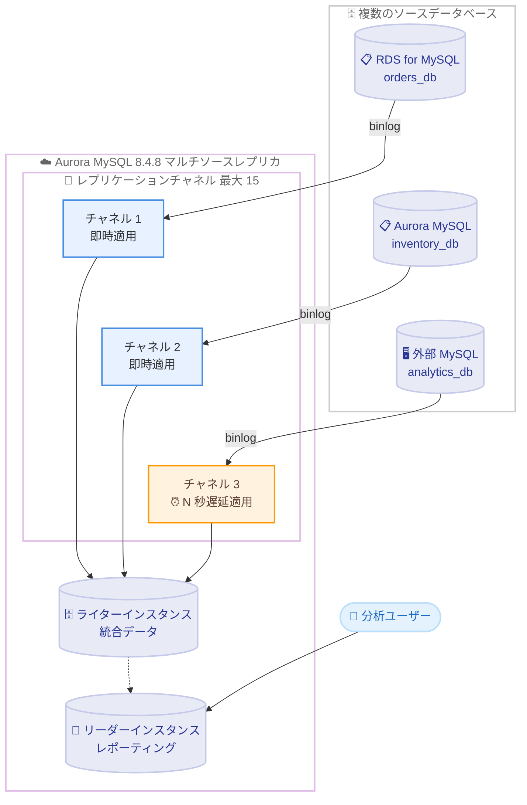

# Amazon Aurora MySQL - マルチソースレプリケーションと遅延レプリケーションのサポート

**リリース日**: 2026 年 9 月 3 日
**サービス**: Amazon Aurora MySQL-Compatible Edition
**機能**: マルチソースレプリケーション (Multi-Source Replication) および遅延レプリケーション (Delayed Replication)

📊 [このアップデートのインフォグラフィックを見る](https://takech9203.github.io/aws-news-summary/20260903-amazon-aurora-mysql-multisourcerep-delayedrep.html)

## 概要

Amazon Aurora MySQL が 2 つの新しいレプリケーション機能、マルチソースレプリケーションと遅延レプリケーションをサポートしました。いずれも Aurora MySQL バージョン 8.4.8 以降で利用可能です。

マルチソースレプリケーションは、単一の Aurora MySQL クラスターが複数のソースデータベースから同時にバイナリログ (binlog) レプリケーションを受信できる機能です。ソースには RDS for MySQL インスタンス、別の Aurora MySQL クラスター、RDS 外部の MySQL データベースを指定でき、シャードのマージや、地域別・部門別に分かれたデータベースを 1 か所に集約してレポーティングやバックアップを行うといった重要なユースケースを実現します。

遅延レプリケーションは、binlog レプリカがソースの変更を意図的に指定時間だけ遅らせて適用する機能です。ソース側で誤った `DROP TABLE` や `DELETE` などの有害な変更が実行された場合、その変更がレプリカに適用される前にレプリケーションを停止してレプリカを昇格することで、フルリストアを行わずに迅速に復旧できます。人的ミスや論理的なデータ破損に対するシンプルかつ強力なセーフガードとなるほか、アップグレード時のフォールバック先や過去時点のデータ確認手段としても活用できます。

**アップデート前の課題**

- Aurora MySQL クラスターは単一のソースからしか binlog レプリケーションを受信できず、複数の MySQL データベースの統合には AWS DMS などの別ツールや ETL パイプラインの構築が必要だった
- シャーディングされたデータベースを横断するレポーティングやバックアップの一元化に、追加の中間システムが必要だった
- レプリカはソースの変更を即時に適用するため、誤操作や論理破損がレプリカにも即座に伝播し、復旧にはスナップショットからのフルリストアやポイントインタイムリカバリが必要だった

**アップデート後の改善**

- 単一の Aurora MySQL クラスターに最大 15 のレプリケーションチャネルを構成し、複数ソースからのデータをリアルタイムに統合できるようになった
- チャネルごとに binlog 座標または GTID 自動ポジショニングを選択でき、チャネル単位のレプリケーションフィルターも設定可能になった
- レプリカに意図的な適用遅延を設定でき、有害な変更が適用される前にレプリケーションを停止してレプリカを昇格するという迅速な復旧手段を確保できるようになった
- チャネル単位の CloudWatch メトリクス `ReplicationChannelLag` により、ソースごとのレプリケーション遅延を監視できるようになった

## アーキテクチャ図



マルチソースレプリケーションでは、Aurora MySQL クラスターのライターインスタンスがレプリケーションターゲットとなり、ソースごとに独立したチャネルで binlog イベントを受信します。チャネルには遅延レプリケーションを組み合わせることも可能で、統合したデータは Aurora のリードスケーリングを活用してレポーティングに利用できます。

## サービスアップデートの詳細

### 主要機能

1. **マルチソースレプリケーション**
   - 単一の Aurora MySQL クラスターが複数の MySQL 互換ソースから同時に binlog レプリケーションを受信可能
   - ソースは RDS for MySQL、別の Aurora MySQL クラスター、RDS 外部の MySQL データベースに対応
   - 1 つのマルチソースレプリカに最大 15 チャネルを構成可能
   - チャネルごとに binlog ファイル位置ベースまたは GTID 自動ポジショニングベースのレプリケーションを選択可能
   - レプリケーションフィルターをグローバル (クラスターパラメータグループ) とチャネル単位の 2 レベルで設定でき、チャネル単位のフィルターが優先される
   - レプリケーションターゲットはクラスターのライター (プライマリ) インスタンスであり、すべてのストアドプロシージャはライターインスタンスに接続して実行する

2. **遅延レプリケーション**
   - binlog レプリカがソースから受信したトランザクションの適用を、指定した最小秒数だけ意図的に遅延
   - `mysql.rds_set_source_delay` プロシージャで設定 (上限 259,200 秒 = 72 時間)。チャネル単位の設定は `mysql.rds_set_source_delay_for_channel` (delay パラメータの上限 86,400 秒 = 1 日)
   - `mysql.rds_start_replication_until` / `mysql.rds_start_replication_until_gtid` と組み合わせて、有害な変更の直前までロールフォワードしてからレプリカを昇格する災害復旧フローを実現
   - 誤操作対策のほか、アップグレード時のフォールバック先や過去時点のデータ状態の確認にも活用可能

3. **チャネル単位の管理用ストアドプロシージャ**
   - `mysql.rds_set_external_source_for_channel`: binlog 座標ベースでチャネルを構成
   - `mysql.rds_set_external_source_with_auto_position_for_channel`: GTID 自動ポジショニングと任意の遅延でチャネルを構成
   - `mysql.rds_set_external_source_with_delay_for_channel`: binlog 座標ベース + 遅延指定でチャネルを構成
   - `mysql.rds_start_replication_for_channel` / `mysql.rds_stop_replication_for_channel`: チャネル単位の開始・停止
   - `mysql.rds_start_replication_until_for_channel` / `mysql.rds_start_replication_until_gtid_for_channel`: 指定位置・指定 GTID までのレプリケーション
   - `mysql.rds_reset_external_source_for_channel`: チャネルの削除 (関連リレーログも削除)
   - `mysql.rds_skip_repl_error_for_channel` / `mysql.rds_next_source_log_for_channel`: チャネル単位のエラー対処

4. **チャネル単位のモニタリング**
   - `SHOW REPLICA STATUS FOR CHANNEL 'channel_name'\G` でチャネルごとの I/O スレッド・SQL スレッドの状態、遅延秒数、エラーを確認可能
   - CloudWatch メトリクス `ReplicationChannelLag` により、チャネルごとのレプリケーション遅延を 60 秒間隔で監視 (15 日間保持)。しきい値超過時のアラーム設定が可能

## 技術仕様

### 機能仕様

| 項目 | 詳細 |
|------|------|
| 対応バージョン | Aurora MySQL 8.4.8 以降 |
| 最大チャネル数 | 15 チャネル / マルチソースレプリカ |
| 対応ソース | RDS for MySQL、Aurora MySQL クラスター、外部 MySQL データベース |
| レプリケーション方式 | binlog ファイル位置ベースまたは GTID 自動ポジショニング (チャネルごとに選択可能) |
| 遅延レプリケーションの上限 | `rds_set_source_delay`: 259,200 秒 (72 時間) / チャネル構成時の delay パラメータ: 86,400 秒 (1 日) |
| レプリケーションターゲット | Aurora クラスターのライター (プライマリ) インスタンス |
| フィルター | グローバルフィルターとチャネル単位フィルターの 2 レベル (チャネル単位が優先) |
| モニタリング | `SHOW REPLICA STATUS FOR CHANNEL`、CloudWatch メトリクス `ReplicationChannelLag` |
| 認証に関する注意 | 認証プラグイン `caching_sha2_password` (MySQL 8.4 のデフォルト) を使用するレプリケーションユーザーでは `ssl_encryption=1` の指定が必須 |

### リソースプランニング

レプリカに割り当てられるレプリケーションスレッドの総数は「(`replica_parallel_workers` + コーディネータースレッド 1) × チャネル数」です。たとえばデフォルトの `replica_parallel_workers` = 4 で 10 チャネルを構成すると 50 スレッドが割り当てられます。ソースの合計スループットとチャネル数に応じて、db.r6g.2xlarge 以上などの大きめのインスタンスクラスの使用を検討してください。なお、MySQL の仕様上、チャネルごとに異なる並列ワーカー数を設定することはできません。

## 設定方法

### 前提条件

1. Aurora MySQL 8.4.8 以降のクラスターが稼働しており、ライターインスタンスの `autocommit` パラメータが `1` に設定されていること
2. 各ソースでバイナリログが有効化され、binlog 保持期間が適切に設定されていること
3. 各ソースに `REPLICATION CLIENT` および `REPLICATION SLAVE` 権限を持つレプリケーションユーザーが作成されていること
4. Aurora ライターインスタンスから各ソースへのネットワーク接続 (セキュリティグループ、VPC ピアリング、VPN など) がソースごとに確保されていること

### 手順

#### ステップ 1: ソースの binlog 位置の確認と初期データのインポート

```sql
-- 各ソースで現在の binlog ファイルと位置を確認 (MySQL 8.4 以降)
SHOW BINARY LOG STATUS;
-- 結果例: mysql-bin-changelog.000045, Position: 3892
```

```bash
# ソースのデータを Aurora MySQL クラスターへコピー
mysqldump --databases orders_db --single-transaction --compress \
  -u admin -p --host=orders-db.xxxxx.us-east-1.rds.amazonaws.com | \
  mysql --host=my-aurora-cluster.cluster-xxxxx.us-east-1.rds.amazonaws.com -u admin -p
```

各ソースで binlog の座標を記録し、`mysqldump` で既存データを Aurora クラスターへインポートします。大規模データベースの場合は AWS DMS やスナップショット復元の利用が推奨されています。この作業をソースごとに繰り返します。

#### ステップ 2: レプリケーションチャネルの構成と開始

```sql
-- Aurora ライターインスタンスに接続し、チャネルを構成 (binlog 座標ベース)
CALL mysql.rds_set_external_source_for_channel(
  'orders-db.xxxxx.us-east-1.rds.amazonaws.com',
  3306, 'repl_user', 'password',
  'mysql-bin-changelog.000045', 3892, 0, 'orders_channel');

-- チャネルのレプリケーションを開始
CALL mysql.rds_start_replication_for_channel('orders_channel');
```

ステップ 1 で記録した binlog 座標を指定してチャネルを構成し、レプリケーションを開始します。GTID を使用する場合は `mysql.rds_set_external_source_with_auto_position_for_channel` を使用します。ソースごとに一意のチャネル名を指定して繰り返します。

#### ステップ 3: 遅延レプリケーションの設定 (必要に応じて)

```sql
-- 単一ソースのレプリカに 1 時間 3600 秒の遅延を設定
CALL mysql.rds_stop_replication;
CALL mysql.rds_set_source_delay(3600);
CALL mysql.rds_start_replication;

-- チャネル単位で遅延を設定する場合
CALL mysql.rds_stop_replication_for_channel('orders_channel');
CALL mysql.rds_set_source_delay_for_channel(3600, 'orders_channel');
CALL mysql.rds_start_replication_for_channel('orders_channel');
```

遅延を設定する前にレプリケーションを停止する必要があります。設定後にレプリケーションを再開すると、ソースの変更は指定した最小秒数が経過するまでレプリカに適用されません。

#### ステップ 4: レプリケーション状態の監視

```sql
-- すべてのチャネルの状態を確認
SHOW REPLICA STATUS\G

-- 特定チャネルの状態を確認
SHOW REPLICA STATUS FOR CHANNEL 'orders_channel'\G
```

`Replica_IO_Running` と `Replica_SQL_Running` が `Yes` であること、`Seconds_Behind_Source` が想定範囲内であることを確認します。あわせて CloudWatch メトリクス `ReplicationChannelLag` にアラームを設定し、チャネルごとの遅延を継続的に監視することを推奨します。

## メリット

### ビジネス面

- **データ統合コストの削減**: 複数の MySQL データベースの統合に別途 ETL ツールや中間システムを構築・運用する必要がなくなり、マネージドなレプリケーション機能だけでシャード統合やマルチテナント集約を実現できる
- **データ損失リスクの低減**: 遅延レプリカにより人的ミスや論理破損からの復旧時間が大幅に短縮され、RTO の改善と事業継続性の向上につながる
- **レポーティングの一元化**: 地域別・部門別に分散したデータを 1 つのクラスターに集約し、Aurora のリードスケーリングを活用した横断的な分析基盤を構築できる

### 技術面

- **柔軟なレプリケーショントポロジ**: 最大 15 チャネルをチャネルごとに独立して構成・開始・停止でき、binlog 座標と GTID 自動ポジショニングをチャネル単位で使い分けられる
- **きめ細かなフィルタリング**: グローバルとチャネル単位の 2 レベルのレプリケーションフィルターにより、ソースごとに複製対象のデータベース・テーブルを制御し、書き込み競合を回避できる
- **フルリストア不要の復旧フロー**: 遅延レプリカと `rds_start_replication_until` / `rds_start_replication_until_gtid` を組み合わせ、有害な変更の直前までロールフォワードしてから昇格するという精密な復旧が可能
- **運用性の高い監視**: チャネル単位の CloudWatch メトリクス `ReplicationChannelLag` により、ソースごとの遅延をアラームで自動検知できる。Aurora ライターのフェイルオーバー時もチャネル構成は共有ストレージに保持され、新しいライターで自動再開される

## デメリット・制約事項

### 制限事項

- Aurora MySQL 8.4.8 以降でのみ利用可能 (バージョン 3 系および 8.4.7 以前では利用不可)
- マルチソースレプリカに構成できるチャネルは最大 15
- MySQL のマルチソースレプリケーションには競合検出・解決の仕組みがなく、ソース間の変更が競合しないようにユーザー側で設計する必要がある (ソースごとに異なるデータベース・テーブルへ書き込む、`replicate-do-db` などのフィルターを使用する等)
- DB クラスタースナップショットにはマルチソースチャネルの構成が含まれないため、スナップショット復元後は各チャネルの再構成が必要
- チャネルごとに異なる並列ワーカー数は設定できない (MySQL の仕様)

### 考慮すべき点

- レプリケーションスレッド数は「(`replica_parallel_workers` + 1) × チャネル数」で増加するため、チャネル数とソースの合計スループットに応じたインスタンスクラスの選定が必要
- マルチソースレプリカへのアプリケーションからの直接書き込みによる競合を防ぐには、`CALL mysql.rds_set_read_only(1);` で読み取り専用モードを有効化することが推奨される
- 遅延レプリケーションの遅延時間は、復旧ウィンドウの確保とデータ鮮度のトレードオフを考慮して設定する必要がある
- チャネルの管理操作 (構成変更、エラースキップ、開始・停止) は一度に 1 チャネルずつ実施し、複数接続からの同時変更を避けることが推奨される
- ソース側でフェイルオーバーが発生するとチャネルが I/O エラーで停止する場合があり、`rds_start_replication_for_channel` での再開や、エラー 1236 発生時の `rds_next_source_log_for_channel` による対処が必要

## ユースケース

### ユースケース 1: シャーディングされたデータベースの統合レポーティング

**シナリオ**: アプリケーションを複数の RDS for MySQL シャードで運用しており、全シャードを横断した分析・レポーティングと長期バックアップの一元化が必要。

**実装例**:
```sql
-- Aurora ライターインスタンスでソースごとにチャネルを構成
CALL mysql.rds_set_external_source_for_channel(
  'shard-a.xxxxx.rds.amazonaws.com', 3306, 'repl_user', 'password',
  'mysql-bin-changelog.000045', 3892, 1, 'channel_shard_a');
CALL mysql.rds_start_replication_for_channel('channel_shard_a');

CALL mysql.rds_set_external_source_for_channel(
  'shard-b.xxxxx.rds.amazonaws.com', 3306, 'repl_user', 'password',
  'mysql-bin-changelog.000012', 1567, 1, 'channel_shard_b');
CALL mysql.rds_start_replication_for_channel('channel_shard_b');
```

**効果**: 複数シャードのデータが単一の Aurora MySQL クラスターへリアルタイムに統合され、ETL パイプラインを構築することなく、Aurora のリードレプリカを活用した横断レポーティングとバックアップの一元化が実現する。

### ユースケース 2: 遅延レプリカによる誤操作・論理破損対策

**シナリオ**: 運用担当者の誤った `DELETE` 文や `DROP TABLE`、アプリケーション不具合による論理的なデータ破損に備え、フルリストアより高速な復旧手段を確保したい。

**実装例**:
```sql
-- レプリカに 1 時間 3600 秒の適用遅延を設定
CALL mysql.rds_stop_replication;
CALL mysql.rds_set_source_delay(3600);
CALL mysql.rds_start_replication;

-- 誤操作が発覚したらレプリケーションを停止
CALL mysql.rds_stop_replication;
-- 有害な変更の直前の GTID まで適用してから停止
CALL mysql.rds_start_replication_until_gtid('3E11FA47-71CA-11E1-9E33-C80AA9429562:23');
-- その後、レプリカを新しいプライマリクラスターへ昇格
```

**効果**: 有害な変更がレプリカに適用される前にレプリケーションを制御し、問題発生直前の状態まで正確にロールフォワードしてから昇格できるため、スナップショットからのフルリストアと比較して復旧時間を大幅に短縮できる。

### ユースケース 3: マルチテナント集約によるコスト最適化

**シナリオ**: テナントごとに個別の MySQL インスタンスを運用しており、コスト最適化と管理の簡素化のために単一の Aurora クラスターへ集約したい。

**実装例**:
```sql
-- チャネル単位のフィルターでテナントごとの複製対象を制御し、
-- 読み取り専用モードで直接書き込みによる競合を防止
CALL mysql.rds_set_read_only(1);

-- テナント A, B, C をそれぞれ独立したチャネルで集約
CALL mysql.rds_start_replication_for_channel('tenant_a_channel');
CALL mysql.rds_start_replication_for_channel('tenant_b_channel');
CALL mysql.rds_start_replication_for_channel('tenant_c_channel');
```

**効果**: 複数のシングルテナントデータベースを 1 つの Aurora クラスターへ段階的に集約でき、インスタンス数の削減によるコスト最適化と運用の簡素化を実現できる。移行期間中もチャネル単位でレプリケーションを制御できるため、テナントごとに切り替えタイミングを調整できる。

## 料金

マルチソースレプリケーションおよび遅延レプリケーションの利用に追加料金はありません。通常の Aurora の料金 (インスタンス時間、ストレージ、I/O または I/O-Optimized 構成) が適用されます。

複数ソースからのデータ統合によりストレージ使用量とレプリカインスタンスの負荷が増加するため、チャネル数に応じたインスタンスクラスのコストと、クロスリージョンレプリケーションを行う場合のデータ転送料金を考慮してください。詳細は [Amazon Aurora 料金ページ](https://aws.amazon.com/rds/aurora/pricing/) を参照してください。

## 利用可能リージョン

Aurora MySQL が利用可能なすべての AWS リージョンで提供されています。対応リージョンの詳細は [Aurora の利用可能リージョン一覧](https://docs.aws.amazon.com/AmazonRDS/latest/AuroraUserGuide/Concepts.RegionsAndAvailabilityZones.html#Aurora.Overview.Availability.MySQL) を参照してください。

## 関連サービス・機能

- **Aurora MySQL 8.4.8**: 本機能の前提となるエンジンバージョン。PQ-TLS 鍵交換やトランザクションタイムアウトなどの機能強化も同時にリリース ([同日の発表レポート](./2026-09-03-amazon-aurora-mysql-848-available.md) 参照)
- **Amazon RDS for MySQL**: マルチソースレプリケーションのソースとして利用可能。RDS for MySQL 側でも同様のチャネルベースのレプリケーション機能を提供
- **AWS DMS**: 大規模データベースの初期データ移行や、異種データベース間の移行に利用。継続的なレプリケーションの代替手段
- **Amazon CloudWatch**: チャネル単位のメトリクス `ReplicationChannelLag` による遅延監視とアラーム設定
- **Aurora Global Database**: マルチリージョンの耐障害性が必要な場合の選択肢。遅延レプリケーションとは異なり、リージョン間のマネージドレプリケーションを提供

## 参考リンク

- 📊 [インフォグラフィック](https://takech9203.github.io/aws-news-summary/20260903-amazon-aurora-mysql-multisourcerep-delayedrep.html)
- [公式発表 (What's New)](https://aws.amazon.com/about-aws/whats-new/2026/09/amazon-aurora-mysql-multisourcerep-delayedrep/)
- [マルチソースレプリケーションの設定 (Aurora ユーザーガイド)](https://docs.aws.amazon.com/AmazonRDS/latest/AuroraUserGuide/AuroraMySQL.Replication.MultiSource.html)
- [マルチソースレプリケーション管理用ストアドプロシージャ](https://docs.aws.amazon.com/AmazonRDS/latest/AuroraUserGuide/mysql-stored-proc-multi-source-replication.html)
- [binlog レプリケーション用ストアドプロシージャ (rds_set_source_delay など)](https://docs.aws.amazon.com/AmazonRDS/latest/AuroraUserGuide/mysql-stored-proc-replicating.html)
- [MySQL マルチソースレプリケーションのドキュメント (MySQL 公式)](https://dev.mysql.com/doc/refman/8.4/en/replication-multi-source.html)
- [MySQL 遅延レプリケーションのドキュメント (MySQL 公式)](https://dev.mysql.com/doc/refman/8.4/en/replication-delayed.html)
- [Aurora MySQL 8.4 リリースノート](https://docs.aws.amazon.com/AmazonRDS/latest/AuroraMySQLReleaseNotes/AuroraMySQL.Updates.84Updates.html)
- [Amazon Aurora を使用した災害復旧のガイダンス (AWS Solutions Library)](https://docs.aws.amazon.com/solutions/disaster-recovery-using-amazon-aurora/)
- [Amazon Aurora 製品ページ](https://aws.amazon.com/rds/aurora/)
- [Amazon Aurora 料金ページ](https://aws.amazon.com/rds/aurora/pricing/)

## まとめ

マルチソースレプリケーションと遅延レプリケーションは、これまで RDS for MySQL や自己管理の MySQL でしか利用できなかった重要なレプリケーション機能を Aurora MySQL にもたらすアップデートです。シャード統合やレポーティング基盤の構築を外部ツールなしで実現できるほか、遅延レプリカは誤操作対策として費用対効果の高いセーフガードになります。利用には Aurora MySQL 8.4.8 以降が必要なため、これらの機能を活用したいクラスターはまずバージョンアップグレードの計画から始めることを推奨します。
