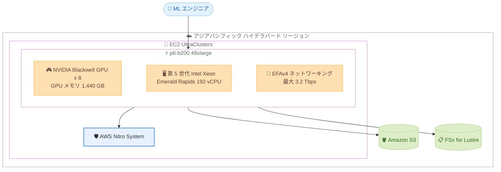

# Amazon EC2 - P6-B200 インスタンスがアジアパシフィック (ハイデラバード) リージョンで利用可能に

**リリース日**: 2026 年 9 月 3 日
**サービス**: Amazon EC2
**機能**: EC2 P6-B200 インスタンスのアジアパシフィック (ハイデラバード) リージョン対応

📊 [このアップデートのインフォグラフィックを見る](https://takech9203.github.io/aws-news-summary/20260903-amazon-ec2-p6-b200-instances-available-asia-pacific-hyderabad.html)

## 概要

NVIDIA Blackwell GPU を搭載した Amazon EC2 P6-B200 インスタンスが、新たにアジアパシフィック (ハイデラバード) リージョンで利用可能になりました。P6-B200 インスタンスは、AI トレーニングおよび推論において前世代の P5en インスタンスと比較して最大 2 倍のパフォーマンスを提供する、AWS の最新世代 GPU インスタンスです。

P6-B200 インスタンスは、8 基の NVIDIA Blackwell GPU (合計 1,440 GB の高帯域 GPU メモリ、P5en 比で GPU メモリ帯域幅 60% 向上)、第 5 世代 Intel Xeon プロセッサ (Emerald Rapids)、Elastic Fabric Adapter (EFAv4) による最大 3.2 Tbps のネットワーキングを備えています。AWS Nitro System 上に構築されており、EC2 UltraClusters 内で数万 GPU 規模まで安全かつ確実にスケールできます。

今回のリージョン拡大により、インドを拠点とする企業や、インド国内でのデータレジデンシー要件を持つ組織が、大規模な基盤モデルのトレーニングや推論ワークロードを低レイテンシーで実行できるようになります。ハイデラバードはムンバイに続くインド国内 2 つ目の対応リージョンです。

**アップデート前の課題**

- P6-B200 インスタンスはインド国内ではアジアパシフィック (ムンバイ) リージョンでのみ利用可能であり、リージョンレベルの冗長性を確保した AI ワークロードの構築が困難だった
- ハイデラバードリージョンを主要拠点とするユーザーは、Blackwell GPU を利用するために他リージョンへワークロードを配置する必要があった
- データレジデンシー要件と可用性要件の両方を満たしながら、インド国内で最新 GPU を使い分ける選択肢が限られていた

**アップデート後の改善**

- ハイデラバードリージョンで NVIDIA Blackwell GPU 搭載インスタンスを直接利用できるようになった
- インド国内でムンバイとハイデラバードの 2 リージョン構成が可能になり、GPU キャパシティの選択肢と冗長性が向上した
- P5en 比で最大 2 倍の AI トレーニング/推論性能を、インド国内のより多くのユーザーが活用できるようになった

## アーキテクチャ図



ハイデラバードリージョンにおける P6-B200 インスタンスの構成要素を示しています。8 基の Blackwell GPU と EFAv4 ネットワーキングを備えたインスタンスが EC2 UltraClusters 内でスケールし、S3 や FSx for Lustre と連携して大規模 AI ワークロードを処理します。

## サービスアップデートの詳細

### 主要機能

1. **NVIDIA Blackwell GPU による高性能 AI 処理**
   - 1 インスタンスあたり 8 基の NVIDIA Blackwell GPU を搭載
   - 合計 1,440 GB の高帯域 GPU メモリを提供
   - P5en 比で GPU メモリ帯域幅が 60% 向上
   - AI トレーニングおよび推論で P5en 比最大 2 倍のパフォーマンス

2. **高速ネットワーキングとスケーラビリティ**
   - EFAv4 による最大 3.2 Tbps のネットワーク帯域幅
   - EC2 UltraClusters 内で数万 GPU 規模までのスケールに対応
   - AWS Nitro System により安全で信頼性の高い基盤を提供

3. **最新世代 CPU との組み合わせ**
   - 第 5 世代 Intel Xeon プロセッサ (Emerald Rapids) を採用
   - GPU 処理の前後で必要となるデータ前処理などの CPU ワークロードにも高い性能を発揮

## 技術仕様

### p6-b200.48xlarge のスペック

| 項目 | 詳細 |
|------|------|
| インスタンスサイズ | p6-b200.48xlarge (単一サイズ) |
| GPU | NVIDIA Blackwell GPU x 8 |
| GPU メモリ | 合計 1,440 GB (高帯域メモリ) |
| GPU メモリ帯域幅 | P5en 比 60% 向上 |
| CPU | 第 5 世代 Intel Xeon (Emerald Rapids)、192 vCPU |
| システムメモリ | 2 TiB |
| ローカルストレージ | 30 TB NVMe SSD (3.84 TB x 8) |
| ネットワーク | 最大 3.2 Tbps (EFAv4、400 Gbps x 8) |
| EBS 帯域幅 | 100 Gbps |
| 基盤 | AWS Nitro System、EC2 UltraClusters |

注: システムメモリ、ローカルストレージ、EBS 帯域幅の値は 2025 年 5 月の GA 発表時の AWS News Blog に基づきます。

## 設定方法

### 前提条件

1. AWS アカウントを保有していること
2. アジアパシフィック (ハイデラバード) リージョン (ap-south-2) が有効化されていること
3. P6-B200 インスタンス用のキャパシティ (EC2 Capacity Blocks for ML など、利用可能な購入オプション) を確保していること

### 手順

#### ステップ 1: ハイデラバードリージョンでのインスタンスタイプ提供状況の確認

```bash
aws ec2 describe-instance-type-offerings \
  --region ap-south-2 \
  --filters "Name=instance-type,Values=p6-b200.48xlarge" \
  --query "InstanceTypeOfferings[].InstanceType"
```

ハイデラバードリージョン (ap-south-2) で p6-b200.48xlarge が提供されているかを確認します。

#### ステップ 2: インスタンスタイプの詳細確認

```bash
aws ec2 describe-instance-types \
  --region ap-south-2 \
  --instance-types p6-b200.48xlarge \
  --query "InstanceTypes[].{vCPU:VCpuInfo.DefaultVCpus,Memory:MemoryInfo.SizeInMiB,GPU:GpuInfo.Gpus}"
```

vCPU 数、メモリ、GPU 構成などの詳細スペックを確認します。

#### ステップ 3: インスタンスの起動

```bash
aws ec2 run-instances \
  --region ap-south-2 \
  --instance-type p6-b200.48xlarge \
  --image-id <Deep Learning AMI の ID> \
  --key-name <キーペア名> \
  --subnet-id <サブネット ID>
```

AWS Deep Learning AMI などを指定して P6-B200 インスタンスを起動します。Capacity Blocks for ML を使用する場合は、事前に予約したキャパシティ予約 ID を `--capacity-reservation-specification` で指定します。

## メリット

### ビジネス面

- **インド国内での AI 開発加速**: ハイデラバードを拠点とする企業が最新の Blackwell GPU をローカルで利用でき、AI 開発サイクルを短縮できる
- **データレジデンシー要件への対応**: インド国内にデータを保持したまま最先端 GPU による AI ワークロードを実行できる
- **リージョン冗長性の向上**: ムンバイとハイデラバードの 2 リージョンで GPU キャパシティを確保でき、事業継続性が向上する

### 技術面

- **最大 2 倍の性能向上**: P5en 比で AI トレーニング/推論性能が最大 2 倍となり、同じ処理をより短時間で完了できる
- **大容量 GPU メモリ**: 1,440 GB の GPU メモリにより、より大規模なモデルやより長いコンテキストの処理が可能
- **大規模分散トレーニング対応**: EFAv4 の 3.2 Tbps ネットワーキングと EC2 UltraClusters により、数万 GPU 規模の分散トレーニングに対応

## デメリット・制約事項

### 制限事項

- インスタンスサイズは p6-b200.48xlarge の単一サイズのみの提供
- 利用可能リージョンは限定的 (米国、GovCloud、インドの計 7 リージョン)
- GA 時点の購入オプションは EC2 Capacity Blocks for ML が中心であり、リージョンごとに利用可能な購入オプションが異なる場合があるため事前確認が必要

### 考慮すべき点

- 大規模 GPU インスタンスのためコストが高額になりやすく、ワークロードに応じた適切なサイジングとスケジューリングが重要
- Capacity Blocks for ML を利用する場合は事前予約が必要であり、料金は購入時に確定し前払いで請求される
- 分散トレーニングの性能を最大化するには、EFA や NCCL などの通信ライブラリの適切な設定が必要

## ユースケース

### ユースケース 1: 基盤モデルの大規模分散トレーニング

**シナリオ**: インド国内の AI 企業が、数百億パラメータ規模の基盤モデルをインド国内のデータを用いてトレーニングする。

**実装例**:
```
- ハイデラバードリージョンで Capacity Blocks for ML により P6-B200 キャパシティを予約
- EC2 UltraClusters 上で複数の P6-B200 インスタンスを EFAv4 で接続
- FSx for Lustre をトレーニングデータの高速ストレージとして構成
```

**効果**: P5en 比最大 2 倍の性能によりトレーニング時間を大幅に短縮し、データレジデンシー要件も満たしながらモデル開発を加速できる。

### ユースケース 2: 大規模言語モデルの低レイテンシー推論

**シナリオ**: インドのユーザー向けに LLM ベースのサービスを提供する企業が、推論基盤をユーザーの近くに配置する。

**実装例**:
```
- ハイデラバードリージョンに P6-B200 ベースの推論クラスターを構築
- 1,440 GB の GPU メモリを活用して大規模モデルを単一インスタンスにロード
- Amazon EKS でコンテナ化された推論サービスをオーケストレーション
```

**効果**: インド国内ユーザーへの応答レイテンシーを最小化しつつ、大規模モデルの高スループット推論を実現できる。

### ユースケース 3: マルチリージョン GPU 戦略による可用性向上

**シナリオ**: ムンバイリージョンで GPU ワークロードを運用中の企業が、キャパシティ確保と災害対策のためにセカンダリリージョンを追加する。

**実装例**:
```
- ムンバイをプライマリ、ハイデラバードをセカンダリとした 2 リージョン構成
- トレーニングジョブのチェックポイントを S3 クロスリージョンレプリケーションで同期
- キャパシティ状況に応じてジョブを両リージョンに振り分け
```

**効果**: インド国内で GPU キャパシティの選択肢が広がり、リージョン障害時にもワークロードを継続できる体制を構築できる。

## 料金

P6-B200 インスタンスの利用料金はリージョンおよび購入オプションにより異なります。GA 時点では EC2 Capacity Blocks for ML による提供が中心で、1〜14 日、21 日、28 日、または最大 182 日までの 7 日単位の期間で予約でき、開始日は最大 8 週間先まで指定できます。Capacity Blocks の料金は購入時に確定し、前払いで請求されます。

ハイデラバードリージョンでの最新の料金と購入オプションは、[Amazon EC2 料金ページ](https://aws.amazon.com/ec2/pricing/) および [EC2 Capacity Blocks for ML の料金ページ](https://aws.amazon.com/ec2/capacityblocks/pricing/) を参照してください。

## 利用可能リージョン

P6-B200 インスタンスは以下のリージョンで利用可能です。

- 米国西部 (オレゴン)
- 米国東部 (バージニア北部)
- 米国東部 (オハイオ)
- AWS GovCloud (US-West)
- AWS GovCloud (US-East)
- アジアパシフィック (ハイデラバード) ← 今回追加
- アジアパシフィック (ムンバイ)

## 関連サービス・機能

- **EC2 UltraClusters**: P6-B200 インスタンスを数万 GPU 規模まで接続する大規模クラスター基盤
- **Elastic Fabric Adapter (EFAv4)**: 最大 3.2 Tbps の低レイテンシーネットワーキングを提供し、分散トレーニングの通信性能を最大化
- **EC2 Capacity Blocks for ML**: GPU キャパシティを期間指定で事前予約できる購入オプション
- **Amazon FSx for Lustre / Amazon S3**: トレーニングデータやチェックポイントの高速ストレージとして連携
- **Amazon EKS / AWS Deep Learning AMI**: コンテナベースまたは AMI ベースでの ML 環境構築を支援

## 参考リンク

- 📊 [インフォグラフィック](https://takech9203.github.io/aws-news-summary/20260903-amazon-ec2-p6-b200-instances-available-asia-pacific-hyderabad.html)
- [公式発表 (What's New)](https://aws.amazon.com/about-aws/whats-new/2026/09/amazon-ec2-p6-b200-instances-available-asia-pacific-hyderabad)
- [AWS Blog: New Amazon EC2 P6-B200 instances powered by NVIDIA Blackwell GPUs to accelerate AI innovations](https://aws.amazon.com/blogs/aws/new-amazon-ec2-p6-b200-instances-powered-by-nvidia-blackwell-gpus-to-accelerate-ai-innovations/)
- [Amazon EC2 P6 インスタンス](https://aws.amazon.com/ec2/instance-types/p6/)
- [Amazon EC2 料金ページ](https://aws.amazon.com/ec2/pricing/)

## まとめ

NVIDIA Blackwell GPU を搭載した EC2 P6-B200 インスタンスがハイデラバードリージョンに拡大し、インド国内で 2 リージョン体制での最新 GPU 活用が可能になりました。インド国内でのデータレジデンシー要件を持つ組織や、大規模な AI トレーニング/推論ワークロードを運用する組織は、ハイデラバードでのキャパシティ確保と購入オプションを確認し、既存の P5en ベースのワークロードからの移行効果を評価することを推奨します。
