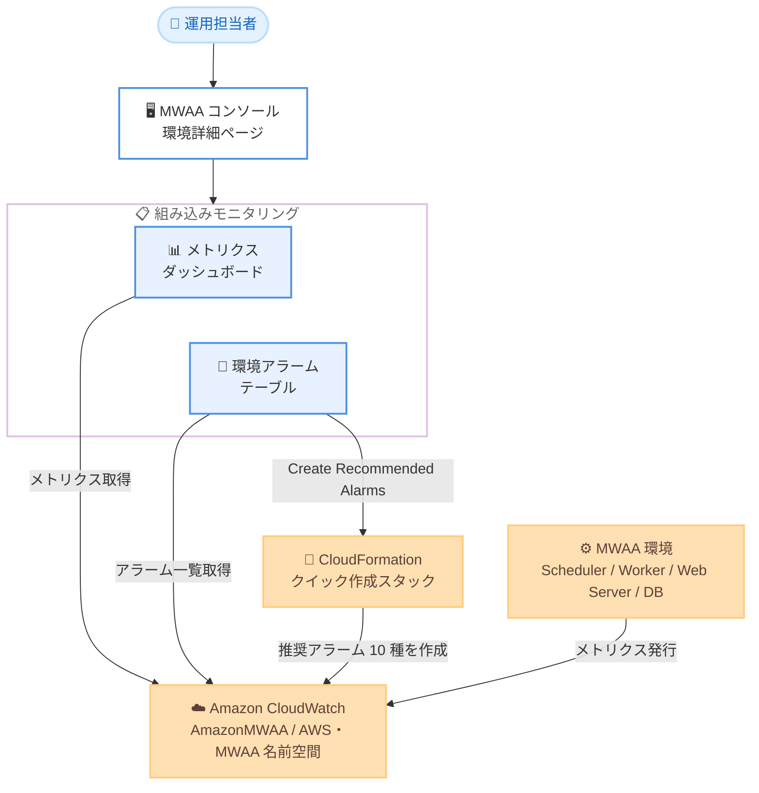

# Amazon MWAA - Amazon CloudWatch による組み込みモニタリング機能

**リリース日**: 2026 年 9 月 3 日
**サービス**: Amazon Managed Workflows for Apache Airflow (MWAA)
**機能**: 環境詳細ページの組み込みメトリクスダッシュボードと推奨アラームのワンクリック作成

📊 [このアップデートのインフォグラフィックを見る](https://takech9203.github.io/aws-news-summary/20260903-amazon-mwaa-cloudwatch-monitoring.html)

## 概要

Amazon Managed Workflows for Apache Airflow (MWAA) は、AWS マネジメントコンソールの環境詳細ページに組み込みのモニタリング機能を追加しました。新しいメトリクスダッシュボードは、環境の主要な Amazon CloudWatch メトリクスを 1 か所に表示し、各グラフには推奨される警告範囲 (suggested warning ranges) をオーバーレイ表示するオプションのトグルが用意されています。これにより、環境の健全性やパフォーマンスに影響を与える可能性のある状態を素早く特定できます。

また、環境詳細ページには MWAA 環境に関連付けられたすべての CloudWatch アラームを一覧表示するアラームテーブルも追加されました。ワンクリックの「Create Recommended Alarms」アクションを使用すると、AWS 管理のテンプレート (CloudFormation クイック作成スタック) から厳選されたアラームセットをプロビジョニングでき、各アラームを手動で設定することなく重要なメトリクスのモニタリングをすぐに開始できます。

本機能は、Apache Airflow ワークフローを運用するデータエンジニアリングチームや運用チームを対象としており、MWAA が利用可能なすべてのリージョンの Provisioned 環境で利用できます。

**アップデート前の課題**

このアップデート以前は、MWAA 環境のモニタリングには追加のセットアップ作業が必要でした。

- 環境のメトリクスを確認するには CloudWatch コンソールに移動し、`AmazonMWAA` と `AWS/MWAA` の 2 つの名前空間から必要なメトリクスを自分で探してカスタムダッシュボードを構築する必要があった
- どのメトリクスをどのしきい値で監視すべきかのガイダンスがコンソール上になく、ベストプラクティスに基づくアラーム設計を各チームが個別に検討する必要があった
- スケジューラーハートビートやワーカーの CPU 使用率などの重要なアラームを 1 つずつ手動で作成する必要があり、複数環境での標準化に手間がかかった

**アップデート後の改善**

- 環境詳細ページを開くだけで、コンテナ、データベースとキュー、スケジューラー、DAG 処理、タスク、Triggerer の 6 セクションに整理された主要メトリクスのグラフを追加設定なしで確認できるようになった
- 「Alarm recommendations」トグルにより、各グラフ上にアラームの推奨しきい値が注釈として表示され、異常な状態を視覚的に判断しやすくなった
- 「Create recommended alarms」ボタンから CloudFormation クイック作成スタックを起動するだけで、スケジューラーハートビートやリソース使用率など 10 種類の推奨アラームを一括作成できるようになった
- 環境に関連するすべての CloudWatch アラーム (自作のアラームを含む) を環境詳細ページ上のテーブルで一元的に確認できるようになった

## アーキテクチャ図



MWAA 環境が発行する CloudWatch メトリクスを、コンソールの環境詳細ページに埋め込まれたダッシュボードで直接可視化し、推奨アラームは CloudFormation スタック経由でワンクリック作成できます。

## サービスアップデートの詳細

### 主要機能

1. **組み込みメトリクスダッシュボード**
   - 環境詳細ページの「CloudWatch metrics」ペインに、追加設定なしで環境のグラフを表示
   - `AmazonMWAA` 名前空間 (Apache Airflow メトリクス) と `AWS/MWAA` 名前空間 (コンテナ、キュー、データベースメトリクス) の 2 つの名前空間からメトリクスを表示
   - 「Metric sections」フィルターで Containers、Database and queue、Scheduler、DAG processing、Tasks、Triggerer の 6 グループを切り替え可能
   - 「View all in CloudWatch」から CloudWatch コンソールの全メトリクスへ遷移可能

2. **アラーム推奨のオーバーレイ表示**
   - 「Alarm recommendations」トグルをオンにすると、推奨メトリクスのグラフのみを表示
   - 各グラフにアラームしきい値が注釈 (「Alarms if {metric} above / below」) として描画され、警告範囲を視覚的に確認可能

3. **環境アラームテーブル**
   - 環境に帰属する CloudWatch アラームを一覧表示 (名前空間と `Environment` ディメンションでマッチング)
   - 推奨アラームだけでなく、ユーザーが自作したアラームも表示対象
   - アラーム名、ステータス (In alarm / OK / Insufficient data)、条件、アクション、最終更新日時を表示
   - ペインヘッダーに現在 `ALARM` 状態のアラーム数 (In alarm カウント) を表示

4. **推奨アラームのワンクリック作成**
   - 「Create recommended alarms」ボタンで CloudFormation クイック作成スタックを新しいタブで起動
   - スタック名は `MWAA-alarms-{environment-name}` で、AWS 管理テンプレートから標準的な推奨アラームセットを作成
   - 各アラームは手動設定不要で、重要メトリクスのモニタリングを即座に開始可能

## 技術仕様

### ダッシュボードに表示される主なメトリクス

| セクション | 主なグラフ | CloudWatch メトリクス |
|------|------|------|
| Containers | Scheduler / Worker / Web server の CPU・メモリ使用率、ワーカーコンテナ数、ワーカーハートビート | CPUUtilization、MemoryUtilization、CeleryWorkerHeartbeat |
| Database and queue | データベースの空きメモリ、CPU 使用率、接続数、書き込みレイテンシ、最古のキュータスク経過時間 | FreeableMemory、CPUUtilization、DatabaseConnections、WriteLatency、ApproximateAgeOfOldestTask |
| Scheduler | スケジューラーハートビート、クリティカルセクション時間、タスク状態、外部強制終了タスク、Executor 空きスロット | SchedulerHeartbeat、CriticalSectionDuration、TasksExecutable、TasksStarving、TasksKilledExternally、OpenSlots |
| DAG processing | DAG 解析時間、DAG バッグサイズ、インポートエラー、DAG プロセッサーの健全性 | TotalParseTime、DagBagSize、ImportErrors、ProcessorTimeouts、ManagerStalls |
| Tasks | タスクキュー、タスクの成功と失敗、強制終了されたゾンビタスク | QueuedTasks、RunningTasks、TaskInstanceSuccesses、TaskInstanceFailures、ZombiesKilled |
| Triggerer | Triggerer ハートビート、トリガーの結果 | TriggererHeartbeat、TriggersSucceeded、TriggersFailed |

### 推奨アラームの内容

CloudFormation テンプレートが作成する推奨アラームは以下の 10 種類です。すべて 5 分 (300 秒) 間隔で評価されます。

| アラーム | メトリクス | しきい値条件 |
|------|------|------|
| Scheduler heartbeat | SchedulerHeartbeat | 合計 < 1 が 2/2 データポイント。欠損データはアラーム扱い |
| Oldest queued task age | ApproximateAgeOfOldestTask | 最大 > 1,800 秒が 3/3 データポイント |
| Scheduler CPU utilization | CPUUtilization (Scheduler) | 平均 > 95% が 3/3 データポイント |
| Scheduler memory utilization | MemoryUtilization (Scheduler) | 平均 > 95% が 3/3 データポイント |
| Worker CPU utilization | CPUUtilization (BaseWorker) | 平均 > 95% が 6/6 データポイント |
| Worker memory utilization | MemoryUtilization (BaseWorker) | 平均 > 95% が 6/6 データポイント |
| Web server CPU utilization | CPUUtilization (WebServer) | 平均 > 95% が 3/3 データポイント |
| Web server memory utilization | MemoryUtilization (WebServer) | 平均 > 95% が 3/3 データポイント |
| Database CPU utilization | CPUUtilization (WRITER) | 平均 > 95% が 3/3 データポイント |
| Database freeable memory | FreeableMemory (WRITER) | 平均 < 512 MiB が 3/3 データポイント |

### 必要な IAM 権限

コンソール上でダッシュボードとアラームテーブルを表示するには、IAM アイデンティティに以下の権限が必要です。

```json
{
  "Version": "2012-10-17",
  "Statement": [
    {
      "Effect": "Allow",
      "Action": [
        "cloudwatch:GetMetricData",
        "cloudwatch:GetMetricStatistics",
        "cloudwatch:ListMetrics",
        "cloudwatch:DescribeAlarms"
      ],
      "Resource": "*"
    }
  ]
}
```

`cloudwatch:GetMetricData` などのメトリクス読み取り権限がない場合、グラフはデータなしで描画されます。アラームテーブルの表示には `cloudwatch:DescribeAlarms` が必要です。

## 設定方法

### 前提条件

1. Amazon MWAA の Provisioned 環境が作成済みであること
2. IAM アイデンティティに CloudWatch メトリクスの読み取り権限とアラームの参照権限があること
3. 推奨アラームを作成する場合、CloudFormation スタックを作成する権限があること

### 手順

#### ステップ 1: メトリクスダッシュボードの確認

1. [Amazon MWAA コンソール](https://console.aws.amazon.com/mwaa/home) を開き、対象の環境を選択して環境詳細ページを開く
2. 「CloudWatch metrics」ペインで、環境のグラフを確認する
3. 「Metric sections」フィルターで表示するグループ (Containers、Scheduler など) を絞り込む
4. 「Alarm recommendations」トグルをオンにして、推奨メトリクスと警告範囲の注釈を表示する

追加のセットアップは不要で、環境詳細ページを開くだけでメトリクスを確認できます。

#### ステップ 2: 推奨アラームの作成

1. 環境詳細ページの「Monitoring」ビューで「Alarms」ペインを表示する
2. 「Create recommended alarms」を選択すると、CloudFormation クイック作成スタックが新しいタブで開く
3. CloudFormation コンソールでスタック内容を確認し、必要に応じて IAM リソース作成の確認事項にチェックを入れる
4. 「Create stack」を選択する

スタック `MWAA-alarms-{environment-name}` の作成が完了すると、10 種類の推奨アラームが「Environment alarms」テーブルと CloudWatch コンソールに表示されます。

#### ステップ 3: アラームの運用

1. 「Alarms」ペインの「In alarm」カウントで、現在 `ALARM` 状態のアラーム数を確認する
2. アラーム名のリンクから CloudWatch コンソールの詳細に遷移し、通知アクション (SNS トピックなど) を必要に応じて設定する
3. 「Manage in CloudWatch」から CloudWatch コンソールのアラームページを開き、しきい値の調整や独自アラームの追加を行う

自作したアラームも、名前空間と `Environment` ディメンションが一致すれば「Environment alarms」テーブルに自動的に表示されます。

## メリット

### ビジネス面

- **運用開始までの時間短縮**: ダッシュボード構築やアラーム設計をゼロから行う必要がなく、環境作成直後からベストプラクティスに沿ったモニタリングを開始できる
- **障害の早期検知**: スケジューラーハートビートの停止やタスクキューの滞留など、ワークフロー遅延につながる状態を早期に検知し、データパイプラインの SLA 維持に貢献する
- **標準化の促進**: AWS 管理テンプレートによる推奨アラームを使用することで、複数環境・複数チーム間でモニタリング基準を統一しやすくなる

### 技術面

- **コンテキストを維持した監視**: MWAA コンソールと CloudWatch コンソールを行き来することなく、環境詳細ページ上でメトリクスとアラームを一元的に確認できる
- **推奨しきい値の可視化**: 「Alarm recommendations」トグルにより、各メトリクスの推奨警告範囲がグラフ上に注釈表示され、正常・異常の判断基準が明確になる
- **IaC との親和性**: 推奨アラームは CloudFormation スタックとして作成されるため、内容の確認やテンプレートを参考にしたカスタマイズが容易

## デメリット・制約事項

### 制限事項

- 本機能は MWAA Provisioned 環境が対象であり、ダッシュボードは環境全体の集約メトリクスを表示する。DAG 単位、タスク単位、プール単位などの高カーディナリティメトリクスはグラフ化されない
- Triggerer 関連のグラフは新しい Apache Airflow バージョンでのみ表示される (Trigger outcomes は v2.7.2 以降、Triggerer heartbeat は v2.8.1 以降)
- メトリクスの allow list / block list オプションで Apache Airflow メトリクスの発行をフィルタリングしている場合、一部のグラフにデータが表示されないことがある
- 環境を削除すると対応するダッシュボードも削除される。CloudWatch メトリクス自体は 15 か月間保存され、削除はできない

### 考慮すべき点

- メトリクスクエリとアラームには標準の CloudWatch 料金が適用されるため、推奨アラーム 10 種類を多数の環境に展開する場合はアラーム費用を見積もる必要がある
- 推奨アラームのしきい値 (CPU / メモリ 95% など) は汎用的な初期値であり、ワークロード特性に応じて調整が必要な場合がある
- 推奨アラームには通知アクションが事前設定されないため、SNS トピックへの通知連携は別途設定する必要がある

## ユースケース

### ユースケース 1: 新規 MWAA 環境の即時モニタリング立ち上げ

**シナリオ**: 新しいデータパイプライン基盤として MWAA 環境を構築したが、監視設計に時間をかけられず、まず標準的な監視を迅速に導入したい。

**実装例**:
```text
1. MWAA コンソールで環境詳細ページを開く
2. Alarms ペインで Create recommended alarms を選択
3. CloudFormation クイック作成スタックで Create stack を実行
4. 作成された 10 種類のアラームに SNS 通知アクションを追加
```

**効果**: アラーム設計・実装の工数をかけずに、スケジューラー、ワーカー、Web サーバー、データベースを網羅する標準監視を数分で導入できる。

### ユースケース 2: ワークフロー遅延の原因調査

**シナリオ**: DAG の実行が遅延しており、原因がワーカーのリソース不足か、スケジューラーの問題か、DAG 解析の遅さかを切り分けたい。

**実装例**:
```text
1. 環境詳細ページの CloudWatch metrics ペインを開く
2. Metric sections フィルターで Tasks を選択し、
   QueuedTasks と RunningTasks の推移を確認
3. Database and queue セクションで
   ApproximateAgeOfOldestTask の増加傾向を確認
4. Containers セクションで Worker CPU / メモリ使用率を確認
5. Alarm recommendations トグルで警告範囲との比較を行う
```

**効果**: CloudWatch コンソールでメトリクスを個別に探すことなく、環境詳細ページ上でボトルネックの切り分けを迅速に実施できる。

### ユースケース 3: 複数環境のモニタリング標準化

**シナリオ**: 開発・ステージング・本番など複数の MWAA 環境を運用しており、環境ごとにアラーム設定がばらついているため、共通の監視基準に統一したい。

**実装例**:
```text
1. 各環境の詳細ページから Create recommended alarms を実行し、
   環境ごとに MWAA-alarms-{environment-name} スタックを作成
2. 作成されたテンプレート内容を確認し、
   本番環境のみしきい値や評価期間をカスタマイズ
3. 各環境の Environment alarms テーブルで
   アラーム構成が揃っていることを確認
```

**効果**: AWS 管理テンプレートを共通の基準として、全環境で一貫したアラーム構成を維持でき、環境間の監視レベルの差異を解消できる。

## 料金

組み込みダッシュボードとアラームテーブルの表示機能自体に追加料金はありませんが、メトリクスクエリとアラームには標準の Amazon CloudWatch 料金が適用されます。

### 料金の考え方

| 項目 | 課金内容 |
|--------|------------------|
| メトリクスクエリ | ダッシュボード表示時の GetMetricData などの API リクエストに標準 CloudWatch 料金が適用 |
| CloudWatch アラーム | 推奨アラーム 10 種類を含む、作成したアラーム数に応じた標準アラーム料金が適用 |

詳細は [Amazon CloudWatch 料金ページ](https://aws.amazon.com/cloudwatch/pricing/) を参照してください。

## 利用可能リージョン

Amazon MWAA が利用可能なすべての AWS リージョンの Provisioned 環境で利用できます。対象リージョンは [AWS リージョン別サービス一覧](https://aws.amazon.com/about-aws/global-infrastructure/regional-product-services/) を参照してください。

## 関連サービス・機能

- **Amazon CloudWatch**: 本機能のメトリクス表示とアラームの基盤。カスタムダッシュボードや追加アラームの作成にも利用可能
- **AWS CloudFormation**: 推奨アラームはクイック作成スタックとしてプロビジョニングされる。IaC による監視構成の標準化にも活用可能
- **Amazon SNS**: アラームの通知アクションとして SNS トピックを設定することで、メールやチャットツールへの通知が可能
- **Apache Airflow メトリクス**: MWAA 環境は Apache Airflow のメトリクス (`AmazonMWAA` 名前空間) とインフラメトリクス (`AWS/MWAA` 名前空間) を自動発行する

## 参考リンク

- 📊 [インフォグラフィック](https://takech9203.github.io/aws-news-summary/20260903-amazon-mwaa-cloudwatch-monitoring.html)
- [公式発表 (What's New)](https://aws.amazon.com/about-aws/whats-new/2026/09/amazon-mwaa-cloudwatch-monitoring/)
- [ドキュメント: Monitoring dashboards and alarms on Amazon MWAA](https://docs.aws.amazon.com/mwaa/latest/userguide/monitoring-dashboard.html)
- [ドキュメント: Apache Airflow environment metrics in CloudWatch](https://docs.aws.amazon.com/mwaa/latest/userguide/access-metrics-cw.html)
- [Amazon CloudWatch 料金ページ](https://aws.amazon.com/cloudwatch/pricing/)

## まとめ

Amazon MWAA の環境詳細ページに、追加設定不要のメトリクスダッシュボードと CloudWatch アラームの一元管理機能が組み込まれ、推奨アラームもワンクリックで作成できるようになりました。MWAA を運用しているチームは、まず「Alarm recommendations」トグルで現在の環境状態と推奨警告範囲を確認し、「Create recommended alarms」で標準アラームセットを導入したうえで、SNS 通知の設定とワークロードに応じたしきい値調整を行うことを推奨します。
