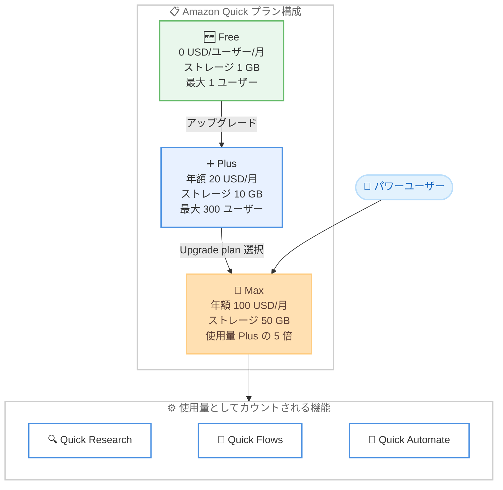

# Amazon Quick - Quick Max プラン (Plus 比 5 倍の使用量・ストレージ)

**リリース日**: 2026 年 9 月 3 日
**サービス**: Amazon Quick
**機能**: Amazon Quick Max (パワーユーザー向け新料金プラン)

📊 [このアップデートのインフォグラフィックを見る](https://takech9203.github.io/aws-news-summary/20260903-amazon-quick-max-5x-usage-power-users.html)

## 概要

Amazon Quick に、パワーユーザー向けの新しい料金プラン「Quick Max」が追加されました。Max プランは既存の Plus プランと比較して 5 倍の使用量 (エージェント使用時間) と 5 倍のストレージを提供し、より多くのエージェント、より多くのワークフローなど、Quick を最大限に活用したいユーザーに対応します。

Max プランでは、大規模な同時実行ワークロードを 1 か月を通して中断なく実行できます。使えば使うほど 1 ドルあたりの価値が高まる設計となっており、月額課金と年額課金の両方の支払いオプションが用意されています。

これにより、Amazon Quick の個人・チーム向けプランは Free、Plus、Max の 3 段階構成となり、利用規模に応じた柔軟なプラン選択が可能になりました。Plus プランの利用者は、左ナビゲーションバー下部の自分の名前をクリックし「Upgrade plan」を選択するだけで Max に切り替えられます。

**アップデート前の課題**

これまでの Amazon Quick のプラン構成では、ヘビーユーザーの需要に十分応えられないケースがありました。

- 個人・チーム向けの有料プランは Plus のみで、Plus の使用量上限を超えるヘビーユーザー向けの選択肢がなかった
- Quick Research、Quick Flows、カスタムエージェントなどを大量に利用すると、月の途中で使用量上限に達し、作業が中断される可能性があった
- ユーザーあたりのインデックスストレージが Plus の 10 GB までに制限され、大量のドキュメントを扱う組織には不足する場合があった

**アップデート後の改善**

今回のアップデートにより、以下が可能になりました。

- Plus 比 5 倍の使用量により、大規模な同時実行ワークロードを 1 か月を通して中断なく実行できるようになった
- ユーザーあたり 50 GB (組織レベルでプール) のインデックスストレージにより、より大量のコンテンツを Quick のインデックスに取り込めるようになった
- 月額・年額の 2 種類の課金オプションから選択でき、年額課金では割引価格 (100 USD/ユーザー/月) で利用できるようになった
- Plus からの移行は画面上の「Upgrade plan」操作のみで完結し、環境の再構築が不要

## アーキテクチャ図



Amazon Quick の 3 段階のプラン構成と、Max プランの使用量としてカウントされる主な AI 機能の関係を示しています。

## サービスアップデートの詳細

### 主要機能

1. **Plus 比 5 倍の使用量**
   - Quick の使用量 (エージェント使用時間) が Plus プランの 5 倍に拡大
   - エージェント使用時間は Quick Research、Quick Flows、Quick Automate、デスクトップアプリ、アーティファクト生成、カスタム AI アプリなどの AI 機能の実行時間として秒単位で計測される
   - 大規模な同時実行ワークロードを 1 か月を通して中断なく実行可能

2. **Plus 比 5 倍のストレージ**
   - ユーザーあたりのインデックスストレージが Plus の 10 GB から 50 GB に拡大
   - ストレージは組織レベルでプールされるため、チーム内でのメンバー間の利用量の偏りを吸収できる
   - インデックスストレージは SharePoint や S3 などの接続元における処理前の生ファイルサイズで計測される

3. **柔軟な課金オプション**
   - 月額課金 (125 USD/ユーザー/月) と年額課金 (100 USD/ユーザー/月相当) の 2 種類から選択可能
   - インフラストラクチャ料金は不要
   - 使用量が多いほど 1 ドルあたりの価値が高まる料金設計

4. **簡単なアップグレード手順**
   - Plus プラン利用者は、左ナビゲーションバー下部の自分の名前をクリックし「Upgrade plan」を選択するだけで Max に移行可能
   - 新規ユーザーは AWS アカウント不要で、メールアドレスまたはソーシャルアカウントにより数分で無料サインアップ可能

## 技術仕様

### プラン比較

| 項目 | Free | Plus | Max |
|------|------|------|-----|
| 料金 (年額課金) | 0 USD/ユーザー/月 | 20 USD/ユーザー/月 | 100 USD/ユーザー/月 |
| 料金 (月額課金) | 0 USD/ユーザー/月 | 25 USD/ユーザー/月 | 125 USD/ユーザー/月 |
| 使用量 | 基本 | 標準 | Plus の 5 倍 |
| インデックスストレージ (ユーザーあたり、組織でプール) | 1 GB | 10 GB | 50 GB |
| 最大ユーザー数 | 1 | 300 | 300 |
| インフラストラクチャ料金 | なし | なし | なし |

### 全プラン共通の主な機能

| 機能 | 説明 |
|------|------|
| AI アシスタントチャット | あらゆるトピック・タスクに関する対話 |
| カスタムチャットエージェント | エージェントの作成と共有 |
| Quick Research | 詳細な分析とレポートの生成 |
| Quick Flows | 日常業務の自動化 |
| Web アプリ構築 | アイデアから本番利用可能な Web アプリを構築 |
| 外部連携 | Slack、Microsoft 365、Google、QuickBooks などとの統合 |

### Plus / Max プラン限定機能

| 機能 | 説明 |
|------|------|
| 共有 Spaces | チームでの作業スペース共有 |
| 組織ナレッジベース | 組織全体でのナレッジ共有 |
| 拡張機能 | ブラウザおよび Microsoft 365 向け拡張機能 |
| 管理機能 | ユーザー管理と一元的な請求管理 |

## 設定方法

### 前提条件

1. Amazon Quick のアカウントを保有していること (新規の場合は無料サインアップが可能)
2. Max へのアップグレードには既存の Free または Plus プランのアカウントが必要
3. 課金オプション (月額または年額) の選択

### 手順

#### ステップ 1: Amazon Quick にサインアップ (新規ユーザーの場合)

Amazon Quick の[サインアップページ](https://portal.aws.amazon.com/billing/signup/service?app=AmazonQuickSuite&tier=free&funnel=boost#/validation)からメールアドレスまたはソーシャルアカウントで無料プランに登録します。AWS アカウントは不要です。

#### ステップ 2: プランのアップグレード

1. Amazon Quick にサインインする
2. 左ナビゲーションバー下部の自分の名前をクリックする
3. 「Upgrade plan」を選択する
4. Max プランを選択し、月額または年額の課金オプションを選択する

#### ステップ 3: プラン内容の確認

[Amazon Quick 料金ページ](https://aws.amazon.com/quick/pricing/)で Free、Plus、Max の各プランの詳細を比較し、利用状況に応じて最適なプランを確認します。

## メリット

### ビジネス面

- **作業中断の防止**: 使用量上限による月途中での作業中断を回避でき、業務の継続性が向上する
- **コスト効率**: 使用量が多いほど 1 ドルあたりの価値が高まる設計で、ヘビーユーザーにとって費用対効果が高い
- **柔軟な支払い**: 月額・年額の課金オプションにより、予算計画に合わせた契約が可能 (年額課金で月額比 20% 割引)

### 技術面

- **大規模ワークロード対応**: 大規模な同時実行ワークロードを 1 か月を通して実行可能
- **ストレージ拡大**: ユーザーあたり 50 GB のプールされたインデックスストレージにより、大量のドキュメントやデータソースを取り込み可能
- **移行の容易さ**: Plus からのアップグレードは画面操作のみで完結し、既存のエージェントやワークフローをそのまま利用可能

## デメリット・制約事項

### 制限事項

- 最大ユーザー数は Plus と同じ 300 ユーザーまで (ユーザー数の上限拡大はない)
- Free / Plus / Max プランにおける具体的なエージェント使用時間の割り当て量は、料金ページ上で明示されていない (「Plus の 5 倍」という相対値のみ公表)
- Max 限定の新機能は含まれず、機能面は Plus と同等 (拡大されるのは使用量とストレージ)

### 考慮すべき点

- 年額課金 (100 USD/ユーザー/月) と月額課金 (125 USD/ユーザー/月) で 25 USD/月の差があるため、長期利用が見込まれる場合は年額課金が有利
- Plus (年額 20 USD) から Max (年額 100 USD) へは 5 倍の価格差があるため、実際の使用量が Plus の上限を恒常的に超えているかを確認してからアップグレードすることを推奨
- インデックスストレージは接続元での処理前の生ファイルサイズで計測されるため、取り込み対象のデータ量を事前に把握しておく必要がある

## ユースケース

### ユースケース 1: リサーチ業務を大量に行うアナリストチーム

**シナリオ**: 市場調査チームが Quick Research を日常的に利用して業界レポートを大量に生成しており、Plus プランでは月の後半に使用量上限へ到達してしまう。

**実装例**:
```text
1. 管理者が Plus から Max プランにアップグレード
2. チームメンバーは従来どおり Quick Research でレポート生成を継続
3. 5 倍の使用量により月末まで中断なく利用
```

**効果**: 月途中の作業中断がなくなり、レポート作成のスループットが向上する。

### ユースケース 2: 業務自動化を全社展開する組織

**シナリオ**: Quick Flows と Quick Automate で経費処理やステータス報告などの定型業務を自動化しており、自動化の対象業務を拡大したい。

**実装例**:
```text
1. Max プランにアップグレードし使用量枠を 5 倍に拡大
2. デプロイ済み automation の実行数を段階的に増加
3. 組織プールされた 50 GB/ユーザーのストレージに社内ドキュメントを追加取り込み
```

**効果**: 自動化対象の業務を拡大しても使用量上限を気にせず、大規模な同時実行ワークロードを安定して運用できる。

### ユースケース 3: 大量の社内ドキュメントを扱うナレッジベース構築

**シナリオ**: SharePoint や S3 上の大量の社内ドキュメントを Quick のナレッジベースとして取り込みたいが、Plus の 10 GB/ユーザーでは不足する。

**実装例**:
```text
1. Max プランへアップグレードしストレージを 50 GB/ユーザーに拡大
2. SharePoint / S3 などの接続元から社内ドキュメントを追加インデックス
3. 組織全体でナレッジベースを共有
```

**効果**: 組織レベルでプールされた大容量ストレージにより、全社規模のナレッジベースを単一プランで運用できる。

## 料金

Max プランはユーザー単位の月額料金制で、月額課金と年額課金の 2 種類の支払いオプションがあります。インフラストラクチャ料金は不要です。

### 料金例

| プラン | 年額課金 | 月額課金 |
|--------|----------|----------|
| Free | 0 USD/ユーザー/月 | 0 USD/ユーザー/月 |
| Plus | 20 USD/ユーザー/月 | 25 USD/ユーザー/月 |
| Max | 100 USD/ユーザー/月 | 125 USD/ユーザー/月 |

最新の料金と各プランの詳細は [Amazon Quick 料金ページ](https://aws.amazon.com/quick/pricing/)を参照してください。

## 利用可能リージョン

公式発表ではリージョンに関する記載はありません。Amazon Quick はメールアドレスまたはソーシャルアカウントでサインアップして利用する SaaS 型のサービスであり、プランの提供状況の詳細は [Amazon Quick 料金ページ](https://aws.amazon.com/quick/pricing/)を参照してください。

## 関連サービス・機能

- **Amazon Quick Research**: 詳細な分析とレポート生成を行う AI 機能。エージェント使用時間の消費対象であり、Max の使用量拡大の恩恵を最も受けやすい機能の 1 つ
- **Amazon Quick Flows**: 日常業務を自動化するワークフロー機能。実行回数が使用量としてカウントされる
- **Amazon Quick Automate**: デプロイ型の自動化機能。デプロイ済み automation の実行が使用量としてカウントされる
- **Amazon Quick Suite**: エンタープライズ向けには Professional / Enterprise プランも提供されており、組織の要件に応じて選択できる

## 参考リンク

- 📊 [インフォグラフィック](https://takech9203.github.io/aws-news-summary/20260903-amazon-quick-max-5x-usage-power-users.html)
- [公式発表 (What's New)](https://aws.amazon.com/about-aws/whats-new/2026/09/amazon-quick-max-5x-usage-power-users/)
- [Amazon Quick 製品ページ](https://aws.com/quick)
- [Amazon Quick 料金ページ](https://aws.amazon.com/quick/pricing/)
- [Amazon Quick 無料サインアップ](https://portal.aws.amazon.com/billing/signup/service?app=AmazonQuickSuite&tier=free&funnel=boost#/validation)

## まとめ

Amazon Quick Max は、Plus プランの使用量とストレージでは足りないパワーユーザー向けに、5 倍の使用量と 5 倍のストレージ (50 GB/ユーザー) を提供する新しい最上位プランです。Quick Research や Quick Flows を大量に利用しているチームは、現在の使用量が Plus の上限に達していないかを確認し、恒常的に上限へ到達している場合は Max へのアップグレードを検討することを推奨します。
