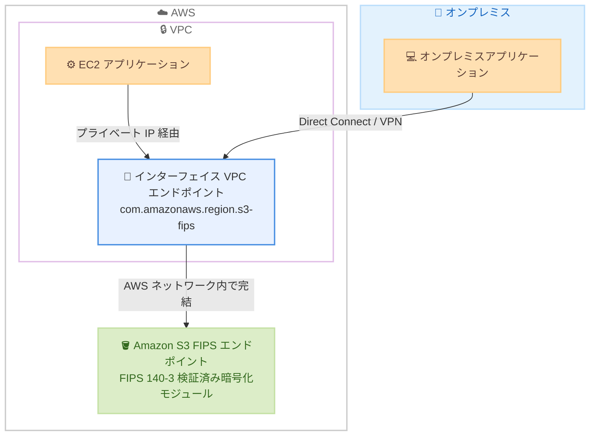

# Amazon S3 - PrivateLink による FIPS エンドポイントのサポート

**リリース日**: 2026 年 9 月 3 日
**サービス**: Amazon S3 (Simple Storage Service)
**機能**: AWS PrivateLink for FIPS endpoints

📊 [このアップデートのインフォグラフィックを見る](https://takech9203.github.io/aws-news-summary/20260903-amazon-s3-privatelink-fips-endpoints.html)

## 概要

Amazon S3 が、FIPS (Federal Information Processing Standard) 140-3 プログラムで検証されたエンドポイントに対する AWS PrivateLink のサポートを開始しました。これにより、セキュリティおよびコンプライアンス要件を持つお客様は、FIPS 検証済みの暗号化モジュールを使用して S3 に接続しながら、トラフィックを VPC (Virtual Private Cloud) 内に保持できるようになります。

FIPS 140-3 は、米国政府機関や規制産業で求められる暗号化モジュールのセキュリティ要件を定めた標準規格です。これまで S3 の FIPS エンドポイントはパブリックエンドポイントとして提供されており、PrivateLink 経由でのプライベート接続と FIPS 検証済み暗号化を同時に満たすことができませんでした。今回のアップデートにより、インターフェイス VPC エンドポイントの作成時にサービス名 `com.amazonaws.{region}.s3-fips` を指定することで、両方の要件を満たす構成が可能になります。

政府機関、公共部門、金融や医療などの規制産業のお客様が主な対象であり、AWS GovCloud (US) リージョンでも利用可能です。追加料金なしで利用できます (通常の PrivateLink 料金は適用されます)。

**アップデート前の課題**

- S3 の FIPS エンドポイントへの接続はパブリックエンドポイント経由に限られ、PrivateLink によるプライベート接続と組み合わせることができなかった
- FIPS 検証済み暗号化モジュールの利用と、トラフィックを VPC 内に閉じるという 2 つのコンプライアンス要件を同時に満たす構成が困難だった
- オンプレミスから Direct Connect や Site-to-Site VPN 経由で S3 の FIPS エンドポイントにプライベートにアクセスする手段がなかった

**アップデート後の改善**

- インターフェイス VPC エンドポイントで FIPS サービス名 `com.amazonaws.{region}.s3-fips` を指定するだけで、FIPS 検証済み暗号化モジュールによる S3 接続が VPC 内で完結する
- 既存のインターフェイス VPC エンドポイントを編集して FIPS S3 エンドポイントを使用するよう構成することも可能
- バケット、アクセスポイント、S3 Control API へのアクセスをサポートし、IPv4 / IPv6 / デュアルスタックの IP アドレスタイプも選択できる

## アーキテクチャ図



VPC 内のアプリケーションとオンプレミスのアプリケーションが、FIPS サービス名で作成したインターフェイス VPC エンドポイントを経由して、FIPS 140-3 検証済みの S3 エンドポイントにプライベートに接続する構成です。トラフィックはインターネットを経由せず AWS ネットワーク内で完結します。

## サービスアップデートの詳細

### 主要機能

1. **FIPS サービス名によるインターフェイス VPC エンドポイントの作成**
   - サービス名 `com.amazonaws.{region}.s3-fips` (例: `com.amazonaws.us-east-1.s3-fips`) を指定してインターフェイスエンドポイントを作成する
   - 作成すると `s3-fips` サービス識別子を含むエンドポイント固有の DNS 名が生成される (例: `vpce-1a2b3c4d-5e6f.s3-fips.us-east-1.vpce.amazonaws.com`)
   - 新規作成だけでなく、既存のインターフェイス VPC エンドポイントを編集して FIPS S3 エンドポイントを使用するよう構成することも可能

2. **バケット、アクセスポイント、S3 Control API へのアクセス**
   - FIPS インターフェイスエンドポイントは、S3 バケットへのアクセスに加え、S3 アクセスポイントおよび Amazon S3 Control API オペレーションへのアクセスをサポートする
   - エンドポイント固有 DNS 名の先頭に `bucket`、`accesspoint`、`control` を付与してアクセス先を指定する

3. **プライベート DNS との統合**
   - プライベート DNS 名を有効にすると、リージョナルな FIPS エンドポイント名がインターフェイスエンドポイントのプライベート IP アドレスに解決される
   - 対象: `s3-fips.{region}.amazonaws.com` (バケット)、`s3-control-fips.{region}.amazonaws.com` (Control API)、`s3-accesspoint-fips.{region}.amazonaws.com` (アクセスポイント)
   - デュアルスタック構成の場合、`s3-fips.dualstack.{region}.amazonaws.com` もプライベート IP アドレスに解決される

4. **複数の IP アドレスタイプのサポート**
   - FIPS インターフェイスエンドポイントは IPv4、IPv6、デュアルスタックの IP アドレッシングを構成できる
   - アプリケーションやネットワーク要件に応じて DNS レコード IP タイプもカスタマイズ可能

## 技術仕様

### FIPS インターフェイスエンドポイントの仕様

| 項目 | 詳細 |
|------|------|
| サービス名 | `com.amazonaws.{region}.s3-fips` |
| エンドポイントタイプ | インターフェイス (AWS PrivateLink) |
| エンドポイント固有 DNS 名の例 | `vpce-1a2b3c4d-5e6f.s3-fips.us-east-1.vpce.amazonaws.com` |
| 対応する暗号化標準 | FIPS 140-3 検証済み暗号化モジュール |
| アクセス可能なリソース | S3 バケット、S3 アクセスポイント、S3 Control API |
| IP アドレスタイプ | IPv4 / IPv6 / デュアルスタック |
| プライベート DNS 対応エンドポイント | `s3-fips.{region}.amazonaws.com`、`s3-control-fips.{region}.amazonaws.com`、`s3-accesspoint-fips.{region}.amazonaws.com` |
| オンプレミスからのアクセス | Direct Connect / Site-to-Site VPN 経由で可能 |

### S3 インターフェイスエンドポイントの制限事項

S3 のインターフェイスエンドポイント共通の制限として、以下はサポートされません。

| 非サポート項目 | 説明 |
|------|------|
| 静的ウェブサイトエンドポイント | S3 ウェブサイトホスティングのエンドポイントは利用不可 |
| レガシーグローバルエンドポイント | 旧形式のグローバルエンドポイントは利用不可 |
| リージョン間の CopyObject / UploadPartCopy | 異なるリージョンのバケット間コピーは利用不可 |
| TLS 1.0 / 1.1 / 1.3 | TLS 1.2 のみサポート |
| ハイブリッドポスト量子 TLS | 利用不可 |

## 設定方法

### 前提条件

1. VPC およびサブネットが作成済みであること
2. インターフェイスエンドポイントに割り当てるセキュリティグループが用意されていること (HTTPS 443 番ポートのインバウンドを許可)
3. FIPS S3 エンドポイントが提供されているリージョンであること (利用可能リージョンを参照)

### 手順

#### ステップ 1: FIPS サービス名でインターフェイス VPC エンドポイントを作成

```bash
aws ec2 create-vpc-endpoint \
  --region us-east-1 \
  --service-name com.amazonaws.us-east-1.s3-fips \
  --vpc-id vpc-0123456789abcdef0 \
  --subnet-ids subnet-0123456789abcdef0 \
  --vpc-endpoint-type Interface \
  --security-group-ids sg-0123456789abcdef0
```

FIPS サービス名 `com.amazonaws.us-east-1.s3-fips` を指定して、VPC 内にインターフェイスエンドポイントを作成します。指定したサブネットにエンドポイントネットワークインターフェイス (ENI) が作成され、プライベート IP アドレスが割り当てられます。本番環境では高可用性のため、2 つ以上のアベイラビリティーゾーンのサブネットを指定することが推奨されます。

#### ステップ 2: エンドポイント固有の DNS 名を確認

```bash
aws ec2 describe-vpc-endpoints \
  --vpc-endpoint-ids vpce-0123456789abcdef0 \
  --query "VpcEndpoints[*].DnsEntries"
```

作成したインターフェイスエンドポイントに割り当てられた DNS エントリを表示します。`s3-fips` サービス識別子を含むリージョナル DNS 名とゾーン DNS 名 (例: `vpce-1a2b3c4d-5e6f.s3-fips.us-east-1.vpce.amazonaws.com`) が確認できます。

#### ステップ 3: FIPS エンドポイント経由で S3 にアクセス

```bash
aws s3 ls s3://my-bucket/ \
  --region us-east-1 \
  --endpoint-url https://bucket.vpce-1a2b3c4d-5e6f.s3-fips.us-east-1.vpce.amazonaws.com
```

エンドポイント固有 DNS 名の先頭に `bucket` を付与した URL を `--endpoint-url` に指定して、FIPS インターフェイスエンドポイント経由でバケット内のオブジェクトを一覧表示します。アクセスポイントへのアクセスには `accesspoint`、S3 Control API には `control` プレフィックスを使用します。

#### ステップ 4: 既存エンドポイントを FIPS エンドポイントに変更する場合

既存のインターフェイス VPC エンドポイントを使用している場合は、AWS Management Console の VPC エンドポイント設定画面から編集し、FIPS S3 エンドポイントを使用するよう構成できます。プライベート DNS を有効にすると、アプリケーションは `s3-fips.us-east-1.amazonaws.com` などのリージョナル FIPS エンドポイント名をそのまま使用しながら、PrivateLink 経由のプライベート接続を利用できます。

## メリット

### ビジネス面

- **コンプライアンス要件への対応**: FIPS 140-3 検証済み暗号化モジュールの使用が義務付けられている政府機関や規制産業の要件と、プライベートネットワーク接続の要件を同時に満たせる
- **追加コストなし**: FIPS エンドポイントのサポート自体に追加料金は発生しない (通常の PrivateLink インターフェイスエンドポイント料金のみ)
- **GovCloud 対応**: AWS GovCloud (US) リージョンでも利用可能であり、米国政府関連ワークロードにそのまま適用できる

### 技術面

- **トラフィックの VPC 内完結**: S3 への通信がインターネットゲートウェイや NAT ゲートウェイを経由せず、AWS ネットワーク内のプライベート接続で完結する
- **オンプレミスからのプライベートアクセス**: Direct Connect や Site-to-Site VPN 経由で、オンプレミスアプリケーションからも FIPS 検証済み接続で S3 にアクセスできる
- **既存構成からの移行が容易**: 既存のインターフェイスエンドポイントの編集、またはプライベート DNS の活用により、アプリケーション側の変更を最小限に抑えられる
- **柔軟な IP アドレッシング**: IPv4 / IPv6 / デュアルスタックに対応し、多様なネットワーク環境で利用できる

## デメリット・制約事項

### 制限事項

- 利用可能リージョンは米国、カナダ、AWS GovCloud (US) の 7 リージョンに限定される (FIPS エンドポイント自体が提供されているリージョンに依存)
- インターフェイスエンドポイント共通の制限として、静的ウェブサイトエンドポイント、レガシーグローバルエンドポイント、リージョン間の CopyObject / UploadPartCopy は利用できない
- TLS 1.2 のみサポートされ、TLS 1.0 / 1.1 / 1.3 およびハイブリッドポスト量子 TLS は利用できない

### 考慮すべき点

- インターフェイスエンドポイントはゲートウェイエンドポイントと異なり、時間課金およびデータ処理量課金が発生するため、VPC 内のトラフィックにはゲートウェイエンドポイントを併用するコスト最適化を検討する
- エンドポイント固有 DNS 名を直接使用する場合、アプリケーション側でエンドポイント URL の設定変更が必要になる (プライベート DNS の有効化で回避可能)
- FIPS エンドポイントは非 FIPS エンドポイントと DNS 名が異なるため、既存アプリケーションの接続先設定を確認する必要がある

## ユースケース

### ユースケース 1: 政府機関ワークロードにおける FIPS 準拠のプライベート S3 アクセス

**シナリオ**: 米国政府機関向けシステムを AWS GovCloud (US) で運用しており、FIPS 140-3 検証済み暗号化モジュールの使用と、トラフィックをプライベートネットワークに閉じることの両方が求められている。

**実装例**:
```bash
aws ec2 create-vpc-endpoint \
  --region us-gov-west-1 \
  --service-name com.amazonaws.us-gov-west-1.s3-fips \
  --vpc-id vpc-xxxxxxxx \
  --subnet-ids subnet-aaaa subnet-bbbb \
  --vpc-endpoint-type Interface \
  --private-dns-enabled \
  --security-group-ids sg-xxxxxxxx
```

**効果**: FIPS 検証済み暗号化とプライベート接続の両方のコンプライアンス要件を単一の構成で満たし、監査対応が簡素化される。

### ユースケース 2: オンプレミスから S3 への FIPS 準拠プライベート転送

**シナリオ**: 金融機関がオンプレミスのデータセンターから Direct Connect 経由で S3 にデータをアーカイブしており、社内規程で FIPS 検証済み暗号化モジュールの使用とインターネット非経由の通信が義務付けられている。

**実装例**:
```bash
# オンプレミスアプリケーションからエンドポイント固有 DNS 名でアクセス
aws s3 cp ./archive.tar.gz \
  s3://compliance-archive-bucket/2026/09/ \
  --region us-east-1 \
  --endpoint-url https://bucket.vpce-1a2b3c4d-5e6f.s3-fips.us-east-1.vpce.amazonaws.com
```

**効果**: オンプレミスから S3 への転送経路全体で FIPS 検証済み暗号化とプライベート接続が保証され、規制要件を満たしたデータアーカイブが実現する。

### ユースケース 3: 既存インターフェイスエンドポイントの FIPS 対応への移行

**シナリオ**: すでに S3 用インターフェイスエンドポイントを利用している規制産業のお客様が、新たなコンプライアンス要件により FIPS 検証済みエンドポイントへの移行を求められている。

**実装例**:
```bash
# プライベート DNS を有効にした FIPS エンドポイントを作成し、
# アプリケーションはリージョナル FIPS エンドポイント名をそのまま使用
aws s3 ls s3://my-bucket/ \
  --region us-east-1 \
  --endpoint-url https://s3-fips.us-east-1.amazonaws.com
```

**効果**: プライベート DNS により `s3-fips.us-east-1.amazonaws.com` への名前解決がインターフェイスエンドポイントのプライベート IP アドレスに向くため、アプリケーションコードの大幅な変更なしに FIPS 準拠のプライベート接続へ移行できる。

## 料金

FIPS S3 エンドポイントに対する PrivateLink サポート自体に追加料金はありません。

ただし、インターフェイス VPC エンドポイントの標準料金が適用されます。

| 課金項目 | 内容 |
|--------|------------------|
| エンドポイント時間料金 | アベイラビリティーゾーンごとにプロビジョニングされた時間単位で課金 |
| データ処理料金 | エンドポイントを通過したデータ量 (GB 単位) で課金 |

詳細は [AWS PrivateLink 料金ページ](https://aws.amazon.com/privatelink/pricing/) を参照してください。なお、ゲートウェイエンドポイントは無料のため、VPC 内トラフィックにはゲートウェイエンドポイントを併用するコスト最適化が可能です。

## 利用可能リージョン

以下の 7 リージョンで利用可能です。

- 米国東部 (バージニア北部)
- 米国東部 (オハイオ)
- 米国西部 (北カリフォルニア)
- 米国西部 (オレゴン)
- カナダ (中部)
- カナダ西部 (カルガリー)
- AWS GovCloud (US)

## 関連サービス・機能

- **AWS PrivateLink**: VPC と AWS サービス間のプライベート接続を提供する基盤サービス。今回のアップデートで S3 の FIPS エンドポイントに対応
- **Amazon VPC**: インターフェイスエンドポイントを配置するプライベートネットワーク環境。エンドポイントポリシーやセキュリティグループによるアクセス制御が可能
- **AWS Direct Connect / AWS Site-to-Site VPN**: オンプレミスから VPC 経由で FIPS インターフェイスエンドポイントにアクセスするための接続サービス
- **AWS Certificate Manager / AWS-LC**: AWS における FIPS 検証済み暗号化の関連コンポーネント。FIPS 140-3 対応の詳細は AWS の FIPS コンプライアンスページを参照

## 参考リンク

- 📊 [インフォグラフィック](https://takech9203.github.io/aws-news-summary/20260903-amazon-s3-privatelink-fips-endpoints.html)
- [公式発表 (What's New)](https://aws.amazon.com/about-aws/whats-new/2026/09/amazon-s3-privatelink-fips-endpoints)
- [ドキュメント: AWS PrivateLink for Amazon S3](https://docs.aws.amazon.com/AmazonS3/latest/userguide/privatelink-interface-endpoints.html)
- [ドキュメント: AWS PrivateLink を通じた AWS サービスへのアクセス](https://docs.aws.amazon.com/vpc/latest/privatelink/privatelink-access-aws-services.html)
- [FIPS 140-3 コンプライアンス](https://aws.amazon.com/compliance/fips/)
- [料金ページ: AWS PrivateLink](https://aws.amazon.com/privatelink/pricing/)

## まとめ

Amazon S3 の FIPS エンドポイントが AWS PrivateLink に対応したことで、FIPS 140-3 検証済み暗号化モジュールの使用とプライベートネットワーク接続という 2 つのコンプライアンス要件を単一の構成で満たせるようになりました。政府機関や規制産業のワークロードを扱うお客様は、インターフェイス VPC エンドポイントの作成時にサービス名 `com.amazonaws.{region}.s3-fips` を指定するだけで導入できるため、該当する要件を持つ環境では既存エンドポイントの見直しを含めて検討することを推奨します。
