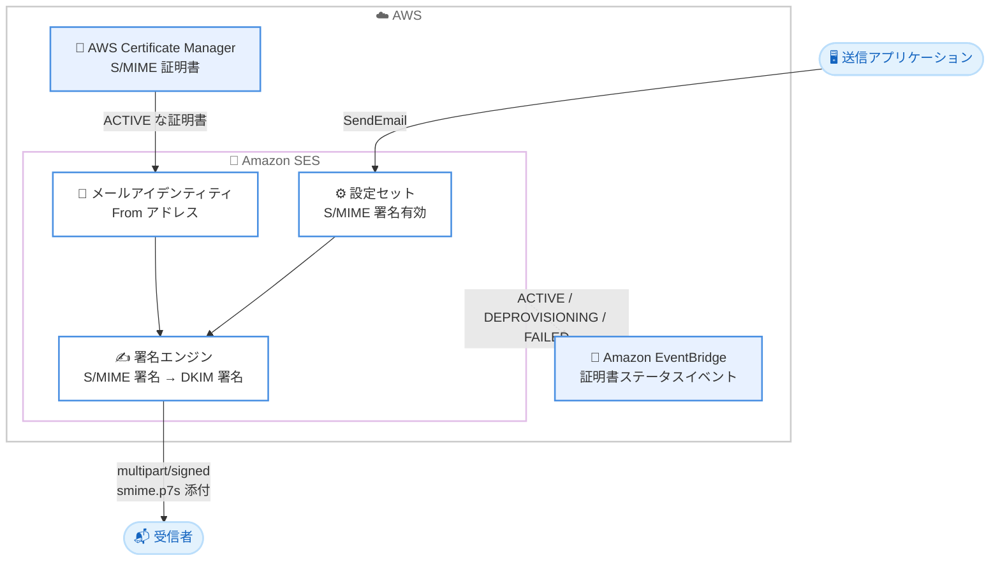

# Amazon SES - S/MIME 電子メール署名のサポート

**リリース日**: 2026 年 9 月 3 日
**サービス**: Amazon Simple Email Service (SES)
**機能**: S/MIME (Secure/Multipurpose Internet Mail Extensions) 署名

📊 [このアップデートのインフォグラフィックを見る](https://takech9203.github.io/aws-news-summary/20260903-amazon-ses-supports-smime-signing.html)

## 概要

Amazon Simple Email Service (SES) が S/MIME (Secure/Multipurpose Internet Mail Extensions) 署名をサポートしました。S/MIME は証明書ベースのデジタル署名を使用する標準規格 (RFC 8551) で、メッセージが From アドレスの保有者によって送信されたこと、および転送中に内容が改ざんされていないことを受信者が検証できるようにします。

今回のアップデートにより、署名用証明書を AWS Certificate Manager (ACM) に保存し、送信者 ID (メールアイデンティティ) に関連付けたうえで設定セット (Configuration Set) で S/MIME 署名を有効化するだけで、SES が送信時にサーバーサイドで自動的にメッセージへ署名します。金融、医療、行政などセキュリティ意識の高い送信者が、既存の SES 構成を維持したまま簡単にデジタル署名を追加できます。

S/MIME に対応していないメールクライアントの受信者も、メッセージを通常どおり読むことができます。これは SES がクリア署名 (multipart/signed 形式、RFC 1847) を採用しているためです。

**アップデート前の課題**

- S/MIME 署名が必要な送信者は、SES に送信する前に各メッセージへ自分で署名する必要があり、送信処理が複雑になっていた
- 署名鍵や証明書の管理、署名処理の実装・運用を送信者側で行う必要があった
- 署名処理を自前で実装すると、SES のテンプレート機能や開封・クリックトラッキングとの整合性を保つのが難しかった

**アップデート後の改善**

- 証明書を ACM に保存して SES 側で設定するだけで、送信時に SES が自動的に S/MIME 署名を適用するようになった
- 送信アプリケーション側のコード変更が不要で、既存の SES 送信フローをそのまま利用できる
- 開封・クリックトラッキング、テンプレートレンダリング、購読管理リンクの挿入は署名前に適用されるため、これらの機能と S/MIME 署名を併用できる

## アーキテクチャ図



送信アプリケーションが S/MIME 署名を有効化した設定セット経由でメールを送信すると、SES が ACM 内の証明書を使用してサーバーサイドで自動的に署名し、受信者へ配信します。証明書の関連付けステータスの変化は EventBridge イベントで監視できます。

## サービスアップデートの詳細

### 主要機能

1. **送信時の自動 S/MIME 署名**
   - S/MIME 署名を有効化した設定セット経由で送信されたメッセージに、SES がサーバーサイドで署名を適用
   - 送信者が事前にメッセージへ署名する必要がなくなり、既存の送信フローを変更せずに利用可能
   - From アドレスに ACTIVE な証明書が関連付けられている場合にのみ署名を実行

2. **ACM による証明書管理**
   - S/MIME 証明書、秘密鍵、証明書チェーンを ACM にインポートして管理
   - 証明書はメールアイデンティティ配下の From アドレス単位で関連付け
   - 証明書の関連付けステータスが ACTIVE、DEPROVISIONING、FAILED に変化すると EventBridge イベントを発行し、証明書の失効検知などの自動化が可能

3. **クリア署名による高い互換性**
   - multipart/signed 形式 (クリア署名、RFC 1847) のデタッチ署名を採用し、署名を application/pkcs7-signature メディアタイプの別パート (通常は smime.p7s) として添付
   - S/MIME 非対応のメールクライアントでも本文をそのまま閲覧可能
   - 署名には署名証明書と証明書チェーンを CMS SignedData オブジェクトとして埋め込み、受信者側で認証局までの信頼チェーンを検証可能

4. **DKIM との併用**
   - S/MIME と DKIM は異なるレイヤーで動作する補完関係にあり、S/MIME は DKIM の代替ではない
   - DKIM は「送信ドメインがメッセージを承認したこと」を DNS 上の鍵で証明し、S/MIME は「特定のメールアドレス保有者が送信し内容が無傷であること」を認証局への信頼チェーンで証明
   - 両方を有効化した場合、SES は S/MIME 署名を先に適用し、その後 DKIM 署名を適用することで DKIM 署名の整合性を維持

## 技術仕様

### S/MIME 証明書の要件

| 項目 | 詳細 |
|------|------|
| 証明書の保存場所 | メール送信と同じ AWS リージョンの ACM |
| メールアイデンティティ | 検証済みであること (ドメイン検証またはメールアドレス検証) |
| SAN (Subject Alternative Name) | From アドレスと一致する RFC822Name を含むこと (大文字小文字を区別) |
| 鍵アルゴリズム | RSA 2048 / RSA 3072 / RSA 4096 / EC P-256 / EC P-384 / EC P-521 |
| 有効期限 | 有効期限内であること |
| 認証局 | パブリック CA を推奨 (プライベート CA はデフォルトでは受信側に信頼されない) |

### 証明書関連付けのステータス

| ステータス | 説明 |
|------------|------|
| PROVISIONING | 関連付け処理中 |
| ACTIVE | 有効。SES が署名に使用可能 |
| INACTIVE | 無効 |
| DEPROVISIONING | 関連付け解除処理中 |
| FAILED | 関連付け失敗 |

### API 変更履歴

| 日付 | サービス | 変更内容 |
|------|----------|----------|
| 2026/09/01 | [Amazon Simple Email Service](https://awsapichanges.com/archive/changes/31b875-email.html) | 4 new 2 updated api methods - メールアイデンティティへの S/MIME 署名証明書の関連付け・一覧・解除 (AssociateEmailIdentityCertificate、ListEmailIdentityCertificates、DisassociateEmailIdentityCertificate) と、署名スキームを設定する UpdateConfigurationSet を追加。CreateConfigurationSet と GetConfigurationSet に MessageSecurityOptions を追加 |

### 署名済みメッセージのヘッダー例

```
Content-Type: multipart/signed;
    protocol="application/pkcs7-signature";
    micalg=sha-256;
    boundary="----=_SmimeBoundary"
```

署名済みメッセージは標準の S/MIME ヘッダーを使用し、micalg パラメータにダイジェストアルゴリズム (例: sha-256) が示されます。

## 設定方法

### 前提条件

1. 検証済みのメールアイデンティティ (ドメインまたはメールアドレス)
2. 証明書要件を満たす S/MIME 証明書 (パブリック CA 発行を推奨)
3. 送信リージョンと同じリージョンの ACM に証明書、秘密鍵、証明書チェーンをインポート済みであること

### 手順

#### ステップ 1: 証明書を ACM にインポート

```bash
aws acm import-certificate \
    --certificate fileb://certificate.pem \
    --private-key fileb://private-key.pem \
    --certificate-chain fileb://certificate-chain.pem \
    --region us-east-1
```

S/MIME 証明書、秘密鍵、証明書チェーンを ACM にインポートします。インポート後、SES コンソールや CLI から証明書を選択できるようになります。

#### ステップ 2: 証明書をメールアイデンティティに関連付け

```bash
aws sesv2 associate-email-identity-certificate \
    --email-identity example.com \
    --from-address sender@example.com \
    --certificate-arn arn:aws:acm:us-east-1:123456789012:certificate/abcd1234-abcd-1234-abcd-abcd12345678
```

ACM 証明書をメールアイデンティティ配下の From アドレスに関連付けます。ドメインアイデンティティの場合は `--from-address` が必須で、証明書の SAN 内のメールアドレスと一致する必要があります。メールアドレスアイデンティティの場合は `--from-address` を省略できます。

関連付けた証明書とそのステータスは以下のコマンドで確認できます。

```bash
aws sesv2 list-email-identity-certificates \
    --email-identity example.com
```

メールアイデンティティに関連付けられた証明書の一覧と、各証明書のステータス、証明書 ARN、有効期限を表示します。

#### ステップ 3: 設定セットで S/MIME 署名を有効化

```bash
aws sesv2 update-configuration-set \
    --configuration-set-name my-config-set \
    --message-security-options '{"SigningScheme": {"Smime": {}}}'
```

設定セットの MessageSecurityOptions に S/MIME 署名スキームを設定します。SignatureFormat はデフォルトで DETACHED (現時点で唯一サポートされる値) です。無効化する場合は `{"SigningScheme": {"Default": {}}}` を設定します。コンソールでは、設定セットの [General details] にある [Secure email] セクションで [Enable S/MIME signing] チェックボックスを選択します。

#### ステップ 4: 署名の動作確認

メールアイデンティティ詳細ページの「テストメールを送信」アクションを使用し、S/MIME 署名が有効な設定セットを指定して送信すると、テストメッセージが S/MIME 署名された状態で届くことを確認できます。

## メリット

### ビジネス面

- **なりすまし対策の強化**: 受信者が From アドレス保有者による送信であることを検証でき、フィッシング対策やブランド保護に寄与する
- **コンプライアンス対応**: 金融、医療、行政など、メールへのデジタル署名が求められる業界要件に SES のマネージド機能で対応できる
- **運用負荷の削減**: 署名処理の自前実装・運用が不要になり、開発リソースを本来の業務に集中できる

### 技術面

- **サーバーサイドでの自動署名**: 送信アプリケーションのコード変更なしで、設定セットの切り替えだけで署名を適用できる
- **SES 機能との互換性**: 開封・クリックトラッキング、テンプレートレンダリング、購読管理リンク挿入は署名前に適用されるため、既存機能と併用できる
- **証明書ライフサイクルの可視化**: EventBridge イベント (ACTIVE、DEPROVISIONING、FAILED) により、証明書ステータスの変化を検知して自動対応を構築できる

## デメリット・制約事項

### 制限事項

- 1 つの From アドレスに関連付けられる証明書は 1 つのみ。証明書を差し替えるには、既存の証明書を先に削除する必要がある (DEPROVISIONING 中の場合を除く)
- 証明書が関連付けられたままのメールアイデンティティは削除できない
- SignatureFormat は DETACHED のみサポート
- S/MIME 署名が有効な設定セットで送信する際、From アドレスに ACTIVE な証明書が存在しない場合、SES はメッセージを拒否しエラーを返す

### 考慮すべき点

- 受信側で署名を検証するには、受信者のメールクライアントが証明書の発行元認証局を信頼している必要がある。プライベート CA の証明書はデフォルトでは信頼されないため、パブリック CA の利用が推奨される
- From アドレスと証明書 SAN の照合は大文字小文字を区別するため、証明書発行時のアドレス表記に注意が必要
- 証明書の有効期限管理は利用者の責任となるため、EventBridge イベントや ACM の有効期限通知を活用した更新運用を設計する必要がある
- S/MIME は DKIM の代替ではないため、DKIM、SPF、DMARC といったドメインレベルの認証は引き続き併用する

## ユースケース

### ユースケース 1: 金融機関からの重要通知メールの真正性保証

**シナリオ**: 銀行が取引通知や重要なお知らせを顧客に送信する際、フィッシングメールとの区別を明確にするため、送信者の真正性を証明したい。

**実装例**:
```bash
# 通知専用の From アドレスに証明書を関連付け
aws sesv2 associate-email-identity-certificate \
    --email-identity bank.example.com \
    --from-address notice@bank.example.com \
    --certificate-arn arn:aws:acm:ap-northeast-1:123456789012:certificate/xxxx

# 重要通知用の設定セットで S/MIME 署名を有効化
aws sesv2 update-configuration-set \
    --configuration-set-name critical-notifications \
    --message-security-options '{"SigningScheme": {"Smime": {}}}'
```

**効果**: S/MIME 対応クライアントを使用する顧客は送信者の真正性と内容の完全性を検証でき、フィッシングメールとの差別化により顧客の信頼を高められる。

### ユースケース 2: 既存の自前署名処理からの移行

**シナリオ**: これまで送信前に自前の署名基盤で S/MIME 署名を行ってから SES に送信していた企業が、署名処理の運用負荷を削減したい。

**実装例**:
```bash
# 証明書を ACM にインポートして SES に移管
aws acm import-certificate \
    --certificate fileb://smime-cert.pem \
    --private-key fileb://smime-key.pem \
    --certificate-chain fileb://chain.pem

# アプリケーションからは通常の SendEmail を呼び出すだけ
aws sesv2 send-email \
    --from-email-address sender@example.com \
    --destination '{"ToAddresses": ["recipient@example.co.jp"]}' \
    --content '{"Simple": {"Subject": {"Data": "お知らせ"}, "Body": {"Text": {"Data": "本文"}}}}' \
    --configuration-set-name smime-enabled-set
```

**効果**: 署名処理コードと署名鍵管理基盤を廃止でき、SES のテンプレートやトラッキング機能とも自然に統合される。

### ユースケース 3: EventBridge による証明書ステータス監視の自動化

**シナリオ**: 複数の From アドレスで S/MIME 署名を運用しており、証明書の関連付けが FAILED になった場合や失効が近い場合に即座に検知したい。

**実装例**:
```json
{
  "source": ["aws.ses"],
  "detail-type": ["Email Identity Certificate Status Change"],
  "detail": {
    "status": ["FAILED", "DEPROVISIONING"]
  }
}
```

**効果**: 証明書関連付けの異常を EventBridge ルールで検知して SNS 通知や自動修復を実行でき、署名が適用されないままメール送信が失敗するリスクを低減できる。

## 料金

What's New の発表では、S/MIME 署名機能に関する追加料金の記載はありません。SES の標準送信料金が適用されます。証明書を ACM にインポートして利用する形態のため、パブリック CA からの S/MIME 証明書の取得費用は別途、認証局の料金体系に従って発生します。詳細は [Amazon SES 料金ページ](https://aws.amazon.com/ses/pricing/) を参照してください。

## 利用可能リージョン

Amazon SES が利用可能なすべての AWS リージョンで利用できます (東京、大阪リージョンを含む)。

## 関連サービス・機能

- **AWS Certificate Manager (ACM)**: S/MIME 署名用証明書のインポート先および管理基盤。SES は ACM と統合するサービスの 1 つ
- **Amazon EventBridge**: 証明書関連付けステータスの変化 (ACTIVE、DEPROVISIONING、FAILED) をイベントとして受信し、監視・自動化に活用
- **SES DKIM 署名**: ドメインレベルの送信認証。S/MIME と補完関係にあり、併用時は S/MIME 署名の後に DKIM 署名が適用される
- **SES 設定セット (Configuration Set)**: S/MIME 署名の有効化単位。トラッキングや配信オプションと同様にメッセージ単位で適用を制御

## 参考リンク

- 📊 [インフォグラフィック](https://takech9203.github.io/aws-news-summary/20260903-amazon-ses-supports-smime-signing.html)
- [公式発表 (What's New)](https://aws.amazon.com/about-aws/whats-new/2026/09/amazon-ses-supports-smime-signing)
- [ドキュメント: Authenticating email with S/MIME in Amazon SES](https://docs.aws.amazon.com/ses/latest/dg/send-email-authentication-smime.html)
- [ドキュメント: Attaching a certificate to an email identity](https://docs.aws.amazon.com/ses/latest/dg/send-email-authentication-smime-associate.html)
- [ドキュメント: Enabling S/MIME signing on a configuration set](https://docs.aws.amazon.com/ses/latest/dg/send-email-authentication-smime-enable.html)
- [API 変更履歴 (awsapichanges.com)](https://awsapichanges.com/archive/changes/31b875-email.html)
- [料金ページ](https://aws.amazon.com/ses/pricing/)

## まとめ

Amazon SES の S/MIME 署名サポートにより、これまで送信者側で行う必要があった署名処理を SES に委任でき、証明書を ACM で管理するだけで送信時の自動署名が実現します。メールの真正性証明が求められる業界の送信者は、まず対象の From アドレス用の S/MIME 証明書を ACM にインポートし、テスト用の設定セットで署名動作を検証したうえで本番の送信フローへの適用を検討することを推奨します。
