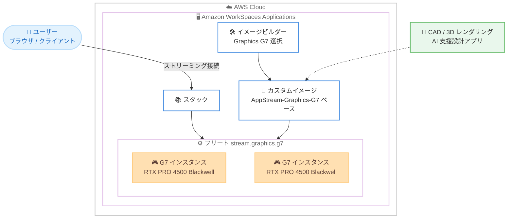

# Amazon WorkSpaces Applications - NVIDIA Blackwell GPU 搭載 Graphics G7 インスタンスのサポート

**リリース日**: 2026 年 9 月 3 日
**サービス**: Amazon WorkSpaces Applications
**機能**: Graphics G7 インスタンスファミリー (NVIDIA RTX PRO 4500 Blackwell Server Edition GPU) のサポート

📊 [このアップデートのインフォグラフィックを見る](https://takech9203.github.io/aws-news-summary/20260903-amazon-workspaces-applications-nvidia-blackwell-gpu-instances.html)

## 概要

Amazon WorkSpaces Applications (旧 Amazon AppStream 2.0) が、NVIDIA RTX PRO 4500 Blackwell Server Edition GPU と第 6 世代 Intel Xeon Scalable プロセッサを搭載した Graphics G7 インスタンスをサポートしました。G7 インスタンスは、前世代の G6 インスタンスと比較してグラフィックス集約型ワークロードで最大 2.1 倍のパフォーマンス向上を実現します。

Graphics G7 インスタンスは GPU あたり 32 GB の GDDR7 GPU メモリを搭載し、メモリ帯域幅は 2.67 倍高速化されています。これにより、CAD/CAM、3D レンダリング、科学技術可視化、動画編集、AI 支援設計ワークフローといった高負荷なプロフェッショナルアプリケーションを、より高い忠実度とフレームレートでストリーミングできます。より大規模で複雑な 3D シーンやモデルの配信が可能になり、設計・製造・メディア業界などでリッチなアプリケーションをブラウザやクライアント経由で利用するユーザーの体験が大きく向上します。

インスタンスサイズは 6 種類が提供され、GPU 数は 1〜8 基、vCPU 数は 8〜192、システムメモリは 32 GB〜768 GB の範囲から選択できます。フリートやイメージビルダーの作成時に Graphics G7 インスタンスを選択するだけで利用を開始できます。

**アップデート前の課題**

- WorkSpaces Applications で利用できる最上位の GPU インスタンスは G6 世代 (NVIDIA L4 / L40S ベースなど) までであり、最新世代 GPU の性能を活用できなかった
- 大規模な 3D シーンや高解像度モデルを扱う場合、GPU メモリ容量やメモリ帯域幅がボトルネックとなり、フレームレートや描画品質が制限されることがあった
- AI 推論を組み合わせた設計支援ワークフローなど、グラフィックスと AI の両方に高い性能を求めるワークロードへの対応が難しかった

**アップデート後の改善**

- NVIDIA Blackwell アーキテクチャの RTX PRO 4500 GPU により、G6 比で最大 2.1 倍のグラフィックス性能を利用可能になった
- GPU あたり 32 GB の GDDR7 メモリと 2.67 倍高速なメモリ帯域幅により、より大規模で複雑な 3D シーン・モデルをストリーミング可能になった
- 1〜8 GPU、8〜192 vCPU、32 GB〜768 GB メモリの 6 サイズから、ワークロード規模に応じた柔軟な選択が可能になった

## アーキテクチャ図



グラフィックス集約型アプリケーションを G7 ベースのイメージに組み込み、Graphics G7 フリートからユーザーへストリーミング配信する構成です。ユーザーはローカルに高性能 GPU を持たなくても、Blackwell GPU の性能をブラウザやクライアント経由で利用できます。

## サービスアップデートの詳細

### 主要機能

1. **NVIDIA RTX PRO 4500 Blackwell Server Edition GPU の採用**
   - 前世代 G6 インスタンス比で最大 2.1 倍のグラフィックス性能を実現
   - GPU あたり 32 GB の GDDR7 メモリを搭載し、メモリ帯域幅は 2.67 倍高速化
   - 第 5 世代 Tensor コアと第 4 世代 RT コアを搭載し、AI 推論とレイトレーシングの両方に対応

2. **幅広いインスタンスサイズの提供**
   - 6 種類のインスタンスサイズを提供
   - GPU 数 1〜8 基、vCPU 数 8〜192、システムメモリ 32 GB〜768 GB から選択可能
   - CPU には第 6 世代 Intel Xeon Scalable プロセッサを採用

3. **高負荷プロフェッショナルワークロードへの対応**
   - CAD/CAM、3D レンダリング、科学技術可視化、動画編集、AI 支援設計ワークフローを高忠実度・高フレームレートでストリーミング
   - より大規模で複雑な 3D シーン・モデルの配信が可能
   - EC2 G7 基盤では第 9 世代 NVENC / 第 6 世代 NVDEC により動画エンコード・デコード性能も向上

## 技術仕様

### EC2 G7 インスタンスの主な仕様 (参考)

WorkSpaces Applications の Graphics G7 インスタンス (stream.graphics.g7.\*) の基盤となる EC2 G7 インスタンスの仕様は以下のとおりです。

| インスタンスサイズ | GPU 数 | GPU メモリ | vCPU | システムメモリ | ネットワーク帯域幅 |
|------|------|------|------|------|------|
| 2xlarge | 1 | 32 GB | 8 | 32 GiB | 最大 60 Gbps |
| 4xlarge | 1 | 32 GB | 16 | 64 GiB | 最大 100 Gbps |
| 8xlarge | 1 | 32 GB | 32 | 128 GiB | 100 Gbps |
| 12xlarge | 2 | 64 GB | 48 | 192 GiB | 175 Gbps |
| 24xlarge | 4 | 128 GB | 96 | 384 GiB | 350 Gbps |
| 48xlarge | 8 | 256 GB | 192 | 768 GiB | 700 Gbps |

### WorkSpaces Applications での利用形態

| 項目 | 詳細 |
|------|------|
| インスタンスファミリー | Graphics G7 (stream.graphics.g7.\*) |
| ベースイメージ | AppStream-Graphics-G7-{WinServerOperatingSystemVersion}-{MM-DD-YYYY}、AppStream-Graphics-G7-RockyLinux8-{MM-DD-YYYY}、AppStream-Graphics-G7-RHEL8-{MM-DD-YYYY} |
| イメージインポート | Accelerated.g7.\* インスタンスタイプ向けにイメージインポートに対応 |
| 対象ワークロード | グラフィックス集約型アプリケーションおよび AI 推論アプリケーション |
| ボリューム | 200 GB の固定サイズボリューム (C ドライブ、非永続) |

## 設定方法

### 前提条件

1. AWS アカウントと WorkSpaces Applications (AppStream 2.0) の利用環境があること
2. 利用リージョンが Graphics G7 の提供リージョン (バージニア北部、オハイオ、オレゴン) であること
3. Graphics G7 インスタンスファミリーに対応したベースイメージ (AppStream-Graphics-G7-\*) を使用すること

### 手順

#### ステップ 1: G7 対応イメージビルダーの起動

WorkSpaces Applications コンソールでイメージビルダーを起動し、インスタンスタイプに Graphics G7 (stream.graphics.g7.\*) を選択します。ベースイメージには AppStream-Graphics-G7-\* 系列を選択します。

#### ステップ 2: アプリケーションのインストールとイメージ作成

イメージビルダーに接続し、CAD/CAM や 3D レンダリングなどのアプリケーションをインストールして動作確認後、カスタムイメージを作成します。

#### ステップ 3: G7 フリートの作成

```bash
# AWS CLI で Graphics G7 フリートを作成する例
aws appstream create-fleet \
  --name my-g7-fleet \
  --instance-type stream.graphics.g7.4xlarge \
  --fleet-type ON_DEMAND \
  --image-name my-custom-g7-image \
  --compute-capacity DesiredInstances=2 \
  --region us-east-1
```

ステップ 2 で作成したカスタムイメージを指定し、インスタンスタイプに stream.graphics.g7.4xlarge を指定してオンデマンドフリートを作成しています。作成後、フリートをスタックに関連付けてユーザーにストリーミングを提供します。

## メリット

### ビジネス面

- **ハイエンドワークステーションの集約**: 高価な物理 GPU ワークステーションを配布することなく、最新世代 GPU の性能をリモートユーザーへ提供できる
- **生産性の向上**: 大規模 3D モデルの読み込みや描画が高速化され、設計者・エンジニアの待ち時間を削減できる
- **段階的な移行が可能**: 既存の G6 ベースのフリートを維持しつつ、性能要件の高いユーザーから G7 へ移行できる

### 技術面

- **最大 2.1 倍の性能向上**: G6 比でグラフィックス性能が大幅に向上し、高フレームレート・高忠実度のストリーミングが可能
- **大容量・高帯域の GPU メモリ**: GPU あたり 32 GB の GDDR7 メモリと 2.67 倍のメモリ帯域幅により、大規模シーンの処理に対応
- **AI 推論への対応**: 第 5 世代 Tensor コアにより、AI 支援設計など AI 推論を組み合わせたワークフローにも対応

## デメリット・制約事項

### 制限事項

- 提供リージョンは現時点でバージニア北部、オハイオ、オレゴンの 3 リージョンのみ (東京リージョンは未対応、今後拡大予定)
- Graphics G7 用のベースイメージ (AppStream-Graphics-G7-\*) から作成したイメージが必要であり、他のグラフィックスファミリー用イメージをそのまま利用できない
- G6f / Gr6f のようなフラクショナル GPU 構成は G7 では現時点でアナウンスされていない

### 考慮すべき点

- 上位 GPU インスタンスは時間あたりの料金が高くなるため、フリートタイプ (Always-On / On-Demand / Elastic) とオートスケーリング設定によるコスト管理が重要
- 既存の G6 で性能要件を満たしているワークロードでは、G7 への移行によるコスト増と性能向上のバランスを評価する必要がある
- WorkSpaces Applications は非永続環境であり、各セッション終了後にインスタンスボリュームが削除される点は従来どおり

## ユースケース

### ユースケース 1: 製造業における大規模 CAD/CAM モデルのリモート設計

**シナリオ**: 自動車や航空機の設計部門で、大規模なアセンブリモデルを扱う CAD アプリケーションをリモート拠点や在宅勤務の設計者に提供したい。

**実装例**:
```
1. AppStream-Graphics-G7 ベースイメージから CAD アプリケーションを組み込んだイメージを作成
2. stream.graphics.g7.8xlarge (1 GPU / 32 vCPU / 128 GiB) のフリートを作成
3. 設計者は自宅のブラウザから高精細なモデルを操作
```

**効果**: 32 GB の GPU メモリにより従来は分割が必要だった大規模モデルをそのまま扱え、高フレームレートで快適な設計作業が可能になる。

### ユースケース 2: メディア・エンターテインメントでの 3D レンダリング・動画編集

**シナリオ**: 映像制作会社が、3D レンダリングや 4K 動画編集アプリケーションを外部のフリーランス編集者にセキュアに提供したい。

**実装例**:
```
1. 動画編集・レンダリングアプリを組み込んだ G7 イメージを作成
2. On-Demand フリートで stream.graphics.g7.12xlarge (2 GPU) を構成
3. 素材データは S3 / FSx に保管し、成果物のみを共有
```

**効果**: 高速な GPU と NVENC/NVDEC の性能向上により、プレビューやエンコードの待ち時間を削減しつつ、素材データを社外に持ち出さないセキュアな編集環境を実現できる。

### ユースケース 3: AI 支援設計ワークフローの提供

**シナリオ**: 建築設計事務所が、生成 AI による設計案の生成や AI 推論を組み込んだ設計支援ツールを設計者に提供したい。

**実装例**:
```
1. AI 支援設計ツールと推論ランタイムを組み込んだ G7 イメージを作成
2. stream.graphics.g7.4xlarge のフリートで設計者ごとにセッションを提供
3. Tensor コアを活用してローカル GPU なしで AI 推論を実行
```

**効果**: 第 5 世代 Tensor コアによる AI 推論性能を活用し、グラフィックス描画と AI 処理を 1 つのストリーミングセッション内で完結できる。

## 料金

WorkSpaces Applications の料金体系に従い、インスタンスタイプ・サイズ・OS に基づく時間課金 (ストリーミングリソース料金) と、Windows フリートの場合はユーザーごとの月額料金 (RDS SAL) が発生します。フリートタイプ (Always-On / On-Demand / Elastic) により課金条件が異なります。Graphics G7 インスタンスの具体的な時間単価は、料金ページで利用リージョンを選択して確認してください。

- Always-On フリート: ユーザー接続の有無にかかわらず実行中は課金
- On-Demand フリート: ストリーミングセッション中は実行料金、それ以外は停止インスタンス料金
- Elastic フリート: セッション時間に対する秒単位課金 (最低 15 分)

詳細は [Amazon WorkSpaces Applications 料金ページ](https://aws.amazon.com/workspaces/applications/pricing/) を参照してください。

## 利用可能リージョン

- 米国東部 (バージニア北部)
- 米国東部 (オハイオ)
- 米国西部 (オレゴン)

追加リージョンへは今後順次拡大される予定です。

## 関連サービス・機能

- **Amazon EC2 G7 インスタンス**: Graphics G7 の基盤となる EC2 インスタンスファミリー。NVIDIA RTX PRO 4500 Blackwell GPU と第 6 世代 Intel Xeon プロセッサを搭載
- **Amazon WorkSpaces (パーソナル)**: 永続的な仮想デスクトップを提供するサービス。非永続的なアプリケーションストリーミングを提供する WorkSpaces Applications と使い分ける
- **Amazon WorkSpaces Core**: VDI ソリューションと組み合わせて利用できるマネージドインフラストラクチャ
- **NICE DCV (Amazon DCV)**: WorkSpaces Applications のストリーミングを支える高性能プロトコル

## 参考リンク

- 📊 [インフォグラフィック](https://takech9203.github.io/aws-news-summary/20260903-amazon-workspaces-applications-nvidia-blackwell-gpu-instances.html)
- [公式発表 (What's New)](https://aws.amazon.com/about-aws/whats-new/2026/09/amazon-workspaces-applications-nvidia-blackwell-gpu-instances/)
- [WorkSpaces Applications Instance Families (ドキュメント)](https://docs.aws.amazon.com/appstream2/latest/developerguide/instance-types.html)
- [Amazon EC2 G7 インスタンスタイプ](https://aws.amazon.com/ec2/instance-types/g7/)
- [Amazon WorkSpaces Applications 料金ページ](https://aws.amazon.com/workspaces/applications/pricing/)

## まとめ

Amazon WorkSpaces Applications が NVIDIA Blackwell 世代の Graphics G7 インスタンスに対応し、G6 比で最大 2.1 倍のグラフィックス性能と 32 GB の GDDR7 GPU メモリを活用したアプリケーションストリーミングが可能になりました。CAD/CAM、3D レンダリング、AI 支援設計などの高負荷ワークロードをリモートユーザーに提供している場合は、対象リージョンでイメージビルダーまたはフリート作成時に Graphics G7 を選択し、性能とコストのバランスを検証することを推奨します。
