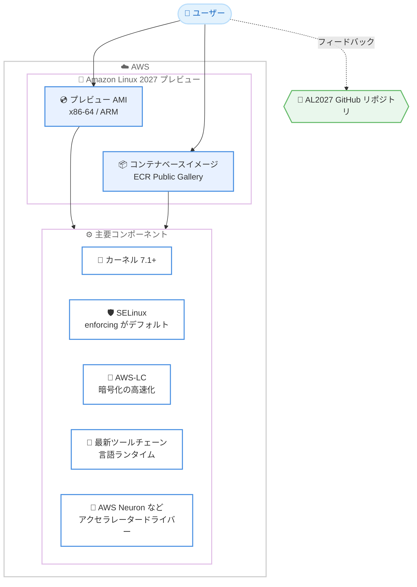

# Amazon Linux - Amazon Linux 2027 (AL2027) パブリックプレビュー

**リリース日**: 2026 年 9 月 3 日
**サービス**: Amazon Linux
**機能**: Amazon Linux 2027 (AL2027) パブリックプレビュー

📊 [このアップデートのインフォグラフィックを見る](https://takech9203.github.io/aws-news-summary/20260903-announcing-amazon-linux-2027.html)

## 概要

AWS は、Amazon Linux オペレーティングシステムの次期バージョンである Amazon Linux 2027 (AL2027) のパブリックプレビューを発表しました。AL2027 は、パフォーマンス、スケール、セキュリティを重視して AWS 上のクラウドネイティブワークロード向けに専用設計された OS であり、AL2023 のベースラインの上に構築されています。Web アプリケーション、データベース、コンテナ化されたマイクロサービス、AI/ML ワークロード、大規模インフラストラクチャを運用し、セキュアで安定した AWS ネイティブな OS を必要とするお客様を対象としています。

AL2027 はカーネル 7.1 以降で動作し、SELinux をデフォルトで enforcing モードで有効化し、AWS-LC による暗号化処理の高速化を実現します。また、最新のツールチェーンと言語ランタイムを提供し、AI/ML ワークロード向けには AWS Neuron ドライバーを含むアクセラレーターへのアクセスを提供します。

パブリックプレビューにより、一般提供 (GA) に先立って新機能を試し、アプリケーションを検証し、Amazon Linux チームに直接フィードバックを提供できます。プレビュー AMI はすべての商用 AWS リージョンで x86-64 と ARM の両アーキテクチャで利用可能であり、コンテナベースイメージは Amazon ECR Public Gallery で公開されています。

**アップデート前の課題**

- AL2023 はカーネル 6.1 ベースで提供が開始されており、最新カーネルの機能や性能改善を必要とするワークロードには制約があった
- AL2023 では SELinux はデフォルトで enforcing モードではなく、強制アクセス制御をデフォルトで求める環境では追加の設定・検証作業が必要だった
- 新しい言語ランタイムやツールチェーンを利用するには、ユーザー自身での追加セットアップが必要になる場合があった
- 次期メジャーバージョンを GA 前に検証する手段がなく、移行計画の準備を早期に開始しにくかった

**アップデート後の改善**

- カーネル 7.1 以降の採用により、最新のカーネル機能とパフォーマンス改善を利用可能になった
- SELinux がデフォルトで enforcing モードで有効化され、OS レベルの強制アクセス制御が標準で機能するようになった
- AWS-LC の採用により暗号化処理のパフォーマンスが向上した
- 最新のツールチェーンと言語ランタイムが標準で提供され、開発者が常に最新の環境を利用できるようになった
- AWS Neuron ドライバーを含む AI/ML アクセラレータードライバーへのアクセスが提供された
- GA 前にプレビュー AMI とコンテナイメージで検証を行い、GitHub を通じてフィードバックを提供できるようになった

## アーキテクチャ図



AL2027 プレビューは EC2 向けの AMI と ECR Public Gallery のコンテナベースイメージの 2 つの形態で提供され、カーネル 7.1 以降、SELinux enforcing モード、AWS-LC などの主要コンポーネントを標準搭載します。フィードバックは GitHub リポジトリを通じて提供できます。

## サービスアップデートの詳細

### 主要機能

1. **カーネル 7.1 以降の採用**
   - AL2023 (カーネル 6.1 で提供開始) から大きく進んだ最新カーネルを採用
   - 最新のハードウェアサポート、パフォーマンス改善、セキュリティ機能を利用可能
   - AL2023 のベースラインの上に構築されており、既存ワークロードからの移行を考慮した設計

2. **SELinux enforcing モードがデフォルト**
   - 強制アクセス制御 (MAC) が OS レベルで標準的に機能
   - 主要アプリケーション向けに事前設定済みの SELinux ポリシーが同梱
   - ブート時にセキュリティポリシーを設定可能

3. **AWS-LC による暗号化の高速化**
   - AWS が開発する暗号化ライブラリ AWS-LC を採用し、暗号化処理のパフォーマンスを向上
   - TLS 通信やデータ暗号化を多用するワークロードでの性能改善が期待できる

4. **最新のツールチェーンと言語ランタイム**
   - 開発者が最新の開発環境を標準で利用可能
   - クラウドネイティブアプリケーションの開発・実行に必要なランタイムを提供

5. **AI/ML ワークロード向けアクセラレーターサポート**
   - AWS Neuron ドライバーサポートを含むアクセラレータードライバーへのアクセスを提供
   - AWS Trainium / Inferentia などを利用する AI/ML ワークロードの実行基盤として利用可能

6. **バージョンロックされたリポジトリと計画的アップデート**
   - リポジトリは特定バージョンにロックされ、ユーザーがアップデートの取り込みタイミングを制御可能
   - 四半期ごとのアップデート提供 (GitHub リポジトリの記載による)
   - アップデートの延期や選択的なパッケージ適用が可能

## 技術仕様

### AL2027 プレビューの提供形態

| 項目 | 詳細 |
|------|------|
| 提供ステータス | パブリックプレビュー (GA 前) |
| ベースライン | AL2023 をベースに構築、アップストリームは Fedora |
| カーネル | 7.1 以降 |
| SELinux | デフォルトで enforcing モード |
| 暗号化ライブラリ | AWS-LC |
| 対応アーキテクチャ | x86-64、ARM (aarch64)。i686 (32 ビット) パッケージは非提供 |
| AMI | AWS Management Console から利用可能 (全商用リージョン) |
| コンテナイメージ | Amazon ECR Public Gallery で公開 |
| AI/ML サポート | AWS Neuron ドライバーを含むアクセラレータードライバー |
| フィードバック | AL2027 GitHub リポジトリ (Issues / Discussions) |

### API 変更履歴

本アップデートは OS のリリースであり、関連する AWS API の変更はありません。

## 設定方法

### 前提条件

1. AWS アカウントを保有していること
2. EC2 インスタンスを起動できる IAM 権限があること
3. プレビュー版のため、本番環境ではなく検証環境での利用を前提とすること

### 手順

#### ステップ 1: プレビュー AMI の検索

```bash
# AL2027 プレビュー AMI を検索 (名前は環境により異なるため、コンソールでの確認を推奨)
aws ec2 describe-images \
  --owners amazon \
  --filters "Name=name,Values=al2027-*" \
  --query 'Images[*].[ImageId,Name,Architecture]' \
  --output table
```

Amazon が所有する AMI から AL2027 プレビュー AMI を検索し、AMI ID、名前、アーキテクチャを一覧表示します。AWS Management Console の AMI カタログからも検索できます。

#### ステップ 2: EC2 インスタンスの起動

```bash
# AL2027 プレビュー AMI で EC2 インスタンスを起動
aws ec2 run-instances \
  --image-id ami-xxxxxxxxxxxxxxxxx \
  --instance-type t3.micro \
  --key-name my-key-pair \
  --subnet-id subnet-xxxxxxxx
```

検索した AL2027 プレビュー AMI を指定して EC2 インスタンスを起動します。ARM 版を利用する場合は Graviton ベースのインスタンスタイプ (例: t4g.micro) を指定します。

#### ステップ 3: コンテナベースイメージの取得

```bash
# ECR Public Gallery から AL2027 コンテナベースイメージを取得
docker pull public.ecr.aws/amazonlinux/amazonlinux:2027
```

Amazon ECR Public Gallery から AL2027 のコンテナベースイメージを取得します。コンテナ環境でのアプリケーション検証に利用できます。

#### ステップ 4: SELinux の状態確認とアプリケーション検証

```bash
# SELinux のモードを確認 (デフォルトで Enforcing)
getenforce

# SELinux による拒否ログの確認
sudo ausearch -m AVC -ts recent
```

AL2027 では SELinux がデフォルトで enforcing モードのため、既存アプリケーションが SELinux ポリシーに抵触しないかを検証します。`getenforce` で現在のモードを確認し、`ausearch` でアクセス拒否 (AVC) の発生有無を確認します。

## メリット

### ビジネス面

- **移行計画の早期立案**: GA 前にプレビューで検証できるため、AL2 / AL2023 からの移行計画を早期に開始し、移行リスクを低減できる
- **セキュリティコンプライアンスの強化**: SELinux enforcing がデフォルトとなることで、強制アクセス制御を求めるセキュリティ基準への対応が容易になる
- **追加コストなし**: Amazon Linux は追加料金なしで利用でき、OS ライセンスコストを抑制できる

### 技術面

- **最新カーネルの活用**: カーネル 7.1 以降により、最新のハードウェアサポートとパフォーマンス改善を享受できる
- **暗号化パフォーマンスの向上**: AWS-LC により TLS や暗号化処理が高速化され、セキュア通信の多いワークロードで有利
- **AI/ML 基盤としての即応性**: AWS Neuron ドライバーを含むアクセラレータードライバーが提供され、AI/ML ワークロードの構築が容易
- **計画的なパッチ運用**: バージョンロックされたリポジトリにより、アップデートの適用タイミングを制御でき、意図しない変更を回避できる

## デメリット・制約事項

### 制限事項

- パブリックプレビューであり、GA 前のため本番環境での利用は推奨されない
- プレビュー期間中は仕様や同梱パッケージが変更される可能性がある
- i686 (32 ビット x86) パッケージは提供されないため、32 ビット依存のレガシーアプリケーションは動作しない
- 提供リージョンは商用リージョンのみ (GovCloud などでの提供は現時点で言及なし)

### 考慮すべき点

- SELinux が enforcing モードのため、AL2023 以前から移行するアプリケーションは SELinux ポリシーへの適合検証が必要
- カーネルバージョンの大幅な更新に伴い、カーネルモジュールやドライバーに依存するソフトウェアは互換性確認が必要
- AWS-LC への変更により、OpenSSL の特定バージョンに依存するアプリケーションは動作検証を行うことが望ましい
- GA 時期やサポートライフサイクルの詳細は公式ドキュメント・FAQ で最新情報を確認する必要がある

## ユースケース

### ユースケース 1: AL2023 からの移行事前検証

**シナリオ**: AL2023 で稼働中の Web アプリケーションを、次期 OS へ計画的に移行したい。GA 後に慌てて検証するのではなく、プレビュー段階で互換性問題を洗い出したい。

**実装例**:
```bash
# 検証用インスタンスを AL2027 プレビュー AMI で起動し、
# アプリケーションをデプロイして SELinux 拒否ログを確認
getenforce
sudo ausearch -m AVC -ts today
```

**効果**: SELinux enforcing 化やカーネル更新に伴う互換性問題を GA 前に特定でき、移行時の手戻りを最小化できる。発見した問題は GitHub でフィードバックし、GA までの改善につなげられる。

### ユースケース 2: コンテナベースイメージの更新検証

**シナリオ**: コンテナ化されたマイクロサービスのベースイメージとして Amazon Linux を使用しており、次期バージョンでのビルド・動作確認を CI パイプラインで先行実施したい。

**実装例**:
```dockerfile
FROM public.ecr.aws/amazonlinux/amazonlinux:2027
RUN dnf install -y python3
COPY app/ /app/
CMD ["python3", "/app/main.py"]
```

**効果**: 最新のツールチェーンと言語ランタイムでの動作を早期に確認でき、ベースイメージ更新に伴うビルドエラーやランタイム非互換を事前に解消できる。

### ユースケース 3: AI/ML ワークロードの実行基盤検証

**シナリオ**: AWS Trainium / Inferentia を利用した推論・学習ワークロードを運用しており、次期 OS 上での AWS Neuron ドライバーの動作を検証したい。

**実装例**:
```bash
# AL2027 プレビュー AMI 上で Neuron デバイスの認識を確認
neuron-ls
```

**効果**: AI/ML アクセラレーターの動作を GA 前に検証でき、最新カーネルと AWS-LC による性能向上の効果測定も併せて実施できる。

## 料金

Amazon Linux 2027 は追加料金なしで利用できます。EC2 インスタンスの実行には、選択したインスタンスタイプに応じた通常の EC2 料金が適用されます。コンテナベースイメージの利用自体にも追加費用はかかりません。

## 利用可能リージョン

AL2027 プレビュー AMI は、すべての商用 AWS リージョンで AWS Management Console から利用可能です。x86-64 と ARM の両アーキテクチャに対応しています。コンテナベースイメージは Amazon ECR Public Gallery で公開されています。

## 関連サービス・機能

- **Amazon EC2**: AL2027 プレビュー AMI の実行基盤。Graviton インスタンスでは ARM 版 AMI を利用可能
- **Amazon ECR Public Gallery**: AL2027 コンテナベースイメージの配布元
- **AWS Neuron**: AWS Trainium / Inferentia 向け SDK。AL2027 はドライバーサポートを提供
- **AWS-LC**: AWS が開発する暗号化ライブラリ。AL2027 の暗号化パフォーマンス向上の中核
- **Amazon Linux 2023 (AL2023)**: 現行の Amazon Linux。AL2027 は AL2023 のベースラインの上に構築されている

## 参考リンク

- 📊 [インフォグラフィック](https://takech9203.github.io/aws-news-summary/20260903-announcing-amazon-linux-2027.html)
- [公式発表 (What's New)](https://aws.amazon.com/about-aws/whats-new/2026/09/announcing-amazon-linux-2027/)
- [AL2027 ドキュメント](https://docs.aws.amazon.com/linux/al2027/ug/what-is-amazon-linux.html)
- [AL2027 GitHub リポジトリ](https://github.com/amazonlinux/amazon-linux-2027)
- [Amazon Linux 製品ページ](https://aws.amazon.com/linux/)

## まとめ

Amazon Linux 2027 のパブリックプレビューは、カーネル 7.1 以降、SELinux enforcing のデフォルト化、AWS-LC による暗号化高速化など、セキュリティとパフォーマンスを大きく強化した次期 OS を GA 前に検証できる重要な機会です。AL2023 や AL2 を利用中のお客様は、検証環境でプレビュー AMI やコンテナイメージを試し、SELinux ポリシーやカーネル依存コンポーネントの互換性確認を早期に開始することを推奨します。発見した問題や要望は GitHub リポジトリを通じてフィードバックすることで、GA に向けた改善に貢献できます。
