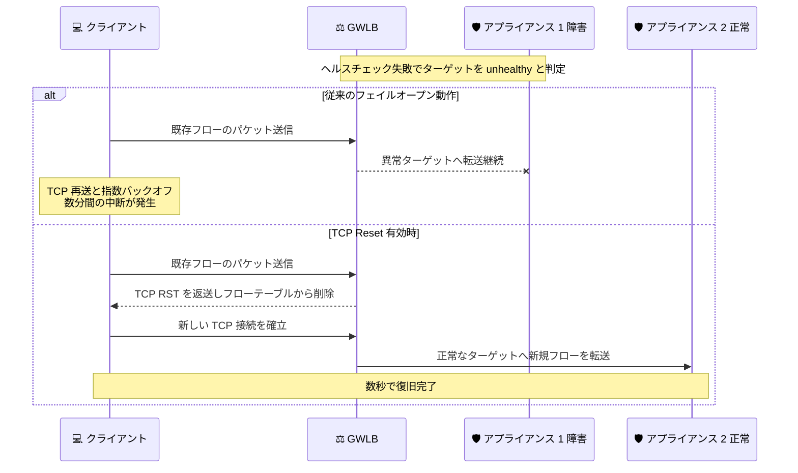

# AWS Gateway Load Balancer - TCP Reset による高速な障害復旧のサポート

**リリース日**: 2026 年 9 月 3 日
**サービス**: AWS Gateway Load Balancer (GWLB)
**機能**: TCP Reset (RST) パケット送信による TCP フローの高速復旧

📊 [このアップデートのインフォグラフィックを見る](https://takech9203.github.io/aws-news-summary/20260903-aws-gateway-load-balancer-tcp-reset.html)

## 概要

AWS Gateway Load Balancer (GWLB) が、ターゲットが異常 (unhealthy) になったとき、ターゲットが登録解除されたとき、またはフローのアイドルタイムアウトが期限切れになったときに、TCP Reset (RST) パケットを送信する機能をサポートしました。この機能により、TCP エンドポイント (クライアントやサーバー) が失敗した接続を迅速に検出し、正常なターゲットを経由する新しい TCP フローを確立できるようになり、トラフィックの中断時間を数分から数秒に短縮できます。

GWLB は、ファイアウォール、IDS/IPS、DPI (ディープパケットインスペクション) といったサードパーティ製セキュリティアプライアンスに、透過的な「bump-in-the-wire」方式でトラフィックを分散するサービスです。従来、GWLB のターゲットが障害を起こした場合でも、既存の TCP 接続は異常なターゲットに転送され続ける「フェイルオープン」動作となっており、クライアントやサーバーのアプリケーションは TCP スタックに組み込まれた再送と指数バックオフの仕組みにより、数分間にわたる中断を経験する可能性がありました。

本機能は後方互換性を確保するためデフォルトでは無効になっており、AWS Management Console、AWS CLI、または API を使用してターゲットグループ単位およびリスナー単位で有効化できます。GWLB が利用可能なすべての AWS リージョンで、新規・既存を問わずすべての Gateway Load Balancer に追加料金なしで利用できます。

**アップデート前の課題**

- GWLB のターゲットが障害を起こしても、既存の TCP フローは異常なターゲットに転送され続けるフェイルオープン動作となり、トラフィックはサイレントにドロップされていた
- クライアント/サーバーは TCP の再送と指数バックオフにより、接続断の検出までに 30 秒から 5 分以上を要することがあった
- 取引プラットフォーム、リアルタイム通信、EC サイトのチェックアウトなど、レイテンシーに敏感なワークロードでは長時間の中断が大きな影響となっていた
- アイドルタイムアウトで GWLB のフローテーブルからフローが削除されても、エンドポイント側には通知されず、切断状態の検出が遅れていた

**アップデート後の改善**

- ターゲットの異常検出時、登録解除時、アイドルタイムアウト期限切れ時に GWLB が TCP RST を返すことで、送信元が接続断を即座に検知できるようになった
- TCP エンドポイントが RST 受信後すぐに再接続し、正常なターゲット経由の新しいフローを確立できるため、復旧時間が数分から数秒に短縮された
- 3 つのトリガー (unhealthy、登録解除、アイドルタイムアウト) を個別に有効化でき、要件に応じた柔軟な設定が可能になった
- 新しい CloudWatch メトリクス `TCP_ELB_Reset_Count` により、GWLB が生成した RST の数を監視できるようになった

## アーキテクチャ図



ターゲット障害時の従来動作と TCP Reset 有効時の動作の比較です。TCP Reset を有効にすると、GWLB は着信トラフィックへの応答として RST を返し、送信元が即座に再接続して正常なターゲット経由で通信を再開できます。

## サービスアップデートの詳細

### 主要機能

1. **ターゲット異常時の TCP Reset (ターゲットグループ属性)**
   - ヘルスチェックが設定回数連続で失敗し、ターゲットが unhealthy と判定された後、該当フローへの着信トラフィックに対して TCP RST を送信する
   - 属性名: `send_tcp_reset.on_unhealthy.enabled` (デフォルト: `false`)
   - RST 送信後、GWLB はフローエントリをフローテーブルから削除し、後続トラフィックは新しいフローとして正常なターゲットにルーティングされる

2. **ターゲット登録解除時の TCP Reset (ターゲットグループ属性)**
   - ターゲットの登録解除後、コネクションドレイン時間が経過した後に TCP RST を送信する
   - 属性名: `send_tcp_reset.on_deregistration.enabled` (デフォルト: `false`)
   - アプライアンスの計画的な入れ替えやスケールインの際に、既存フローを安全かつ迅速に移行できる

3. **アイドルタイムアウト期限切れ時の TCP Reset (リスナー属性)**
   - TCP フローのアイドルタイムアウトが期限切れになった場合、またはフローテーブルに存在しないフローの非 SYN TCP パケットを受信した場合に TCP RST を送信する
   - 属性名: `send_tcp_reset.on_idle_timeout.enabled` (デフォルト: `false`)
   - 従来はサイレントにドロップされていた古いフローを能動的にクローズし、エンドポイント側の無駄な再送を防止する

4. **TCP Reset の動作原則**
   - GWLB は着信トラフィックへの応答としてのみ RST を送信し、自発的に RST パケットを生成することはない
   - RST は、トリガーとなったパケットの送信元 (クライアントまたはリモート宛先) に返送される
   - TCP トラフィックのみが対象であり、UDP などその他のプロトコルには影響しない

5. **CloudWatch による監視**
   - 新しいメトリクス `TCP_ELB_Reset_Count` で、ロードバランサーが生成した TCP RST の総数を追跡できる
   - GWLB のモニタリングタブから確認可能

## 技術仕様

### TCP Reset のトリガーと設定属性

| トリガー | RST 送信タイミング | 属性名 | 設定レベル | デフォルト |
|------|------|------|------|------|
| ターゲット異常 | ヘルスチェックの連続失敗で unhealthy 判定後 | `send_tcp_reset.on_unhealthy.enabled` | ターゲットグループ | `false` |
| ターゲット登録解除 | コネクションドレイン時間の経過後 | `send_tcp_reset.on_deregistration.enabled` | ターゲットグループ | `false` |
| アイドルタイムアウト | TCP アイドルタイムアウト期限切れ後の非 SYN パケット受信時 | `send_tcp_reset.on_idle_timeout.enabled` | リスナー | `false` |

### 関連するリスナー属性

| 属性 | 詳細 |
|------|------|
| `tcp.idle_timeout.seconds` | TCP アイドルタイムアウト値。有効範囲は 60〜6000 秒、デフォルトは 350 秒 |
| `send_tcp_reset.on_idle_timeout.enabled` | アイドルタイムアウト時の RST 送信。RST 送信後にフローエントリをフローテーブルから削除 |

### 有効化の前提条件

| 項目 | 詳細 |
|------|------|
| フロースティッキネス | 5-tuple フロースティッキネスが必須 (`stickiness.enabled` が `false` の場合のデフォルト動作) |
| スティッキネスとの排他 | `stickiness.enabled` が `true` (2-tuple/3-tuple) の場合は有効化不可 |
| Flow Rebalance との排他 | `target_failover.on_unhealthy` / `target_failover.on_deregistration` が `rebalance` の場合は有効化不可 |
| 対象プロトコル | TCP のみ (UDP その他は対象外) |
| 対象ロードバランサー | 新規および既存のすべての GWLB |

### API 変更履歴

本機能は既存の `ModifyTargetGroupAttributes` API および `ModifyListenerAttributes` API に新しい属性キーを追加する形で提供されており、新規 API メソッドの追加はありません。

## 設定方法

### 前提条件

1. Gateway Load Balancer とターゲットグループが作成済みであること
2. ターゲットグループのフロースティッキネスが 5-tuple (デフォルト、`stickiness.enabled=false`) であること
3. ターゲットフェイルオーバー属性が `no_rebalance` (デフォルト) であること

### 手順

#### ステップ1: ターゲットグループ属性で TCP Reset を有効化

```bash
aws elbv2 modify-target-group-attributes \
  --target-group-arn <target-group-arn> \
  --attributes \
    Key=send_tcp_reset.on_unhealthy.enabled,Value=true \
    Key=send_tcp_reset.on_deregistration.enabled,Value=true
```

ターゲットが unhealthy になった場合と登録解除された場合の両方で TCP RST を送信するよう、ターゲットグループ属性を変更しています。要件に応じて片方のみ有効化することも可能です。

#### ステップ2: リスナー属性でアイドルタイムアウト時の TCP Reset を有効化

```bash
aws elbv2 modify-listener-attributes \
  --listener-arn <listener-arn> \
  --attributes Key=send_tcp_reset.on_idle_timeout.enabled,Value=true
```

TCP フローのアイドルタイムアウトが期限切れになった際、またはフローテーブルに存在しないフローの非 SYN パケットを受信した際に、GWLB が RST を返すようリスナー属性を変更しています。

#### ステップ3: 設定の確認

```bash
aws elbv2 describe-target-group-attributes \
  --target-group-arn <target-group-arn>
```

ターゲットグループ属性の現在の設定値を取得し、`send_tcp_reset.on_unhealthy.enabled` と `send_tcp_reset.on_deregistration.enabled` が `true` になっていることを確認しています。

コンソールから設定する場合は、EC2 コンソールの [Target Groups] から対象ターゲットグループの [Attributes] タブを開き、[No rebalance and send TCP reset] タイルを選択して各リセットオプションを有効化します。

#### ステップ4: ヘルスチェックのチューニングと監視

障害検出時間は「ヘルスチェック間隔 × unhealthy しきい値」で決まります。デフォルト設定 (間隔 30 秒、しきい値 3) では障害発生から約 3 分後に RST が送信されます。間隔 5 秒、しきい値 2 に短縮すると約 10 秒で障害を検出でき、RST の配信は最大 90 秒以内に完了します。有効化後は CloudWatch メトリクス `TCP_ELB_Reset_Count` で RST の発生状況を監視します。

## メリット

### ビジネス面

- **ダウンタイムの大幅短縮**: アプライアンス障害時のトラフィック中断が数分から数秒に短縮され、取引システムや EC サイトなどレイテンシーに敏感なビジネスへの影響を最小化できる
- **追加コストなし**: 本機能に追加料金は発生せず、既存の GWLB 構成にそのまま適用できる
- **運用の柔軟性向上**: 登録解除時の RST により、アプライアンスの計画的なメンテナンスや入れ替えを、ユーザー影響を抑えながら実施できる

### 技術面

- **TCP レベルでの即時通知**: TCP スタックの再送・指数バックオフ (30 秒〜5 分以上) を待たずに、RST により接続断を即座にエンドポイントへ通知できる
- **トリガーごとの個別制御**: unhealthy、登録解除、アイドルタイムアウトの 3 つのトリガーを独立して有効化でき、要件に応じたきめ細かな制御が可能
- **後方互換性の維持**: デフォルト無効のオプトイン方式のため、既存環境の動作に影響を与えずに段階的に導入できる
- **可観測性の向上**: `TCP_ELB_Reset_Count` メトリクスにより、障害発生や古いフローのクローズ状況を定量的に把握できる

## デメリット・制約事項

### 制限事項

- TCP トラフィックのみが対象であり、UDP やその他のプロトコルには適用されない
- 5-tuple フロースティッキネスが必須であり、2-tuple/3-tuple スティッキネス (`stickiness.enabled=true`) との併用はできない
- Flow Rebalance 機能 (`target_failover` が `rebalance`) との併用はできない。リバランスは既存フローを新しいターゲットへ意図的に移行するため、RST の目的と相反するためである
- GWLB は自発的に RST を生成せず、着信トラフィックへの応答としてのみ送信するため、無通信のフローには RST が送られない

### 考慮すべき点

- 障害検出までの時間はヘルスチェック設定 (間隔 × しきい値) に依存するため、迅速な復旧が必要な場合はヘルスチェックの積極的なチューニングが必要。ただし、間隔を短くするとヘルスチェックトラフィックの増加と誤検知リスクの上昇を伴う
- アプリケーション層の既存タイムアウトやリトライロジックは維持することが推奨される。本機能はリトライロジックを置き換えるものではなく補完するものである
- ステートフルなアプライアンスが再接続を正しく処理できるか、本番環境への適用前に非本番環境でのテストが推奨される

## ユースケース

### ユースケース1: ファイアウォールアプライアンス障害時の高速フェイルオーバー

**シナリオ**: GWLB の背後に複数のサードパーティ製ファイアウォールアプライアンスを配置してインターネット向けトラフィックを検査している環境で、1 台のアプライアンスがソフトウェア障害でヘルスチェックに失敗した。従来は既存の TCP セッションが数分間ハングしていた。

**実装例**:
```bash
# unhealthy 時の TCP Reset を有効化
aws elbv2 modify-target-group-attributes \
  --target-group-arn <firewall-target-group-arn> \
  --attributes Key=send_tcp_reset.on_unhealthy.enabled,Value=true

# ヘルスチェックを積極的な設定に変更して検出を高速化
aws elbv2 modify-target-group \
  --target-group-arn <firewall-target-group-arn> \
  --health-check-interval-seconds 5 \
  --unhealthy-threshold-count 2
```

**効果**: 障害検出が約 10 秒に短縮され、RST を受信したクライアントが即座に再接続することで、正常なファイアウォール経由での通信が数秒で再開される。

### ユースケース2: アプライアンスの計画メンテナンスにおける安全な切り離し

**シナリオ**: IDS/IPS アプライアンスのバージョンアップのため、ターゲットを順次登録解除して入れ替えたい。コネクションドレイン後も残る長時間接続 (長命な TCP セッション) が、ドレイン完了後にサイレントドロップされることを避けたい。

**実装例**:
```bash
# 登録解除時の TCP Reset を有効化
aws elbv2 modify-target-group-attributes \
  --target-group-arn <ips-target-group-arn> \
  --attributes Key=send_tcp_reset.on_deregistration.enabled,Value=true

# ターゲットを登録解除 (ドレイン開始)
aws elbv2 deregister-targets \
  --target-group-arn <ips-target-group-arn> \
  --targets Id=<instance-id>
```

**効果**: ドレイン時間経過後に残存フローへ RST が送信され、クライアントが即座に別のアプライアンス経由で再接続するため、メンテナンス作業をユーザー影響を最小限に抑えて実施できる。

### ユースケース3: 長時間アイドルな接続の能動的なクリーンアップ

**シナリオ**: 金融系のリアルタイム通信システムで、TCP アイドルタイムアウト (デフォルト 350 秒) の期限切れにより GWLB のフローテーブルからフローが削除された後も、エンドポイントは接続が有効と認識したままパケットを送信し、再送を繰り返していた。

**実装例**:
```bash
# アイドルタイムアウト時の TCP Reset を有効化し、タイムアウト値も調整
aws elbv2 modify-listener-attributes \
  --listener-arn <listener-arn> \
  --attributes \
    Key=send_tcp_reset.on_idle_timeout.enabled,Value=true \
    Key=tcp.idle_timeout.seconds,Value=600
```

**効果**: フローテーブルに存在しないフローの非 SYN パケットに対して RST が返るため、エンドポイントが古い接続を即座に破棄して再接続でき、無駄な再送トラフィックとアプリケーションのハングが解消される。

## 料金

本機能の利用に追加料金はありません。Gateway Load Balancer の標準料金 (GWLB 時間料金および GLCU 単位の使用量課金) がそのまま適用されます。CloudWatch メトリクス `TCP_ELB_Reset_Count` の参照についても、CloudWatch の標準的な利用範囲内で確認できます。

## 利用可能リージョン

Gateway Load Balancer が利用可能なすべての AWS リージョンで、新規および既存の Gateway Load Balancer に対して利用できます。

## 関連サービス・機能

- **AWS Gateway Load Balancer Endpoint (GWLBE)**: GWLB へトラフィックを送るための PrivateLink ベースのエンドポイント。TCP Reset は GWLBE 経由のトラフィックにも透過的に機能する
- **Elastic Load Balancing (NLB/ALB)**: NLB にも同様の TCP アイドルタイムアウトやリセットの概念があり、GWLB が同水準の障害復旧機能を獲得した形となる
- **Amazon CloudWatch**: 新メトリクス `TCP_ELB_Reset_Count` による RST 発生状況の監視と、既存のヘルスチェック関連メトリクスとの組み合わせで障害対応を可視化できる
- **AWS Transit Gateway**: アプライアンスモードと組み合わせた集中検査アーキテクチャで GWLB を利用する場合、5-tuple スティッキネスが必要であり、本機能の前提条件とも整合する

## 参考リンク

- 📊 [インフォグラフィック](https://takech9203.github.io/aws-news-summary/20260903-aws-gateway-load-balancer-tcp-reset.html)
- [公式発表 (What's New)](https://aws.amazon.com/about-aws/whats-new/2026/09/aws-gateway-load-balancer-tcp-reset/)
- [AWS Blog: Reduce traffic interruptions with Gateway Load Balancer TCP Reset](https://aws.amazon.com/blogs/networking-and-content-delivery/reduce-traffic-interruptions-with-gateway-load-balancer-tcp-reset/)
- [ドキュメント: Edit target group attributes for your Gateway Load Balancer](https://docs.aws.amazon.com/elasticloadbalancing/latest/gateway/edit-target-group-attributes.html#send-tcp-reset-target-failover)
- [ドキュメント: Listeners for your Gateway Load Balancers](https://docs.aws.amazon.com/elasticloadbalancing/latest/gateway/gateway-listeners.html#listener-attributes)
- [料金ページ: Elastic Load Balancing pricing](https://aws.amazon.com/elasticloadbalancing/pricing/)

## まとめ

GWLB の TCP Reset サポートにより、セキュリティアプライアンス障害時のトラフィック中断が数分から数秒へと大幅に短縮され、GWLB を用いた集中検査アーキテクチャの可用性が向上しました。デフォルト無効のオプトイン方式かつ追加料金なしで利用できるため、GWLB の背後でファイアウォールや IDS/IPS を運用しているユーザーは、非本番環境での動作確認とヘルスチェック設定のチューニングを行ったうえで、本機能の有効化を検討することを推奨します。
