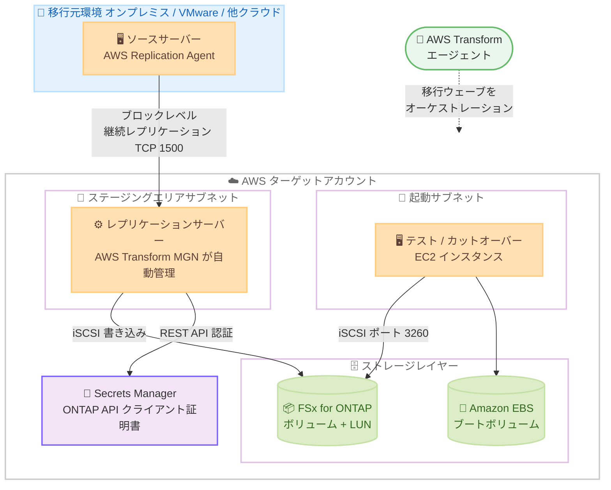

# AWS Transform - Amazon FSx for NetApp ONTAP サポートの一般提供開始

**リリース日**: 2026 年 9 月 3 日
**サービス**: AWS Transform (AWS Transform for migrations)
**機能**: Amazon FSx for NetApp ONTAP をブロックストレージ移行ターゲットとしてサポート (GA)

📊 [このアップデートのインフォグラフィックを見る](https://takech9203.github.io/aws-news-summary/20260903-aws-transform-fsx-netapp-ontap-support.html)

## 概要

AWS Transform for migrations が、ブロックストレージワークロードの移行先ストレージターゲットとして Amazon FSx for NetApp ONTAP (FSx for ONTAP) を一般提供 (GA) で追加しました。従来からサポートされている Amazon EBS に加えて、コンピュートとネットワークを扱う同一の移行ウェーブの中で、ブロックストレージを FSx for ONTAP へ直接移行できるようになります。

AWS Transform は、エージェンティック AI を活用してオンプレミスや VMware 環境などから AWS への大規模移行を自動化するサービスです。内部的には AWS Transform MGN によるブロックレベルの継続的レプリケーションを使用しており、今回のアップデートでレプリケーション設定の「ターゲットストレージタイプ」に FSx for ONTAP を選択できるようになりました。NetApp ONTAP、その他のブロックストレージプラットフォーム、VMware 環境のいずれから移行する場合でも、移行後のデータアクセスパターンや運用プロセスを変えることなく、ONTAP のエンタープライズ機能と AWS のスケーラビリティ・耐障害性を兼ね備えたフルマネージドの共有ストレージへ移行できます。

オンプレミスで NetApp ONTAP ストレージを利用している企業や、VMware 環境から共有ストレージ要件を維持したまま AWS へ移行したい企業が主な対象です。従来は複数のツールを組み合わせる必要があった移行作業が、単一の移行ワークフローで完結します。

**アップデート前の課題**

- AWS Transform のブロックストレージ移行ターゲットは Amazon EBS のみであり、FSx for ONTAP へ移行するには中間ストレージプラットフォームや別個の移行ツール (NetApp SnapMirror など) を組み合わせる必要があった
- コンピュート・ネットワークの移行と、ONTAP ストレージへのデータ移行を別々のワークフローで管理する必要があり、移行計画とカットオーバーの調整が複雑だった
- ONTAP の機能 (Snapshot、ストレージ効率化、マルチプロトコルアクセスなど) に依存するワークロードを、運用プロセスを変えずに AWS へ移行することが難しかった

**アップデート後の改善**

- サーバー再ホストと同じ移行ウェーブ内で、データボリュームを FSx for ONTAP へ直接レプリケーションできるようになった
- 中間ストレージや別ツールが不要になり、レプリケーション、テスト起動、カットオーバーまでを AWS Transform の単一ワークフローで完結できるようになった
- 移行後のワークロードは iSCSI 経由で FSx for ONTAP の LUN に接続され、ONTAP のエンタープライズ機能をフルマネージドサービスとして利用できるようになった

## アーキテクチャ図



AWS Transform のエージェントが移行ウェーブ全体をオーケストレーションし、ソースサーバーのデータはレプリケーションサーバー経由で FSx for ONTAP のボリュームに LUN として書き込まれます。カットオーバー後の EC2 インスタンスは iSCSI で FSx for ONTAP に接続し、ブートボリュームのみ Amazon EBS を使用します。

## サービスアップデートの詳細

### 主要機能

1. **ターゲットストレージタイプとしての FSx for ONTAP 選択**
   - AWS Transform MGN のレプリケーションテンプレートで、ターゲットストレージタイプを Amazon EBS (デフォルト) または FSx for ONTAP から選択できる
   - FSx for ONTAP を選択する場合、Storage Virtual Machine (SVM) ID、ONTAP REST API 認証用のクライアント証明書を格納した Secrets Manager の Secret ARN、iSCSI アクセス用のセキュリティグループを指定する
   - 既存の FSx for ONTAP ファイルシステムも新規作成したファイルシステムも利用できる

2. **単一の移行ワークフローへの統合**
   - インベントリ検証、レプリケーションエージェント展開、継続レプリケーション、テスト起動、カットオーバーという既存の移行ウェーブのフローの中で、ストレージターゲットとして FSx for ONTAP が扱われる
   - コンピュート、ネットワーク、ブロックストレージの移行を同一ウェーブで計画・実行でき、中間ストレージや別ツールが不要になる

3. **ONTAP ネイティブなデータ配置**
   - ソースサーバーごとに FSx for ONTAP 上に 1 つのボリュームが作成され、各ディスクはそのボリューム内の個別の LUN として配置される (例: 3 ディスクのサーバーは 1 ボリューム + 3 LUN)
   - 移行後に ONTAP の `lun move start` コマンドで LUN を専用ボリュームへ無停止で再配置し、ボリューム単位の Snapshot や階層化ポリシーを個別に構成することも可能
   - 起動されたインスタンスには iSCSI イニシエーターとマルチパスのパッケージが自動インストールされ、マルチパス構成で LUN に接続される

4. **証明書ベースの安全な認証**
   - AWS Transform MGN は ONTAP REST API へのアクセスにクライアント証明書認証を使用する (iSCSI の CHAP は使用せず、iSCSI アクセスはセキュリティグループで制御)
   - 証明書と秘密鍵は AWS Secrets Manager に格納し、Secret ARN を介して安全に参照される
   - 本番環境では AWS Private Certificate Authority または組織の CA の利用が推奨される

5. **移行後の検証支援**
   - 事前定義の Volume integrity validation ポストローンチアクションを有効にすると、テスト起動やカットオーバー起動のたびに iSCSI 接続とマルチパスマウント構成が自動検証される

## 技術仕様

### FSx for ONTAP ターゲットの仕様

| 項目 | 詳細 |
|------|------|
| 選択できるターゲットストレージタイプ | Amazon EBS (デフォルト) / FSx for ONTAP |
| レプリケーション方式 | エージェントベースのみ (エージェントレスレプリケーションは非対応) |
| データ配置 | ソースサーバーごとに 1 ボリューム、ディスクごとに 1 LUN |
| ブートボリューム | 常に Amazon EBS (FSx for ONTAP には配置されない) |
| ターゲットインスタンスからの接続 | iSCSI (ポート 3260)、管理 API は HTTPS (ポート 443) |
| 認証方式 | ONTAP REST API へのクライアント証明書認証 (Secrets Manager に格納) |
| 同時移行できるファイルシステム数 | 1 アカウントあたり最大 5 ファイルシステム |
| igroup 上限 | Single-AZ: 256 / Multi-AZ: 512 (ソースサーバーごとに 1 つ + 起動インスタンスごとに 1 つ作成) |
| ネットワーク要件 | FSx for ONTAP と MGN インスタンスは同一アカウント・同一リージョン。IPv4 接続が必要。ステージング / 起動サブネットから OS パッケージリポジトリへのアウトバウンドアクセスが必要 |
| 推奨キャパシティ | 移行予定データの 3 倍を目安にプロビジョニングし、SSD 使用率 80% 以下を維持 |
| Local Zones | 非対応 |

### 必要な設定要素

FSx for ONTAP をターゲットに指定するには、レプリケーションテンプレートで以下を構成します。

```text
ターゲットストレージタイプ : AWS FSx for ONTAP
SVM ID                    : ファイルシステム上の Storage Virtual Machine を選択
FSx Storage Secret ARN    : ONTAP API クライアント証明書を格納した Secrets Manager の ARN
セキュリティグループ      : iSCSI 通信を許可する MGN-Instances-SG
```

Secrets Manager のシークレットは、`cert` (クライアント証明書) と `key` (PKCS#8 形式の秘密鍵) の 2 つのキーを持ち、タグ `AWSApplicationMigrationServiceManaged: True` を付与する必要があります。

## 設定方法

### 前提条件

1. AWS Transform のワークスペースと移行ジョブが設定済みで、ターゲットアカウントコネクタが承認されていること
2. ターゲットアカウントで AWS Transform MGN が初期化されていること (FSx for ONTAP サポート提供前に初期化した場合は、MGN コンソールの「Reinitialize Service Permissions」で再初期化が必要)
3. ソースサーバーがサポート対象 OS であり、エージェントベースのレプリケーションが可能であること
4. ステージングエリアサブネットと起動サブネットから OS パッケージリポジトリへのアウトバウンドアクセスがあること (iSCSI / マルチパスパッケージの自動インストールに必要)

### 手順

#### ステップ 1: セキュリティグループを作成

相互参照する 2 つのセキュリティグループを作成します。

- `MGN-Instances-SG`: MGN が起動するテスト / カットオーバーインスタンスに付与。インバウンドはレプリケーション用の TCP 1500 のみ必須
- `FSx-ONTAP-SG`: FSx for ONTAP ファイルシステムに付与。`MGN-Instances-SG` をソースとする iSCSI (3260) と管理アクセス、およびファイルシステム配置サブネットの CIDR からの HTTPS (443) を許可

`FSx-ONTAP-SG` のインバウンドルールが `MGN-Instances-SG` を参照するため、MGN が起動したインスタンスだけがファイルシステムへ到達できる構成になります。

#### ステップ 2: FSx for ONTAP ファイルシステムを準備

既存または新規の FSx for ONTAP ファイルシステムを、MGN がインスタンスを起動するアカウント・リージョンに用意します。Multi-AZ 構成の場合は、VPC CIDR の外側の具体的な IPv4 アドレス範囲 (例: `192.168.1.0/24`) をエンドポイントアドレス範囲として明示的に指定する必要があります。ストレージ容量は移行データの 3 倍を目安に確保し、Autonomous Ransomware Protection (ARP) が有効な場合は移行前に無効化します。

#### ステップ 3: クライアント証明書を構成し Secrets Manager に格納

```bash
# ONTAP CLI でクライアント CA 証明書をインストールし、証明書認証ユーザーを作成
security certificate install -type client-ca -vserver FsxId0123456789abcdef -cert-name my-client-ca
security login create -vserver FsxId0123456789abcdef \
  -user-or-group-name cert_usr -application http \
  -authentication-method cert -role fsxadmin
```

ファイルシステムの管理エンドポイントに `fsxadmin` で SSH 接続し、クライアント CA 証明書を登録して証明書認証のユーザーを作成します。その後、クライアント証明書 (`cert`) と PKCS#8 形式の秘密鍵 (`key`) を Secrets Manager にシークレットとして格納し、Secret ARN を控えます。

#### ステップ 4: レプリケーションテンプレートで FSx for ONTAP を選択

MGN コンソールの「Settings → Replication template」で、ターゲットストレージタイプに「AWS FSx for ONTAP」を選択し、SVM ID、FSx Storage Secret ARN、`MGN-Instances-SG` を指定して保存します。AWS Transform のチャットインターフェイスや HITL (Human-in-the-Loop) レビューを通じて設定することもできます。すでにレプリケーション中のソースサーバーのストレージタイプを変更すると、レプリケーションは初期同期からやり直しになる点に注意してください。

#### ステップ 5: 移行ウェーブを実行

AWS Transform のエージェントの案内に従い、インベントリ検証、レプリケーションエージェント展開、データレプリケーション、テスト起動、カットオーバーを進めます。データボリュームは FSx for ONTAP 上の LUN として複製され、カットオーバー後のインスタンスは iSCSI マルチパス経由で接続されます。Volume integrity validation ポストローンチアクションを有効にすると、起動のたびに接続とマウントが自動検証されます。

## メリット

### ビジネス面

- **移行ツールチェーンの簡素化**: 従来は複数ツールの組み合わせが必要だったコンピュート + ストレージ移行が単一ワークフローになり、移行プロジェクトの計画・管理コストを削減できる
- **運用プロセスの継続性**: NetApp ONTAP からの移行では、Snapshot 運用などのデータアクセスパターンや運用プロセスを変えずに AWS へ移行でき、運用チームの再教育コストを抑えられる
- **エンタープライズストレージのマネージド化**: ハードウェア更改やストレージ基盤運用から解放され、フルマネージドで本番対応の共有ストレージへ移行できる

### 技術面

- **同一ウェーブでの一貫したカットオーバー**: コンピュート、ネットワーク、ブロックストレージを同じ移行ウェーブで扱えるため、依存関係のあるワークロードの切り替えを整合性を保って実行できる
- **ONTAP 機能の活用**: 移行後すぐに Snapshot、ストレージ効率化 (重複排除・圧縮)、容量プールへの階層化などの ONTAP 機能を利用できる
- **証明書ベースのセキュアな統合**: ONTAP REST API へのアクセスはクライアント証明書認証と Secrets Manager で保護され、iSCSI アクセスはセキュリティグループの相互参照で MGN 起動インスタンスのみに制限される
- **自動化された接続構成**: iSCSI イニシエーターとマルチパスの構成はレプリケーションサーバーと起動インスタンスに自動で行われ、手動のストレージ接続設定が不要

## デメリット・制約事項

### 制限事項

- エージェントベースのレプリケーションのみサポートされ、エージェントレスレプリケーションでは FSx for ONTAP をターゲットにできない
- 1 アカウントで同時に移行できる FSx for ONTAP ファイルシステムは最大 5 つ (それ以上はフェーズ分割が必要)
- 同一サーバー内でストレージタイプの混在はできない (データボリュームはすべて EBS または FSx for ONTAP のいずれかで、ブートボリュームは常に EBS)
- ソースが ONTAP ストレージの場合でも、アクセス権限、クォータ、Snapshot ポリシーなどの ONTAP 設定は移行されず、移行後に再構成が必要
- MGN はソースサーバーごとに 1 ボリューム + ディスクごとの LUN を作成するため、ONTAP のベストプラクティスである 1 ボリューム 1 LUN 構成にするには移行後に `lun move start` での再配置が必要
- Local Zones では利用できない

### 考慮すべき点

- FSx for ONTAP の自動バックアップや ARP が有効な場合、カットオーバー完了時のレプリケーションボリューム削除がブロックされることがあるため、移行中は ARP の無効化とバックアップ設定の確認が必要 (移行完了後に再有効化)
- 移行中はレプリケーションデータ、変換済みボリューム、削除待ちボリュームが同時に容量を消費するため、移行データの 3 倍を目安とした事前のキャパシティ確保が推奨される
- igroup はソースサーバーと起動インスタンスごとに作成されるため、ファイルシステムあたりの igroup 上限 (Single-AZ: 256 / Multi-AZ: 512) を考慮してサーバー数を計画する必要がある
- MGN が管理する FSx for ONTAP リソース (LUN、igroup、Snapshot) を移行中に変更・リネームすると、移行の最初からのやり直しが必要になる
- スループットキャパシティは移行時間に直結するため、全ソースサーバーの平均読み取り + 書き込みスループットの合計に 15% の余裕を加えた値で事前に設計する (移行後に縮小可能)

## ユースケース

### ユースケース 1: オンプレミス NetApp ONTAP から FSx for ONTAP への移行

**シナリオ**: オンプレミスのデータセンターで NetApp ONTAP ストレージに接続されたアプリケーションサーバー群を運用しており、ハードウェア更改を機に AWS へ移行したい。Snapshot ベースの運用手順を維持したい。

**実装例**:
```text
1. AWS Transform で移行ジョブを作成し、ディスカバリーデータから移行ウェーブを計画
2. ターゲットアカウントに Multi-AZ の FSx for ONTAP ファイルシステムを作成
3. レプリケーションテンプレートでターゲットストレージタイプに FSx for ONTAP を選択
4. ウェーブ単位でレプリケーション → テスト → カットオーバーを実行
5. 移行後に Snapshot ポリシーやクォータを FSx for ONTAP 上で再構成
```

**効果**: SnapMirror 用の中間環境や別ツールを用意することなく、サーバーとストレージを単一ワークフローで移行できる。移行後も ONTAP ベースの運用手順を継続できる。

### ユースケース 2: VMware 環境からの共有ストレージ要件を伴う移行

**シナリオ**: VMware 環境で共有データストア上の仮想マシンを運用しており、AWS への移行後もエンタープライズグレードの共有ストレージ機能 (重複排除、圧縮、階層化) を利用したい。

**実装例**:
```text
1. AWS Transform のディスカバリーツールで VMware 環境をインベントリ化
2. ネットワーク移行と landing zone 構築を同一ジョブ内で実施
3. データボリュームのターゲットを FSx for ONTAP、ブートボリュームは EBS で移行
4. カットオーバー後、アクセス頻度の低いデータを容量プールへ階層化
```

**効果**: コンピュート、ネットワーク、ストレージの移行が 1 つの移行ウェーブで完結し、移行後は ONTAP のストレージ効率化機能によりストレージコストを最適化できる。

### ユースケース 3: 他のブロックストレージプラットフォームからの統合移行

**シナリオ**: 複数ベンダーのブロックストレージ (SAN) に分散したワークロードを AWS に集約し、ストレージ基盤を FSx for ONTAP に標準化したい。

**実装例**:
```text
1. ソースサーバーに AWS Replication Agent を展開 (ソースのハイパーバイザーやストレージベンダーは不問)
2. ウェーブごとにレプリケーション先の FSx for ONTAP ファイルシステムを割り当て (同時 5 ファイルシステムまで)
3. Volume integrity validation ポストローンチアクションで iSCSI 接続を自動検証
4. 移行後に lun move start で LUN を専用ボリュームへ再配置し、ボリューム単位のポリシーを適用
```

**効果**: ソースのストレージプラットフォームに依存せず、エージェントベースのブロックレベルレプリケーションで FSx for ONTAP への標準化と集約を段階的に実行できる。

## 料金

AWS Transform の FSx for ONTAP サポート自体は追加機能であり、利用には移行先の FSx for ONTAP ファイルシステムの標準料金 (SSD ストレージ容量、スループットキャパシティ、容量プール使用量など) が適用されます。

| 課金項目 | 内容 |
|--------|------------------|
| FSx for ONTAP | SSD ストレージ、プロビジョンドスループット、容量プールなどの標準料金 |
| Amazon EBS | ブートボリュームおよび EBS をターゲットにしたボリュームの標準料金 |
| レプリケーションサーバー | ステージングエリアで自動起動される EC2 インスタンス (デフォルト t3.small) の料金 |

移行中はレプリケーションデータ、変換ボリューム、削除待ちボリュームが同時に容量を消費するため、一時的に移行データの 3 倍程度のストレージ容量が必要になる点に注意してください。第 2 世代のファイルシステム (Single-AZ 2 / Multi-AZ 2) であれば、移行完了後にストレージ容量を縮小できます。スループットキャパシティも移行完了後に引き下げ可能です。詳細は [Amazon FSx for NetApp ONTAP 料金ページ](https://aws.amazon.com/fsx/netapp-ontap/pricing/) および [AWS Transform 料金ページ](https://aws.amazon.com/transform/pricing/) を参照してください。

## 利用可能リージョン

AWS Transform がサポートするターゲットリージョンのうち、Amazon FSx for NetApp ONTAP が利用可能なリージョンで利用できます。AWS Transform のターゲットリージョンには、東京、大阪を含む以下のリージョンが含まれます。

米国東部 (バージニア北部)、米国東部 (オハイオ)、米国西部 (北カリフォルニア)、米国西部 (オレゴン)、アフリカ (ケープタウン)、アジアパシフィック (香港)、アジアパシフィック (台北)、アジアパシフィック (ムンバイ)、アジアパシフィック (ハイデラバード)、アジアパシフィック (東京)、アジアパシフィック (ソウル)、アジアパシフィック (大阪)、アジアパシフィック (シンガポール)、アジアパシフィック (シドニー)、アジアパシフィック (ジャカルタ)、アジアパシフィック (メルボルン)、アジアパシフィック (マレーシア)、アジアパシフィック (ニュージーランド)、アジアパシフィック (タイ)、カナダ (中部)、カナダ西部 (カルガリー)、欧州 (フランクフルト)、欧州 (チューリッヒ)、欧州 (アイルランド)、欧州 (ロンドン)、欧州 (パリ)、欧州 (ストックホルム)、欧州 (ミラノ)、欧州 (スペイン)、イスラエル (テルアビブ)、メキシコ (中部)、南米 (サンパウロ)

最新のリージョン一覧は、[AWS Transform のサポート対象ターゲットリージョン](https://docs.aws.amazon.com/transform/latest/userguide/transform-vmware-connect-target-account.html#transform-vmware-cta-supported-regions) および [FSx for ONTAP の利用可能リージョン](https://docs.aws.amazon.com/fsx/latest/ONTAPGuide/available-aws-regions.html) を参照してください。なお、FSx for ONTAP ターゲットは Local Zones では利用できません。

## 関連サービス・機能

- **AWS Transform MGN**: AWS Transform の内部で使用されるブロックレベルレプリケーション基盤。今回のアップデートでレプリケーションテンプレートのターゲットストレージタイプに FSx for ONTAP が追加された
- **Amazon FSx for NetApp ONTAP**: NetApp ONTAP のエンタープライズ機能をフルマネージドで提供するストレージサービス。Snapshot、SnapMirror、重複排除、階層化などを利用できる
- **AWS Secrets Manager**: ONTAP REST API 認証用のクライアント証明書と秘密鍵を安全に格納し、MGN が Secret ARN 経由で参照する
- **AWS Private Certificate Authority**: 本番環境で推奨される、クライアント証明書の発行基盤
- **AWS Transfer Family**: 2026 年 1 月には Transfer Family でも FSx for ONTAP サポートが追加されており、移行後のファイル転送ワークフロー統合にも活用できる

## 参考リンク

- 📊 [インフォグラフィック](https://takech9203.github.io/aws-news-summary/20260903-aws-transform-fsx-netapp-ontap-support.html)
- [公式発表 (What's New)](https://aws.amazon.com/about-aws/whats-new/2026/09/aws-transform-fsx-netapp-ontap-support/)
- [AWS Transform for migrations 製品ページ](https://aws.amazon.com/transform/migrations/)
- [ドキュメント: FSx for ONTAP configuration (AWS Transform MGN User Guide)](https://docs.aws.amazon.com/mgn/latest/ug/fsx-ontap.html)
- [ドキュメント: Replication template reference](https://docs.aws.amazon.com/mgn/latest/ug/replication-server-settings.html)
- [ドキュメント: Migrate servers (AWS Transform User Guide)](https://docs.aws.amazon.com/transform/latest/userguide/transform-vmware-migrate-servers.html)
- [Amazon FSx for NetApp ONTAP 製品ページ](https://aws.amazon.com/fsx/netapp-ontap/)
- [料金ページ: Amazon FSx for NetApp ONTAP](https://aws.amazon.com/fsx/netapp-ontap/pricing/)

## まとめ

AWS Transform for migrations のストレージターゲットに FSx for ONTAP が GA として追加されたことで、コンピュート・ネットワーク・ブロックストレージの移行が単一の移行ウェーブで完結するようになりました。オンプレミスの NetApp ONTAP や VMware 環境から、エンタープライズストレージ機能を維持したまま AWS へ移行したいお客様にとって、中間ストレージや別ツールを排除できる大きな改善です。移行を計画する際は、エージェントベースレプリケーションの制約、ファイルシステムのキャパシティ設計 (移行データの 3 倍が目安)、igroup 上限を考慮した上で、レプリケーションテンプレートのターゲットストレージタイプ設定から検討を始めることを推奨します。
