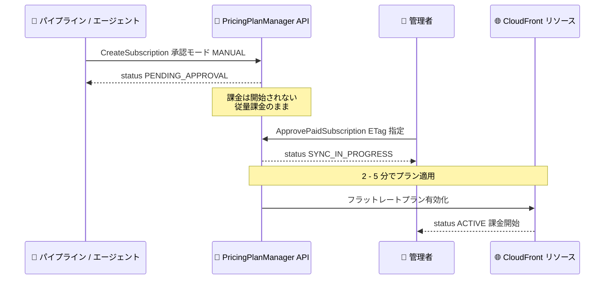

# Amazon CloudFront - フラットレート料金プランの API サポート

**リリース日**: 2026年9月3日
**サービス**: Amazon CloudFront
**機能**: PricingPlanManager API によるフラットレート料金プランのプログラマティック管理

📊 [このアップデートのインフォグラフィックを見る](https://takech9203.github.io/aws-news-summary/20260903-cloudfront-flat-rate-pricing-plans-api.html)

## 概要

Amazon CloudFront のフラットレート料金プランを、AWS CLI、AWS SDK、CloudFormation、CDK、または新しい PricingPlanManager API を使用してプログラマティックに管理できるようになった。サブスクリプションの作成 (加入)、アップグレード、ダウングレード、キャンセルのすべてを API 経由で実行できる。

CloudFront フラットレートプランは、グローバルなコンテンツ配信、AWS WAF、DDoS 保護、DNS、ロギング、エッジコンピュートを単一の月額料金でカバーするプランであり、トラフィックスパイクや攻撃が発生しても使用量ベースの超過料金は発生しない。今回のアップデートにより、Infrastructure as Code (IaC) や自動化パイプライン、さらにはインフラをプロビジョニングする AI エージェントのワークフローにフラットレートプランの管理を組み込めるようになった。

特筆すべき点として、有料プランではオプションの 2 フェーズアクティベーションフロー (作成 → 承認) がサポートされる。プランを作成した後、明示的に承認するまで課金が開始されないため、自動化ワークフローやエージェントが意図せず課金コミットメントを発生させることを防止できる。

**アップデート前の課題**

- フラットレート料金プランへの加入はコンソール経由でのみ可能だった
- API や CloudFormation などの IaC でディストリビューションを作成・管理する場合でも、プラン加入だけは手動操作が必要だった
- 自動化パイプラインやマルチアカウント環境でプラン管理を標準化する手段がなかった

**アップデート後の改善**

- AWS CLI、AWS SDK、CloudFormation、CDK、PricingPlanManager API でプランの加入・アップグレード・ダウングレード・キャンセルが可能になった
- 2 フェーズアクティベーション (MANUAL 承認モード) により、人間の確認を経てから課金を開始する安全な自動化フローを構築できるようになった
- IAM 権限の分離 (`CreateSubscription` と `ApprovePaidSubscription`) により、パイプラインやエージェントには作成権限のみを付与し、課金承認は管理者に限定できるようになった
- ディストリビューション作成からプラン加入までを単一の IaC ワークフローで完結できるようになった

## アーキテクチャ図



有料プランの推奨パターンである 2 フェーズアクティベーションのフロー。自動化ワークフローがサブスクリプションを作成し、人間の管理者が承認して初めて課金が開始される。

## サービスアップデートの詳細

### 主要機能

1. **PricingPlanManager API の一般提供**
   - フラットレート料金プランのサブスクリプションを管理する新しい専用 API
   - プランファミリーの概念を導入し、現時点では CloudFront が唯一のプランファミリー
   - API エンドポイントは us-east-1 で提供 (CLI では `--region us-east-1` を指定)
   - 9 つの新規 API メソッドを提供

2. **2 フェーズアクティベーション (承認モード)**
   - `MANUAL` (デフォルト): サブスクリプション作成後、`ApprovePaidSubscription` を呼び出すまで `PENDING_APPROVAL` 状態となり課金されない
   - `IMMEDIATE`: 作成と有効化を 1 ステップで実行し、即座に課金開始。呼び出し元には `CreateSubscription` と `ApprovePaidSubscription` の両方の権限が必要
   - 無料プランは承認不要で即座に有効化される (`MANUAL` の指定は拒否される)
   - Premium プランは月額最大 10,000 USD となるため、自動化ワークフローでは `MANUAL` の使用が推奨されている

3. **楽観的同時実行制御 (ETag)**
   - すべての変更系操作は ETag による楽観的同時実行制御を使用
   - `GetSubscription` などで取得した `eTag` 値を `--if-match` パラメータで渡す必要がある
   - サブスクリプションが取得後に変更されていた場合は `ConflictException` で失敗し、変更の上書きを防止

4. **リソースの関連付け管理**
   - 必須リソース: CloudFront ディストリビューション ARN と AWS WAF Web ACL ARN (CLOUDFRONT スコープ、us-east-1)
   - オプションリソース: Route 53 ホストゾーン ARN、CloudFront KeyValueStore ARN
   - `AssociateResourcesToSubscription` / `DisassociateResourcesFromSubscription` で作成後にオプションリソースを追加・削除可能

5. **スケジュールされた変更の管理**
   - アップグレードは即時反映され、日割りで新料金が適用される
   - ダウングレードとキャンセルは請求期間 (暦月) の終了時に有効化される
   - `CancelSubscriptionChange` で保留中のダウングレード・キャンセルを取り消し可能

## 技術仕様

### API オペレーション一覧

| オペレーション | 説明 |
|------|------|
| `CreateSubscription` | 新しいサブスクリプションを作成。プランファミリー、プランティア、リソース ARN、承認モードを指定 |
| `ApprovePaidSubscription` | `PENDING_APPROVAL` 状態の有料サブスクリプションを承認し、課金を開始 |
| `GetSubscription` | 単一サブスクリプションの詳細と ETag を取得 |
| `ListSubscriptions` | アカウント内のすべてのサブスクリプションを一覧表示 |
| `UpdateSubscription` | プランティアまたは使用量レベルを変更 (アップグレード / ダウングレード) |
| `CancelSubscription` | サブスクリプションをキャンセル。有料プランは請求期間末に有効化 |
| `CancelSubscriptionChange` | 保留中のダウングレードまたはキャンセルを取り消し |
| `AssociateResourcesToSubscription` | オプションリソースをサブスクリプションに追加 |
| `DisassociateResourcesFromSubscription` | オプションリソースをサブスクリプションから削除 |

### サブスクリプションのライフサイクル

| ステータス | 説明 |
|------|------|
| `ACTIVE` | プランが有効で、関連リソースに適用済み。プラン料金で課金 |
| `PENDING_APPROVAL` | MANUAL モードで作成された有料プランが承認待ち。承認まで従量課金が継続 |
| `SYNC_IN_PROGRESS` | 変更をリソースに適用中 (通常 2 - 5 分)。完了まで変更操作は不可 |
| `FAILED` | 操作が失敗。`statusReason` フィールドで原因を確認し、キャンセル後に再試行 |

### プランティア

| ティア | 対象 |
|------|------|
| `FREE` | ホビイスト、学習者、開発者向け |
| `PRO` | 小規模なウェブサイト、ブログ、アプリケーションの立ち上げと成長 |
| `BUSINESS` | ビジネスアプリケーションの保護と高速化 |
| `PREMIUM` | ビジネスおよびミッションクリティカルなアプリケーション。使用量レベルを設定可能 |

### API変更履歴

| 日付 | サービス | 変更内容 |
|------|----------|----------|
| 2026/07/30 | [PricingPlanManager](https://awsapichanges.com/archive/changes/c60f41-pricingplanmanager.html) | 9 new api methods - Public PricingPlanManager SDK のサポートを追加 |

### IAM 権限分離の例

自動化ワークフロー (パイプライン、エージェント、サービスロール) には作成権限のみを付与し、課金を開始する承認権限は管理者ロールに限定する。

```json
{
  "Version": "2012-10-17",
  "Statement": [
    {
      "Effect": "Allow",
      "Action": "pricingplanmanager:CreateSubscription",
      "Resource": "*"
    }
  ]
}
```

## 設定方法

### 前提条件

1. IAM 権限: 実行する `pricingplanmanager` アクションの権限が必要
2. AWS CLI v2 のインストールと認証情報の設定
3. リージョン: PricingPlanManager API エンドポイントは us-east-1 (コマンドで `--region us-east-1` を指定するか、デフォルトリージョンを設定)
4. CloudFront ディストリビューションと CLOUDFRONT スコープの AWS WAF Web ACL が作成済みであること (API は Web ACL を自動作成しない)

### 手順

#### ステップ1: サブスクリプションの作成 (MANUAL 承認モード)

```bash
aws pricing-plan-manager create-subscription \
  --plan-family CloudFront \
  --plan-tier BUSINESS \
  --resource-arns \
    arn:aws:cloudfront::111122223333:distribution/EDFDVBD6EXAMPLE \
    arn:aws:wafv2:us-east-1:111122223333:global/webacl/my-web-acl/a1b2c3d4-5678-90ab-cdef-EXAMPLE22222 \
  --approval-mode MANUAL
```

CloudFront プランファミリーの Business ティアのサブスクリプションを作成する。ディストリビューション ARN と Web ACL ARN の両方が必須。MANUAL モードのため、レスポンスのステータスは `PENDING_APPROVAL` となり、この時点では課金は開始されない。レスポンスに含まれる `eTag` 値を次のステップで使用する。

#### ステップ2: サブスクリプションの承認

```bash
aws pricing-plan-manager approve-paid-subscription \
  --arn arn:aws:pricingplanmanager:us-east-1:111122223333:subscription/a1b2c3d4-5678-90ab-cdef-EXAMPLE11111 \
  --if-match "v1aXample1234"
```

`PENDING_APPROVAL` 状態のサブスクリプションを承認し、課金を開始する。`--if-match` には前のステップで取得した ETag を指定する。承認後はステータスが `SYNC_IN_PROGRESS` となり、2 - 5 分でプランがリソースに適用され `ACTIVE` になる。

#### ステップ3: プランのアップグレード

```bash
# 最新の ETag を取得
ETAG=$(aws pricing-plan-manager get-subscription \
  --arn "$SUBSCRIPTION_ARN" \
  --query 'eTag' --output text)

# Premium ティアへアップグレード
aws pricing-plan-manager update-subscription \
  --arn "$SUBSCRIPTION_ARN" \
  --if-match "$ETAG" \
  --plan-tier PREMIUM \
  --usage-level CF_PREMIUM_L3
```

`get-subscription` で最新の ETag を取得してから、`update-subscription` で Premium ティアと使用量レベルを指定してアップグレードする。アップグレードは即時反映され、日割りで新料金が適用される。なお、`--usage-level` を省略するとデフォルトレベルにリセットされるため、現在のレベルを維持する場合は明示的に指定する必要がある。

## メリット

### ビジネス面

- **課金の安全性**: 2 フェーズアクティベーションにより、人間の確認なしに自動プロセスが課金コミットメント (最大月額 10,000 USD) を開始することを防止できる
- **運用の標準化**: マルチアカウント環境や多数のディストリビューションを持つ組織で、プラン加入を IaC テンプレートとして標準化できる
- **予測可能なコスト管理の自動化**: フラットレートプランの利点 (超過料金なし) をそのままに、加入プロセスを自動化できる

### 技術面

- **IaC との統合**: CloudFormation / CDK でディストリビューション作成からプラン加入までを単一スタックで管理できる
- **エージェントワークフロー対応**: MANUAL 承認モードと IAM 権限分離により、AI エージェントがインフラをプロビジョニングするワークフローでも安全にプラン管理を委任できる
- **競合防止**: ETag による楽観的同時実行制御と `--client-token` による冪等性サポートにより、堅牢な自動化を実装できる

## デメリット・制約事項

### 制限事項

- API エンドポイントは us-east-1 のみで提供される
- 現時点でサポートされるプランファミリーは CloudFront のみ
- 有効化された有料サブスクリプションは、当月の請求期間中はキャンセル・取り消しができない (キャンセルは暦月末に有効化)
- リアルタイムログ、マルチテナントディストリビューション、継続的デプロイのステージングディストリビューションなど、一部の機能を使用するディストリビューションはプランに加入できない (`ValidationException` で失敗)
- Web ACL は API が自動作成しないため、事前に CLOUDFRONT スコープで作成しておく必要がある

### 考慮すべき点

- ダウングレードをリクエストすると、上位ティア専用の機能は即座に利用不可となる一方、課金は請求期間末まで現行ティアのレートで継続される
- `UpdateSubscription` で `--usage-level` を省略するとデフォルトレベルにリセットされる点に注意が必要
- `SYNC_IN_PROGRESS` 中は変更操作ができず、`effectiveDate` などのフィールドも同期完了まで表示されない
- IMMEDIATE 承認モードを使用する場合は、呼び出し元に `CreateSubscription` と `ApprovePaidSubscription` の両方の権限が必要

## ユースケース

### ユースケース1: CI/CD パイプラインでのウェブサイトプロビジョニング

**シナリオ**: 新規ウェブサイトの立ち上げ時に、Web ACL、ディストリビューション、フラットレートプラン加入までをパイプラインで自動化し、課金の承認のみ管理者が行う。

**実装例**:
```bash
# パイプライン: Web ACL 作成 → ディストリビューション作成 → プラン作成
read SUBSCRIPTION_ARN ETAG < <(aws pricing-plan-manager create-subscription \
  --plan-family CloudFront \
  --plan-tier BUSINESS \
  --resource-arns "$DISTRIBUTION_ARN" "$WEB_ACL_ARN" \
  --approval-mode MANUAL \
  --query '[subscription.arn, eTag]' --output text)

# 管理者: 内容を確認してから承認
aws pricing-plan-manager approve-paid-subscription \
  --arn "$SUBSCRIPTION_ARN" --if-match "$ETAG"
```

**効果**: プロビジョニングは完全自動化しつつ、課金開始は人間の承認を必須とすることで、意図しないコスト発生を防止できる。

### ユースケース2: トラフィック増加に応じた Premium 使用量レベルの自動調整

**シナリオ**: 月間使用量が現在の Premium 使用量レベルの上限に近づいた際に、監視システムから上位の使用量レベルへ自動アップグレードする。

**実装例**:
```bash
read ETAG CURRENT_TIER < <(aws pricing-plan-manager get-subscription \
  --arn "$SUBSCRIPTION_ARN" \
  --query '[eTag, subscription.planTier]' --output text)

aws pricing-plan-manager update-subscription \
  --arn "$SUBSCRIPTION_ARN" \
  --if-match "$ETAG" \
  --plan-tier PREMIUM \
  --usage-level CF_PREMIUM_L4
```

**効果**: 使用量レベルの引き上げは即時反映 (日割り課金) されるため、成長するアプリケーションの容量計画を自動化できる。

### ユースケース3: 保留中のキャンセルの取り消し

**シナリオ**: プランのキャンセルをスケジュールした後、方針変更によりキャンセルを取り消して現行プランを継続する。

**実装例**:
```bash
# キャンセルをスケジュール (請求期間末に有効化)
aws pricing-plan-manager cancel-subscription \
  --arn "$SUBSCRIPTION_ARN" --if-match "$ETAG"

# 方針変更: 保留中のキャンセルを取り消し
aws pricing-plan-manager cancel-subscription-change \
  --arn "$SUBSCRIPTION_ARN" --if-match "$LATEST_ETAG"
```

**効果**: キャンセルが有効化される請求期間末までは `CancelSubscriptionChange` でいつでも取り消せるため、柔軟なプラン運用が可能になる。

## 料金

PricingPlanManager API の使用に追加料金は発生しない。フラットレートプラン自体の料金は選択するティアと使用量レベルに応じた月額固定料金となる。

### Premium プランの使用量レベル (参考)

| 使用量レベル | 月間データ転送 | 月間リクエスト | 月額料金 |
|--------|------|------|------------------|
| DEFAULT | 50 TB | 5 億 | $1,000 |
| CF_PREMIUM_L2 | 75 TB | 7.5 億 | $1,450 |
| CF_PREMIUM_L3 | 125 TB | 12.5 億 | $2,250 |
| CF_PREMIUM_L4 | 200 TB | 20 億 | $3,500 |
| CF_PREMIUM_L5 | 350 TB | 35 億 | $6,000 |
| CF_PREMIUM_L6 | 600 TB | 60 億 | $10,000 |

月間 60 億リクエストまたは 600 TB を超えるベースライン使用量の場合は、カスタム料金について AWS への問い合わせが必要。

## 利用可能リージョン

CloudFront はグローバルサービスであり、フラットレートプランはグローバルなコンテンツ配信をカバーする。PricingPlanManager API のエンドポイントは us-east-1 で提供される。

## 関連サービス・機能

- **AWS WAF**: フラットレートプランには CLOUDFRONT スコープの Web ACL が必須。Business / Premium ティアでは Anti-DDoS マネージドルールグループ (`AWSManagedRulesAntiDDoSRuleSet`) の追加が推奨される
- **Amazon Route 53**: ホストゾーン ARN をオプションリソースとして関連付けると、ティアの DNS クエリ許容量の範囲で標準コストがプランでカバーされる
- **CloudFront KeyValueStore**: CloudFront Functions で使用する KeyValueStore もオプションリソースとして関連付け可能
- **AWS CloudFormation / CDK**: ディストリビューション作成とプラン加入を単一の IaC ワークフローで管理できる

## 参考リンク

- 📊 [インフォグラフィック](https://takech9203.github.io/aws-news-summary/20260903-cloudfront-flat-rate-pricing-plans-api.html)
- [公式発表 (What's New)](https://aws.amazon.com/about-aws/whats-new/2026/09/cloudfront-flat-rate-pricing-plans-api/)
- [Getting started with the PricingPlanManager API](https://docs.aws.amazon.com/PricingPlanManager/latest/UserGuide/getting-started-pricingplanmanager-api.html)
- [API 変更履歴 (awsapichanges.com)](https://awsapichanges.com/archive/changes/c60f41-pricingplanmanager.html)
- [Amazon CloudFront 料金ページ](https://aws.amazon.com/cloudfront/pricing/)

## まとめ

CloudFront フラットレートプランの管理が API と IaC に対応したことで、これまでコンソール操作が必要だった最後のピースが自動化可能になった。特に MANUAL 承認モードによる 2 フェーズアクティベーションと IAM 権限分離は、デプロイパイプラインや AI エージェントに安全にプラン管理を委任するための実践的な設計であり、フラットレートプランを利用中または検討中の組織は、IaC テンプレートへの組み込みと承認権限の分離設計を検討することを推奨する。
