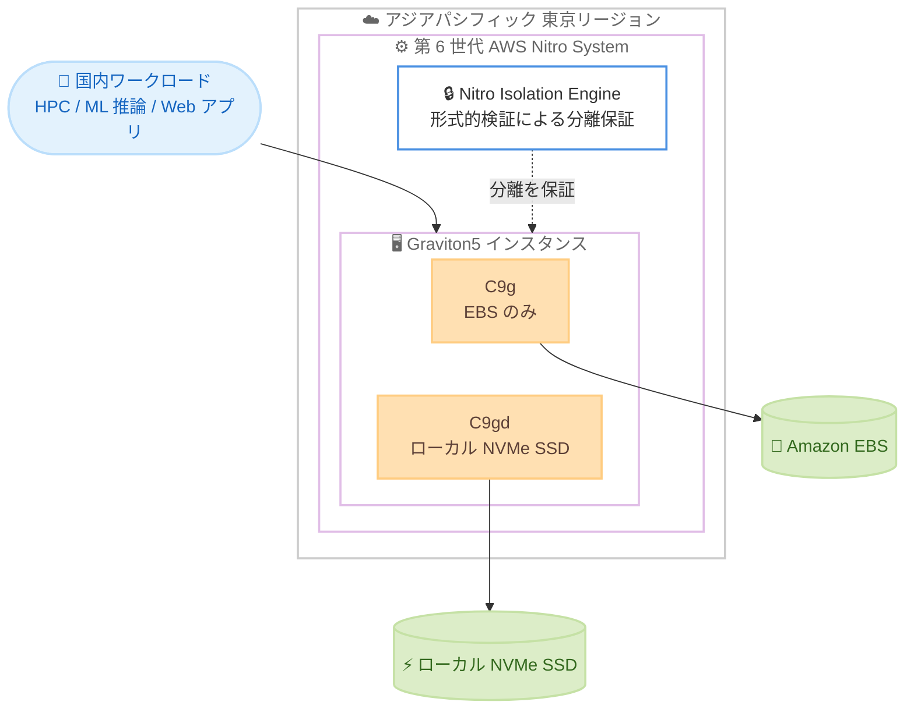

# Amazon EC2 - C9g / C9gd インスタンスが東京リージョンで利用可能に

**リリース日**: 2026 年 9 月 3 日
**サービス**: Amazon Elastic Compute Cloud (Amazon EC2)
**機能**: AWS Graviton5 プロセッサ搭載 C9g / C9gd インスタンスのアジアパシフィック (東京) リージョン対応

📊 [このアップデートのインフォグラフィックを見る](https://takech9203.github.io/aws-news-summary/20260903-ec2-c9g-c9gd-asia-pacific-tokyo.html)

## 概要

AWS Graviton5 プロセッサを搭載した Amazon EC2 C9g および C9gd インスタンスが、アジアパシフィック (東京) リージョンで利用可能になりました。Graviton5 は AWS がカスタム設計した第 5 世代 CPU であり、コンピューティング負荷の高いワークロードに対して Amazon EC2 上で最高のコストパフォーマンスを提供します。

C9g / C9gd インスタンスは、Graviton4 ベースの C8g / C8gd インスタンスと比較して最大 25% 高いコンピューティング性能を実現し、データベースで最大 30%、Web アプリケーションで最大 35%、機械学習で最大 35% の高速化を達成します。これらのインスタンスは第 6 世代 AWS Nitro System 上に構築されており、Nitro Isolation Engine を初めて搭載しています。Nitro Isolation Engine は形式的検証 (formal verification) を活用し、お客様のワークロードが相互に、および AWS オペレーターから分離されていることを数学的に保証します。

C9g インスタンスは HPC、バッチ処理、ゲーミング、動画エンコーディング、科学技術モデリング、分散分析、CPU ベースの機械学習 (ML) 推論、リアルタイム分析、広告配信などのワークロードに適しています。C9gd インスタンスはローカル NVMe ベースの SSD ブロックレベルストレージを備え、スクラッチ領域、一時ファイル、キャッシュなど高速かつ低レイテンシーなローカルストレージを必要とするワークロードに対応します。

**アップデート前の課題**

- C9g / C9gd インスタンスは東京リージョンで提供されておらず、国内ワークロードで Graviton5 の性能向上を活用できなかった
- 東京リージョンのコンピューティング最適化インスタンスでは Graviton4 ベースの C8g / C8gd が最新の選択肢であり、さらなるコストパフォーマンス向上の余地があった
- 低レイテンシー要件やデータレジデンシー要件のある国内ワークロードでは、海外リージョンの C9g / C9gd を利用しにくかった

**アップデート後の改善**

- 東京リージョンで Graviton5 ベースの C9g / C9gd インスタンスを起動できるようになり、C8g / C8gd 比で最大 25% の性能向上を国内ワークロードで活用可能になった
- 日本国内のユーザー向けに低レイテンシーを維持したまま、データベースや Web アプリケーション、ML 推論などの処理性能を向上できるようになった
- Nitro Isolation Engine による形式的検証に基づく分離保証を、東京リージョンのワークロードでも利用可能になった

## アーキテクチャ図



東京リージョンで提供される C9g / C9gd インスタンスは第 6 世代 Nitro System 上に構築され、Nitro Isolation Engine が形式的検証によってワークロード間の分離を保証します。C9g は Amazon EBS を、C9gd はローカル NVMe SSD を利用できます。

## サービスアップデートの詳細

### 主要機能

1. **東京リージョンでの提供開始**
   - AWS Graviton5 搭載の C9g / C9gd インスタンスがアジアパシフィック (東京) リージョンで利用可能に
   - 国内のユーザーやシステムに近い場所で、低レイテンシーを維持しながら Graviton5 の性能を活用できる
   - Savings Plans、オンデマンド、スポットインスタンス、Dedicated Instances、Dedicated Hosts で購入可能

2. **AWS Graviton5 プロセッサによる性能向上**
   - C8g / C8gd 比でコンピューティング性能が最大 25% 向上
   - データベースで最大 30%、Web アプリケーションで最大 35%、機械学習で最大 35% 高速化
   - コンピューティング負荷の高いワークロードで Amazon EC2 上最高のコストパフォーマンスを提供

3. **Nitro Isolation Engine**
   - 第 6 世代 AWS Nitro System 上に構築され、Nitro Isolation Engine を初めて搭載
   - 形式的検証により、ワークロードが相互に、および AWS オペレーターから分離されていることを数学的に保証
   - 数学的に証明されたクラウドセキュリティの新たな標準を切り拓く

4. **C9gd のローカル NVMe ストレージ**
   - スクラッチ領域、一時ファイル、キャッシュ向けの高速・低レイテンシーなローカル NVMe SSD ブロックレベルストレージを提供

## 技術仕様

### C9g インスタンス (EBS のみ)

| サイズ | vCPU | メモリ (GiB) | ネットワーク帯域 (Gbps) | EBS 帯域 (Gbps) |
|------|------|------|------|------|
| medium | 1 | 2 | 最大 15 | 最大 12 |
| large | 2 | 4 | 最大 15 | 最大 12 |
| xlarge | 4 | 8 | 最大 15 | 最大 12 |
| 2xlarge | 8 | 16 | 最大 17 | 最大 12 |
| 4xlarge | 16 | 32 | 最大 17 | 最大 12 |
| 8xlarge | 32 | 64 | 17 | 12 |
| 12xlarge | 48 | 96 | 25 | 18 |
| 16xlarge | 64 | 128 | 34 | 24 |
| 24xlarge | 96 | 192 | 50 | 36 |
| 48xlarge | 192 | 384 | 100 | 72 |
| metal-48xl | 192 | 384 | 100 | 72 |

### C9gd インスタンス (ローカル NVMe SSD)

vCPU、メモリ、帯域は C9g と同一で、以下のローカル NVMe ストレージを備えます。

| サイズ | vCPU | メモリ (GiB) | ローカル NVMe ストレージ |
|------|------|------|------|
| medium | 1 | 2 | 1 x 59 GB |
| large | 2 | 4 | 1 x 118 GB |
| xlarge | 4 | 8 | 1 x 237 GB |
| 2xlarge | 8 | 16 | 1 x 474 GB |
| 4xlarge | 16 | 32 | 1 x 950 GB |
| 8xlarge | 32 | 64 | 1 x 1900 GB |
| 12xlarge | 48 | 96 | 3 x 950 GB |
| 16xlarge | 64 | 128 | 1 x 3800 GB |
| 24xlarge | 96 | 192 | 3 x 1900 GB |
| 48xlarge | 192 | 384 | 3 x 3800 GB |
| metal-48xl | 192 | 384 | 3 x 3800 GB |

### 購入オプション

| 項目 | 詳細 |
|------|------|
| 購入モデル | Savings Plans、オンデマンド、スポットインスタンス、Dedicated Instances、Dedicated Hosts |
| ストレージ | C9g: Amazon EBS のみ / C9gd: ローカル NVMe SSD + EBS |
| Nitro System | 第 6 世代 (Nitro Isolation Engine 搭載) |
| プロセッサ | AWS Graviton5 (第 5 世代カスタム設計 Arm CPU) |

## 設定方法

### 前提条件

1. AWS アカウントを保有し、東京リージョン (ap-northeast-1) で EC2 インスタンスを起動できる IAM 権限があること
2. Arm64 (aarch64) アーキテクチャに対応した AMI を使用すること
3. 必要に応じて、対象アプリケーションが Arm アーキテクチャで動作することを事前に検証しておくこと

### 手順

#### ステップ 1: 東京リージョンで利用可能なインスタンスタイプを確認する

```bash
aws ec2 describe-instance-type-offerings \
  --region ap-northeast-1 \
  --filters "Name=instance-type,Values=c9g.*,c9gd.*" \
  --query "InstanceTypeOfferings[].InstanceType" \
  --output table
```

東京リージョンで提供されている C9g / C9gd のインスタンスサイズの一覧を取得します。

#### ステップ 2: Arm64 対応の AMI を確認する

```bash
aws ec2 describe-images \
  --region ap-northeast-1 \
  --owners amazon \
  --filters "Name=name,Values=al2023-ami-2023*-arm64" "Name=state,Values=available" \
  --query "sort_by(Images, &CreationDate)[-1].{ImageId:ImageId,Name:Name}" \
  --output table
```

東京リージョンで利用可能な最新の Arm64 版 Amazon Linux 2023 AMI を検索します。

#### ステップ 3: C9g インスタンスを起動する

```bash
aws ec2 run-instances \
  --region ap-northeast-1 \
  --instance-type c9g.xlarge \
  --image-id ami-xxxxxxxxxxxxxxxxx \
  --key-name my-key-pair \
  --subnet-id subnet-xxxxxxxx \
  --security-group-ids sg-xxxxxxxx
```

ステップ 2 で確認した Arm64 対応 AMI を指定し、東京リージョンで c9g.xlarge インスタンスを起動します。ローカル NVMe ストレージが必要な場合は `c9gd.xlarge` などの C9gd インスタンスタイプを指定します。

## メリット

### ビジネス面

- **国内ワークロードのコストパフォーマンス向上**: C8g / C8gd 比で最大 25% の性能向上により、同一ワークロードをより少ないリソースで実行し、コストを削減できる
- **低レイテンシーの維持**: 日本国内のユーザーやオンプレミスシステムに近い東京リージョンで Graviton5 を利用でき、応答性能を維持できる
- **柔軟な購入オプション**: Savings Plans やスポットインスタンスなど複数の購入モデルにより、コスト最適化の選択肢が広い

### 技術面

- **ワークロード別の大幅な高速化**: データベースで最大 30%、Web アプリケーションで最大 35%、機械学習で最大 35% の高速化を実現
- **数学的に保証された分離**: Nitro Isolation Engine の形式的検証により、ワークロード間および AWS オペレーターからの分離を数学的に保証
- **ローカル NVMe による低レイテンシー**: C9gd はスクラッチ領域や一時ファイル、キャッシュ用途で高速なローカルストレージを利用可能

## デメリット・制約事項

### 制限事項

- Arm アーキテクチャ (AWS Graviton) ベースであるため、x86 依存のバイナリや商用ソフトウェアは Arm 向けのビルド・ライセンス確認・検証が必要
- 東京リージョン以外の国内リージョン (大阪) での提供は本発表には含まれていない

### 考慮すべき点

- C9gd のローカル NVMe ストレージはインスタンス停止・終了時にデータが失われるため、永続化が必要なデータには Amazon EBS や Amazon S3 を併用する
- 既存の C8g / C8gd や x86 ベースワークロードから移行する場合は、性能・互換性の検証を事前に実施することが推奨される
- 新しいインスタンスファミリーはリージョンやアベイラビリティーゾーンによって在庫状況が異なる場合があるため、大規模利用時はキャパシティの確保方法 (オンデマンドキャパシティ予約など) を検討する

## ユースケース

### ユースケース 1: 国内向け Web アプリケーションの高速化

**シナリオ**: 東京リージョンで C8g インスタンス上の Web アプリケーションを運用しており、トラフィック増加に伴う性能とコストの改善が必要な事業者。

**実装例**:
```
Auto Scaling グループの起動テンプレートを c8g.xlarge から c9g.xlarge に変更し、
カナリアデプロイで一部トラフィックを C9g に振り分けて性能を比較検証する
```

**効果**: Web アプリケーションで最大 35% の高速化により、同一トラフィックをより少ないインスタンス数で処理でき、レイテンシーの改善とコスト削減を両立できます。

### ユースケース 2: CPU ベースの ML 推論基盤

**シナリオ**: 日本国内のユーザー向けに低レイテンシーの推論 API を提供しており、推論コストの削減が課題となっている機械学習アプリケーション。

**実装例**:
```
Amazon ECS / Amazon EKS のノードグループに c9g インスタンスを追加し、
Arm64 対応の推論コンテナイメージをデプロイしてスループットを測定する
```

**効果**: 機械学習で最大 35% の高速化により、同一スループットをより少ないインスタンス数で処理でき、国内ユーザー向けの低レイテンシーを維持しながら推論コストを削減できます。

### ユースケース 3: 動画エンコーディング / バッチ処理

**シナリオ**: 一時ファイルや中間データを多用する動画トランスコードや大規模バッチ処理パイプラインを東京リージョンで運用しているメディア企業。

**実装例**:
```
AWS Batch のコンピューティング環境に c9gd インスタンスを指定し、
ローカル NVMe SSD をスクラッチ領域としてマウントして処理する
```

**効果**: C9gd のローカル NVMe SSD により、スクラッチ領域への高速な読み書きが可能となり、パイプライン全体の処理時間を短縮できます。スポットインスタンスと組み合わせることでコストをさらに抑制できます。

## 料金

C9g / C9gd インスタンスは、Savings Plans、オンデマンド、スポットインスタンス、Dedicated Instances、Dedicated Hosts で購入できます。具体的な料金はリージョンおよびインスタンスサイズによって異なるため、東京リージョンの最新価格は Amazon EC2 の料金ページを参照してください。

## 利用可能リージョン

今回のアップデートにより、C9g および C9gd インスタンスがアジアパシフィック (東京) リージョンで利用可能になりました。2026 年 6 月の一般提供開始時点では、米国東部 (バージニア北部、オハイオ)、米国西部 (オレゴン)、欧州 (フランクフルト) で提供されていました。最新の提供リージョンは C9g インスタンスの製品ページを参照してください。

## 関連サービス・機能

- **AWS Graviton**: C9g / C9gd を支える AWS カスタム設計 CPU ファミリー。第 5 世代の Graviton5 を搭載
- **AWS Nitro System**: 第 6 世代 Nitro System 上に構築。Nitro Isolation Engine による形式的検証ベースの分離を提供
- **Amazon EBS**: C9g / C9gd のブロックストレージとして利用。永続化が必要なデータの保存先
- **Amazon EC2 Savings Plans**: C9g / C9gd のコスト最適化に活用できる柔軟な料金モデル
- **Amazon EC2 Auto Scaling / AWS Batch**: C9g / C9gd を組み込んだスケーラブルなコンピューティング基盤の構築に活用

## 参考リンク

- 📊 [インフォグラフィック](https://takech9203.github.io/aws-news-summary/20260903-ec2-c9g-c9gd-asia-pacific-tokyo.html)
- [公式発表 (What's New)](https://aws.amazon.com/about-aws/whats-new/2026/09/ec2-c9g-c9gd-asia-pacific-tokyo/)
- [C9g / C9gd インスタンスの製品ページ](https://aws.amazon.com/ec2/instance-types/c9g/)
- [AWS Graviton](https://aws.amazon.com/ec2/graviton/level-up-with-graviton/)
- [AWS Nitro System](https://aws.amazon.com/ec2/nitro/)
- [Nitro Isolation Engine のブログ](https://aws.amazon.com/blogs/compute/aws-nitro-isolation-engine-formally-verifying-the-hypervisor-in-the-aws-nitro-system/)

## まとめ

AWS Graviton5 搭載の Amazon EC2 C9g / C9gd インスタンスが東京リージョンで利用可能になり、国内ワークロードでも C8g / C8gd 比で最大 25% の性能向上と、Nitro Isolation Engine による数学的に保証された分離を活用できるようになりました。東京リージョンで C8g / C8gd や x86 ベースのコンピューティング最適化インスタンスを運用しているお客様は、C9g / C9gd への移行によるコストパフォーマンス改善の検証を推奨します。まずは既存ワークロードとの互換性と性能を東京リージョンで評価してみてください。
