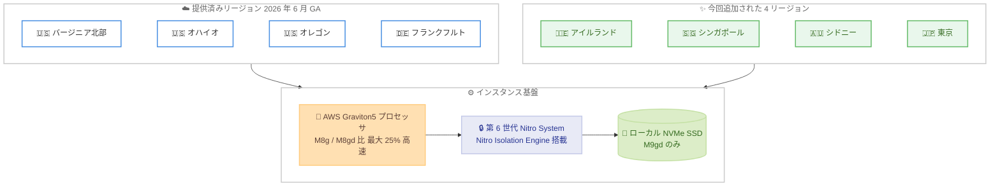

# Amazon EC2 - M9g / M9gd インスタンスが東京を含む 4 リージョンで利用可能に

**リリース日**: 2026年9月3日
**サービス**: Amazon EC2
**機能**: AWS Graviton5 搭載 M9g / M9gd インスタンスのリージョン拡大 (アイルランド、シンガポール、シドニー、東京)

📊 [このアップデートのインフォグラフィックを見る](https://takech9203.github.io/aws-news-summary/20260903-ec2-m9g-m9gd-four-regions.html)
<!-- INFOGRAPHIC_BASE_URL は環境変数から取得 -->

## 概要

AWS Graviton5 プロセッサを搭載した Amazon EC2 M9g および M9gd インスタンスが、新たに Europe (Ireland) と Asia Pacific (Singapore、Sydney、Tokyo) の 4 リージョンで利用可能になりました。2026 年 6 月の一般提供開始時は米国と欧州の一部リージョンに限られていましたが、今回の拡大により東京リージョンを含むアジアパシフィックでも Graviton5 の性能を利用できるようになります。

M9g / M9gd インスタンスは、Graviton4 ベースの M8g / M8gd インスタンスと比較して最大 25% 高い性能を発揮し、データベースでは最大 30% の高速化を実現します。M9g インスタンスは、オープンソースデータベース、インメモリキャッシュ、ビッグデータ分析などのメモリ集約型ワークロードに適しており、M9gd インスタンスはこれらに加えてローカル NVMe ベースの SSD ブロックレベルストレージを備え、スクラッチスペース、一時ファイル、キャッシュなど高速で低レイテンシなアクセスを必要とする用途に対応します。

両インスタンスは第 6 世代の AWS Nitro System 上に構築されており、Nitro Isolation Engine を初めて搭載しています。Nitro Isolation Engine は形式検証 (formal verification) を用いて、お客様のワークロードが相互に、また AWS のオペレーターから分離されていることを数学的に証明します。

**アップデート前の課題**

- M9g / M9gd インスタンスは US East (バージニア北部、オハイオ)、US West (オレゴン)、Europe (フランクフルト) でのみ利用可能で、東京リージョンでは利用できませんでした
- 日本国内のユーザー向けワークロードで Graviton5 を利用するには、海外リージョンを使用する必要があり、レイテンシやデータ所在地の要件を満たせない場合がありました
- アジアパシフィックや欧州西部のワークロードでは、Graviton4 ベースの M8g / M8gd が実質的な最新選択肢でした

**アップデート後の改善**

- 今回のアップデートにより、東京リージョンを含む 4 リージョンで M9g / M9gd インスタンスを起動できるようになりました
- 日本国内のワークロードで、M8g / M8gd 比最大 25% の性能向上 (データベースでは最大 30%) を低レイテンシで活用できるようになりました
- アジアパシフィックと欧州のマルチリージョン構成でも、Graviton5 ベースの統一したインスタンスファミリーを採用しやすくなりました

## アーキテクチャ図



M9g / M9gd インスタンスの提供リージョンが 4 か所から 8 か所に拡大し、東京を含むアジアパシフィック 3 リージョンとアイルランドで Graviton5 基盤を利用できるようになりました。

## サービスアップデートの詳細

### 主要機能

1. **4 リージョンへの提供拡大**
   - Europe (Ireland)、Asia Pacific (Singapore)、Asia Pacific (Sydney)、Asia Pacific (Tokyo) が追加されました
   - 既存の US East (バージニア北部、オハイオ)、US West (オレゴン)、Europe (フランクフルト) と合わせて 8 リージョンで利用可能になりました
   - 東京リージョン対応により、日本国内のワークロードでも Graviton5 を採用できます

2. **AWS Graviton5 プロセッサによる性能向上**
   - AWS が独自に設計したプロセッサの第 5 世代で、Arm Neoverse V3 ベースです
   - Graviton4 ベースの M8g / M8gd インスタンスと比較して最大 25% 高い性能を発揮します
   - データベースでは最大 30%、Web アプリケーションや機械学習では最大 35% の高速化が見込めます

3. **M9g / M9gd の 2 つのバリエーション**
   - M9g: オープンソースデータベース、インメモリキャッシュ、ビッグデータ分析などのメモリ集約型ワークロード向けです
   - M9gd: ローカル NVMe ベースの SSD ブロックレベルストレージを搭載し、スクラッチスペース、一時ファイル、キャッシュなどの高速アクセス用途に適しています

4. **第 6 世代 AWS Nitro System と Nitro Isolation Engine**
   - 第 6 世代の AWS Nitro System 上に構築されています
   - Nitro Isolation Engine を初めて搭載し、形式検証によりワークロードの分離を数学的に証明します
   - 常時有効なメモリ暗号化、vCPU ごとの専用キャッシュ、ポインタ認証などのセキュリティ機能も備えます

## 技術仕様

### パフォーマンス向上 (Graviton4 ベース M8g / M8gd 比)

| ワークロード | 性能向上 |
|------|------|
| 汎用演算 | 最大 25% 高速 |
| データベース | 最大 30% 高速 |
| Web アプリケーション | 最大 35% 高速 |
| 機械学習 | 最大 35% 高速 |

### M9g インスタンスサイズ

| サイズ | vCPU | メモリ (GiB) | ネットワーク帯域幅 (Gbps) | EBS 帯域幅 (Gbps) |
|------|------|------|------|------|
| medium | 1 | 4 | 最大 15 | 最大 12 |
| large | 2 | 8 | 最大 15 | 最大 12 |
| xlarge | 4 | 16 | 最大 15 | 最大 12 |
| 2xlarge | 8 | 32 | 最大 17 | 最大 12 |
| 4xlarge | 16 | 64 | 最大 17 | 最大 12 |
| 8xlarge | 32 | 128 | 17 | 12 |
| 12xlarge | 48 | 192 | 25 | 18 |
| 16xlarge | 64 | 256 | 34 | 24 |
| 24xlarge | 96 | 384 | 50 | 36 |
| 48xlarge | 192 | 768 | 100 | 72 |
| metal-48xl | 192 | 768 | 100 | 72 |

### M9gd のローカル NVMe SSD ストレージ

M9gd は M9g と同等の vCPU / メモリ / 帯域幅構成に加え、以下のローカルストレージを搭載します。

| サイズ | ローカルストレージ (GB) |
|------|------|
| medium | 1 x 59 |
| large | 1 x 118 |
| xlarge | 1 x 237 |
| 2xlarge | 1 x 474 |
| 4xlarge | 1 x 950 |
| 8xlarge | 1 x 1900 |
| 12xlarge | 3 x 950 |
| 16xlarge | 1 x 3800 |
| 24xlarge | 3 x 1900 |
| 48xlarge | 3 x 3800 |
| metal-48xl | 3 x 3800 |

### 購入オプション

| 購入オプション | 説明 |
|------|------|
| オンデマンド | 初期費用なしで秒単位課金 |
| Savings Plans | 1 年または 3 年のコミットメントで割引 |
| スポットインスタンス | 未使用キャパシティを大幅割引で利用 |
| Dedicated Instances / Dedicated Hosts | 専有ハードウェアでの実行 |

## 設定方法

### 前提条件

1. AWS アカウントと EC2 インスタンスを起動できる IAM 権限を保有していること
2. 対応リージョン (今回追加された東京リージョンなど) を利用すること
3. ワークロードが Arm ベースアーキテクチャ (AArch64) に対応していること

### 手順

#### ステップ1: 東京リージョンでの提供状況の確認

```bash
# 東京リージョンで M9g / M9gd インスタンスタイプを確認
aws ec2 describe-instance-type-offerings \
  --location-type region \
  --filters "Name=instance-type,Values=m9g.*,m9gd.*" \
  --query 'InstanceTypeOfferings[].InstanceType' \
  --region ap-northeast-1
```

このコマンドは、東京リージョン (ap-northeast-1) で利用可能な M9g / M9gd のインスタンスサイズ一覧を取得します。

#### ステップ2: Arm64 対応 AMI の取得

```bash
# Arm64 アーキテクチャに対応した最新の Amazon Linux 2023 AMI を取得
aws ec2 describe-images \
  --owners amazon \
  --filters "Name=architecture,Values=arm64" "Name=name,Values=al2023-ami-*" \
  --query 'Images | sort_by(@, &CreationDate)[-1].ImageId' \
  --region ap-northeast-1
```

このコマンドは、Graviton5 が採用する Arm64 アーキテクチャに対応した最新の Amazon Linux 2023 AMI の ID を取得します。Graviton ベースのインスタンスでは Arm64 対応の AMI が必要です。

#### ステップ3: M9g インスタンスの起動

```bash
# 東京リージョンで M9g インスタンスを起動
aws ec2 run-instances \
  --image-id <arm64-ami-id> \
  --instance-type m9g.xlarge \
  --key-name <your-key-pair> \
  --region ap-northeast-1
```

このコマンドは、取得した Arm64 対応 AMI を使用して東京リージョンで m9g.xlarge インスタンスを起動します。ローカル NVMe SSD が必要な場合は、インスタンスタイプを `m9gd.xlarge` などに変更します。M9gd のローカルストレージは一時的なストレージであり、インスタンスの停止/終了でデータが失われる点に注意してください。

## メリット

### ビジネス面

- **国内ワークロードでの最新性能の活用**: 東京リージョン対応により、データ所在地要件のある日本のワークロードでも Graviton5 の性能とコストパフォーマンスを利用できます
- **コスト最適化の機会**: M8g / M8gd 比最大 25% の性能向上により、同等の処理をより少ないインスタンス数で実行でき、コスト削減が期待できます
- **グローバル展開の容易化**: 米国、欧州、アジアパシフィックの 8 リージョンで同一インスタンスファミリーを利用でき、マルチリージョン構成の設計が統一できます

### 技術面

- **低レイテンシ**: エンドユーザーに近いリージョンでインスタンスを実行することで、アプリケーションの応答時間を短縮できます
- **強化されたセキュリティ分離**: Nitro Isolation Engine により、形式検証に基づいて数学的に証明されたワークロード分離が保証されます
- **柔軟な構成**: medium から 48xlarge、bare metal まで幅広いサイズが選択でき、M9gd では最大 11.4 TB のローカル NVMe SSD を利用できます

## デメリット・制約事項

### 制限事項

- 提供リージョンは 8 リージョンに拡大しましたが、大阪リージョンなどその他のリージョンでは引き続き利用できません
- Graviton (Arm64) アーキテクチャに対応したソフトウェアと AMI が必要です
- M9gd のローカル NVMe ストレージは一時的なストレージであり、インスタンスの停止/終了でデータが失われます

### 考慮すべき点

- x86 ベースのワークロードを移行する場合は、Arm64 への再コンパイルや依存ライブラリの互換性検証が必要になる場合があります
- リージョンやサイズによってはキャパシティに限りがある場合があるため、大規模利用の際はオンデマンドキャパシティ予約の活用を検討してください
- 新しいインスタンスファミリーの料金は M8g / M8gd と異なるため、性能向上と単価を合わせたコストパフォーマンスで評価する必要があります

## ユースケース

### ユースケース1: 東京リージョンでのオープンソースデータベースの高速化

**シナリオ**: 東京リージョンで MySQL や PostgreSQL をセルフマネージドで運用しており、データベース性能を向上させつつコストを抑えたい。

**実装例**:
```
M8g で運用中のデータベースを m9g.4xlarge (16 vCPU / 64 GiB) に移行し、性能を比較検証
```

**効果**: M8g 比で最大 30% 高速なデータベース性能により、スループット向上またはインスタンスサイズの適正化によるコスト削減が期待できます。

### ユースケース2: インメモリキャッシュ層の集約

**シナリオ**: アジアパシフィックの複数リージョン (東京、シンガポール、シドニー) で Redis や Memcached ベースのキャッシュ層を運用している。

**実装例**:
```
各リージョンのキャッシュノードを m9g.2xlarge に統一し、リージョン間で同一構成を展開
```

**効果**: 全リージョンで同一の Graviton5 ベース構成を採用でき、運用の標準化と性能向上を同時に実現できます。

### ユースケース3: ビッグデータ分析の一時データ処理

**シナリオ**: 東京リージョンで Spark などの分析基盤を運用しており、シャッフルデータや一時ファイルの読み書きが性能ボトルネックになっている。

**実装例**:
```
m9gd.8xlarge (ローカル NVMe 1900 GB) をワーカーノードに採用し、一時データをローカル SSD に配置
```

**効果**: 高速で低レイテンシなローカル NVMe SSD により、シャッフルや中間データの I/O 性能が向上し、ジョブ全体の実行時間を短縮できます。

## 料金

M9g および M9gd インスタンスは、Savings Plans、オンデマンド、スポットインスタンス、Dedicated Instances、Dedicated Hosts の各購入オプションで利用できます。料金はリージョンとインスタンスサイズによって異なります。最新の料金は EC2 オンデマンド料金ページで確認してください。

### 料金例

| 使用量 | 月額料金 (概算) |
|--------|------------------|
| オンデマンド | リージョンとサイズに応じて変動 (公式料金ページ参照) |
| Savings Plans / スポット | オンデマンドより割引価格で利用可能 |

## 利用可能リージョン

**今回追加された 4 リージョン**: Europe (Ireland)、Asia Pacific (Singapore)、Asia Pacific (Sydney)、Asia Pacific (Tokyo)

**既存リージョン**: US East (バージニア北部、オハイオ)、US West (オレゴン)、Europe (フランクフルト)

## 関連サービス・機能

- **AWS Graviton**: M9g / M9gd を支える Arm ベースのカスタムプロセッサファミリー。第 5 世代が Graviton5 です
- **AWS Nitro System**: インスタンスの基盤となるハードウェアおよびソフトウェアのプラットフォーム。第 6 世代で Nitro Isolation Engine を搭載しています
- **Amazon EC2 M8g / M8gd インスタンス**: Graviton4 ベースの前世代インスタンス。移行時の性能比較の基準になります
- **AWS Savings Plans**: M9g / M9gd の利用料金を柔軟なコミットメントで割引できます

## 参考リンク

- 📊 [インフォグラフィック](https://takech9203.github.io/aws-news-summary/20260903-ec2-m9g-m9gd-four-regions.html)
- [公式発表 (What's New)](https://aws.amazon.com/about-aws/whats-new/2026/09/ec2-m9g-m9gd-four-regions/)
- [AWS Blog: AWS Nitro Isolation Engine](https://aws.amazon.com/blogs/compute/aws-nitro-isolation-engine-formally-verifying-the-hypervisor-in-the-aws-nitro-system/)
- [Amazon EC2 M9g インスタンスページ](https://aws.amazon.com/ec2/instance-types/m9g/)
- [AWS Nitro System](https://aws.amazon.com/ec2/nitro/)
- [Amazon EC2 オンデマンド料金](https://aws.amazon.com/ec2/pricing/on-demand/)

## まとめ

AWS Graviton5 搭載の M9g / M9gd インスタンスが東京を含む 4 リージョンに拡大し、日本国内のワークロードでも M8g / M8gd 比最大 25% (データベースは最大 30%) の性能向上を活用できるようになりました。東京リージョンで Graviton ベースのインスタンスを運用しているお客様は、M9g / M9gd への移行による性能とコストパフォーマンスの改善効果を検証することをお勧めします。
