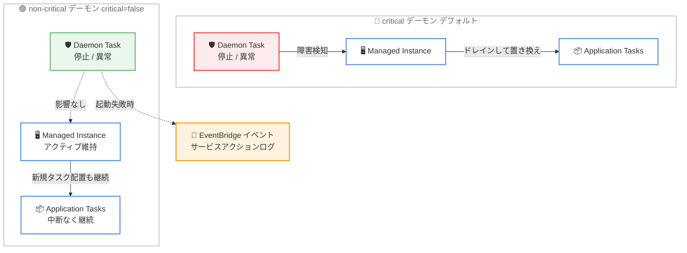

# Amazon ECS Managed Daemons - non-critical デーモンのサポート

**リリース日**: 2026 年 9 月 3 日
**サービス**: Amazon Elastic Container Service (Amazon ECS)
**機能**: ECS Managed Daemons における non-critical デーモン

📊 [このアップデートのインフォグラフィックを見る](https://takech9203.github.io/aws-news-summary/20260903-ecs-managed-daemons-non-critical.html)
<!-- INFOGRAPHIC_BASE_URL は環境変数から取得 -->

## 概要

Amazon ECS Managed Instances 向けの ECS Managed Daemons が、non-critical (非クリティカル) デーモンをサポートするようになりました。デーモンを non-critical として設定すると、デーモンタスクが失敗、停止、または異常 (unhealthy) になった場合でも、ミッションクリティカルなアプリケーションタスクは中断されることなく実行を継続します。

ECS Managed Daemons は、セキュリティ、オブザーバビリティ、ネットワーキングなどのソフトウェアエージェントを、アプリケーションのデプロイとは独立して一元的に展開・管理できる機能です。一部のミッションクリティカルなアプリケーションでは、ログやメトリクス収集といった補助的なデーモン機能よりも、アプリケーションタスクの中断のない実行の方が重要になる場合があります。今回のアップデートにより、デーモンの障害がアプリケーションタスクのチャーン (再配置) を引き起こさないように設定できるようになりました。

non-critical デーモンのタスクが失敗、停止、異常になっても、コンテナインスタンスはアクティブなまま維持され、既存のアプリケーションタスクは実行を継続し、ECS は新規タスクの配置も継続します。また、インスタンスの登録がブロックされることもないため、デーモンの起動に失敗した場合でもタスクは即座に起動できます。デーモンタスクの起動失敗時には EventBridge イベントが発行され、critical / non-critical の両方でサービスアクションログが記録されるため、デーモンのヘルスに対する完全なオブザーバビリティが確保されます。

**アップデート前の課題**

今回のアップデート以前は、Managed Daemons はすべて critical として扱われ、以下の制約がありました。

- デーモンタスクが停止または異常になると、ECS はコンテナインスタンスをドレインして置き換えるため、補助的なエージェントの障害でもアプリケーションタスクが再配置されていた
- デーモンタスクの起動に失敗すると、インスタンスの登録がブロックされ、アプリケーションタスクを配置できなかった
- ログやメトリクス収集などの補助的なデーモンと、アプリケーションの可用性要件との優先順位を柔軟に制御できなかった

**アップデート後の改善**

今回のアップデートにより、デーモンの重要度に応じた挙動の制御が可能になりました。

- `critical` パラメータを `false` に設定することで、デーモンの障害時もアプリケーションタスクが中断なく実行を継続できるようになった
- non-critical デーモンの障害時もコンテナインスタンスはアクティブなまま維持され、新規タスクの配置とインスタンス登録がブロックされなくなった
- デーモンタスクの起動失敗時の EventBridge イベントとサービスアクションログにより、non-critical 化してもデーモンのヘルスを完全に監視できる

## アーキテクチャ図



critical デーモンでは障害時にインスタンスのドレインと置き換えが発生しますが、non-critical デーモンでは障害が発生してもインスタンスはアクティブなまま維持され、アプリケーションタスクは影響を受けません。

## サービスアップデートの詳細

### 主要機能

1. **デーモンの criticality (重要度) 設定**
   - デーモンの作成・更新時に `critical` パラメータで挙動を制御できる
   - `critical: true` (デフォルト): デーモンタスクが停止または異常になると、ECS はコンテナインスタンスをドレインして置き換える。起動失敗時はインスタンスの登録をブロックし、デーモンなしでアプリケーションタスクが実行されることを防ぐ
   - `critical: false`: デーモンタスクはコンテナインスタンスのヘルスから独立して動作する。障害時もインスタンスはアクティブなまま維持される

2. **アプリケーションタスクの継続性**
   - non-critical デーモンの障害時も既存のアプリケーションタスクは中断なく実行を継続する
   - ECS はそのインスタンスへの新規アプリケーションタスクの配置を継続する
   - インスタンスの登録がブロックされないため、デーモンの起動失敗時 (スケールアウト時やデプロイ時のいずれでも) もタスクを即座に起動できる

3. **デーモンヘルスのオブザーバビリティ**
   - デーモンタスクの起動失敗時に EventBridge イベントを発行 (critical / non-critical の両方)
   - critical / non-critical の両方でサービスアクションログを記録
   - デプロイ中のデーモンタスク起動失敗はデプロイサーキットブレーカーによってカウントされ、不安定なターゲットリビジョンは自動でロールバックされる

4. **デーモンの起動順序は維持**
   - criticality にかかわらず、ECS はインスタンス上でデーモンタスクをアプリケーションタスクより先に起動する
   - ログ、トレーシング、メトリクス収集といった横断的機能がアプリケーションの処理開始前に稼働する動作は変わらない

## 技術仕様

### critical パラメータ

| 項目 | 詳細 |
|------|------|
| パラメータ名 | `critical` |
| 型 | Boolean (任意指定) |
| デフォルト値 | `true` |
| 対象 API | `CreateDaemon` / `UpdateDaemon` |
| `true` の挙動 | デーモンタスクの停止・異常時にインスタンスをドレインして置き換え。起動失敗時はインスタンス登録をブロック |
| `false` の挙動 | デーモン障害はアプリケーションタスクに影響しない。インスタンスはアクティブ維持、登録もブロックしない |
| 監視 | 起動失敗時に EventBridge イベントを発行し、サービスアクションログを記録 |
| 設定手段 | AWS マネジメントコンソール、AWS CLI、AWS CloudFormation、AWS SDK |

### CreateDaemon リクエストの例

```json
{
    "daemonName": "logging-daemon",
    "clusterArn": "arn:aws:ecs:us-east-1:111122223333:cluster/my-cluster",
    "daemonTaskDefinitionArn": "arn:aws:ecs:us-east-1:111122223333:daemon-task-definition/logging-agent:1",
    "capacityProviderArns": [
        "arn:aws:ecs:us-east-1:111122223333:capacity-provider/my-managed-instances-cp"
    ],
    "critical": false
}
```

## 設定方法

### 前提条件

1. ECS Managed Instances のキャパシティプロバイダーが構成されていること
2. デーモンタスク定義が登録されていること
3. デーモンの作成・更新を行う権限を持つ IAM ロールが用意されていること

### 手順

#### ステップ1: デーモンタスク定義の登録

```bash
aws ecs register-daemon-task-definition --cli-input-json file://daemon-taskdef.json
```

デーモンとして実行するエージェントのコンテナイメージなどを定義したデーモンタスク定義を登録します。

#### ステップ2: non-critical デーモンの作成

```bash
aws ecs create-daemon \
    --daemon-name logging-daemon \
    --cluster-arn arn:aws:ecs:us-east-1:111122223333:cluster/my-cluster \
    --daemon-task-definition-arn arn:aws:ecs:us-east-1:111122223333:daemon-task-definition/logging-agent:1 \
    --capacity-provider-arns arn:aws:ecs:us-east-1:111122223333:capacity-provider/my-managed-instances-cp \
    --no-critical
```

`critical` パラメータを `false` に設定してデーモンを作成します。これにより、デーモンの障害がインスタンスのドレインやタスクの中断を引き起こさなくなります。既存のデーモンについても、更新時に `critical` を `false` へ変更できます。

#### ステップ3: デーモンヘルスの監視設定

デーモンタスクの起動失敗時に発行される EventBridge イベントに対してルールを作成し、SNS 通知や自動修復アクションを設定します。サービスアクションログと合わせて、non-critical 化した後もデーモンのヘルスを継続的に監視します。

## メリット

### ビジネス面

- **アプリケーション可用性の向上**: 補助的なエージェントの障害がミッションクリティカルなワークロードの中断につながらなくなり、サービスレベルを維持しやすくなる
- **不要なチャーンの削減**: デーモン障害によるインスタンスの置き換えとタスクの再配置がなくなり、それに伴う一時的な性能低下やリスクを回避できる
- **運用の一元化は維持**: エージェントの一元的な展開・管理という Managed Daemons の利点はそのままに、可用性要件に応じた柔軟な運用が可能になる

### 技術面

- **重要度に応じた制御**: デーモンごとに `critical` パラメータを設定し、セキュリティエージェントは critical、ログ収集は non-critical といった使い分けができる
- **登録ブロックの回避**: non-critical デーモンは起動に失敗してもインスタンス登録をブロックしないため、スケールアウト時のタスク起動が遅延しない
- **オブザーバビリティの確保**: EventBridge イベントとサービスアクションログにより、non-critical 化してもデーモン障害を確実に検知できる

## デメリット・制約事項

### 制限事項

- ECS Managed Daemons は ECS Managed Instances のキャパシティプロバイダーでのみサポートされる
- non-critical デーモンが停止している間は、そのインスタンス上でデーモンが提供する機能 (ログ収集、メトリクス収集など) が欠落する
- デプロイ中のデーモンタスク起動失敗はデプロイサーキットブレーカーの対象としてカウントされる

### 考慮すべき点

- デフォルトは `critical: true` のため、non-critical にするには明示的な設定が必要
- セキュリティエージェントなど、稼働が必須のデーモンを non-critical にすると、エージェント停止中もアプリケーションタスクが実行され続けるため、コンプライアンス要件との整合を確認する必要がある
- non-critical デーモンは自動修復 (インスタンスのドレインと置き換え) が行われないため、EventBridge イベントを起点とした監視・対応フローの整備が望ましい

## ユースケース

### ユースケース1: ミッションクリティカルなアプリケーションとログ収集エージェント

**シナリオ**: 中断が許されない決済処理アプリケーションを ECS Managed Instances で運用しており、ログ収集エージェントの一時的な障害でタスクが再配置されることを避けたい。

**実装例**:
```bash
aws ecs create-daemon \
    --daemon-name log-collector \
    --daemon-task-definition-arn arn:aws:ecs:region:account:daemon-task-definition/log-collector:1 \
    --capacity-provider-arns arn:aws:ecs:region:account:capacity-provider/payments-cp \
    --no-critical
```

**効果**: ログ収集エージェントが障害を起こしても決済処理タスクは中断されず、可用性を維持しながらエージェントの復旧を行える。

### ユースケース2: スケールアウト時のタスク起動遅延の回避

**シナリオ**: トラフィック急増時に迅速なスケールアウトが求められるワークロードで、メトリクス収集デーモンの起動失敗によって新規インスタンスの登録がブロックされ、タスク起動が遅延することを防ぎたい。

**実装例**:
```bash
aws ecs update-daemon \
    --daemon-arn arn:aws:ecs:region:account:daemon/my-cluster/metrics-agent \
    --no-critical
```

**効果**: non-critical デーモンはインスタンス登録をブロックしないため、デーモンの起動に失敗した場合でもアプリケーションタスクを即座に起動でき、スケールアウトの速度を確保できる。

### ユースケース3: デーモンの重要度に応じた使い分け

**シナリオ**: セキュリティ監視エージェントは全インスタンスでの稼働が必須である一方、トレーシングエージェントはベストエフォートで運用したい。

**実装例**:
```bash
# セキュリティエージェント: critical (デフォルト)
aws ecs create-daemon \
    --daemon-name security-agent \
    --daemon-task-definition-arn arn:aws:ecs:region:account:daemon-task-definition/security-agent:1 \
    --capacity-provider-arns arn:aws:ecs:region:account:capacity-provider/prod-cp

# トレーシングエージェント: non-critical
aws ecs create-daemon \
    --daemon-name tracing-agent \
    --daemon-task-definition-arn arn:aws:ecs:region:account:daemon-task-definition/tracing-agent:1 \
    --capacity-provider-arns arn:aws:ecs:region:account:capacity-provider/prod-cp \
    --no-critical
```

**効果**: セキュリティエージェントの障害時は自動修復によるカバレッジ維持を優先し、トレーシングエージェントの障害時はアプリケーションの継続性を優先する、といった重要度に応じた運用ができる。

## 料金

今回の機能は追加料金なしで利用できます。ECS Managed Instances 上で動作するコンピューティングリソースに対する通常の料金のみが発生します。

## 利用可能リージョン

ECS Managed Daemons がサポートされるすべての AWS リージョンで利用できます。

## 関連サービス・機能

- **ECS Managed Instances**: 本機能の動作基盤。Managed Daemons は Managed Instances のキャパシティプロバイダーでのみ利用できる
- **Amazon EventBridge**: デーモンタスクの起動失敗イベントを受信し、通知や自動対応のトリガーとして利用できる
- **Amazon CloudWatch**: デーモンのローリングデプロイ時のアラーム連携により、自動ロールバックの判断に利用できる

## 参考リンク

- 📊 [インフォグラフィック](https://takech9203.github.io/aws-news-summary/20260903-ecs-managed-daemons-non-critical.html)
- [公式発表 (What's New)](https://aws.amazon.com/about-aws/whats-new/2026/09/ecs-managed-daemons-non-critical/)
- [ドキュメント (Amazon ECS Managed Daemons)](https://docs.aws.amazon.com/AmazonECS/latest/developerguide/managed-daemons.html)
- [API リファレンス (CreateDaemon)](https://docs.aws.amazon.com/AmazonECS/latest/APIReference/API_CreateDaemon.html)

## まとめ

今回のアップデートにより、ECS Managed Daemons のデーモンごとに criticality を設定できるようになり、補助的なエージェントの障害がミッションクリティカルなアプリケーションタスクの中断につながる問題を回避できるようになりました。ECS Managed Instances で Managed Daemons を利用しているチームは、各デーモンの役割を整理し、稼働が必須のエージェントは critical のまま、ベストエフォートでよいエージェントは `critical: false` へ変更することを検討してください。non-critical 化する場合は、EventBridge イベントを活用した監視体制の整備を併せてお勧めします。
