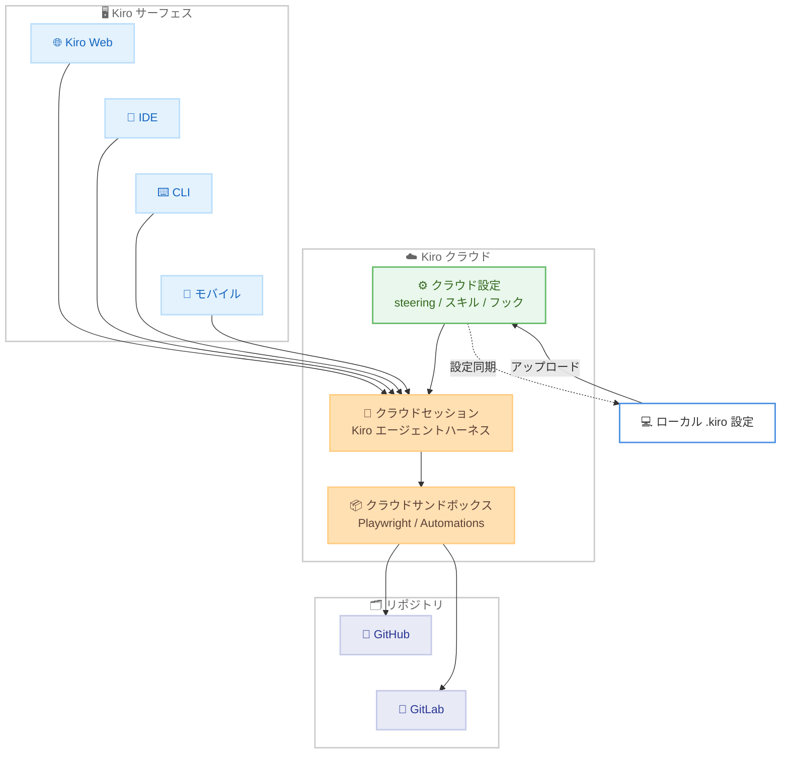

# Kiro - Kiro Web / クラウドセッションの一般提供開始とクラウド設定の導入

**リリース日**: 2026年9月3日
**サービス**: Kiro (AWS が提供する AI 搭載 IDE)
**機能**: Kiro Web、クラウドセッション (Cloud Sessions) の一般提供開始 (GA)、クラウド設定 (Cloud Configuration) の導入

📊 [このアップデートのインフォグラフィックを見る](https://takech9203.github.io/aws-news-summary/20260903-kiro-agentic-engineering-in-the-cloud.html)

## 概要

Kiro は 2026 年 9 月 3 日、**Kiro Web** と**クラウドセッション (Cloud Sessions)** の一般提供開始 (GA) を発表しました。あわせて、ローカルで構築した Kiro のセットアップをクラウドセッションでも利用できるようにする**クラウド設定 (Cloud Configuration)** が新たに導入されました。これにより、開発者はブラウザ、IDE、CLI、モバイルのどのサーフェスからでもエージェント処理をクラウドで実行し、任意のサーフェスから同じセッションを再開できるようになります。

Kiro Web は 2026 年 5 月のプレビュー公開以降、クイックフィックスからマルチリポジトリのマイグレーション、開発者が離席中や就寝中にも進行する作業まで、日常的なワークフローに組み込まれてきました。2026 年 8 月にはクラウドセッションがプレビューとして提供され、Kiro Web が常に利用してきたクラウドサンドボックスでの実行を CLI と IDE にも拡張しました。今回の GA により、有料プランのすべての開発者とチームがこれらの機能を利用できます。

対象ユーザーは、長時間かかる実装・リファクタリング・アップグレード作業をローカルマシンから切り離して実行したい開発者、複数リポジトリにまたがる変更を一貫して進めたいチーム、および SSO や IAM ロールによるアクセス制御のもとでクラウド開発環境を統制したい組織です。

**アップデート前の課題**

- Kiro Web とクラウドセッションはプレビュー段階であり、本番利用を前提とした一般提供ではなかった
- ローカルで構築した steering、カスタムエージェント、スキル、powers、フックなどの個人設定は、クラウドセッションに引き継ぐことができなかった
- クラウドで実行する作業は、リポジトリに含まれるプロジェクト設定のみに依存し、開発者ごとのセットアップを再現できなかった
- チーム向けのアクセス制御手段が限られており、企業の ID 基盤との統合に制約があった

**アップデート後の改善**

- Kiro Web とクラウドセッションが GA となり、有料プラン (Pro、Pro+、Pro Max、Power) のすべての開発者とチームが利用可能になった
- クラウド設定により、ローカルの `.kiro` 設定 (steering、カスタムエージェント、スキル、powers、フック) をクラウドセッションでも利用できるようになった
- 設定同期 (Configuration Sync) により、クラウド設定を新しいローカル IDE / CLI セッションへ自動的に読み込めるようになった (ローカルファイルはそのまま維持され、重複時はローカルが優先)
- チーム向けに、サンドボックスアクセスへの IAM ロール対応と、Okta / Microsoft Entra ID による認証がサポートされた

## アーキテクチャ図



どのサーフェスからでもクラウドセッションを開始・再開でき、セッションは Kiro のクラウドサンドボックス内で実行されます。ローカルの `.kiro` 設定をクラウド設定にアップロードすると、クラウドでの作業にも同じセットアップが適用され、設定同期により新しいローカルセッションにも反映されます。

## サービスアップデートの詳細

### 主要機能

1. **Kiro Web の一般提供開始**
   - ブラウザからエージェントへの作業の依頼 (delegate) と実装が可能
   - `/kiro fix` で PR のレビューコメントを一括で解消
   - 1 つのセッションで複数リポジトリ (GitHub と GitLab の混在を含む) にまたがる変更を調整
   - Automations によるスケジュール実行で、定期的なメンテナンス作業を自動化
   - Playwright によるブラウザベースのバグ再現と UI 変更の検証をクラウドサンドボックス内で実行

2. **クラウドセッションの一般提供開始**
   - IDE や CLI から開始したセッションを、ローカルマシンではなくクラウド上で同一の Kiro エージェントハーネスとして実行
   - 接続を切断してもエージェントは実行を継続
   - セッションは Kiro アカウントに紐付くため、ブラウザ、エディタ、ターミナル、モバイル、あるいは別のマシンから同じセッションに復帰可能
   - IDE / CLI からの作成とアタッチには最新バージョンが必要

3. **クラウド設定 (新機能)**
   - ローカルで構築した steering、カスタムエージェント、スキル、powers、フックをクラウドセッションで利用可能
   - リポジトリとともに移動するプロジェクト設定と併用できる個人設定として機能
   - 設定同期により、クラウド設定を新しいローカル IDE / CLI セッションへ自動的に読み込み可能
   - ローカルファイルはそのまま維持され、両者が重複する場合はローカルが優先

4. **チーム向けのアクセス制御強化**
   - サンドボックスアクセスに対する IAM ロールのサポート
   - Okta および Microsoft Entra ID による認証に対応
   - AWS IAM Identity Center を含む既存の SSO を IDE、CLI、Web 全体で利用可能
   - 管理者が Kiro コンソールの単一のトグルで Kiro Web とクラウドセッションを有効化

## 技術仕様

### 提供形態

| 項目 | 詳細 |
|------|------|
| 提供ステータス | Kiro Web / クラウドセッション: GA、クラウド設定: 新規導入 |
| 対応サーフェス | Web (app.kiro.dev)、IDE、CLI、モバイル |
| 実行環境 | Kiro のクラウドサンドボックス (US East (N. Virginia)) |
| 対象プラン | Pro、Pro+、Pro Max、Power |
| 課金 | 共有クレジットを使用 (クラウドコンピューティングの追加料金なし) |
| 対応リポジトリ | GitHub、GitLab |
| チーム認証 | AWS IAM Identity Center、Okta、Microsoft Entra ID |
| サンドボックスアクセス | IAM ロールをサポート |

### クラウド設定の構成要素

| 構成要素 | 説明 |
|----------|------|
| Steering | プロジェクトやコーディング規約に関する指示 |
| カスタムエージェント | 用途別にカスタマイズされたエージェント定義 |
| スキル | 特定タスク向けにパッケージ化された手順 |
| Powers | Kiro の拡張機能 |
| フック | イベントに応じて実行される自動処理 |

## 設定方法

### 前提条件

1. Kiro の有料プラン (Pro、Pro+、Pro Max、Power のいずれか) に加入していること
2. IDE / CLI からクラウドセッションを作成・アタッチする場合は、最新バージョンの Kiro を使用していること
3. チーム利用の場合は、管理者が Kiro コンソールで Kiro Web とクラウドセッションを有効化していること

### 手順

#### ステップ1: Kiro Web へのアクセス

```text
https://app.kiro.dev
```

ブラウザで app.kiro.dev にアクセスし、Kiro アカウントでサインインします。IDE やターミナルで進めていた作業の続きを引き継ぐことも、新しい作業を開始することもできます。

#### ステップ2: クラウドセッションの開始

Kiro Web、IDE、CLI のいずれかからクラウドセッションを開始します。IDE や CLI で実装の方針を固めた後、独立して実行できる状態になった時点でクラウドセッションに切り替えると、作業は Kiro のクラウドサンドボックスで実行され、切断後もエージェントが処理を継続します。

#### ステップ3: クラウド設定のセットアップ

Kiro の Settings からローカルの `.kiro` 設定をアップロードします。これにより、steering、カスタムエージェント、スキル、powers、フックがクラウドセッションでも利用可能になります。あわせて設定同期 (Configuration Sync) を有効にすると、クラウド設定が新しいローカルセッションへ自動的に読み込まれます。スコープと同期の詳細はクラウド設定のドキュメントを参照してください。

#### ステップ4: チーム向けのセットアップ (組織利用の場合)

管理者が Kiro コンソールのトグルで Kiro Web とクラウドセッションを有効化します。開発者はチームが既に利用している SSO (AWS IAM Identity Center、Okta、Microsoft Entra ID) を通じて、IDE、CLI、Web のすべてのサーフェスからクラウドセッションを開始できます。

## メリット

### ビジネス面

- **開発サイクルの継続性**: 開発者が離席中や就寝中もエージェントが作業を継続するため、長時間タスクの完了までのリードタイムを短縮できる
- **定型作業の自動化**: Automations により依存関係の更新、Issue のトリアージ、changelog の更新などの定期作業をクラウドで自動実行でき、開発者の負担を軽減できる
- **エンタープライズ統制**: 既存の SSO 基盤 (IAM Identity Center、Okta、Microsoft Entra ID) と IAM ロールによるアクセス制御で、組織のセキュリティ要件を満たしながら導入できる
- **追加コストなしのクラウド実行**: クラウドセッションは既存の共有クレジットを消費し、クラウドコンピューティングの個別課金が発生しない

### 技術面

- **サーフェス間のシームレスな移行**: ブラウザ、IDE、CLI、モバイル、別マシンのいずれからでも同一セッションに復帰でき、作業のコンテキストが失われない
- **設定の一貫性**: クラウド設定により、ローカルとクラウドで同じ steering、スキル、フックが適用され、実行環境による挙動の差異を抑えられる
- **実ブラウザでの検証**: Playwright を使ってクラウドサンドボックス内でバグの再現と修正後の動作検証まで完結でき、パッチ提案止まりにならない
- **マルチリポジトリ対応**: GitHub と GitLab をまたぐ変更を単一セッションで調整し、プルリクエスト / マージリクエストの作成まで一貫して実行できる

## デメリット・制約事項

### 制限事項

- 提供リージョンは US East (N. Virginia) のみ
- 無料プラン (Kiro Free) では利用できず、Pro、Pro+、Pro Max、Power の有料サブスクリプションが必要
- IDE / CLI からのクラウドセッションの作成とアタッチには最新バージョンの Kiro が必要
- チーム利用では、管理者が Kiro コンソールで機能を有効化するまで開発者はクラウドセッションを開始できない

### 考慮すべき点

- クラウドセッションはプランの共有クレジットを消費するため、長時間実行や Automations の頻度に応じたクレジット消費量の見積もりが必要
- クラウド設定とローカル設定が重複する場合はローカルが優先されるため、意図した設定が適用されているかの確認が推奨される
- ソースコードがクラウドサンドボックスで処理されるため、組織のデータ取り扱いポリシーとの整合性を事前に確認することが望ましい

## ユースケース

### ユースケース1: 実装の続きをクラウドに委任

**シナリオ**: IDE や CLI で変更の方針を固めた後、残りの実装をローカルマシンから切り離して実行したい。

**実装例**:
```text
1. IDE / CLI で変更内容を検討し、実装方針を確定
2. 実装が独立して実行できる段階でクラウドセッションを開始
3. セッションは Kiro のクラウドサンドボックスで実行
4. 後から Kiro Web、IDE、CLI、モバイルで同じセッションを開き、
   進捗確認、追加指示、作業の継続が可能
```

**効果**: ローカルマシンを占有せずに実装が進行し、任意のサーフェスから進捗の確認と方向修正ができる。

### ユースケース2: 大規模リファクタリングやフレームワークアップグレード

**シナリオ**: フレームワークのアップグレード、依存関係の移行、大規模な API 置き換え、テストの多いリファクタリングなど、時間のかかる作業を実行したい。

**実装例**:
```text
1. IDE / CLI からクラウドセッションを開始
2. ローカルの .kiro 設定をクラウド設定にアップロード
3. クラウドでの作業にローカルと同じ steering、スキル、
   フックが適用された状態で実行が進行
```

**効果**: ローカルで築いたセットアップと同じ品質基準のまま、長時間の作業をクラウドで完遂できる。

### ユースケース3: 複数リポジトリにまたがる本番変更と定期メンテナンス

**シナリオ**: サービスや API の変更がバックエンド、SDK、クライアント、フロントエンドに波及する。また、依存関係の更新やドキュメントの整合性チェックを定期的に実施したい。

**実装例**:
```text
1. Kiro Web で作業を開始し、単一のクラウドセッションが
   関係するすべてのリポジトリを横断して変更を実施
2. 各リポジトリへのプルリクエスト / マージリクエスト作成まで一貫して実行
3. 定期作業は Automations として登録し、各実行はクラウド設定が
   適用されたクラウドサンドボックスでスケジュール実行
```

**効果**: リポジトリごとに独立した作業として扱わず一貫した変更として完遂でき、定期作業は誰も見ていない時間帯でも同じ設定で自動実行される。

## 料金

Kiro Web、クラウドセッション、クラウド設定は Pro、Pro+、Pro Max、Power の各サブスクリプションに含まれます。クラウドセッションはプランの共有クレジットを使用し、クラウドコンピューティングに対する追加料金は発生しません。

### 対象プラン

| プラン | 月額料金 | クレジット |
|--------|----------|-----------|
| Kiro Pro | $20 | 1,000 クレジット |
| Kiro Pro+ | $40 | 2,000 クレジット |
| Kiro Pro Max | $100 | 5,000 クレジット |
| Kiro Power | $200 | 10,000 クレジット |

追加クレジットは $0.04/クレジットで購入できます。最新の料金は [Kiro Pricing](https://kiro.dev/pricing/) を参照してください。

## 利用可能リージョン

Kiro はグローバルに利用可能です。ただし、Kiro Web、クラウドセッション、クラウド設定のクラウド実行環境は US East (N. Virginia) で提供されます。

## 関連サービス・機能

- **Kiro IDE / CLI**: ローカルでのエージェント開発環境。クラウドセッションの開始とアタッチが可能
- **Kiro Automations**: クラウドサンドボックスでの定期実行機能。クラウド設定が各実行に適用される
- **AWS IAM Identity Center**: チーム利用時の SSO 認証基盤の 1 つ。Okta、Microsoft Entra ID とあわせて利用可能
- **GitHub / GitLab**: クラウドセッションが横断的に操作できるリポジトリホスティングサービス

## 参考リンク

- 📊 [インフォグラフィック](https://takech9203.github.io/aws-news-summary/20260903-kiro-agentic-engineering-in-the-cloud.html)
- [公式 Blog: Agentic engineering in the cloud](https://kiro.dev/blog/agentic-engineering-in-the-cloud/)
- [Kiro Changelog](https://kiro.dev/changelog/)
- [Kiro Web](https://app.kiro.dev)
- [Kiro Pricing](https://kiro.dev/pricing/)

## まとめ

Kiro Web とクラウドセッションの GA、およびクラウド設定の導入により、エージェントによるエンジニアリング作業をローカルマシンに縛られずクラウドで実行し、ブラウザ、IDE、CLI、モバイルのどこからでも継続できるようになりました。有料プランを利用中の開発者は、まずローカルの `.kiro` 設定をクラウド設定にアップロードし、長時間かかる実装やリファクタリングをクラウドセッションに委任することから試すことを推奨します。チームでの導入を検討する場合は、既存の SSO (IAM Identity Center、Okta、Microsoft Entra ID) との統合と Kiro コンソールでの有効化手順を確認してください。
