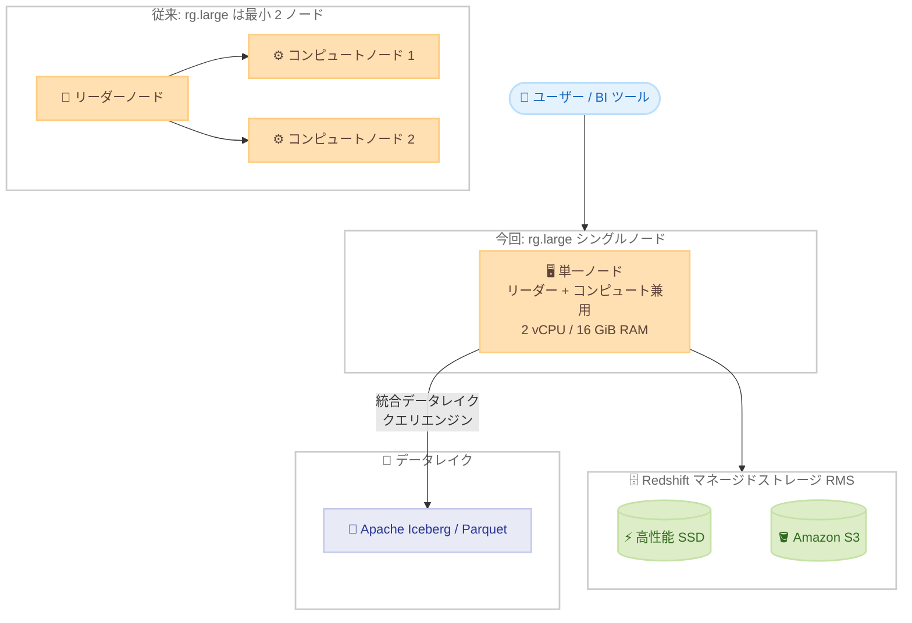

# Amazon Redshift - rg.large インスタンスのシングルノードクラスターサポート

**リリース日**: 2026 年 9 月 3 日
**サービス**: Amazon Redshift
**機能**: rg.large インスタンスによるシングルノードクラスターの作成サポート

📊 [このアップデートのインフォグラフィックを見る](https://takech9203.github.io/aws-news-summary/20260903-redshift-rg-large-single-node.html)

## 概要

AWS Graviton プロセッサを搭載した Amazon Redshift の rg.large インスタンスが、シングルノードクラスターをサポートしました。rg.large のシングルノードサポートはパッチバージョン P204 以降で利用可能です。高可用性を必要としない小規模なワークロード向けに、単一ノードの rg.large クラスターを作成できるようになり、概念実証 (PoC) やテストを迅速かつコスト効率よく実施するための選択肢が提供されます。

RG インスタンスは、前世代の RA3 インスタンスと比較して、データウェアハウスおよびデータレイクワークロードの実行において最大 2.4 倍の高速なパフォーマンスを、vCPU あたり 30% 低い価格で提供します。また、RG インスタンスには Redshift 専用に構築されたベクトル化データレイククエリエンジンが含まれており、Apache Iceberg や Parquet のデータをクラスターノード上で直接処理します。これにより、データウェアハウスとデータレイクをまたぐ SQL 分析を単一のエンジンで実行できます (RA3 クラスターではデータレイククエリに Amazon Redshift Spectrum を使用)。

これまで RG インスタンスのクラスターは最小 2 ノードからの構成が必要でしたが、今回のアップデートにより最小構成のコストが大幅に下がり、開発・検証環境や小規模な分析基盤において、最新世代の RG インスタンスをより気軽に試せるようになりました。

**アップデート前の課題**

- RG インスタンスのクラスターはマルチノード構成 (最小 2 ノード) が必要で、小規模な PoC やテストでもノード 2 台分のコストが発生していた
- 最小コストで最新世代を試したい場合の選択肢が限られており、シングルノードを使うには前世代の ra3.large などを選択する必要があった
- 開発・検証用途で高可用性が不要な場合でも、RG インスタンスでは最小構成を小さくする手段がなかった

**アップデート後の改善**

- 単一ノードの rg.large クラスター (2 vCPU、16 GiB RAM、マネージドストレージ 1 TB) を作成できるようになった
- ノード 1 台分の料金で Graviton ベースの最新世代 RG インスタンスと統合データレイククエリエンジンを利用でき、PoC・テストのコストを削減できる
- 小規模に始めて、データやワークロードの成長に合わせてマルチノード構成 (2〜16 ノード) へ拡張するアプローチが取りやすくなった

## アーキテクチャ図



シングルノードクラスターでは、1 台のノードがリーダーノードとコンピュートノードの両方の役割を担います。データは Redshift マネージドストレージ (RMS) に保存され、統合データレイククエリエンジンにより Apache Iceberg や Parquet のデータも同じエンジンでクエリできます。

## サービスアップデートの詳細

### 主要機能

1. **rg.large シングルノードクラスターの作成**
   - 高可用性を必要としない小規模ワークロード向けに、1 ノード構成の rg.large クラスターを作成可能
   - 1 台のノードがリーダーとコンピュートの機能を兼用する
   - パッチバージョン P204 以降で利用可能

2. **Graviton ベースの価格性能**
   - AWS Graviton プロセッサ搭載により、前世代 RA3 インスタンス比で最大 2.4 倍の高速なパフォーマンス
   - vCPU あたりの価格は RA3 比で 30% 低減

3. **統合データレイククエリエンジン**
   - Redshift 専用に構築されたベクトル化データレイククエリエンジンをクラスターノード上で実行
   - Apache Iceberg および Parquet データを単一エンジンで処理し、データウェアハウスとデータレイクを横断する SQL 分析が可能
   - RA3 の Redshift Spectrum とは異なり、クラスター自身のコンピュートリソースで直接クエリを実行

## 技術仕様

### RG ノードタイプの仕様

| ノードタイプ | vCPU | RAM (GiB) | ノードあたり RMS 上限 | ノード数範囲 | 合計 RMS 容量 |
|------|------|------|------|------|------|
| rg.large (シングルノード) | 2 | 16 | 1 TB | 1 | 1 TB |
| rg.large (マルチノード) | 2 | 16 | 8 TB | 2〜16 | 128 TB |
| rg.xlarge (マルチノード) | 4 | 32 | 32 TB | 2〜16 | 1,024 TB |
| rg.4xlarge | 16 | 128 | 128 TB | 2〜32 | 8,192 TB |
| rg.12xlarge | 48 | 384 | 128 TB | 2〜128 | 16,384 TB |

RMS は Redshift マネージドストレージを指します。シングルノード構成の rg.large では、ノードあたりの RMS 上限がマルチノード構成の 8 TB に対して 1 TB となる点に注意が必要です。

### シングルノードとマルチノードの比較

| 項目 | シングルノード | マルチノード |
|------|------|------|
| ノードの役割 | 1 台でリーダーとコンピュートを兼用 | リーダーノードとコンピュートノードが分離 |
| データミラーリング | なし | 各ノードのデータを別ノードのディスクにミラーリング |
| ハードウェア障害時 | ノード交換不可、スナップショットからの復元が必要 | 影響ノードの交換により復旧 |
| 推奨用途 | PoC、テスト、開発環境 | 本番ワークロード |

### API変更履歴

今回のアップデートに伴う新規 API の追加はありません。既存の `CreateCluster` API やコンソールで、ノードタイプ `rg.large`、ノード数 1 を指定することで利用できます。

## 設定方法

### 前提条件

1. クラスターのパッチバージョンが P204 以降であること
2. RG インスタンスが利用可能な AWS リージョンであること
3. クラスターを起動する VPC およびクラスターサブネットグループが準備されていること

### 手順

#### ステップ1: シングルノード rg.large クラスターの作成

```bash
aws redshift create-cluster \
  --cluster-identifier my-rg-single-node \
  --node-type rg.large \
  --cluster-type single-node \
  --master-username awsuser \
  --master-user-password <パスワード> \
  --cluster-subnet-group-name my-subnet-group \
  --vpc-security-group-ids sg-xxxxxxxx
```

`--cluster-type single-node` を指定してノードタイプ `rg.large` のシングルノードクラスターを作成します。シングルノード構成では `--number-of-nodes` の指定は不要です。

#### ステップ2: クラスターの状態確認

```bash
aws redshift describe-clusters \
  --cluster-identifier my-rg-single-node \
  --query "Clusters[0].{Status:ClusterStatus,NodeType:NodeType,Nodes:NumberOfNodes}"
```

クラスターのステータスが `available` になっていること、ノードタイプとノード数が意図した構成であることを確認します。

#### ステップ3: マルチノードへの拡張 (必要に応じて)

ワークロードの成長に合わせて、リサイズ操作によりマルチノード構成へ変更できます。コンソールの場合は対象クラスターを選択し、[アクション] から [サイズ変更] を実行します。リサイズ方式 (elastic resize / classic resize) の対応状況は構成により異なるため、[リサイズのドキュメント](https://docs.aws.amazon.com/redshift/latest/mgmt/managing-cluster-operations.html) を確認してください。

## メリット

### ビジネス面

- **PoC・テストコストの削減**: ノード 1 台分の料金で最新世代 RG インスタンスを試すことができ、評価・検証のハードルが下がる
- **スモールスタートの実現**: 小規模に始めて成長に合わせてマルチノードへ拡張でき、初期投資を最小化できる
- **開発環境の最適化**: 高可用性が不要な開発・検証環境を低コストで運用できる (一時停止機能との併用でさらにコスト削減可能)

### 技術面

- **最新世代の性能を最小構成で利用**: Graviton ベースの RG インスタンスの性能 (RA3 比最大 2.4 倍) を 1 ノードから利用できる
- **データレイク分析の検証が容易**: 統合データレイククエリエンジンによる Iceberg / Parquet クエリをシングルノードで検証できる
- **本番構成との一貫性**: 本番のマルチノード RG クラスターと同じノードタイプ・同じエンジンで開発・検証でき、環境差異を減らせる

## デメリット・制約事項

### 制限事項

- シングルノードサポートはパッチバージョン P204 以降が必要
- シングルノード rg.large のマネージドストレージ上限は 1 TB (マルチノードはノードあたり 8 TB)
- シングルノードクラスターは本番ワークロードでの使用は推奨されない
- シングルノード構成ではデータのミラーリングが行われず、ハードウェア障害時はノード交換ができないため、スナップショットからの復元が必要

### 考慮すべき点

- 高可用性・耐障害性が求められる本番ワークロードには、2 ノード以上のマルチノード構成を選択する
- シングルノード構成でもスナップショット (自動・手動) を活用し、障害時の復旧手段を確保しておく
- データ量が 1 TB を超える見込みがある場合は、あらかじめマルチノード構成や上位ノードタイプを検討する

## ユースケース

### ユースケース1: RG インスタンスへの移行前検証 (PoC)

**シナリオ**: 現在 RA3 クラスターを運用しており、RG インスタンスへのアップグレードによる性能向上とコスト削減を検証したい。

**実装例**:
```bash
# 既存クラスターのスナップショットからシングルノード rg.large で検証環境を作成
aws redshift restore-from-cluster-snapshot \
  --cluster-identifier rg-poc-cluster \
  --snapshot-identifier my-ra3-snapshot \
  --node-type rg.large \
  --number-of-nodes 1
```

**効果**: 最小コストで実データを使った RG インスタンスの性能検証が可能になり、移行判断に必要な情報を短期間・低コストで収集できる。

### ユースケース2: 開発・テスト環境の常設

**シナリオ**: データエンジニアリングチームが SQL やストアドプロシージャの開発、BI ダッシュボードのテスト用に小規模な Redshift 環境を常設したい。

**実装例**:
```bash
# 開発用シングルノードクラスターを作成し、夜間・週末は一時停止してコスト削減
aws redshift pause-cluster --cluster-identifier dev-rg-single-node
aws redshift resume-cluster --cluster-identifier dev-rg-single-node
```

**効果**: 本番と同じ RG 世代のエンジンで開発・テストを行いつつ、シングルノード + 一時停止の組み合わせで環境維持コストを最小化できる。

### ユースケース3: データレイク分析のスモールスタート

**シナリオ**: S3 上の Apache Iceberg / Parquet データに対する SQL 分析基盤を、小規模チーム向けに低コストで立ち上げたい。

**実装例**:
```sql
-- 統合データレイククエリエンジンで S3 上の Iceberg テーブルを直接クエリ
SELECT product_category, SUM(sales_amount)
FROM datalake_db.iceberg_sales
WHERE sale_date >= '2026-08-01'
GROUP BY product_category;
```

**効果**: シングルノードの rg.large でデータウェアハウスとデータレイクの横断分析を開始し、利用拡大に応じてマルチノードへスケールできる。

## 料金

Amazon Redshift プロビジョンドクラスターは、ノードタイプとノード数に基づくオンデマンド課金 (秒単位) と、Redshift マネージドストレージ (RMS) の使用量に基づくストレージ課金で構成されます。シングルノード構成ではノード 1 台分のコンピュート料金のみが発生するため、最小 2 ノードだった従来の RG クラスターと比較して最小構成のコストを約半分に抑えられます。

RG インスタンスは RA3 と比較して vCPU あたり 30% 低い価格で提供されます。また、定常的に利用するクラスターにはリザーブドノードによる割引、開発用途にはクラスターの一時停止によるコンピュート課金の停止も活用できます。リージョンごとの具体的な料金は [Amazon Redshift 料金ページ](https://aws.amazon.com/redshift/pricing/) を参照してください。

## 利用可能リージョン

RG インスタンスは以下の AWS リージョンで利用可能です。

- **米国**: 米国東部 (バージニア北部)、米国東部 (オハイオ)、米国西部 (北カリフォルニア)、米国西部 (オレゴン)
- **アジアパシフィック**: 東京、ソウル、大阪、香港、ムンバイ、ハイデラバード、シンガポール、シドニー、ジャカルタ、メルボルン、マレーシア、台北、タイ
- **カナダ**: カナダ (中部)
- **ヨーロッパ**: フランクフルト、ストックホルム、スペイン、アイルランド、ロンドン、パリ
- **南米**: サンパウロ
- **中東・アフリカ**: アフリカ (ケープタウン)
- **その他**: AWS GovCloud (US-East)、AWS GovCloud (US-West)、メキシコ (中部)

## 関連サービス・機能

- **Amazon Redshift Serverless**: クラスター管理が不要なサーバーレスオプション。断続的なワークロードにはシングルノードクラスターとあわせて比較検討の対象となる
- **Amazon Redshift マネージドストレージ (RMS)**: 高性能 SSD と Amazon S3 を組み合わせたストレージレイヤー。コンピュートとストレージを独立してスケール可能
- **AWS Graviton**: RG インスタンスに搭載される AWS 設計の ARM ベースプロセッサ。高い価格性能を実現
- **Apache Iceberg / Amazon S3**: 統合データレイククエリエンジンのクエリ対象となるオープンテーブルフォーマットとストレージ

## 参考リンク

- 📊 [インフォグラフィック](https://takech9203.github.io/aws-news-summary/20260903-redshift-rg-large-single-node.html)
- [公式発表 (What's New)](https://aws.amazon.com/about-aws/whats-new/2026/09/redshift-rg-large-single-node)
- [Amazon Redshift RG インスタンスドキュメント (ノードタイプ詳細)](https://docs.aws.amazon.com/redshift/latest/mgmt/working-with-clusters.html#rs-rg-nodes-table)
- [RA3 から RG へのアップグレードガイド](https://docs.aws.amazon.com/redshift/latest/mgmt/managing-cluster-considerations.html#rs-upgrading-to-ra3)
- [Amazon Redshift 料金ページ](https://aws.amazon.com/redshift/pricing/)

## まとめ

Graviton ベースの最新世代 RG インスタンスが最小 1 ノードから利用できるようになり、PoC・テスト・開発環境のコストを大きく下げられるアップデートです。RA3 からの移行を検討しているチームは、まずシングルノード rg.large で実データを使った性能検証を行うことを推奨します。本番ワークロードでは引き続きマルチノード構成を選択し、シングルノードは高可用性を必要としない用途に限定してください。
