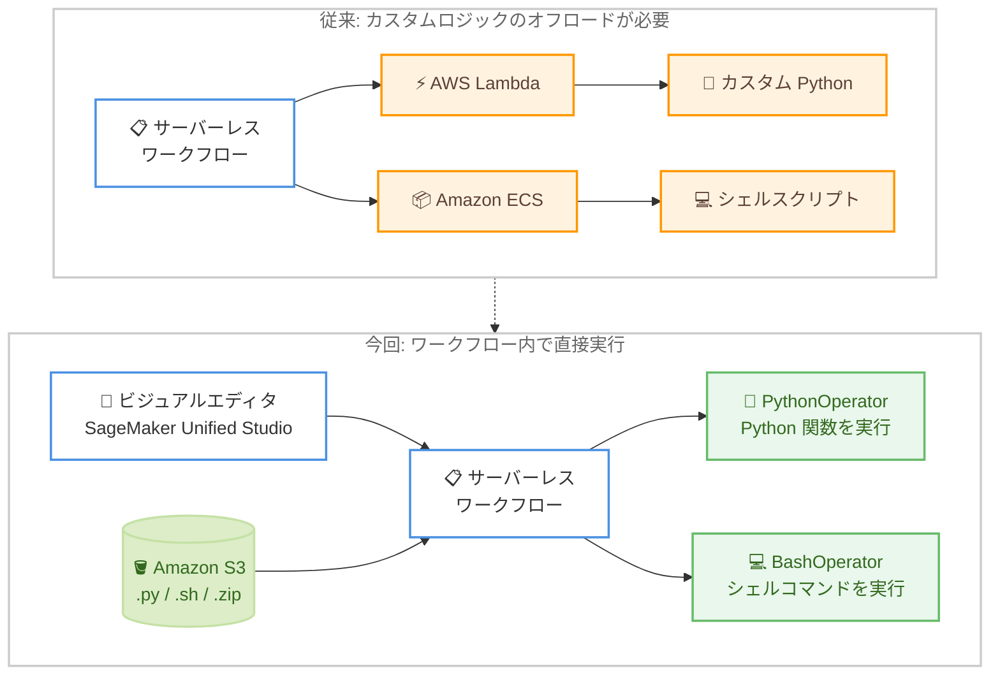

# Amazon SageMaker Unified Studio - Workflows での PythonOperator / BashOperator サポート

**リリース日**: 2026 年 9 月 3 日
**サービス**: Amazon SageMaker Unified Studio (Workflows)
**機能**: サーバーレスビジュアルワークフローにおける PythonOperator / BashOperator サポート

📊 [このアップデートのインフォグラフィックを見る](https://takech9203.github.io/aws-news-summary/20260903-sagemaker-workflows-python-bash.html)

## 概要

Amazon SageMaker Unified Studio Workflows が、Apache Airflow のコアオペレーターである PythonOperator と BashOperator をサポートしました。これにより、サーバーレスワークフロー内で任意の Python 関数やシェルコマンドを、別途コンピューティングリソースをプロビジョニングすることなく直接実行できるようになります。

これまで、データ変換などのカスタムロジックやシェルスクリプトの実行をワークフローに組み込むには、AWS Lambda や Amazon ECS にロジックをオフロードする必要がありました。今回のアップデートにより、ビジュアルワークフローエディタのタスクパネルから PythonOperator または BashOperator をキャンバスにドラッグし、スクリプトファイルを指定するだけで、カスタムコードをワークフローのタスクとして実行できます。

この機能は SageMaker Unified Studio Workflows の基盤である Amazon MWAA Serverless の新機能として提供されており、データエンジニアや ML エンジニアがビジュアルキャンバスを離れることなく、AWS サービス連携タスクとカスタムコードタスクを組み合わせたパイプラインを構築できます。

**アップデート前の課題**

- サーバーレスワークフローは AWS サービス連携用のオペレーター (Glue、EMR、Redshift、SageMaker など 80 以上) のみをサポートしており、任意のカスタムコードを直接実行できなかった
- 軽量なデータ変換やシェルスクリプト実行のために、AWS Lambda 関数や Amazon ECS タスクを別途作成・管理する必要があった
- カスタムロジックのためだけに別サービスの IAM ロール、デプロイパイプライン、監視設定を用意する運用負荷が発生していた

**アップデート後の改善**

- PythonOperator により、任意の Python 関数 (callable) をワークフローのタスクとして直接実行できるようになった
- BashOperator により、シェルコマンドやシェルスクリプトをワークフローのタスクとして直接実行できるようになった
- ビジュアルエディタ上でスクリプトファイルをアップロードし、関数やコマンドを指定するだけで完結するため、Lambda / ECS へのオフロードが不要になった
- タスク出力を `{{ タスク名.output }}` 形式で他のタスクから参照でき、AWS サービスオペレーターとカスタムコードを自然に連携できるようになった

## アーキテクチャ図



従来は Lambda や ECS にオフロードしていたカスタムロジックを、S3 にアップロードしたスクリプトファイルを参照する PythonOperator / BashOperator としてワークフロー内で直接実行できるようになりました。

## サービスアップデートの詳細

### 主要機能

1. **PythonOperator: Python 関数の直接実行**
   - 任意の Python callable をワークフローのタスクとして実行
   - ビジュアルエディタでは、アップロードした Python ファイルと関数名 (`module_name.function_name` 形式) を指定するだけで設定が完了
   - Op arguments (位置引数のリスト) と Op kwargs (キーワード引数の辞書) で関数に引数を渡すことが可能
   - YAML 定義では `airflow.providers.standard.operators.python.PythonOperator` (Airflow 3 形式) または `airflow.operators.python.PythonOperator` として指定

2. **BashOperator: シェルコマンド / スクリプトの直接実行**
   - Bash コマンド、コマンドの組み合わせ、または `.sh` スクリプトへの参照をタスクとして実行
   - コマンドフィールドはテンプレート値をサポートし、他のタスクの出力やワークフロー変数を参照可能
   - YAML 定義では `airflow.providers.standard.operators.bash.BashOperator` または `airflow.operators.bash.BashOperator` として指定

3. **ビジュアルエディタからのファイルアップロード**
   - ワークフロー設定の Storage セクションから、オペレーターが参照する `.py` / `.sh` / `.zip` ファイルをアップロード
   - 単一ファイルは zip 化不要でそのままアップロード可能。複数ファイルは `.zip` アーカイブにパッケージ化され、S3 に保存されてワークフロー実行時に展開される
   - サードパーティの Python 依存関係は `pip install --target ./package` でローカルにインストールし、スクリプトと一緒にアップロードすることで利用可能

4. **タスク間のデータ連携**
   - PythonOperator / BashOperator の出力は `{{ タスク名.output }}` 構文で他のタスクから参照可能
   - AWS サービスオペレーターとカスタムコードタスクを組み合わせた DAG を構築できる

## 技術仕様

### 実行環境 (Amazon MWAA Serverless ワーカー)

| 項目 | 詳細 |
|------|------|
| OS / アーキテクチャ | Linux / x86_64 |
| リソース | 1 vCPU / 3 GiB メモリ (タスクあたり) |
| ランタイム | Python 3.12 |
| コード展開先 | `/usr/local/airflow/dags` (BashOperator の作業ディレクトリも同じ) |
| ネットワーク | デフォルトではインターネットアクセスなし (必要な場合は NetworkConfiguration で VPC を指定) |
| AWS 認証情報 | ワークフロー実行ロールの認証情報が自動的に利用可能 (boto3 のデフォルト認証情報プロバイダーチェーンで解決) |

### コードパッケージの制限

| 項目 | 制限 |
|------|------|
| 対応ファイル形式 | 単一の `.py`、単一の `.sh`、または複数ファイルを含む `.zip` |
| コードファイルの最大サイズ | 250 MB |
| zip 展開後の最大サイズ | 250 MB |
| アカウント内の全ワークフローの合計コードストレージ | 75 GB |
| 依存関係の互換性要件 | Python 3.12 / Linux x86_64 用のパッケージであること |

### プリインストールパッケージ (主要なもの)

| パッケージ | バージョン |
|-----------|-----------|
| apache-airflow | 3.0.6 |
| apache-airflow-providers-amazon | 9.32.0 |
| boto3 / botocore | 1.43.1 |
| dag-factory | 1.0.0 |
| aws-encryption-sdk | 4.0.3 以降 |

プリインストールパッケージは、コードパッケージに同じパッケージの別バージョンを同梱した場合でも優先されます。同梱するのはプリインストールされていないパッケージのみにする必要があります。

### YAML ワークフロー定義の例

```yaml
my_dag:
  start_date: "2024-01-01"
  schedule: null
  tasks:
    python_task:
      operator: airflow.providers.standard.operators.python.PythonOperator
      python_callable: my_module.hello_world
    bash_task:
      operator: airflow.providers.standard.operators.bash.BashOperator
      bash_command: "echo 'Hello from bash' && date"
```

## 設定方法

### 前提条件

1. Amazon SageMaker Unified Studio のプロジェクトが作成済みであること
2. オペレーターが参照する Python (`.py`) または Bash (`.sh`) ファイルを準備しておくこと
3. (MWAA Serverless API を直接使用する場合) コードと DAG ファイルを保存する S3 バケットと、S3 バケットへのアクセス権限を持つ実行ロール

### 手順

#### ステップ 1: ビジュアルワークフローの作成

SageMaker Unified Studio にログインし、左ナビゲーションペインの [Workflows] から [Create new workflow] を選択してビジュアルワークフローエディタを開き、ワークフローに名前を付けて保存します。

#### ステップ 2: オペレーターファイルのアップロード

エディタの設定 (歯車アイコン) から [Storage] を展開し、[Python/Bash Operator Files] でオペレーターが参照する `.py` / `.sh` / `.zip` ファイルをアップロードして保存します。アップロードされたファイルは zip 化されて S3 のオペレーターファイル用ロケーションに保存され、ワークフロー定義から参照されます。

サードパーティの依存関係が必要な場合は、以下のようにローカルでパッケージを準備します。

```bash
# ソースファイルと依存関係を 1 つのディレクトリに集約
mkdir my_package
cp my_module.py my_package/

# 実行環境 (Python 3.12 / Linux x86_64) 向けの依存関係をインストール
pip install -r requirements.txt --target my_package \
  --platform manylinux2014_x86_64 \
  --python-version 3.12 \
  --only-binary=:all:

# アーカイブのルートに全ファイルを配置した zip を作成
cd my_package
zip -r ../my_package.zip . -x "*__pycache__*" "*.pyc"
```

`--platform` / `--python-version` / `--only-binary` フラグにより、MWAA Serverless ワーカーの実行環境である Python 3.12 / Linux x86_64 用のホイールを取得します。これらを指定しないとローカルマシン向けのパッケージがインストールされ、実行時のインポートが失敗します。

#### ステップ 3: PythonOperator タスクの追加

タスク検索ウィンドウで [General Purpose] カテゴリを展開して [Python Operator] を選択し、キャンバスに追加します。タスク名を入力し、[Python Callable] でアップロード済みの Python ファイルと呼び出す関数名を指定します。必要に応じて [Optional configurations] から Op arguments (例: `[us-east-1, gold, 100]`) や Op kwargs を設定します。

#### ステップ 4: BashOperator タスクの追加

同様に [Bash Operator] をキャンバスに追加し、[Bash command] フィールドに実行するコマンド、コマンドの組み合わせ、またはアップロード済みの `.sh` スクリプトへの参照を入力します。このフィールドはテンプレート値をサポートするため、他のタスクの出力 (例: `{{ Bash-task.output }}`) やワークフロー変数を参照できます。

#### ステップ 5: タスクの接続と実行

各タスクの + 記号同士を接続して実行順序を定義し、ワークフローを保存します。実行後は [View runs] からタスクごとの出力とログを確認できます。タスクログは CloudWatch Logs の `/aws/mwaa-serverless/{ワークフロー名}/` ロググループに出力されます。

## メリット

### ビジネス面

- **開発速度の向上**: カスタムロジックのために Lambda 関数や ECS タスクを別途構築・デプロイする工程が不要になり、パイプライン構築のリードタイムが短縮される
- **運用コストの削減**: 管理対象のコンポーネントが減り、個別の IAM ロール設定、デプロイパイプライン、監視設定にかかる運用負荷が軽減される
- **ローコードとカスタムコードの両立**: ドラッグアンドドロップのビジュアル操作でパイプラインを構築しつつ、必要な箇所だけカスタムコードを組み込める

### 技術面

- **サーバーレス実行**: コンピューティングリソースのプロビジョニングやスケーリング管理が不要で、タスクごとに 1 vCPU / 3 GiB のワーカー上で実行される
- **Airflow 標準オペレーターとの互換性**: Apache Airflow 3 標準の PythonOperator / BashOperator と同じ指定方法が使えるため、既存の Airflow DAG からの移行がしやすい
- **認証情報の自動解決**: ワークフロー実行ロールの認証情報が実行環境で自動的に利用可能で、コード内での認証設定が不要
- **コードのバージョニング**: ワークフローの作成・更新のたびにコードと定義がイミュータブルなワークフローバージョンとしてスナップショットされ、再現性のあるデプロイが可能

## デメリット・制約事項

### 制限事項

- コードファイルの最大サイズおよび zip 展開後の最大サイズは 250 MB
- アカウント内の全ワークフロー合計のコードストレージは 75 GB まで
- 実行環境は Python 3.12 / Linux x86_64 固定であり、依存パッケージはこの環境と互換性が必要
- タスクあたりのリソースは 1 vCPU / 3 GiB メモリであり、大規模な処理には Glue や EMR など専用のオペレーターが適する
- プリインストールパッケージと同名のパッケージを同梱しても、プリインストール版が優先される

### 考慮すべき点

- タスクはデフォルトでインターネットアクセスなしで実行される。外部 API の呼び出しや実行時のパッケージダウンロードが必要な場合は、NetworkConfiguration パラメータでインターネットアクセス可能な VPC を指定する必要がある
- `__pycache__` ディレクトリをコードパッケージに含めると、異なる OS / アーキテクチャでコンパイルされたバイトコードの非互換により失敗する可能性があるため除外する
- PythonOperator / BashOperator のタスクは AWS Managed Tasks として扱われ、MWAA の料金体系に基づく課金が発生する
- 本番ワークフローでは S3 バージョニングを有効化し、コードの VersionId を指定することで再現性のあるデプロイが推奨される

## ユースケース

### ユースケース 1: ETL パイプライン内の軽量データ変換

**シナリオ**: Glue ジョブで抽出したデータに対して、ロード前に軽量なフォーマット変換やバリデーションを行いたい。従来はこの処理のためだけに Lambda 関数を作成していた。

**実装例**:
```yaml
etl_dag:
  start_date: "2026-09-01"
  schedule: "0 2 * * *"
  tasks:
    extract:
      operator: airflow.providers.amazon.aws.operators.glue.GlueJobOperator
      job_name: extract-job
    transform:
      operator: airflow.providers.standard.operators.python.PythonOperator
      python_callable: transforms.normalize_records
      dependencies: [extract]
    load:
      operator: airflow.providers.amazon.aws.operators.glue.GlueJobOperator
      job_name: load-job
      dependencies: [transform]
```

**効果**: Lambda 関数の作成・デプロイ・監視が不要になり、変換ロジックをワークフローと一体でバージョン管理できる。

### ユースケース 2: シェルスクリプトによる前処理・後処理

**シナリオ**: 分析ジョブの前にファイルの整形やチェックサム検証をシェルコマンドで行い、ジョブ完了後に結果の後処理を実行したい。

**実装例**:
```
BashOperator タスク 1 (前処理):
  Bash command: bash preprocess.sh {{ workflow.params.input_path }}

AthenaOperator タスク (分析クエリ実行)

BashOperator タスク 2 (後処理):
  Bash command: echo "Query finished" && bash postprocess.sh {{ Athena-task.output }}
```

**効果**: 既存のシェルスクリプト資産を ECS タスク化することなくそのままワークフローに組み込め、テンプレート構文で前段タスクの出力も参照できる。

### ユースケース 3: boto3 を使った AWS リソースのカスタム操作

**シナリオ**: 標準オペレーターでカバーされていない AWS API 操作 (カスタムタグ付け、独自の条件チェックなど) をパイプラインの途中で実行したい。

**実装例**:
```python
# custom_ops.py (アップロードするコードパッケージに含める)
import boto3

def tag_processed_objects(bucket, prefix):
    s3 = boto3.client("s3")  # 実行ロールの認証情報が自動で解決される
    response = s3.list_objects_v2(Bucket=bucket, Prefix=prefix)
    for obj in response.get("Contents", []):
        s3.put_object_tagging(
            Bucket=bucket,
            Key=obj["Key"],
            Tagging={"TagSet": [{"Key": "status", "Value": "processed"}]},
        )
```

**効果**: プリインストールされた boto3 と自動解決される実行ロール認証情報により、認証設定なしで任意の AWS API 操作をタスクとして実行できる。

## 料金

PythonOperator および BashOperator のタスクは AWS Managed Tasks として扱われ、Amazon MWAA (Managed Workflows for Apache Airflow) の料金体系に基づいて課金されます。詳細は [Amazon MWAA の料金ページ](https://aws.amazon.com/managed-workflows-for-apache-airflow/pricing/) を参照してください。

## 利用可能リージョン

Amazon SageMaker Unified Studio が利用可能なすべての AWS リージョンで利用できます。対象リージョンの一覧は [Supported Regions for Amazon SageMaker Unified Studio](https://docs.aws.amazon.com/sagemaker-unified-studio/latest/adminguide/supported-regions.html) を参照してください。

## 関連サービス・機能

- **Amazon MWAA Serverless**: SageMaker Unified Studio のサーバーレスワークフローの実行基盤。今回のオペレーターサポートは MWAA Serverless の機能として提供される
- **AWS Lambda / Amazon ECS**: 従来カスタムロジックのオフロード先として必要だったサービス。軽量な処理であれば今回の機能で代替可能
- **Amazon S3**: オペレーターが参照するコードファイル (.py / .sh / .zip) の保存先
- **Amazon CloudWatch Logs**: タスクの実行ログの出力先 (`/aws/mwaa-serverless/{ワークフロー名}/` ロググループ)
- **AWS Glue / Amazon EMR / Amazon Athena**: ビジュアルワークフローがサポートする 80 以上の AWS サービスオペレーターの代表例。カスタムコードタスクと組み合わせて利用可能

## 参考リンク

- 📊 [インフォグラフィック](https://takech9203.github.io/aws-news-summary/20260903-sagemaker-workflows-python-bash.html)
- [公式発表 (What's New)](https://aws.amazon.com/about-aws/whats-new/2026/09/sagemaker-workflows-python-bash/)
- [AWS Blog: Introducing Amazon MWAA Serverless](https://aws.amazon.com/blogs/big-data/introducing-amazon-mwaa-serverless/)
- [ドキュメント: Serverless visual workflows (SageMaker Unified Studio User Guide)](https://docs.aws.amazon.com/sagemaker-unified-studio/latest/userguide/serverless-visual-workflows.html)
- [ドキュメント: Supported operators (Amazon MWAA Serverless User Guide)](https://docs.aws.amazon.com/mwaa/latest/mwaa-serverless-userguide/operators.html)
- [ドキュメント: Python and Bash operators (Amazon MWAA Serverless User Guide)](https://docs.aws.amazon.com/mwaa/latest/mwaa-serverless-userguide/operators-python-bash-detail.html)
- [料金ページ (Amazon MWAA)](https://aws.amazon.com/managed-workflows-for-apache-airflow/pricing/)

## まとめ

SageMaker Unified Studio のサーバーレスビジュアルワークフローで PythonOperator と BashOperator が利用可能になり、Lambda や ECS を経由せずにカスタムコードをパイプラインへ直接組み込めるようになりました。標準オペレーターでカバーできない軽量なデータ変換やスクリプト実行を含むパイプラインの構築・運用が大幅に簡素化されます。ETL パイプラインにカスタムロジックを組み込んでいるチームは、既存の Lambda / ECS ベースの補助処理を本機能で置き換えられないか検討することをおすすめします。
