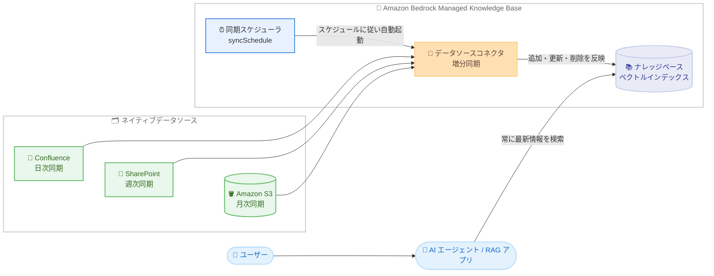

# Amazon Bedrock - Managed Knowledge Base のデータソースコネクタ自動同期スケジューリング

**リリース日**: 2026 年 9 月 4 日
**サービス**: Amazon Bedrock
**機能**: Managed Knowledge Base データソースコネクタの自動同期スケジューリング

📊 [このアップデートのインフォグラフィックを見る](https://takech9203.github.io/aws-news-summary/20260904-amazon-bedrock-managed-knowledge-base-automatic-sync-scheduling-data-source-connectors.html)

## 概要

Amazon Bedrock Managed Knowledge Base が、データソースコネクタの自動同期スケジューリングをサポートしました。Managed Knowledge Base は、ベクトルデータベースやデータパイプラインの管理を必要とせずに、データの取り込み、ストレージ最適化、高度な検索を処理するフルマネージド型の検索拡張生成 (RAG) サービスです。今回のアップデートにより、すべてのネイティブデータソースコネクタに対して、日次・週次・月次の同期スケジュールを設定できるようになりました。

自動同期スケジューリングでは、ソースコンテンツの更新頻度に合わせて同期頻度を選択できます。たとえば、更新が頻繁な Confluence のカスタマーサポートナレッジベースには日次同期、定期的に更新される SharePoint のポリシードキュメントには週次同期、Amazon S3 に保存された参照資料には月次同期を設定するといった使い分けが可能です。

これにより、独自のスケジューリング用ワークアラウンドを構築・保守する必要がなくなり、運用負荷を削減しながら、RAG アプリケーションが常に最新のエンタープライズデータに基づいて回答できる状態を維持できます。AI エージェントや RAG アプリケーションを構築するすべてのユーザーにとって、ナレッジベースの鮮度を保つ運用がシンプルになるアップデートです。

**アップデート前の課題**

- 以前はソースデータが変更されるたびに、手動で同期をトリガーする必要があった
- 定期的に同期するには、EventBridge Scheduler と Lambda などを組み合わせたカスタムソリューションを構築・保守する必要があった
- 同期漏れにより、AI エージェントが古い情報に基づいて回答するリスクがあった

**アップデート後の改善**

- すべてのネイティブデータソースコネクタに対して、日次・週次・月次の同期スケジュールを設定できるようになった
- カスタムスケジューリングの構築・保守が不要になり、運用オーバーヘッドを削減できるようになった
- データソースごとにコンテンツの更新頻度に合わせた同期頻度を設定でき、AI エージェントが常に最新情報を検索できるようになった

## アーキテクチャ図



データソースごとに設定した同期スケジュールに従い、Managed Knowledge Base がコネクタの同期ジョブを自動的に起動する流れを示しています。同期は増分方式のため、前回同期以降に追加・更新・削除されたドキュメントのみが処理されます。

## サービスアップデートの詳細

### 主要機能

1. **日次・週次・月次の同期スケジュール**
   - デフォルトはオンデマンド (手動同期のみ) で、自動スケジュールは行われない
   - 日次: 1 日 1 回、システムが自動的に選択したオフピーク時間帯に同期
   - 週次: 指定した曜日 (日曜〜土曜) に週 1 回同期
   - 月次: 指定した日 (1〜28 日) または月末に月 1 回同期

2. **すべてのネイティブデータソースコネクタに対応**
   - Amazon S3、SharePoint、OneDrive、Confluence、Google Drive、Web Crawler など、Managed Knowledge Base のネイティブコネクタで利用可能
   - 直近で追加された ServiceNow コネクタを含め、コネクタごとに個別のスケジュールを設定可能

3. **作成時・作成後の柔軟な設定変更**
   - データソースの接続時にスケジュールを設定できるほか、既存データソースの編集でも変更可能
   - コンソールの Sync schedule セクション、または API の syncSchedule フィールドで設定

4. **増分同期との組み合わせ**
   - スケジュール実行される同期は増分方式で、前回同期以降の追加・更新・削除のみを処理
   - フルクロールを繰り返さないため、スケジュール同期でも効率的にインデックスを最新化

## 技術仕様

### 同期スケジュールの設定項目

| 項目 | 詳細 |
|------|------|
| 設定場所 | dataSourceConfiguration 内の managedKnowledgeBaseConnectorConfiguration.syncSchedule |
| 対象 API | CreateDataSource / UpdateDataSource (Agents for Amazon Bedrock ビルドタイムエンドポイント) |
| On-demand | syncSchedule を省略。手動同期のみ (デフォルト) |
| daily | 空オブジェクト {} を指定。システムが選択したオフピーク時間帯に 1 日 1 回同期 |
| weekly | dayOfWeek (SUNDAY〜SATURDAY) を指定。週 1 回同期 |
| monthly | dayOfMonth に dayNumber (1〜28) または lastDayOfMonth {} を指定。月 1 回同期 |
| 実行時刻 | 自動的にスケジュールされ、変動する可能性がある (時刻の指定は不可) |

### API 変更履歴

| 日付 | サービス | 変更内容 |
|------|----------|----------|
| 2026/08/28 | [Agents for Amazon Bedrock](https://awsapichanges.com/archive/changes/b6cdac-bedrock-agent.html) | 3 updated api methods - Managed Knowledge Base のデータソースコネクタ向けに、CreateDataSource / UpdateDataSource へオプションの syncSchedule フィールドを追加。日次・週次・月次の自動同期に対応 |

### 設定例 (dataSourceConfiguration)

毎週月曜日に同期する場合の設定例です。

```json
{
    "dataSourceConfiguration": {
        "type": "MANAGED_KNOWLEDGE_BASE_CONNECTOR",
        "managedKnowledgeBaseConnectorConfiguration": {
            "connectorParameters": {
                "type": "CONNECTOR_TYPE",
                "version": "1"
            },
            "syncSchedule": {
                "weekly": {
                    "dayOfWeek": "MONDAY"
                }
            }
        }
    }
}
```

毎月 15 日に同期する場合は、syncSchedule を次のように置き換えます。

```json
{
    "syncSchedule": {
        "monthly": {
            "dayOfMonth": {
                "dayNumber": 15
            }
        }
    }
}
```

## 設定方法

### 前提条件

1. Amazon Bedrock Managed Knowledge Base を作成済みであること
2. 対象のネイティブデータソースコネクタ (S3、SharePoint、Confluence など) の接続情報を設定済み、または設定できる状態であること
3. CreateDataSource / UpdateDataSource を呼び出す IAM 権限があること (API で設定する場合)

### 手順

#### ステップ 1: データソースの接続時または編集時にスケジュールを選択する (コンソール)

マネジメントコンソールでデータソースを接続または編集し、Sync schedule セクションで Frequency (On-demand / Daily / Weekly / Monthly) を選択します。Weekly を選択した場合は同期を実行する曜日を、Monthly を選択した場合は日付 (1〜28) または月末を指定します。

#### ステップ 2: API でスケジュールを設定する (CLI / SDK)

```bash
aws bedrock-agent update-data-source \
  --knowledge-base-id "your-knowledge-base-id" \
  --data-source-id "your-data-source-id" \
  --name "confluence-connector" \
  --data-source-configuration file://data-source-config.json
```

既存のデータソースに syncSchedule を含む dataSourceConfiguration を適用しています。data-source-config.json には前述の設定例のように、daily、weekly、monthly のいずれか 1 つのみを指定します。オンデマンド同期に戻す場合は syncSchedule を省略します。

#### ステップ 3: 同期履歴を確認する

コンソールのデータソース詳細画面で Sync history を確認するか、ListIngestionJobs API で同期ジョブの実行状況とステータスを確認します。スケジュール同期が期待どおりに実行されているかを定期的に確認してください。

## メリット

### ビジネス面

- **回答品質の維持**: ナレッジベースが常に最新のエンタープライズデータに基づくため、AI エージェントが古い情報で回答するリスクを低減できる
- **運用コストの削減**: 手動同期の運用やカスタムスケジューラの保守が不要になり、担当者の作業負荷を削減できる
- **導入までの時間短縮**: スケジューリング基盤を自前で構築する必要がなく、RAG アプリケーションの本番運用をすぐに開始できる

### 技術面

- **カスタムワークアラウンドの排除**: EventBridge Scheduler + Lambda などによる StartIngestionJob の定期実行を自前で実装・保守する必要がなくなる
- **データソースごとの柔軟な頻度設定**: コンテンツの更新頻度に合わせて、コネクタ単位で日次・週次・月次を使い分けられる
- **オフピーク実行**: 同期時刻はシステムがオフピーク時間帯に自動選択するため、時刻設計を意識する必要がない

## デメリット・制約事項

### 制限事項

- 同期の実行時刻は自動的にスケジュールされ、特定の時刻を指定することはできない (実行時刻は変動する可能性がある)
- 選択できる頻度は日次・週次・月次のみで、時間単位や cron 式のような細かいスケジュールは指定できない
- 月次スケジュールで指定できる日付は 1〜28 日または月末のみ (29 日、30 日は指定不可)

### 考慮すべき点

- 日次よりも高い頻度 (数時間ごとなど) で同期したい場合は、引き続き StartIngestionJob API による独自スケジューリングが必要
- syncSchedule はオプションフィールドであり、省略するとオンデマンド (手動同期のみ) となるため、既存データソースには明示的な設定変更が必要
- 公式発表には利用可能リージョンの明記がないため、利用予定のリージョンで Managed Knowledge Base が提供されているかドキュメントやコンソールで確認が必要

## ユースケース

### ユースケース 1: カスタマーサポートナレッジベースの日次同期

**シナリオ**: サポートチームが Confluence でナレッジ記事を頻繁に更新しており、サポート用 AI アシスタントに常に最新の記事を反映したい。

**実装例**:
```
1. Confluence コネクタのデータソースを Managed Knowledge Base に接続
2. syncSchedule に daily を設定
3. AI アシスタントは毎日オフピーク時間帯に更新された記事を自動で取り込み
```

**効果**: 手動同期なしで最新のサポートナレッジに基づく回答を提供でき、誤案内のリスクを低減できる。

### ユースケース 2: 社内ポリシードキュメントの週次同期

**シナリオ**: SharePoint 上の社内ポリシードキュメントが週次程度で更新されるため、更新サイクルに合わせてナレッジベースを同期したい。

**実装例**:
```
1. SharePoint コネクタのデータソースを接続
2. syncSchedule に weekly を設定し、dayOfWeek に MONDAY を指定
3. 週初めに前週の更新分が自動でナレッジベースへ反映される
```

**効果**: 更新頻度に見合った同期頻度により、不要な同期ジョブを避けつつ、社内問い合わせボットの回答を最新のポリシーに保てる。

### ユースケース 3: S3 上の参照資料の月次同期

**シナリオ**: Amazon S3 に保存された製品マニュアルや参照資料が月 1 回の定期リリースで更新されるため、リリース後に自動で同期したい。

**実装例**:
```
1. S3 コネクタのデータソースを接続
2. syncSchedule の monthly で dayOfMonth に dayNumber 15 を指定 (毎月 15 日のリリース後)
3. 月末更新の資料には lastDayOfMonth を指定
```

**効果**: リリースサイクルに同期タイミングを合わせられ、運用作業ゼロで参照資料の鮮度を維持できる。

## 料金

公式発表には自動同期スケジューリングに関する追加料金の記載はありません。Amazon Bedrock Knowledge Bases の料金体系に準じます。スケジュール同期により同期ジョブの実行頻度が増える場合は、取り込みに伴う料金への影響を考慮してください。詳細は [Amazon Bedrock の料金ページ](https://aws.amazon.com/bedrock/pricing/) を参照してください。

## 利用可能リージョン

公式発表には利用可能リージョンの明記がありません。利用予定のリージョンでの Managed Knowledge Base の提供状況は、[Amazon Bedrock のドキュメント](https://docs.aws.amazon.com/bedrock/latest/userguide/kb-managed-sync.html) およびマネジメントコンソールで確認してください。

## 関連サービス・機能

- **Amazon Bedrock Knowledge Bases**: 本機能の基盤となる RAG 機能。ネイティブコネクタ (S3、SharePoint、OneDrive、Confluence、Google Drive、Web Crawler、ServiceNow など) を提供
- **Amazon Bedrock AgentCore**: Managed Knowledge Base を組み込みツールとして利用する AI エージェント基盤。最新のナレッジに基づくエージェント構築が容易になる
- **Amazon EventBridge Scheduler**: 従来の定期同期のワークアラウンドとして利用されてきたスケジューリングサービス。本機能により Managed Knowledge Base の同期用途では不要になる
- **AWS Lambda**: StartIngestionJob を定期実行するカスタムソリューションで利用されてきたサービス。本機能により同期用途の実装・保守が不要になる

## 参考リンク

- 📊 [インフォグラフィック](https://takech9203.github.io/aws-news-summary/20260904-amazon-bedrock-managed-knowledge-base-automatic-sync-scheduling-data-source-connectors.html)
- [公式発表 (What's New)](https://aws.amazon.com/about-aws/whats-new/2026/09/amazon-bedrock-managed-knowledge-base-automatic-sync-scheduling-data-source-connectors/)
- [ドキュメント: Sync scheduling for data sources](https://docs.aws.amazon.com/bedrock/latest/userguide/kb-managed-sync.html#kb-managed-sync-schedule)
- [ドキュメント: Connect a data source](https://docs.aws.amazon.com/bedrock/latest/userguide/kb-managed-connect-ds.html)
- [Amazon Bedrock Knowledge Bases 製品ページ](https://aws.amazon.com/bedrock/knowledge-bases/)
- [料金ページ](https://aws.amazon.com/bedrock/pricing/)

## まとめ

Amazon Bedrock Managed Knowledge Base の自動同期スケジューリングにより、データソースコネクタごとに日次・週次・月次の同期を設定するだけで、ナレッジベースの鮮度をノーコードで維持できるようになりました。これまで EventBridge Scheduler や Lambda で同期を自動化していた場合は、本機能への置き換えによる運用簡素化を検討する価値があります。まずは既存データソースの更新頻度を整理し、コネクタごとに適切な同期スケジュールを設定することから始めることを推奨します。
