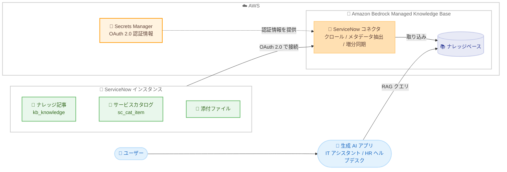

# Amazon Bedrock - Managed Knowledge Base の ServiceNow ネイティブデータソースコネクタ

**リリース日**: 2026 年 9 月 4 日
**サービス**: Amazon Bedrock
**機能**: Managed Knowledge Base 向け ServiceNow ネイティブデータソースコネクタ

📊 [このアップデートのインフォグラフィックを見る](https://takech9203.github.io/aws-news-summary/20260904-amazon-bedrock-managed-knowledge-base-servicenow-native-data-source-connector.html)

## 概要

Amazon Bedrock Managed Knowledge Base が、ServiceNow をネイティブデータソースコネクタとしてサポートしました。Managed Knowledge Base はフルマネージド型の検索拡張生成 (RAG) サービスであり、今回のアップデートにより、ServiceNow インスタンスを接続してナレッジ記事とサービスカタログアイテムを直接ナレッジベースに取り込めるようになります。

コネクタはナレッジ記事 (kb_knowledge) とサービスカタログアイテム (sc_cat_item) を添付ファイルを含めてクロールし、sys ID の包含リストを使用して特定のナレッジベース、記事カテゴリ、サービスカタログにクロール範囲を限定できます。ServiceNow インスタンスの認証情報を指定するだけで、データクローリング、メタデータ抽出、増分同期をコネクタが自動的に処理します。

ServiceNow を社内のナレッジ管理や IT サービス管理に利用している組織にとって、最新の ServiceNow コンテンツに基づいた IT アシスタント、人事ヘルプデスク、カスタマーサポートエージェントなどの生成 AI アプリケーションを、カスタム開発なしで構築できる点が大きな価値です。

**アップデート前の課題**

- 以前は ServiceNow のコンテンツを Bedrock のナレッジベースに取り込むには、カスタムのインジェストパイプラインを構築・保守する必要があった
- ServiceNow API の呼び出し、メタデータの抽出、変更差分の検出などを自前で実装する必要があり、開発・運用コストが高かった
- ServiceNow 側の記事更新をナレッジベースに反映する同期処理を独自に設計する必要があった

**アップデート後の改善**

- ServiceNow インスタンスの認証情報を設定するだけで、ナレッジ記事とサービスカタログアイテムを添付ファイルごと自動的に取り込めるようになった
- 追加・更新・削除されたコンテンツを sys_updated_on タイムスタンプに基づいて増分同期できるようになった
- sys ID 包含リストにより、特定のナレッジベース、記事カテゴリ、サービスカタログにクロール範囲を限定できるようになった

## アーキテクチャ図



ServiceNow コネクタが OAuth 2.0 認証で ServiceNow インスタンスに接続し、ナレッジ記事とサービスカタログアイテムをクロールして Managed Knowledge Base に取り込む流れを示しています。取り込まれたコンテンツは、生成 AI アプリケーションからの RAG クエリで利用されます。

## サービスアップデートの詳細

### 主要機能

1. **ナレッジ記事とサービスカタログアイテムのクローリング**
   - ナレッジ記事 (kb_knowledge) とサービスカタログアイテム (sc_cat_item) を取り込み対象としてサポート
   - 各アイテムに紐づく添付ファイルもクロール可能
   - タイトルや著者などの一般的なドキュメントフィールドを自動検出

2. **増分同期**
   - sys_updated_on タイムスタンプに基づき、追加・更新・削除されたコンテンツを増分同期
   - フルクロールを繰り返す必要がなく、ServiceNow 側の変更を効率的にナレッジベースへ反映

3. **sys ID 包含リストによるスコープ制御**
   - 特定のナレッジベース、ナレッジ記事カテゴリ、サービスカタログ、カタログカテゴリの sys ID を指定してクロール範囲を限定
   - 大規模インスタンスでは sys ID によるフィルタリングで同期時間を大幅に短縮可能

4. **OAuth 2.0 Client Credentials (2LO) 認証**
   - 対話型サインインを行わない専用のサービスアカウントを使用
   - 認証情報 (clientId、clientSecret、instanceUrl) は AWS Secrets Manager で管理

## 技術仕様

### コネクタの主な設定項目

| 項目 | 詳細 |
|------|------|
| データソースタイプ | SERVICENOW (MANAGED_KNOWLEDGE_BASE_CONNECTOR) |
| 認証方式 | OAuth 2.0 Client Credentials (2LO) |
| 認証情報の保管 | AWS Secrets Manager (clientId、clientSecret、instanceUrl) |
| クロール対象 | ナレッジ記事、サービスカタログアイテム、それぞれの添付ファイル |
| クロールオプション | 非アクティブなカタログアイテムの取り込み可否、公開ナレッジ記事のみへの限定 |
| フィルタ | ナレッジベース / 記事カテゴリ / サービスカタログ / カタログカテゴリの sys ID 包含リスト |
| 最大ファイルサイズ | maxFileSizeInMegaBytes で単一ファイルの上限を指定 (例: "500") |
| 同期方式 | sys_updated_on に基づく増分同期 (追加・更新・削除) |

### データソース設定例 (CreateDataSource)

```json
{
    "type": "MANAGED_KNOWLEDGE_BASE_CONNECTOR",
    "managedKnowledgeBaseConnectorConfiguration": {
        "connectorParameters": {
            "type": "SERVICENOW",
            "connectorType": "SERVICENOW",
            "version": "1",
            "connectionConfiguration": {
                "secretArn": "arn:aws:secretsmanager:us-west-2:123456789012:secret:bedrock-servicenow-creds",
                "authType": "OAUTH2",
                "hostUrl": "https://your-instance.service-now.com"
            },
            "dataEntityConfiguration": {
                "crawlKnowledgeArticles": true,
                "crawlServiceCatalogs": true,
                "crawlKnowledgeArticleAttachments": true,
                "crawlServiceCatalogAttachments": true,
                "crawlInactiveServiceCatalogItems": false,
                "crawlPublicKnowledgeArticlesOnly": false
            },
            "filterConfiguration": {
                "knowledgeArticleFilter": {
                    "inclusionKnowledgeBaseSysIds": ["kb-sys-id"],
                    "inclusionKnowledgeArticleCategorySysIds": []
                },
                "serviceCatalogFilter": {
                    "inclusionServiceCatalogSysIds": [],
                    "inclusionServiceCatalogCategorySysIds": []
                },
                "maxFileSizeInMegaBytes": "500"
            }
        }
    }
}
```

## 設定方法

### 前提条件

1. OAuth 2.0 と Table API をサポートする ServiceNow インスタンスがあり、AWS から到達可能であること
2. OAuth アプリケーションの作成、ロール割り当て、API アクセスポリシー設定を行うための admin ロールを持つ ServiceNow ユーザーアカウントがあること
3. コネクタが認証に使用する専用のサービスアカウントと OAuth アプリケーションを ServiceNow 側で作成・設定済みであること
4. 認証情報を AWS Secrets Manager のシークレットに保存し、シークレットの ARN を控えていること
5. ナレッジベースの IAM ロールに、データソースへの接続に必要な権限が含まれていること

### 手順

#### ステップ 1: ServiceNow 側で OAuth 2.0 認証を設定する

ServiceNow で専用のサービスアカウントと OAuth アプリケーション (Client Credentials フロー) を作成し、clientId と clientSecret を取得します。詳細は公式ドキュメントの「Set up OAuth 2.0 Client Credentials authentication for ServiceNow」を参照してください。

#### ステップ 2: 認証情報を AWS Secrets Manager に保存する

```bash
aws secretsmanager create-secret \
  --name bedrock-servicenow-creds \
  --secret-string '{"clientId":"YOUR_CLIENT_ID","clientSecret":"YOUR_CLIENT_SECRET","instanceUrl":"https://your-instance.service-now.com"}'
```

ServiceNow の clientId、clientSecret、instanceUrl を含むシークレットを Secrets Manager に作成しています。出力される ARN を次のステップで使用します。

#### ステップ 3: ServiceNow データソースを作成する

```bash
aws bedrock-agent create-data-source \
  --name "ServiceNow-connector" \
  --knowledge-base-id "your-knowledge-base-id" \
  --data-source-configuration file://servicenow-managed-connector.json
```

Managed Knowledge Base に ServiceNow データソースを作成しています。servicenow-managed-connector.json には前述の設定例の内容を記載します。Managed Knowledge Base の CreateDataSource は非同期で実行され、データソースのステータスが CREATING から AVAILABLE に遷移すると作成完了です。マネジメントコンソールからも、データソースタイプに ServiceNow を選択して同様の設定が可能です。

#### ステップ 4: データソースを同期する

データソース作成後に同期を実行し、ServiceNow のコンテンツをナレッジベースに取り込みます。以降は増分同期により、追加・更新・削除が反映されます。

## メリット

### ビジネス面

- **開発コストの削減**: カスタムインジェストパイプラインの構築・保守が不要になり、生成 AI アプリケーションの開発期間を短縮できる
- **回答品質の向上**: 増分同期により最新の ServiceNow コンテンツに基づいた回答を提供でき、古い情報による誤回答のリスクを低減できる
- **社内ナレッジの活用促進**: ServiceNow に蓄積された IT・人事・サポートのナレッジを、生成 AI アプリケーションから横断的に活用できる

### 技術面

- **フルマネージドな同期処理**: データクローリング、メタデータ抽出、増分同期をコネクタが自動処理し、運用負荷を削減できる
- **柔軟なスコープ制御**: sys ID 包含リストやクロールオプションにより、取り込み対象を細かく制御でき、大規模インスタンスでも同期時間を短縮できる
- **セキュアな認証管理**: OAuth 2.0 Client Credentials 認証と Secrets Manager による認証情報管理で、セキュアに接続できる

## デメリット・制約事項

### 制限事項

- ドキュメントレベルのアクセス制御リスト (ACL) をサポートしていない。ナレッジベースにクエリできる認証済みユーザーは、クロールされたすべてのコンテンツを参照できる
- 認証方式は OAuth 2.0 Client Credentials (2LO) のみをサポート
- クロール対象はナレッジ記事とサービスカタログアイテム (および添付ファイル) であり、インシデントなど他のテーブルは対象外

### 考慮すべき点

- ACL が適用されないため、機密性の高い記事を含む場合は crawlPublicKnowledgeArticlesOnly オプションや sys ID フィルタで取り込み範囲を制限する設計が必要
- ServiceNow 側で admin ロールによる OAuth アプリケーションの作成と、専用サービスアカウントの準備が必要
- 公式発表には利用可能リージョンの明記がないため、利用予定のリージョンで機能が提供されているかドキュメントやコンソールで確認が必要

## ユースケース

### ユースケース 1: 社内 IT ヘルプデスクアシスタント

**シナリオ**: 社内の IT 部門が ServiceNow でナレッジ記事を管理しており、従業員からの問い合わせ対応を自動化したい。

**実装例**:
```
1. ServiceNow の IT ナレッジベースの sys ID を inclusionKnowledgeBaseSysIds に指定
2. Managed Knowledge Base に ServiceNow データソースを接続して同期
3. Bedrock の基盤モデルと組み合わせて社内チャットアシスタントを構築
```

**効果**: 従業員は最新の IT ナレッジに基づく回答を即座に得られ、ヘルプデスクの一次対応負荷を削減できる。

### ユースケース 2: サービスカタログ案内エージェント

**シナリオ**: 従業員が PC 交換やソフトウェアライセンス申請などのサービスカタログアイテムを探す際に、自然言語で適切な申請項目を案内したい。

**実装例**:
```
1. crawlServiceCatalogs と crawlServiceCatalogAttachments を true に設定
2. 対象のサービスカタログの sys ID を inclusionServiceCatalogSysIds に指定
3. エージェントが「ノート PC を新調したい」といった質問に対して該当カタログアイテムを案内
```

**効果**: 従業員が目的の申請項目に素早くたどり着けるようになり、申請ミスや問い合わせを削減できる。

### ユースケース 3: 人事ヘルプデスクの自動応答

**シナリオ**: 人事部門が ServiceNow で管理する福利厚生や勤怠に関するナレッジ記事を活用し、従業員向けの自動応答を実現したい。

**実装例**:
```
1. 人事関連のナレッジ記事カテゴリの sys ID を inclusionKnowledgeArticleCategorySysIds に指定
2. crawlPublicKnowledgeArticlesOnly を true に設定して公開記事のみを取り込み
3. 増分同期により制度改定などの記事更新を自動反映
```

**効果**: 人事部門への定型的な問い合わせを削減しつつ、常に最新の制度情報に基づいた回答を提供できる。

## 料金

公式発表には本コネクタに関する追加料金の記載はありません。Amazon Bedrock Knowledge Bases の料金体系に準じます。詳細は [Amazon Bedrock の料金ページ](https://aws.amazon.com/bedrock/pricing/) を参照してください。

## 利用可能リージョン

公式発表には利用可能リージョンの明記がありません。利用予定のリージョンでの提供状況は、[Amazon Bedrock のドキュメント](https://docs.aws.amazon.com/bedrock/latest/userguide/kb-managed-ds-servicenow.html) およびマネジメントコンソールで確認してください。

## 関連サービス・機能

- **Amazon Bedrock Knowledge Bases**: 本コネクタが接続する RAG の基盤機能。ServiceNow 以外にも各種データソースコネクタを提供
- **AWS Secrets Manager**: ServiceNow の OAuth 2.0 認証情報 (clientId、clientSecret、instanceUrl) を安全に保管
- **AWS IAM**: ナレッジベースがデータソースへ接続するための権限をロール / ポリシーで管理
- **Amazon Q Business**: ServiceNow コネクタを持つ別のマネージドサービス。エンタープライズ検索・アシスタント用途では選択肢となる

## 参考リンク

- 📊 [インフォグラフィック](https://takech9203.github.io/aws-news-summary/20260904-amazon-bedrock-managed-knowledge-base-servicenow-native-data-source-connector.html)
- [公式発表 (What's New)](https://aws.amazon.com/about-aws/whats-new/2026/09/amazon-bedrock-managed-knowledge-base-servicenow-native-data-source-connector/)
- [ドキュメント: ServiceNow データソース](https://docs.aws.amazon.com/bedrock/latest/userguide/kb-managed-ds-servicenow.html)
- [ドキュメント: ServiceNow データソースの接続](https://docs.aws.amazon.com/bedrock/latest/userguide/kb-managed-ds-servicenow-connect.html)
- [Amazon Bedrock Knowledge Bases 製品ページ](https://aws.amazon.com/bedrock/knowledge-bases/)
- [料金ページ](https://aws.amazon.com/bedrock/pricing/)

## まとめ

Amazon Bedrock Managed Knowledge Base の ServiceNow ネイティブコネクタにより、カスタムパイプラインなしで ServiceNow のナレッジ記事とサービスカタログを RAG アプリケーションに活用できるようになりました。ServiceNow を利用している組織は、IT アシスタントや人事ヘルプデスクなどの生成 AI ユースケースの構築を検討する価値があります。導入時は ACL 非対応の制約を踏まえ、sys ID フィルタや公開記事限定オプションによる取り込み範囲の設計から始めることを推奨します。
