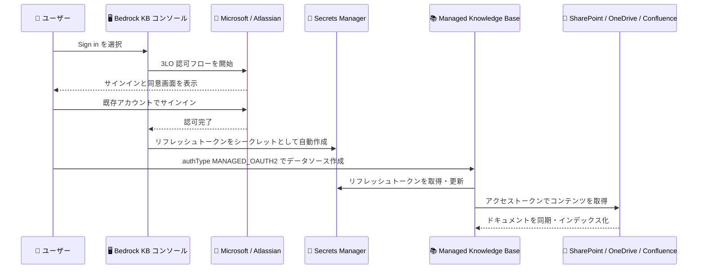

# Amazon Bedrock - Managed Knowledge Base の SharePoint / OneDrive / Confluence 向け user-managed setup (3LO)

**リリース日**: 2026 年 9 月 4 日
**サービス**: Amazon Bedrock (Knowledge Bases)
**機能**: Managed Knowledge Base の SharePoint、OneDrive、Confluence データソース向け user-managed setup (3LO)

📊 [このアップデートのインフォグラフィックを見る](https://takech9203.github.io/aws-news-summary/20260904-amazon-bedrock-managed-knowledge-base-user-managed-setup-sharepoint-onedrive-confluence.html)

## 概要

Amazon Bedrock Managed Knowledge Base が、SharePoint、OneDrive、Confluence データソース向けの user-managed setup (3LO: three-legged OAuth) を発表しました。ユーザーは既存のサードパーティアカウント (Microsoft 365 や Atlassian) でサインインするだけで、Amazon Bedrock Managed Knowledge Base が認証処理を代行し、数分でデータソースの設定を完了できます。

従来のセットアップでは、サードパーティプラットフォーム側で 2LO (two-legged OAuth) のサービスアカウント資格情報を生成する必要があり、これらのシステムの管理者権限を持たないユーザーにとっては時間がかかり、実質的に利用が困難でした。今回のアップデートにより、IT 管理者との調整なしに、SharePoint のドキュメント、OneDrive のファイル、Confluence の Wiki を基盤とした AI アシスタントを迅速にプロトタイピングできるようになります。

なお、既存のサービスアカウント認証 (2LO) は廃止されるわけではなく、本番ワークロード向けのプログラマティックでエンタープライズグレードな選択肢として引き続き利用可能です。今回の 3LO は、個人ユーザーによる迅速な検証・プロトタイピングを補完する位置づけです。

**アップデート前の課題**

- データソース接続には、SharePoint / OneDrive / Confluence 側で 2LO のサービスアカウント資格情報 (アプリ登録、クライアントシークレットなど) を生成する必要があった
- Microsoft Entra ID や Atlassian の管理者権限を持たない一般ユーザーは、IT 管理者に依頼して資格情報を発行してもらう必要があり、セットアップに時間がかかった
- 資格情報を AWS Secrets Manager に手動で登録する作業も必要で、迅速なプロトタイピングの障壁となっていた

**アップデート後の改善**

- 既存のサードパーティアカウントでサインインするだけで、数分でデータソース設定を完了できるようになった
- Secrets Manager のシークレットやテナント ID をユーザー自身で作成・提供する必要がなくなり、Amazon Bedrock Managed Knowledge Base がリフレッシュトークンを保存するシークレットを自動生成するようになった
- 管理者権限がないユーザーでも、自身がアクセスできるコンテンツを対象に AI アシスタントの検証を即座に開始できるようになった

## アーキテクチャ図



ユーザーがコンソールからサインインすると、Amazon Bedrock Managed Knowledge Base が 3LO 認可フローを処理し、リフレッシュトークンを Secrets Manager に自動保存します。以降はサービスがトークンの取得・更新を行い、データソースのコンテンツを同期します。

## サービスアップデートの詳細

### 主要機能

1. **サインインのみで完了するデータソース設定**
   - ユーザーは Amazon Bedrock Knowledge Bases コンソールから既存の Microsoft 365 / Atlassian アカウントでサインインするだけで設定が完了する
   - サービスアカウントの作成、アプリ登録、クライアントシークレットの発行といった管理者作業が不要
   - 対象データソースは SharePoint、OneDrive、Confluence の 3 種類

2. **資格情報の自動管理**
   - サインイン時に Amazon Bedrock Managed Knowledge Base がユーザーの AWS アカウント内にシークレットを自動作成し、3LO リフレッシュトークンを保存する
   - シークレット ARN は `arn:aws:secretsmanager:{region}:{account-id}:secret:bedrock-managedkb-oauth/{prefix}/{connector-type}/{uuid}` の形式で生成される
   - サインイン時にシークレット名のプレフィックスを任意で指定でき、プレフィックス単位でスコープを絞った IAM ポリシーを事前に適用できる (未指定時は `bedrock-managedkb-oauth` プレフィックスを使用)

3. **シークレットの再利用**
   - 作成された 3LO シークレットは特定の Knowledge Base に紐付かず、複数の Knowledge Base をまたいで再利用できる
   - データソース作成時に `authType` を `MANAGED_OAUTH2` に設定して参照する

4. **2LO サービスアカウント認証との併存**
   - 既存の 2LO サービスアカウント認証は本番ワークロード向けの推奨オプションとして引き続き利用可能
   - ドキュメントレベルのアクセス制御 (ACL) が必要な場合は、Microsoft Entra ID App-Only 認証 (2LO) を使用する

## 技術仕様

### 認証方式の比較

| 項目 | user-managed setup (3LO) | サービスアカウント認証 (2LO) |
|------|--------------------------|------------------------------|
| セットアップ | サインインのみ、数分で完了 | 管理者によるアプリ登録・資格情報生成が必要 |
| 必要な権限 | 対象コンテンツへのユーザー自身のアクセス権 | サードパーティ側の管理者権限 |
| シークレット管理 | サービスが自動作成・管理 | ユーザーが Secrets Manager に手動登録 |
| ドキュメントレベル ACL | 非対応 | 対応 (Microsoft Entra ID App-Only 認証) |
| 想定用途 | プロトタイピング、個人検証 | 本番ワークロード、エンタープライズ利用 |

### 要求される委任アクセス許可 (SharePoint の場合)

| アクセス許可 | API | 種類 | 説明 |
|--------------|-----|------|------|
| Sites.Read.All | Microsoft Graph | 委任 | すべてのサイトコレクションのドキュメントとリストアイテムを読み取り |
| User.Read | Microsoft Graph | 委任 | サインインとユーザープロファイルの読み取り |
| offline_access | Microsoft Graph | 委任 | リフレッシュトークンによるアクセスの維持 |
| AllSites.Read | Office 365 SharePoint Online | 委任 | すべてのサイトコレクションのアイテムを読み取り |

### 必要な IAM 権限

`CreateDataSource` を呼び出す IAM プリンシパルには、生成されるシークレットに対する以下の権限が必要です。

```json
{
    "Effect": "Allow",
    "Action": [
        "secretsmanager:CreateSecret",
        "secretsmanager:GetSecretValue"
    ],
    "Resource": [
        "arn:aws:secretsmanager:{region}:{account-id}:secret:bedrock-managedkb-oauth/{your-prefix}/*"
    ]
}
```

Knowledge Base の実行ロールには、トークン更新のためにシークレットへの読み書き権限が必要です。

```json
{
    "Effect": "Allow",
    "Action": [
        "secretsmanager:GetSecretValue",
        "secretsmanager:PutSecretValue"
    ],
    "Resource": [
        "arn:aws:secretsmanager:{region}:{account-id}:secret:bedrock-managedkb-oauth/{your-prefix}/*"
    ]
}
```

## 設定方法

### 前提条件

1. インデックス対象の SharePoint サイト / OneDrive ファイル / Confluence スペースにアクセスできるサードパーティアカウント (Microsoft 365 または Atlassian)
2. Knowledge Base を作成できる Amazon Bedrock へのアクセス権限
3. Amazon Bedrock Knowledge Bases コンソールドメインからのポップアップを許可したブラウザ

### 手順

#### ステップ 1: コンソールからサインイン

Amazon Bedrock Knowledge Bases コンソールでデータソース設定を開始し、[Sign in] を選択します。必要に応じてシークレット名プレフィックスを指定すると、生成されるシークレット ARN にそのプレフィックスが含まれ、スコープを絞った IAM ポリシーを事前に適用できます。

#### ステップ 2: サードパーティアカウントで認証

表示されたサインイン画面で既存の Microsoft 365 / Atlassian アカウントにサインインし、要求されたアクセス許可に同意します。Amazon Bedrock Managed Knowledge Base がリフレッシュトークンを Secrets Manager のシークレットとして自動作成します。

#### ステップ 3: データソースを作成

作成されたシークレットを参照し、`authType` を `MANAGED_OAUTH2` に設定してデータソースを作成します。作成した 3LO シークレットは特定の Knowledge Base に紐付かないため、複数の Knowledge Base で再利用できます。

**テナントが制限されている場合の追加手順**: Microsoft 365 テナントがサードパーティアプリのアクセスを制限している場合、サインイン時にエラーが表示されることがあります。この場合、Microsoft 365 管理者が Amazon Bedrock KB アプリケーションに対して組織全体の管理者同意を一度付与する必要があります。同意はサインイン時の同意ダイアログで [組織に代わって同意する] を選択するか、Microsoft Entra 管理センターの [エンタープライズアプリケーション] から付与できます。

## メリット

### ビジネス面

- **プロトタイピングの高速化**: IT 管理者への依頼や資格情報発行の待ち時間なしに、数分で社内ドキュメントを基盤とした AI アシスタントの検証を開始できる
- **導入障壁の低減**: 管理者権限を持たない現場のユーザーでも、自身がアクセスできるコンテンツで RAG アプリケーションを試せるため、生成 AI 活用の裾野が広がる
- **段階的な本番移行**: 3LO で迅速に検証した後、本番環境ではエンタープライズグレードの 2LO サービスアカウント認証に移行するという段階的なアプローチが取れる

### 技術面

- **資格情報管理の自動化**: シークレットの作成、リフレッシュトークンの保存、アクセストークンの取得・更新をサービスが代行し、手動のシークレット管理が不要になる
- **最小権限の実現**: シークレット名プレフィックスにより、生成されるシークレットへのアクセスをスコープダウンした IAM ポリシーを事前に定義できる
- **シークレットの再利用性**: 一度作成した 3LO シークレットを複数の Knowledge Base で共有でき、データソースごとの重複したセットアップを削減できる

## デメリット・制約事項

### 制限事項

- **ドキュメントレベルのアクセス制御 (ACL) に非対応**: インデックスされたすべてのコンテンツは、Knowledge Base をクエリできるすべてのユーザーからアクセス可能になる。SharePoint 側の個別のアクセス許可は適用されない
- ACL が必要な場合は Microsoft Entra ID App-Only 認証 (2LO) を使用する必要がある
- Microsoft 365 テナントがサードパーティアプリへのユーザー同意を制限している場合、管理者による一度の同意付与が必須となる

### 考慮すべき点

- サインインしたユーザー個人のアクセス権に基づいてコンテンツが取得されるため、Knowledge Base に含めるコンテンツの範囲を慎重に確認する必要がある
- 初回同期後に共有された新しいコンテンツは、再同期を実行するまでインデックスに反映されない
- ブラウザのポップアップブロックやサードパーティ Cookie の無効化により、サインインウィンドウが正常に完了しない場合がある
- 本番ワークロードには AWS が引き続きサービスアカウント認証 (2LO) を推奨しており、3LO はプロトタイピング用途に位置づけられている

## ユースケース

### ユースケース 1: 社内 Wiki を活用した AI アシスタントの迅速な PoC

**シナリオ**: 開発チームが Confluence 上の設計ドキュメントや運用手順を参照できる AI アシスタントを検証したいが、Atlassian の管理者権限を持っておらず、IT 部門への申請には数週間かかる。

**実装例**:
```
1. Bedrock Knowledge Bases コンソールで Confluence データソースを選択
2. user-managed setup を選び、自身の Atlassian アカウントでサインイン
3. アクセス可能なスペースを対象に Knowledge Base を作成
4. RetrieveAndGenerate API で回答品質を検証
```

**効果**: 管理者への依頼なしに当日中に PoC を開始でき、生成 AI 活用の意思決定を数週間短縮できる。

### ユースケース 2: SharePoint の部門ドキュメントを対象とした RAG 検証

**シナリオ**: 営業部門が SharePoint に蓄積された提案書や FAQ を基盤とした社内向け質問応答ボットの実現可能性を評価したい。

**実装例**:
```
1. SharePoint データソースで user-managed setup を選択し
   Microsoft 365 アカウントでサインイン
2. シークレット名プレフィックスを指定し、部門単位で
   スコープダウンした IAM ポリシーを適用
3. 対象サイトを選択して同期・インデックス化
```

**効果**: 部門内のアクセス権限の範囲で安全に検証を進めつつ、IAM ポリシーによるシークレットの統制も維持できる。

### ユースケース 3: 検証から本番への段階的移行

**シナリオ**: 3LO で検証した RAG アプリケーションを全社展開するにあたり、ドキュメントレベルのアクセス制御と安定した運用が求められる。

**実装例**:
```
1. 3LO で構築した Knowledge Base で回答品質・構成を確定
2. 本番環境では Microsoft Entra ID App-Only 認証 (2LO) で
   サービスアカウント資格情報を発行
3. ACL awareness を有効化してドキュメントレベルの
   アクセス制御を適用
```

**効果**: プロトタイプの知見を活かしながら、本番要件であるアクセス制御とエンタープライズグレードの認証に移行できる。

## 料金

本アップデートによる追加料金は発表されていません。Amazon Bedrock Knowledge Bases の利用料金 (ベクトルストア、埋め込みモデル、基盤モデルの推論など) と、自動作成されるシークレットに対する AWS Secrets Manager の料金が適用されます。詳細は各サービスの料金ページを参照してください。

## 利用可能リージョン

公式発表ではリージョンの明記はありません。Amazon Bedrock Knowledge Bases が利用可能なリージョンでの提供が想定されますが、最新の対応状況は公式ドキュメントを確認してください。

## 関連サービス・機能

- **Amazon Bedrock Knowledge Bases**: 本機能の基盤となるマネージド RAG サービス。データソースの同期、インデックス化、検索を提供する
- **AWS Secrets Manager**: 3LO リフレッシュトークンを保存するシークレットが自動作成される。IAM ポリシーによるアクセス制御の対象となる
- **Microsoft Entra ID**: SharePoint / OneDrive の認証基盤。テナントの同意設定や App-Only 認証 (2LO) の管理に使用する
- **AWS IAM**: シークレットへのアクセスをプレフィックス単位でスコープダウンするポリシー定義に使用する

## 参考リンク

- 📊 [インフォグラフィック](https://takech9203.github.io/aws-news-summary/20260904-amazon-bedrock-managed-knowledge-base-user-managed-setup-sharepoint-onedrive-confluence.html)
- [公式発表 (What's New)](https://aws.amazon.com/about-aws/whats-new/2026/09/amazon-bedrock-managed-knowledge-base-user-managed-setup-sharepoint-onedrive-confluence/)
- [ドキュメント: SharePoint user-managed setup](https://docs.aws.amazon.com/bedrock/latest/userguide/kb-managed-sharepoint-3lo-setup.html)
- [ドキュメント: OneDrive user-managed setup](https://docs.aws.amazon.com/bedrock/latest/userguide/kb-managed-onedrive-3lo-setup.html)
- [ドキュメント: Confluence user-managed setup](https://docs.aws.amazon.com/bedrock/latest/userguide/kb-managed-confluence-3lo-setup.html)
- [料金ページ: Amazon Bedrock](https://aws.amazon.com/bedrock/pricing/)

## まとめ

SharePoint、OneDrive、Confluence を対象とした user-managed setup (3LO) により、管理者権限を持たないユーザーでもサインインだけで数分で Knowledge Base のデータソースを設定できるようになりました。ドキュメントレベルの ACL に非対応である点に注意しつつ、プロトタイピングには 3LO、本番ワークロードにはサービスアカウント認証 (2LO) という使い分けを推奨します。社内ドキュメントを活用した RAG アプリケーションの検証を検討している場合は、まず本機能で迅速に価値を確認することをお勧めします。
