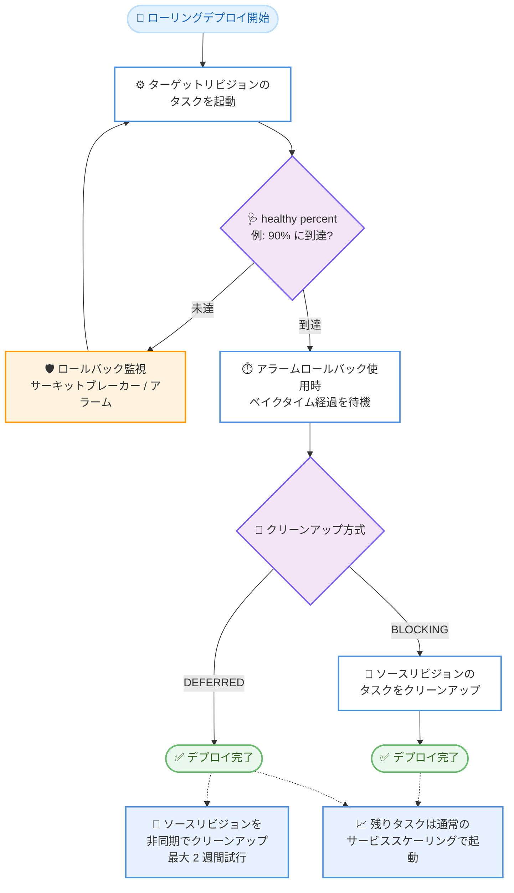

# Amazon ECS - サービスデプロイの Early Success Criteria

**リリース日**: 2026 年 9 月 4 日
**サービス**: Amazon Elastic Container Service (Amazon ECS)
**機能**: Early Success Criteria for service deployments (ローリングデプロイの早期成功判定)

📊 [このアップデートのインフォグラフィックを見る](https://takech9203.github.io/aws-news-summary/20260904-amazon-ecs-deployments-early-success.html)

## 概要

Amazon ECS が、ローリングデプロイ戦略を使用するサービスデプロイにおいて Early Success Criteria (早期成功基準) をサポートしました。これにより、デプロイを「成功」と見なす条件を、ワークロードの運用要件と信頼度に基づいて柔軟に定義できるようになります。

具体的には、healthy percent (デプロイ成功と見なすために必要な、ターゲットリビジョン上で実行中かつ正常なタスクの割合) を設定できます。例えば desired count が 100 のサービスで healthy percent を 90% に設定すると、90 タスクが正常になった時点でデプロイが完了し、残りのタスクはデプロイのライフサイクル外で通常のサービススケーリングによって起動されます。GPU 推論のように容量制約のある特殊なハードウェア上で動作するワークロードや、CI/CD パイプラインの待ち時間を短縮したいチームにとって特に有用なアップデートです。

さらに、ソースリビジョン (旧リビジョン) のタスククリーンアップ方式として BLOCKING (クリーンアップ完了後にデプロイ成功) と DEFERRED (デプロイ成功後に非同期でクリーンアップ) を選択できます。

**アップデート前の課題**

- ローリングデプロイは、ターゲットリビジョンのタスクが desired count の 100% に到達し、すべて正常になるまで完了しなかった
- GPU インスタンスなど容量制約のある環境では、一部のタスク起動に時間がかかり、デプロイ全体が長時間ブロックされていた
- 長時間接続を持つタスクやスケールイン保護されたタスクのドレインが遅い場合、デプロイが完了せず、CI/CD パイプラインや後続のデプロイが待たされていた
- デプロイサーキットブレーカーや CloudWatch アラームによるロールバック監視の期間を、ワークロードに合わせて制御することが難しかった

**アップデート後の改善**

- healthy percent を設定することで、指定した割合のタスクが正常になった時点でデプロイを早期に完了できるようになった
- 残りのタスクはデプロイ外の通常のサービススケーリングで起動されるため、容量制約下でもパイプラインをブロックしなくなった
- DEFERRED クリーンアップにより、旧リビジョンのタスクのドレインを待たずにデプロイを完了し、非同期でクリーンアップできるようになった
- ロールバック監視 (サーキットブレーカー / CloudWatch アラーム) が適用される期間を、自分で定義した健全性レベルに到達するまでに限定できるようになった

## アーキテクチャ図



Early Success Criteria を有効にしたローリングデプロイのフローです。healthy percent に到達した時点で成功判定が行われ、BLOCKING では旧リビジョンのクリーンアップ完了後に、DEFERRED ではクリーンアップを待たずにデプロイが完了します。

## サービスアップデートの詳細

### 主要機能

1. **healthy percent による早期成功判定**
   - `earlySuccessCriteria.healthyPercent` で、デプロイ成功と見なすために必要な正常タスクの割合を desired count に対するパーセンテージで指定
   - 必要タスク数は切り上げで計算 (例: desired count 3 で 50% の場合は 2 タスク)
   - タスクの「正常」判定は、サービスに設定したヘルスチェックに基づく
   - 設定可能な値はサービスの `minimumHealthyPercent` 以上 100 以下
   - 残りのタスクは、デプロイ完了後に通常のサービススケーリングによってデプロイ外で起動される

2. **ソースリビジョンのクリーンアップ方式 (BLOCKING / DEFERRED)**
   - `earlySuccessCriteria.sourceServiceRevisionCleanup` で指定
   - BLOCKING: ソースリビジョンのタスククリーンアップ完了後にデプロイを成功と判定 (従来に近い動作)
   - DEFERRED: 成功基準を満たした時点でデプロイを完了し、旧タスクのクリーンアップは非同期で実行 (最大 2 週間試行)
   - DEFERRED は、長時間接続を持つサービスやタスクスケールイン保護を使用するサービスで、旧タスクの継続実行がデプロイをブロックしないようにするために有効

3. **ロールバック監視期間の制御**
   - デプロイサーキットブレーカーおよび CloudWatch アラームによるロールバックは、デプロイ進行中 (成功基準を満たすまで) に適用される
   - デプロイ完了後は、残りのタスクのスケールアウト中も含めてロールバックは行われない
   - ロールバック監視をどこまで適用するかを、healthy percent の設定によって実質的に制御できる

4. **既存の運用ツールとの整合性**
   - `DescribeServiceDeployments` でデプロイステータスと設定した Early Success Criteria を確認可能 (進行中はライブのタスク数、完了後は完了時点のスナップショット)
   - ライブのタスク数の確認には `DescribeServices` を使用
   - 早期完了したデプロイも `ListServiceDeployments` の `SUCCESSFUL` フィルタに含まれる
   - デプロイの状態変更イベントおよび AWS CloudTrail の記録は、標準の `IN_PROGRESS` から `SUCCESSFUL` へのライフサイクルを示し、新しいデプロイステータスは追加されない

## 技術仕様

### Early Success Criteria の設定項目

| 項目 | 詳細 |
|------|------|
| 対象デプロイ戦略 | ローリングデプロイ (`ROLLING`) |
| `earlySuccessCriteria.enable` | Early Success Criteria の有効化フラグ |
| `earlySuccessCriteria.healthyPercent` | 成功判定に必要な正常タスクの割合。`minimumHealthyPercent` 以上 100 以下。切り上げで計算 |
| `earlySuccessCriteria.sourceServiceRevisionCleanup` | `BLOCKING` または `DEFERRED` |
| DEFERRED のクリーンアップ試行期間 | デプロイ完了後、最大 2 週間 |
| 成功判定の前提 | ターゲットリビジョンで少なくとも 1 タスクが正常になってから healthy percent を評価 |
| 設定手段 | AWS Management Console、AWS CLI、AWS SDK、IaC ツール |

### healthy percent の計算例

| desired count | healthy percent | 必要な正常タスク数 (切り上げ) |
|---------------|-----------------|-------------------------------|
| 2 | 50 | 1 |
| 3 | 50 | 2 |
| 10 | 80 | 8 |
| 100 | 90 | 90 |
| 10 | 100 | 10 |

### API 変更履歴

| 日付 | サービス | 変更内容 |
|------|----------|----------|
| 2026/08/28 | [Amazon EC2 Container Service](https://awsapichanges.com/archive/changes/b6cdac-ecs.html) | 5 updated api methods - ECS ローリングデプロイの Early Success Criteria サポートを追加。設定可能な割合のタスクが正常になった時点でデプロイを完了でき、旧サービスリビジョンのクリーンアップ方式として BLOCKING (必須) または DEFERRED (非同期) を選択可能 |

## 設定方法

### 前提条件

1. Amazon ECS サービスがローリングデプロイ戦略 (`ROLLING`) を使用していること
2. healthy percent の判定に使用するヘルスチェック (コンテナヘルスチェックまたは ELB ヘルスチェック) がサービスに設定されていること
3. healthy percent はサービスの `minimumHealthyPercent` 以上 100 以下で設定すること

### 手順

#### ステップ 1: 既存サービスに Early Success Criteria を設定する

```bash
aws ecs update-service \
    --cluster MyCluster \
    --service MyService \
    --deployment-configuration '{
        "strategy": "ROLLING",
        "earlySuccessCriteria": {
            "enable": true,
            "healthyPercent": 90,
            "sourceServiceRevisionCleanup": "BLOCKING"
        }
    }'
```

`update-service` の `--deployment-configuration` パラメータで Early Success Criteria を有効化し、healthy percent を 90%、クリーンアップ方式を BLOCKING に設定しています。新規サービスの場合は `create-service` で同じパラメータを指定します。コンソールの場合は、サービスの作成 / 更新フローの「デプロイ設定」で Early Success Criteria をオンにし、Healthy percent とクリーンアップ方式 (Blocking / Deferred) を選択します。

#### ステップ 2: デプロイの状況と成功判定を確認する

```bash
aws ecs describe-service-deployments \
    --service-deployment-arns <deployment-arn>
```

デプロイのステータスと、設定した Early Success Criteria を確認しています。デプロイ進行中はライブのタスク数が返され、完了後は完了時点のスナップショットが返されます。

#### ステップ 3: デプロイ完了後のタスク状況を監視する

```bash
aws ecs describe-services \
    --cluster MyCluster \
    --services MyService
```

サービスのライブなタスク数を確認しています。DEFERRED を使用している場合は、ソースリビジョンのタスクが非同期でクリーンアップされる様子をこのコマンドで監視できます。

## メリット

### ビジネス面

- **デリバリー速度の向上**: デプロイが早期に完了するため、CI/CD パイプライン、後続のデプロイ、依存する運用作業の待ち時間を短縮できる
- **GPU など希少リソースの制約を吸収**: ハードウェア可用性によりタスク起動が遅れても、パイプライン全体が長時間ブロックされることを回避できる
- **CI/CD ツールのタイムアウト対策**: 旧タスクのドレインが長引くケース (long-tail) でも、DEFERRED によりツール側の時間制限内にデプロイを完了できる

### 技術面

- **成功判定の柔軟な制御**: ワークロードへの信頼度に応じて、100% を待たずにデプロイを完了する基準を定義できる
- **ロールバック監視期間の明確化**: サーキットブレーカー / CloudWatch アラームによる保護を「自分が定義した健全性レベルに到達するまで」に限定できる
- **旧リビジョンの安全な非同期ドレイン**: 長時間接続やタスクスケールイン保護を使用するサービスでも、旧タスクを稼働させたままデプロイを完了できる
- **既存の運用フローとの互換性**: 新しいデプロイステータスは追加されず、既存のイベント / CloudTrail / API との整合性が保たれる

## デメリット・制約事項

### 制限事項

- 対象はローリングデプロイ戦略のみ (Blue/Green デプロイは対象外)
- healthy percent はサービスの `minimumHealthyPercent` 以上 100 以下に制限される
- DEFERRED のクリーンアップ試行は最大 2 週間で、タスクスケールイン保護などにより 2 週間を超えて保護されたタスクは ECS がクリーンアップできない
- デプロイ完了後の残りタスクのスケールアウトには、サーキットブレーカー / アラームによるロールバック保護が適用されない

### 考慮すべき点

- デプロイ完了後はロールバックできない (デプロイを停止できない) ため、ターゲットリビジョンが健全であると確信できる割合に healthy percent を設定する必要がある
- DEFERRED 使用時は、ソースリビジョンのタスクが残留していないか `DescribeServices` で監視する運用を組み込むことが望ましい
- `DescribeServiceDeployments` のタスク数はデプロイ完了後スナップショットになるため、ライブの状態確認には `DescribeServices` を使用する必要がある

## ユースケース

### ユースケース 1: GPU 推論サービスのデプロイ時間短縮

**シナリオ**: GPU インスタンス上で ML 推論サービスを desired count 20 で運用している。GPU 容量の制約により一部のタスク起動に時間がかかり、デプロイが数時間ブロックされることがある。

**実装例**:
```json
{
    "strategy": "ROLLING",
    "earlySuccessCriteria": {
        "enable": true,
        "healthyPercent": 80,
        "sourceServiceRevisionCleanup": "BLOCKING"
    }
}
```

**効果**: 16 タスク (80%) が正常になった時点でデプロイが完了し、残り 4 タスクは GPU 容量が確保でき次第、通常のサービススケーリングで起動される。CI/CD パイプラインの待ち時間を大幅に短縮できる。

### ユースケース 2: 長時間接続を持つサービスの非同期ドレイン

**シナリオ**: WebSocket ベースのリアルタイム通信サービスで、旧リビジョンのタスクが接続をドレインするまで数時間かかる。CI/CD ツールにはジョブのタイムアウト制限があり、デプロイが失敗扱いになることがある。

**実装例**:
```json
{
    "strategy": "ROLLING",
    "earlySuccessCriteria": {
        "enable": true,
        "healthyPercent": 100,
        "sourceServiceRevisionCleanup": "DEFERRED"
    }
}
```

**効果**: 新リビジョンのタスクがすべて正常になった時点でデプロイが完了し、旧タスクは接続をドレインしながら非同期でクリーンアップされる。CI/CD ツールのタイムアウトを回避しつつ、既存接続を切断せずに安全に移行できる。

### ユースケース 3: 大規模サービスの連続デプロイ

**シナリオ**: desired count 100 の大規模 Web サービスで 1 日に複数回デプロイを実施している。全タスクの入れ替え完了を待つと後続のデプロイが詰まり、リリースサイクルが遅延する。

**実装例**:
```bash
aws ecs update-service \
    --cluster ProdCluster \
    --service WebService \
    --deployment-configuration '{
        "strategy": "ROLLING",
        "earlySuccessCriteria": {
            "enable": true,
            "healthyPercent": 90,
            "sourceServiceRevisionCleanup": "BLOCKING"
        }
    }'
```

**効果**: 90 タスクが正常になった時点でデプロイが完了し、サーキットブレーカーと CloudWatch アラームによる保護もその時点まで適用される。後続のデプロイを早期に開始でき、リリースサイクル全体のスループットが向上する。

## 料金

Early Success Criteria 自体に追加料金はありません。Amazon ECS の料金は従来どおり、起動タイプに応じた課金です。

- AWS Fargate: タスクが使用する vCPU、メモリ、ストレージに対する課金
- Amazon EC2 起動タイプ: 使用する EC2 インスタンスに対する課金 (ECS 自体は無料)

詳細は [Amazon ECS の料金ページ](https://aws.amazon.com/ecs/pricing/) を参照してください。

## 利用可能リージョン

すべての AWS 商用リージョンおよび AWS GovCloud (US) リージョンで利用可能です。

## 関連サービス・機能

- **Amazon ECS デプロイサーキットブレーカー**: デプロイ失敗を自動検出してロールバックする機能。Early Success Criteria の成功判定までの期間に適用される
- **Amazon CloudWatch アラームによるロールバック**: アラームに基づくデプロイのロールバック機能。ベイクタイムの経過が早期成功判定の条件に含まれる
- **タスクスケールイン保護**: 処理中のタスクを終了から保護する機能。DEFERRED クリーンアップと組み合わせることで、保護されたタスクがデプロイをブロックしなくなる
- **AWS CodePipeline / CI/CD ツール**: デプロイの早期完了により、パイプラインの後続ステージの待ち時間を短縮できる

## 参考リンク

- 📊 [インフォグラフィック](https://takech9203.github.io/aws-news-summary/20260904-amazon-ecs-deployments-early-success.html)
- [公式発表 (What's New)](https://aws.amazon.com/about-aws/whats-new/2026/09/amazon-ecs-deployments-early-success/)
- [ドキュメント: Complete Amazon ECS rolling deployments early with early success criteria](https://docs.aws.amazon.com/AmazonECS/latest/developerguide/early-success-criteria.html)
- [Amazon ECS 製品ページ](https://aws.amazon.com/ecs/)
- [料金ページ](https://aws.amazon.com/ecs/pricing/)

## まとめ

Amazon ECS の Early Success Criteria により、ローリングデプロイの成功条件をワークロードの特性に合わせて定義できるようになり、GPU 推論などの容量制約下や長時間接続を持つサービスでのデプロイ遅延を解消できます。デプロイ完了後はロールバック保護が適用されなくなるため、まずは信頼度の高い healthy percent (例: 90%) と BLOCKING クリーンアップから導入し、ドレインが長いサービスでは DEFERRED の活用を検討することを推奨します。
