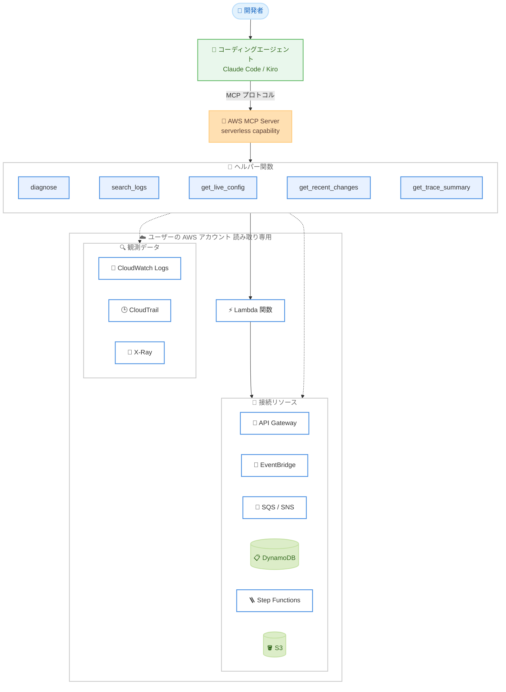

# AWS MCP Server - AWS Lambda 関数向け serverless capability の追加

**リリース日**: 2026 年 9 月 4 日
**サービス**: AWS MCP Server (Agent Toolkit for AWS)
**機能**: Serverless capability for AWS Lambda functions

📊 [このアップデートのインフォグラフィックを見る](https://takech9203.github.io/aws-news-summary/20260904-aws-mcp-server-serverless.html)

## 概要

AWS MCP Server に serverless capability が追加されました。この機能により、Claude Code や Kiro などのコーディングエージェントが、AWS Lambda 関数とその接続リソースの問題を効率的に診断できるようになります。エージェントは Lambda 関数に加えて、Amazon API Gateway、Amazon EventBridge、Amazon S3、Amazon DynamoDB、Amazon SNS、Amazon SQS、AWS Step Functions といった接続リソースを検査し、「なぜこの Lambda 関数が失敗しているのか」「障害の前に何か変更があったか」「問題はコード、設定、AWS 依存関係のどこにあるのか」といった質問に答えられます。

serverless capability は、エラーシグナルを過去 7 日間のベースラインと相関分析して変化点を特定し、繰り返し発生するエラーを表面化してトレンドを把握し、関数と接続リソースのデプロイ済み設定や最近の変更のタイムラインを取得し、接続サービス間のレイテンシーを分析します。単一の呼び出しで包括的な診断データが構造化された形式で返されるため、エージェントが複数の API 呼び出しをオーケストレーションする場合と比較してトークン消費が少なく済む点も特長です。

本機能は追加料金なしで利用でき、Solutions Architect やサーバーレスアプリケーションの開発・運用に携わるエンジニアにとって、AI エージェントを活用した障害調査のワークフローを大きく効率化するアップデートです。

**アップデート前の課題**

- 以前は、エージェントが Lambda 関数の問題を調査する際、CloudWatch Logs、CloudTrail、X-Ray、各サービスの設定 API など複数の API を個別に呼び出してオーケストレーションする必要があった
- 複数回の API 呼び出しと生データの解析により、エージェントのトークン消費が多く、コンテキストウィンドウを圧迫していた
- Lambda 関数単体ではなく、SQS の可視性タイムアウトや DynamoDB のスロットリングなど接続リソース側に起因する問題の切り分けには、サービス横断の知識と手動の相関分析が必要だった
- 「障害の前に何が変わったか」を特定するには、CloudTrail イベントや CloudFormation のデプロイ履歴を人手で突き合わせる必要があった

**アップデート後の改善**

- 単一の呼び出しで、ヘルスチェック、7 日間ベースラインとのメトリクス比較、トリガー・宛先の検出、接続リソース横断の根本原因分析を含む包括的な診断結果を取得できるようになった
- ログは例外タイプごとにグループ化された構造化サマリーとして返されるため、エージェントのコンテキストウィンドウを圧迫せずに繰り返し発生するエラーパターンを把握できるようになった
- CloudTrail、Lambda API、CloudFormation を情報源とする変更タイムラインにより、「誰が」「どの設定を」「どの値からどの値へ」変更したかを即座に確認できるようになった
- X-Ray トレースのサマリーにより、ダウンストリーム呼び出しのうちレイテンシーやエラーが集中している箇所を特定できるようになった

## アーキテクチャ図



コーディングエージェントは MCP プロトコル経由で AWS MCP Server の serverless capability を呼び出し、ヘルパー関数群がユーザーの AWS アカウント内の Lambda 関数、接続リソース、観測データを読み取り専用で検査して、構造化された診断結果を単一の呼び出しで返します。

## サービスアップデートの詳細

### 主要機能

serverless capability は、エージェントがタスクに応じて自動的に発見・呼び出す以下のヘルパー関数を提供します。手動でのセットアップは不要で、「この Lambda 関数が失敗している原因を調べて」のように目的を伝えるだけで、エージェントが適切なツールを選択します。

1. **diagnose (統合診断)**
   - Lambda 関数と接続リソースのヘルスチェックとルールベース診断を単一呼び出しで返す
   - メトリクスを過去 7 日間のベースラインと比較して異常を表面化
   - Lambda のトリガーと宛先を自動検出し、接続リソース横断で根本原因分析を実施 (例: 「DynamoDB のスロットリングが Lambda の呼び出しエラーを引き起こしている」)
   - ログ・トレース・設定を個別に調査しなくても、エージェントに解決の出発点を提供

2. **search_logs (ログ検索)**
   - Amazon CloudWatch Logs から Lambda 関数の最近のログ証跡を取得
   - ログメッセージを共通の例外タイプと代表的なエラー行にグループ化した構造化サマリーを返却
   - エージェントのコンテキストウィンドウを圧迫せずに、繰り返し発生する例外や障害パターンを表面化

3. **get_live_config (デプロイ済み設定の取得)**
   - Lambda 関数と接続リソースのデプロイ済み設定を、リソースタイプを問わず一貫した構造とフィールド名で返却
   - ランタイム、メモリ、タイムアウト、同時実行数、イベントソースマッピング、接続リソースの設定をカバー
   - 設定ドリフトの検出 (タイムアウトが短すぎる、予約済み同時実行数の枯渇、SQS 可視性タイムアウトの不整合、デッドレターキューの欠落など) やデプロイ反映の確認に活用可能

4. **get_recent_changes (変更タイムライン)**
   - AWS CloudTrail、Lambda API、AWS CloudFormation を情報源として、最近のデプロイと設定変更のタイムラインを返却
   - 各エントリに変更者、変更された設定、変更前後の値を含む
   - CloudFormation スタックの一部としてデプロイされた関数の場合、スタックのデプロイイベントもタイムラインに含まれる

5. **get_trace_summary (トレースサマリー)**
   - AWS X-Ray の最近のトレース (デフォルトで直近 30 分間) をサンプリングして要約
   - レイテンシーとエラーが最も多いダウンストリーム呼び出しを特定 (例: 「30 秒の Lambda 呼び出しのうち DynamoDB Query が 24 秒を消費している」)
   - 利用には対象関数で X-Ray トレースの有効化が必要

## 技術仕様

### serverless capability の仕様

| 項目 | 詳細 |
|------|------|
| 対応エージェント | Claude Code、Kiro などの MCP 対応コーディングエージェント |
| 診断対象 | Lambda 関数および接続リソース |
| 対応する接続リソース | Amazon API Gateway (REST / HTTP)、Amazon EventBridge、Amazon S3、Amazon DynamoDB (GSI 単位の分析を含む)、Amazon SNS、Amazon SQS、AWS Step Functions |
| アクセス範囲 | 呼び出し元自身のアカウントにスコープされ、読み取り専用 |
| ベースライン分析 | 過去 7 日間のメトリクスベースラインとの比較 |
| トレース分析 | X-Ray トレースを直近 30 分間 (デフォルト) からサンプリング |
| 情報源 | CloudWatch Logs、CloudTrail、X-Ray、Lambda API、CloudFormation |
| 提供形態 | Agent Toolkit for AWS 経由またはスタンドアロンインストール |
| MCP Server の稼働リージョン | 米国東部 (バージニア北部)、欧州 (フランクフルト) |
| アクセス可能なサービスのリージョン | 全 AWS 商用リージョン |
| 料金 | 追加料金なし |

## 設定方法

### 前提条件

1. AWS CLI がインストール済みで、対象アカウントの認証情報が設定されていること
2. Claude Code や Kiro などの MCP 対応コーディングエージェントを利用していること
3. トレース分析 (get_trace_summary) を利用する場合は、対象の Lambda 関数で X-Ray トレースが有効化されていること

### 手順

#### ステップ 1: AWS MCP Server のセットアップ

```bash
aws configure agent-toolkit
```

AWS CLI から Agent Toolkit の設定コマンドを実行し、利用中のコーディングエージェントに AWS MCP Server を構成します。Agent Toolkit for AWS を経由せず、AWS MCP Server を直接有効化することも可能です。

#### ステップ 2: エージェントからの診断依頼

```text
この Lambda 関数 my-order-processor が失敗している原因を調べてください
```

エージェントに調査したい結果 (アウトカム) を自然言語で伝えます。エージェントが serverless capability を自動的に発見し、diagnose や search_logs などの適切なヘルパー関数を選択して呼び出します。ツールを個別に指定する必要はありません。

#### ステップ 3: 診断結果に基づく修正

エージェントが返す根本原因分析 (例: 接続リソースのスロットリング、設定ドリフト、直近のデプロイによる変更) を確認し、コードや設定の修正を進めます。修正後は get_live_config でデプロイの反映を確認できます。

## メリット

### ビジネス面

- **障害調査時間の短縮**: 単一呼び出しで根本原因分析まで得られるため、サーバーレスアプリケーションの MTTR (平均復旧時間) を短縮できる
- **追加コストなし**: serverless capability は追加料金なしで利用でき、既存の AI エージェント投資の価値を高められる
- **スキルギャップの緩和**: サービス横断の相関分析を capability が担うため、サーバーレス特有の運用知識が浅いメンバーでも効果的な調査が可能になる

### 技術面

- **トークン効率**: 包括的なデータが単一呼び出しで構造化されて返るため、複数 API のオーケストレーションと比較してトークン消費が少ない
- **読み取り専用で安全**: capability は呼び出し元アカウントにスコープされた読み取り専用の設計であり、診断時に意図しない変更が発生しない
- **一貫した構造化データ**: リソースタイプを問わず一貫した構造とフィールド名で設定が返るため、エージェントによる解析精度が向上する
- **変更履歴の自動相関**: CloudTrail、Lambda API、CloudFormation の情報が統合されたタイムラインとして提供され、「何が変わったか」の特定が容易になる

## デメリット・制約事項

### 制限事項

- 診断対象は呼び出し元自身のアカウントに限定され、クロスアカウントの診断には対応しない
- get_trace_summary の利用には対象関数での X-Ray トレースの有効化が必要
- 接続リソースの診断対象は API Gateway、EventBridge、S3、DynamoDB、SNS、SQS、Step Functions に限られる
- MCP Server 自体の稼働リージョンは米国東部 (バージニア北部) と欧州 (フランクフルト) の 2 リージョン

### 考慮すべき点

- 読み取り専用の診断機能であり、問題の修正 (設定変更やコードデプロイ) はエージェントの他のツールや手動操作で行う必要がある
- MCP Server が米国と欧州で稼働するため、組織のデータ所在地ポリシーによっては利用可否の確認が必要
- エージェントに付与する AWS 認証情報の権限は、最小権限の原則に沿って設計することが推奨される

## ユースケース

### ユースケース 1: 本番障害時の迅速な根本原因特定

**シナリオ**: 注文処理を担う Lambda 関数のエラー率が急上昇し、オンコール担当者が原因を特定する必要がある。

**実装例**:
```text
エージェントへの依頼:
「Lambda 関数 order-processor のエラー率が上がっています。原因を調査してください」

エージェントの動作:
1. diagnose で 7 日間ベースラインとの比較と接続リソース横断の根本原因分析を実行
2. search_logs で例外タイプごとにグループ化されたエラーサマリーを取得
3. 「DynamoDB のスロットリングが Lambda 呼び出しエラーの原因」と特定
```

**効果**: 複数コンソールを行き来する手動調査と比較して、根本原因の特定までの時間を大幅に短縮できる。

### ユースケース 2: デプロイ起因の障害の切り分け

**シナリオ**: 深夜のデプロイ後から Lambda 関数の挙動が不安定になり、コード・設定・依存サービスのどこに問題があるかを切り分けたい。

**実装例**:
```text
エージェントへの依頼:
「昨夜のデプロイ以降、payment-handler が不安定です。何が変わったか調べてください」

エージェントの動作:
1. get_recent_changes で CloudTrail / CloudFormation ベースの変更タイムラインを取得
2. 変更者、変更された設定、変更前後の値を確認
3. get_live_config で現在のデプロイ済み設定 (タイムアウト、同時実行数など) を検証
```

**効果**: 「障害の前に何が変わったか」を変更前後の値付きで即座に把握でき、ロールバック判断を迅速化できる。

### ユースケース 3: レイテンシーボトルネックの特定

**シナリオ**: API Gateway 経由で呼び出される Lambda 関数のレスポンスが遅く、タイムアウトが散発している。どのダウンストリーム呼び出しがボトルネックかを特定したい。

**実装例**:
```text
エージェントへの依頼:
「api-backend 関数のレイテンシーが高い原因を特定してください」

エージェントの動作:
1. get_trace_summary で直近 30 分の X-Ray トレースをサンプリング
2. レイテンシーとエラーが集中するダウンストリーム呼び出しを特定
   (例: 30 秒の呼び出しのうち DynamoDB Query が 24 秒を消費)
3. get_live_config でタイムアウト設定や DynamoDB の GSI 設定を確認
```

**効果**: サービス間のレイテンシー分析が自動化され、ボトルネックとなる呼び出しをピンポイントで特定できる。

## 料金

serverless capability による診断機能は追加料金なしで利用できます。ただし、診断対象となる Lambda、CloudWatch、X-Ray、CloudTrail などの各サービスの利用には、それぞれの通常料金が適用されます。

## 利用可能リージョン

- **MCP Server の稼働リージョン**: 米国東部 (バージニア北部)、欧州 (フランクフルト)
- **アクセス可能なサービス**: すべての AWS 商用リージョンのサービスにアクセス可能

## 関連サービス・機能

- **Agent Toolkit for AWS**: AWS MCP Server を含む、AI コーディングエージェント向けのツール群。`aws configure agent-toolkit` でセットアップ可能
- **AWS Lambda**: 本 capability の主要な診断対象となるサーバーレスコンピューティングサービス
- **Amazon CloudWatch / AWS X-Ray / AWS CloudTrail**: 診断の情報源となる観測・監査サービス。ログの構造化サマリー、トレース分析、変更タイムラインに利用される
- **Kiro**: AWS が提供する AI 搭載 IDE。本 capability に対応するコーディングエージェントの 1 つ

## 参考リンク

- 📊 [インフォグラフィック](https://takech9203.github.io/aws-news-summary/20260904-aws-mcp-server-serverless.html)
- [公式発表 (What's New)](https://aws.amazon.com/about-aws/whats-new/2026/09/aws-mcp-server-serverless/)
- [AWS MCP Server ドキュメント](https://docs.aws.amazon.com/agent-toolkit/latest/userguide/mcp-server.html)
- [AWS MCP Server の Capabilities](https://docs.aws.amazon.com/agent-toolkit/latest/userguide/capabilities.html)
- [AWS MCP Server 入門ガイド](https://docs.aws.amazon.com/agent-toolkit/latest/userguide/getting-started-aws-mcp-server.html)
- [Agent Toolkit for AWS](https://aws.amazon.com/products/developer-tools/agent-toolkit-for-aws/)

## まとめ

AWS MCP Server の serverless capability により、コーディングエージェントが Lambda 関数と接続リソースの障害を単一呼び出しで診断できるようになり、トークン効率と調査速度の両面で AI 主導のトラブルシューティングが大きく前進しました。Claude Code や Kiro を利用中のサーバーレス開発チームは、`aws configure agent-toolkit` で AWS MCP Server をセットアップし、追加料金なしで利用できる本機能を障害調査ワークフローに組み込むことを推奨します。
