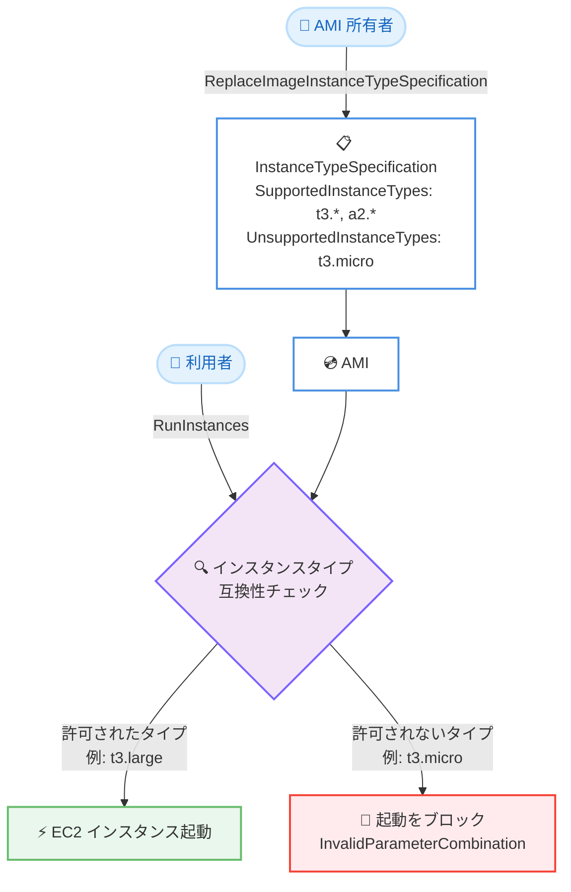

# Amazon EC2 - AMI への互換インスタンスタイプ指定のサポート

**リリース日**: 2026 年 9 月 4 日
**サービス**: Amazon EC2 (Amazon Elastic Compute Cloud)
**機能**: AMI 許可インスタンスタイプ (AMI Allowed Instance Types / InstanceTypeSpecification)

📊 [このアップデートのインフォグラフィックを見る](https://takech9203.github.io/aws-news-summary/20260904-ec2-images-supported-instances.html)

## 概要

Amazon EC2 が、AMI 所有者による互換インスタンスタイプの定義をサポートしました。AMI 所有者は、AMI がサポートするインスタンスタイプ (SupportedInstanceTypes)、サポートしないインスタンスタイプ (UnsupportedInstanceTypes)、またはその両方を AMI の属性として指定できます。許可されていないインスタンスタイプでの起動リクエストは、EC2 が起動時に自動的にブロックし、エラーを返します。

この機能により、AMI 所有者は非互換なインスタンスタイプでの起動を防止する組み込みの仕組みを手に入れ、インスタンスタイプと AMI の組み合わせ不一致による起動失敗の可能性を低減できます。たとえば、GPU ドライバーを含む AMI を GPU インスタンスタイプのみに制限したり、特定のインスタンスファミリーと非互換な AMI からそのファミリーを除外したりできます。組織内で AMI を共有するプラットフォームチームや、AMI を配布する ISV / ソフトウェアベンダーにとって特に有用です。

デフォルトでは AMI は引き続きすべてのインスタンスタイプで起動可能であり、制限を明示的に適用するまで既存のワークフローには影響しません。本機能はすべての AWS リージョンで追加料金なしで利用できます。

**アップデート前の課題**

- AMI 所有者が AMI と互換性のあるインスタンスタイプを技術的に強制する手段がなく、README やドキュメントなどでの周知に頼るしかなかった
- 利用者が非互換なインスタンスタイプ (例: GPU ドライバー前提の AMI を GPU 非搭載インスタンスで起動) を選択した場合、起動後の初期化失敗やアプリケーション障害として顕在化し、原因特定に時間を要した
- 共有 AMI や組織標準のゴールデン AMI において、想定外のインスタンスタイプでの利用を防ぐガードレールを AMI 側に持たせられなかった

**アップデート後の改善**

- AMI の `InstanceTypeSpecification` 属性でサポート対象/対象外のインスタンスタイプを宣言でき、EC2 が起動時に強制 (ハードブロック) するようになった
- ワイルドカード (`t3.*`、`*.12xlarge` など) により、多数のインスタンスタイプを個別に列挙せずパターンで指定できるようになった
- 許可されていないインスタンスタイプでの起動は `InvalidParameterCombination` エラーで即座に失敗するため、起動後に問題が顕在化する前に不一致を検出できるようになった
- `CopyImage` による AMI コピー時にも指定が引き継がれ、一貫したガードレールを維持できるようになった

## アーキテクチャ図



AMI 所有者が `InstanceTypeSpecification` を設定すると、EC2 は起動時に指定インスタンスタイプの互換性を評価し、許可されていない組み合わせの起動をブロックします。

## サービスアップデートの詳細

### 主要機能

1. **InstanceTypeSpecification 属性による互換性の宣言**
   - AMI に `SupportedInstanceTypes` (サポート対象) と `UnsupportedInstanceTypes` (サポート対象外) の 2 つのリストを設定できる
   - `SupportedInstanceTypes` のみを設定した場合、指定したインスタンスタイプのみが起動を許可され、それ以外はすべてブロックされる
   - `UnsupportedInstanceTypes` のみを設定した場合、指定したインスタンスタイプを除くすべてが許可される
   - 両方を設定した場合、`SupportedInstanceTypes` に含まれ、かつ `UnsupportedInstanceTypes` に含まれないインスタンスタイプのみが許可される

2. **ワイルドカードによるパターン指定**
   - 両リストとも `*` を使用したワイルドカードパターンをサポートする
   - `t3.*` のようにファミリー単位、`*.12xlarge` のようにサイズ単位での指定が可能で、個別列挙の手間を削減できる

3. **起動時の自動エンフォース**
   - `RunInstances` などによる起動時に、EC2 が指定インスタンスタイプと AMI の互換性をチェックする
   - 許可されないインスタンスタイプの場合、起動はハードブロックされ `InvalidParameterCombination` エラーが返る
   - 制限は新規起動にのみ適用され、既存の稼働中インスタンスには影響しない

4. **デフォルト動作の維持 (オプトイン方式)**
   - `InstanceTypeSpecification` が未設定の AMI は、従来どおりすべてのインスタンスタイプで起動可能
   - 制限を明示的に適用するまで既存ワークフローは影響を受けない

5. **AMI コピー時の指定の引き継ぎ**
   - `CopyImage` で AMI をコピーすると、コピー先の AMI にもインスタンスタイプ指定が保持される

## 技術仕様

### 評価ロジック

| InstanceTypeSpecification の設定状態 | 起動可能なインスタンスタイプ |
|------|------|
| 未設定 (デフォルト) | すべてのインスタンスタイプ |
| SupportedInstanceTypes のみ | リストに一致するインスタンスタイプのみ |
| UnsupportedInstanceTypes のみ | リストに一致するものを除くすべて |
| 両方を設定 | Supported に一致し、かつ Unsupported に一致しないもの |

### ワイルドカードパターンの例

| パターン | マッチ対象 |
|------|------|
| `t3.*` | t3 ファミリーの全サイズ (t3.micro、t3.small、t3.large など) |
| `p4d.*` | p4d ファミリーの全サイズ |
| `g5.*` | g5 ファミリーの全サイズ |
| `*.12xlarge` | 全ファミリーの 12xlarge サイズ |

### 関連 API / CLI

| 操作 | API / CLI |
|------|------|
| 指定の設定・置換・削除 | `ReplaceImageInstanceTypeSpecification` / `aws ec2 replace-image-instance-type-specification` |
| 指定の確認 | `DescribeImages` のレスポンスに含まれる `InstanceTypeSpecification` フィールド |
| 起動時のブロック | `RunInstances` が `InvalidParameterCombination` エラーを返す |

### API 変更履歴

本レポート作成時点の AWS API Changes フィード (awsapichanges.com) には、本機能に対応する EC2 API 変更エントリは確認できませんでした。公式ドキュメントには `ReplaceImageInstanceTypeSpecification` アクションと `DescribeImages` の `InstanceTypeSpecification` フィールドが記載されています。

## 設定方法

### 前提条件

1. 対象 AMI の所有者であること (AMI 所有者のみが指定を設定・変更できる)
2. AWS CLI を使用する場合は、本機能に対応した最新バージョンへ更新済みであること
3. 共有 AMI に設定する場合、利用者側の起動テンプレートや Auto Scaling グループで使用中のインスタンスタイプを事前に把握していること

### 手順

#### ステップ1: サポート対象/対象外インスタンスタイプの設定

```bash
aws ec2 replace-image-instance-type-specification \
    --image-id ami-1234567890abcdef0 \
    --instance-type-specification '{"SupportedInstanceTypes": ["t3.*", "a2.*"], "UnsupportedInstanceTypes": ["t3.micro"]}'
```

AMI に `InstanceTypeSpecification` を設定しています。この例では t3 ファミリーと a2 ファミリーの全サイズを許可しつつ、t3.micro のみを除外しています。コンソールの場合は、EC2 コンソールの [AMIs] で対象 AMI を選択し、[Actions] から [Manage instance type specification] を選択して設定します。

#### ステップ2: 設定内容の確認

```bash
aws ec2 describe-images \
    --image-ids ami-1234567890abcdef0
```

`DescribeImages` で AMI の詳細を取得し、レスポンスの `InstanceTypeSpecification` フィールドに設定した `SupportedInstanceTypes` と `UnsupportedInstanceTypes` が反映されていることを確認しています。コンソールでは AMI の [Details] タブから確認できます。

#### ステップ3: 起動ブロック動作の確認

```bash
aws ec2 run-instances \
    --image-id ami-1234567890abcdef0 \
    --instance-type t3.micro
```

許可されていないインスタンスタイプ (t3.micro) での起動を試行しています。EC2 は次のエラーを返し、起動をブロックします。

```
An error occurred (InvalidParameterCombination) when calling the RunInstances operation:
This AMI does not support the specified instance type.
Check DescribeImages for InstanceTypeSpecification, and try again.
```

#### ステップ4: 指定の解除 (必要な場合)

```bash
aws ec2 replace-image-instance-type-specification \
    --image-id ami-1234567890abcdef0
```

`--instance-type-specification` を指定せずに実行することで、AMI からインスタンスタイプ指定を削除し、すべてのインスタンスタイプでの起動を許可するデフォルト動作に戻しています。

## メリット

### ビジネス面

- **起動失敗によるトラブルの未然防止**: 非互換な組み合わせが起動前にブロックされるため、起動後の障害調査やサポート対応にかかる工数を削減できる
- **AMI 配布者の品質保証**: ISV や社内プラットフォームチームが、検証済みのインスタンスタイプのみで AMI を利用させるガードレールを提供でき、サポート範囲を明確化できる
- **追加コストなし**: すべての AWS リージョンで追加料金なしで利用でき、既存の AMI 運用にそのまま組み込める

### 技術面

- **起動時の強制力**: ドキュメントによる周知ではなく、EC2 のコントロールプレーンが互換性をハードブロックとして強制するため、ヒューマンエラーを確実に防止できる
- **ワイルドカードによる保守性**: ファミリー単位・サイズ単位のパターン指定により、新しいサイズの追加時にも指定の更新負荷を抑えられる
- **後方互換性**: デフォルトでは制限なし (オプトイン方式) のため、既存の AMI・起動ワークフローへの影響なく段階的に導入できる
- **コピー時の一貫性**: `CopyImage` で指定が保持されるため、リージョン間コピーやバックアップコピーでもガードレールが維持される

## デメリット・制約事項

### 制限事項

- 指定を設定・変更できるのは AMI 所有者のみである
- `ReplaceImageInstanceTypeSpecification` は指定全体を置き換える操作であり、個別のインスタンスタイプを追加・削除する場合も、更新後の完全な指定をリクエストに含める必要がある
- 制限は新規起動にのみ適用され、既存の稼働中インスタンスには影響しない (既存インスタンスの停止・起動を強制する機能ではない)

### 考慮すべき点

- 共有 AMI に指定を設定すると、その AMI を参照する既存の起動テンプレートや Auto Scaling グループが、許可されていないインスタンスタイプを構成している場合に起動失敗する可能性がある。設定前に利用側の互換性確認が推奨される
- `SupportedInstanceTypes` のみで運用する場合、将来リリースされる新しいインスタンスタイプはデフォルトでブロックされるため、新タイプ採用時に指定の更新が必要になる
- 起動失敗時のエラーは `InvalidParameterCombination` として返るため、自動化パイプラインではこのエラーをハンドリングし、`DescribeImages` で許可タイプを確認するフローを組み込むとよい

## ユースケース

### ユースケース1: GPU ドライバー入り AMI を GPU インスタンスに限定

**シナリオ**: 機械学習チームが NVIDIA ドライバーと CUDA をプリインストールした AMI を組織内に共有している。GPU 非搭載インスタンスで起動されるとドライバー初期化に失敗し、問い合わせが多発していた。

**実装例**:
```bash
aws ec2 replace-image-instance-type-specification \
    --image-id ami-0123456789gpuami0 \
    --instance-type-specification '{"SupportedInstanceTypes": ["p4d.*", "p5.*", "g5.*", "g6.*"]}'
```

**効果**: GPU インスタンスファミリー以外での起動が自動的にブロックされ、非互換な環境での起動に起因する障害と問い合わせが解消される。

### ユースケース2: 特定インスタンスファミリーとの非互換の明示

**シナリオ**: 特定のカーネルモジュールに依存するワークロード用 AMI が、一部のインスタンスファミリーで動作しないことが検証で判明している。それ以外のインスタンスタイプは自由に選択させたい。

**実装例**:
```bash
aws ec2 replace-image-instance-type-specification \
    --image-id ami-0abcdef012345678f \
    --instance-type-specification '{"UnsupportedInstanceTypes": ["t3.micro", "t3.nano"]}'
```

**効果**: 非互換と判明しているインスタンスタイプのみをピンポイントで除外し、その他のタイプでは従来どおり自由に起動できる柔軟な制御を実現できる。

### ユースケース3: 最小スペック要件を持つソフトウェア製品 AMI の配布

**シナリオ**: ISV がメモリ要件の大きいソフトウェア製品を AMI として顧客に配布している。小さいサイズのインスタンスで起動されるとパフォーマンス問題が発生し、サポートコストが増大していた。

**実装例**:
```bash
aws ec2 replace-image-instance-type-specification \
    --image-id ami-0fedcba9876543210 \
    --instance-type-specification '{"SupportedInstanceTypes": ["m6i.*", "m7i.*", "r6i.*", "r7i.*"], "UnsupportedInstanceTypes": ["m6i.large", "m7i.large"]}'
```

**効果**: サポート対象ファミリーを許可しつつ最小サイズを除外することで、検証済みスペックでのみ製品が起動されるようになり、サポート範囲外の構成に起因する問い合わせを削減できる。

## 料金

本機能の利用に追加料金はありません。EC2 インスタンスや AMI (基盤となる EBS スナップショットのストレージ) に対する標準料金がそのまま適用されます。

## 利用可能リージョン

すべての AWS リージョンで利用可能です。

## 関連サービス・機能

- **EC2 起動テンプレート**: AMI とインスタンスタイプの組み合わせを定義する起動テンプレートは、AMI 側の指定と矛盾すると起動に失敗するため、指定設定時に整合性の確認が必要
- **Amazon EC2 Auto Scaling**: Auto Scaling グループが参照する AMI に指定を設定する場合、グループに構成されたインスタンスタイプ (混合インスタンスポリシー含む) が許可されているか事前検証が推奨される
- **EC2 Image Builder**: ゴールデン AMI のビルドパイプラインに指定の付与を組み込むことで、配布される AMI に一貫したガードレールを適用できる
- **AMI の共有 / AWS Organizations**: 組織内・アカウント間で共有する AMI に指定を設定することで、利用者側の誤ったインスタンスタイプ選択を配布元で防止できる

## 参考リンク

- 📊 [インフォグラフィック](https://takech9203.github.io/aws-news-summary/20260904-ec2-images-supported-instances.html)
- [公式発表 (What's New)](https://aws.amazon.com/about-aws/whats-new/2026/09/ec2-images-supported-instances)
- [ドキュメント: AMI allowed instance types](https://docs.aws.amazon.com/AWSEC2/latest/UserGuide/ami-allowed-instance-types.html)
- [CLI リファレンス: replace-image-instance-type-specification](https://docs.aws.amazon.com/cli/latest/reference/ec2/replace-image-instance-type-specification.html)
- [料金ページ: Amazon EC2 pricing](https://aws.amazon.com/ec2/pricing/)

## まとめ

AMI への互換インスタンスタイプ指定のサポートにより、AMI 所有者は非互換なインスタンスタイプでの起動を EC2 のコントロールプレーンで確実にブロックできるようになり、起動失敗や起動後の障害を未然に防止できます。デフォルト動作は変わらないオプトイン方式かつ追加料金なしのため、GPU 依存 AMI や共有ゴールデン AMI を運用しているチームは、利用側の起動テンプレートや Auto Scaling グループとの互換性を確認したうえで、本機能によるガードレールの導入を検討することを推奨します。
