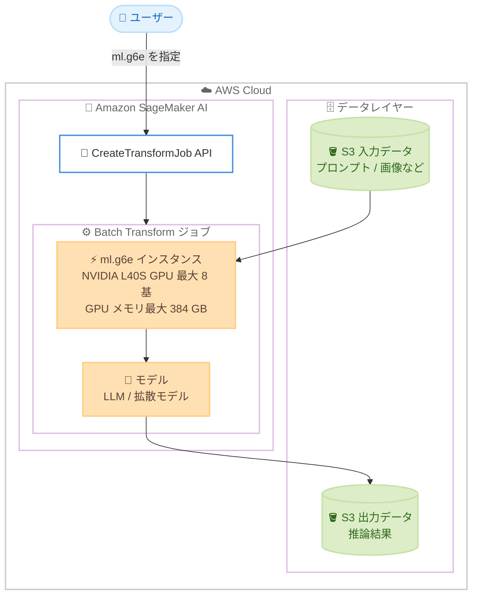

# Amazon SageMaker AI - Batch Transform での G6e インスタンスサポート

**リリース日**: 2026 年 9 月 4 日
**サービス**: Amazon SageMaker AI
**機能**: Batch Transform における Amazon EC2 G6e インスタンスのサポート

📊 [このアップデートのインフォグラフィックを見る](https://takech9203.github.io/aws-news-summary/20260904-sagemaker-batch-transform-g6e-instances.html)

## 概要

Amazon SageMaker AI の Batch Transform が、Amazon EC2 G6e インスタンスをサポートしました。Batch Transform は、Amazon S3 に保存されたデータセットに対して推論 (予測) を実行する機能で、永続的な推論エンドポイントを必要としない大規模データセットのオフライン推論に適しています。

G6e インスタンスは、最大 8 基の NVIDIA L40S Tensor Core GPU (GPU あたり 48 GB のメモリ) と第 3 世代 AMD EPYC プロセッサを搭載しており、大規模言語モデル (LLM) や、画像・動画・音声を生成する拡散モデルなど、GPU 集約型のオフライン推論ワークロードでパフォーマンスの向上が期待できます。

CreateTransformJob API、AWS SDK、AWS CLI で対応する ml.g6e インスタンスタイプを指定するだけで利用を開始できます。

**アップデート前の課題**

このアップデート以前は、Batch Transform で利用できる GPU インスタンスの選択肢に制約がありました。

- Batch Transform で NVIDIA L40S GPU を搭載した G6e インスタンスを選択できなかった
- LLM や拡散モデルのような大きな GPU メモリを必要とするモデルのバッチ推論では、GPU メモリの制約により旧世代インスタンス (G5、G6 など) では実行が難しい、または複数インスタンスへの分割が必要だった
- 大規模な生成 AI モデルのオフライン推論をコスト効率よく実行する選択肢が限られていた

**アップデート後の改善**

今回のアップデートにより、以下が可能になりました。

- Batch Transform ジョブで ml.g6e インスタンスタイプ (GPU あたり 48 GB メモリ) を指定できるようになった
- 最大 8 GPU / 384 GB の GPU メモリを活用し、LLM や画像・動画・音声生成の拡散モデルなど、GPU 集約型モデルのバッチ推論を単一インスタンスで実行しやすくなった
- 永続エンドポイントを立てずに、必要なときだけ高性能 GPU を使ってオフライン推論を実行し、ジョブ完了後は課金が停止するコスト効率の高い運用が可能になった

## アーキテクチャ図



Batch Transform ジョブ作成時に ml.g6e インスタンスタイプを指定すると、S3 上の入力データに対して G6e インスタンス上でオフライン推論が実行され、結果が S3 に出力されます。

## サービスアップデートの詳細

### 主要機能

1. **Batch Transform での ml.g6e インスタンスタイプのサポート**
   - CreateTransformJob API、AWS SDK、AWS CLI で ml.g6e インスタンスタイプを指定可能
   - 永続的な推論エンドポイントを必要としない、S3 上の大規模データセットに対するオフライン推論に利用可能
   - ジョブ実行中のみインスタンスが起動するため、常時稼働のエンドポイントと比べてコスト効率が高い

2. **NVIDIA L40S Tensor Core GPU による高性能推論**
   - 最大 8 基の NVIDIA L40S Tensor Core GPU を搭載し、GPU あたり 48 GB のメモリを提供
   - 第 4 世代 NVIDIA Tensor Core を備え、生成 AI 推論に最適化
   - GPU メモリは G6 インスタンス比で 2 倍、GPU メモリ帯域幅は 2.9 倍に向上 (EC2 G6e 製品ページより)

3. **生成 AI ワークロードへの適合**
   - LLM のバッチ推論 (大量ドキュメントの要約、埋め込み生成、分類など) に対応
   - 画像・動画・音声を生成する拡散モデルのオフライン一括生成に対応
   - 第 3 世代 AMD EPYC プロセッサにより前処理・後処理も高速に実行

## 技術仕様

### G6e インスタンスの仕様

EC2 G6e 製品ページに基づく主な仕様は以下のとおりです (SageMaker では `ml.` プレフィックス付きで指定)。

| インスタンスサイズ | GPU 数 | GPU メモリ (GB) | vCPU | メモリ (GiB) | ネットワーク帯域幅 (Gbps) |
|------|------|------|------|------|------|
| g6e.xlarge | 1 | 48 | 4 | 32 | 最大 20 |
| g6e.2xlarge | 1 | 48 | 8 | 64 | 最大 20 |
| g6e.4xlarge | 1 | 48 | 16 | 128 | 20 |
| g6e.8xlarge | 1 | 48 | 32 | 256 | 25 |
| g6e.16xlarge | 1 | 48 | 64 | 512 | 35 |
| g6e.12xlarge | 4 | 192 | 48 | 384 | 100 |
| g6e.24xlarge | 4 | 192 | 96 | 768 | 200 |
| g6e.48xlarge | 8 | 384 | 192 | 1,536 | 400 |

### API変更履歴

| 日付 | サービス | 変更内容 |
|------|----------|----------|
| 2026/08/31 | [Amazon SageMaker Service](https://awsapichanges.com/archive/changes/65de2a-api.sagemaker.html) | 9 updated api methods - Batch Transform での G6e インスタンス (NVIDIA L40S Tensor Core GPU 搭載) サポートに伴うインスタンスタイプ定義の更新 |

### Batch Transform ジョブでの指定例

```json
{
  "TransformJobName": "llm-batch-inference-g6e",
  "ModelName": "my-llm-model",
  "TransformInput": {
    "DataSource": {
      "S3DataSource": {
        "S3DataType": "S3Prefix",
        "S3Uri": "s3://my-bucket/input/"
      }
    },
    "ContentType": "application/json"
  },
  "TransformOutput": {
    "S3OutputPath": "s3://my-bucket/output/"
  },
  "TransformResources": {
    "InstanceType": "ml.g6e.12xlarge",
    "InstanceCount": 1
  }
}
```

## 設定方法

### 前提条件

1. SageMaker AI で利用するモデル (Model リソース) が作成済みであること
2. 入力データが Amazon S3 に保存されており、出力先の S3 パスが用意されていること
3. SageMaker 実行ロールに S3 バケットへのアクセス権限が付与されていること
4. 対象リージョンで ml.g6e インスタンスのサービスクォータが確保されていること

### 手順

#### ステップ1: 入力データを S3 に配置

```bash
aws s3 cp ./input-data/ s3://my-bucket/input/ --recursive
```

推論対象の入力データ (プロンプト、画像など) を S3 の入力プレフィックスにアップロードします。

#### ステップ2: ml.g6e を指定して Batch Transform ジョブを作成

```bash
aws sagemaker create-transform-job \
  --transform-job-name llm-batch-inference-g6e \
  --model-name my-llm-model \
  --transform-input '{"DataSource": {"S3DataSource": {"S3DataType": "S3Prefix", "S3Uri": "s3://my-bucket/input/"}}, "ContentType": "application/json"}' \
  --transform-output '{"S3OutputPath": "s3://my-bucket/output/"}' \
  --transform-resources '{"InstanceType": "ml.g6e.12xlarge", "InstanceCount": 1}'
```

CreateTransformJob API を呼び出し、`TransformResources` の `InstanceType` に ml.g6e インスタンスタイプを指定して Batch Transform ジョブを作成します。

#### ステップ3: ジョブのステータスと結果を確認

```bash
aws sagemaker describe-transform-job \
  --transform-job-name llm-batch-inference-g6e \
  --query 'TransformJobStatus'

aws s3 ls s3://my-bucket/output/
```

ジョブのステータスを確認し、`Completed` になったら出力先の S3 パスに推論結果が格納されていることを確認します。

## メリット

### ビジネス面

- **コスト効率の向上**: ジョブ実行中のみ課金される Batch Transform と、生成 AI 推論向けにコスト効率の高い G6e の組み合わせにより、常時稼働エンドポイントと比べて大幅なコスト削減が期待できる
- **生成 AI 活用の加速**: 大量コンテンツの一括生成や大規模ドキュメント処理など、生成 AI のバッチ処理ユースケースを高性能 GPU で実現できる
- **インフラ管理の簡素化**: マネージドなバッチ推論として、GPU インスタンスのプロビジョニングやジョブ完了後の停止を SageMaker AI に任せられる

### 技術面

- **大容量 GPU メモリ**: GPU あたり 48 GB、最大 384 GB の GPU メモリにより、大きなモデルを分割せずにロード可能
- **高い推論性能**: NVIDIA L40S Tensor Core GPU により、LLM や拡散モデルの推論スループットが向上
- **既存ワークフローとの互換性**: CreateTransformJob API のインスタンスタイプを変更するだけで移行でき、既存の Batch Transform パイプラインをそのまま活用できる

## デメリット・制約事項

### 制限事項

- 利用可能リージョンは US East (N. Virginia、Ohio)、US West (Oregon)、Asia Pacific (Mumbai、Hyderabad) の 5 リージョンに限定され、東京リージョンでは現時点で利用できない
- ml.g6e インスタンスの利用にはサービスクォータの引き上げ申請が必要な場合がある
- G6e は単一ノード内での推論に適しており、より大規模なモデル (数十 B パラメータ超) には P 系インスタンスなど他の選択肢の検討が必要

### 考慮すべき点

- リアルタイム推論が必要なユースケースには Batch Transform ではなくリアルタイムエンドポイントや非同期推論の利用を検討する
- モデルサイズとバッチサイズに応じて、単一 GPU (g6e.xlarge〜16xlarge) とマルチ GPU (g6e.12xlarge、24xlarge、48xlarge) のどちらが適切か検証が必要
- 旧世代 (G5、G6) と比較して時間あたりの単価は高くなるため、スループット向上によるジョブ時間短縮効果を含めた総コストで評価する

## ユースケース

### ユースケース1: LLM による大量ドキュメントの一括要約

**シナリオ**: 数十万件の社内ドキュメントやカスタマーレビューを LLM で要約・分類したい。リアルタイム性は不要で、夜間バッチで処理したい。

**実装例**:
```
1. 要約対象のドキュメントを JSON Lines 形式で S3 に配置
2. LLM を SageMaker AI のモデルとして登録
3. ml.g6e.12xlarge を指定して Batch Transform ジョブを実行
4. 要約結果を S3 から取得し、後続の分析パイプラインに連携
```

**効果**: 永続エンドポイントを維持することなく、48 GB × 4 GPU の大容量メモリで LLM のバッチ推論を効率的に実行し、処理中のみの課金でコストを最適化できる。

### ユースケース2: 拡散モデルによる画像・動画アセットの一括生成

**シナリオ**: E コマース事業者が、商品説明文をもとに拡散モデルでマーケティング用の画像バリエーションを大量生成したい。

**実装例**:
```
1. 生成プロンプトの一覧を S3 に配置
2. Stable Diffusion 系などの画像生成モデルをデプロイ用にパッケージング
3. ml.g6e.2xlarge を指定して Batch Transform ジョブを実行
4. 生成された画像を S3 出力パスから取得
```

**効果**: L40S GPU の高い生成性能により大量の画像生成を短時間で完了でき、キャンペーンごとのアセット制作を自動化できる。

### ユースケース3: 埋め込みベクトルの大規模バッチ生成

**シナリオ**: RAG (検索拡張生成) システムの構築にあたり、既存のナレッジベース全体に対して埋め込みモデルでベクトルを一括生成したい。

**実装例**:
```
1. チャンク分割済みテキストを S3 に配置
2. 埋め込みモデルを SageMaker AI のモデルとして登録
3. ml.g6e.xlarge、InstanceCount を複数指定して並列バッチ推論を実行
4. 生成した埋め込みベクトルをベクトルデータベースにロード
```

**効果**: GPU による高速な埋め込み生成と Batch Transform の並列実行により、大規模ナレッジベースの初期構築や定期再構築の時間を大幅に短縮できる。

## 料金

Batch Transform では、ジョブ実行中のインスタンス使用時間 (秒単位) に対して課金されます。ジョブが完了するとインスタンスは自動的に停止し、課金も停止します。ml.g6e インスタンスの時間あたりの料金はインスタンスサイズとリージョンによって異なるため、最新の料金は [Amazon SageMaker AI の料金ページ](https://aws.amazon.com/sagemaker/ai/pricing/) を参照してください。

## 利用可能リージョン

以下の 5 リージョンで利用可能です。

- 米国東部 (バージニア北部)
- 米国東部 (オハイオ)
- 米国西部 (オレゴン)
- アジアパシフィック (ムンバイ)
- アジアパシフィック (ハイデラバード)

## 関連サービス・機能

- **Amazon EC2 G6e インスタンス**: 本アップデートで Batch Transform に追加された、NVIDIA L40S Tensor Core GPU 搭載のインスタンスファミリー
- **Amazon S3**: Batch Transform の入力データと推論結果の保存先として使用
- **SageMaker AI リアルタイム推論 / 非同期推論**: 低レイテンシーが必要な場合や大きなペイロードを扱う場合の代替デプロイオプション
- **Amazon Bedrock バッチ推論**: 基盤モデルのマネージドなバッチ推論を利用したい場合の代替選択肢

## 参考リンク

- 📊 [インフォグラフィック](https://takech9203.github.io/aws-news-summary/20260904-sagemaker-batch-transform-g6e-instances.html)
- [公式発表 (What's New)](https://aws.amazon.com/about-aws/whats-new/2026/09/sagemaker-batch-transform-g6e-instances/)
- [Batch Transform ドキュメント](https://docs.aws.amazon.com/sagemaker/latest/dg/batch-transform.html)
- [Amazon EC2 G6e インスタンス](https://aws.amazon.com/ec2/instance-types/g6e/)
- [Amazon SageMaker AI モデルデプロイ](https://aws.amazon.com/sagemaker/ai/deploy/)
- [料金ページ](https://aws.amazon.com/sagemaker/ai/pricing/)

## まとめ

Amazon SageMaker AI Batch Transform での G6e インスタンスサポートにより、LLM や拡散モデルなどの GPU 集約型モデルのオフライン推論を、大容量 GPU メモリを備えたインスタンスでコスト効率よく実行できるようになりました。生成 AI モデルのバッチ推論を運用中、または検討中の場合は、CreateTransformJob API で ml.g6e インスタンスタイプを指定し、既存インスタンスとの性能・コストの比較検証を行うことを推奨します。
